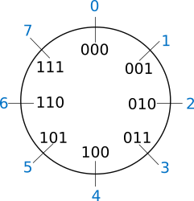

=  Estructura de Computadores
// classic AsciiDoctor attributes
//:stem: latexmath
:stem:
:background-color="#ff0000":
:icons: font
:imagesdir: images
:customcss: styles/myCustomCSS.css
// Despite the warning of the documentation, https://github.com/asciidoctor/asciidoctor-reveal.js, highlight.js syntax highlighting WORKS, BUT, you need to explicitly set the highlighter using the below attribute
// see http://discuss.asciidoctor.org/Highlighting-source-code-for-reveal-js-backend-td2750.html
:source-highlighter: highlight.js
:highlightjs-languages: vhdl
:source-language: vhdl 
//:source-highlighter: rouge
//:source-highlighter: pygments
// revealjs attributes
:revealjs_theme: white
:revealjs_slideNumber: true
// Al actualizar el slide no cambia de transpa y no se va al inicio
:revealjs_hash: true   
:revealjs_history: true

:revealjs_center: true
:revealjs_width: "100%"
:revealjs_height: "100%"
:revealjs_margin: 0

//:revealjs_minScale: 1,
//:revealjs_maxScale: 1

// plugins copiados de tutoriales/asciidoctor-revealjs/../primer.js
:revealjs_plugins_configuration: revealjs-plugins-conf.js
:revealjs_plugins: revealjs-plugins.js

//:scrollable: no pirula

//:revealjs_history: true para go to file no pirula

//:doctype: book
//:lang: es
//:encode: ISO-8859-1
//:ascii-ids:
:show-link-uri:
:asciidoctor-fetch-kroki:
:experimental:

:ruta-transpas: /home/candido/Dropbox/apuntes/apuntes_Estr_Computadores/upna/apuntes_repositorio/transpas_eecc

:ruta-apuntes: home/candido/Dropbox/apuntes

== Transparencias en Formato PDF

* link:./PDF/eecc/eecc_slides.pdf[Transparencias PDF]
* Si hay algún error de forma en el documento PDF que dificulte su interpretación, por favor, enviar un mensaje para su correción. Gracias.

== Indice

[%hardbreaks]
Tema 1: <<Tema1_Intro, Introducción a la asignatura Estructura de Computadores .>>
Tema 2: <<Tema2_RepInf, Representación Digital de la Información.>>

[#Tema1_Intro]
[.columns]
== Tema 1 : Introducción a los Sistemas Digitales Electrónicos

[.column]
* Profesorado

[.column]
* Organización Académica
** Programa
** Prácticas
** Ejercicios
** Evaluación
** Metodología

// [%notitle]
=== Profesorado

* Profesor Responsable Cándido Aramburu Mayoz.
** Doctor Ingeniero Telecomunicación (UPNA-Universidad Politécnica de Madrid) 
** Empresa Ikusi S.A. (Sistemas de Telemedida 1989)
** Profesor Titular UPNA (Dpto Ingeniería Electrónica y Comunicaciones 2000)
* Profesor Teoría: Carlos Juan de Dios
* Profesor Prácticas: Andrés Garde 

[.notes]
--
* https://www.etsit.upm.es/
* https://www.velatia.com/es/empresas-que-forman-velatia/ikusi/
* https://www.unavarra.es/eu/sites/Portada/home.html
--

=== Organización Académica

=== Aulas y Horarios

* Aulas
** Teoría: G91 -> A019, G1 ->A113, G2->A122
** Prácticas: P91->A015, P1->A305, P2->E-ISM, P3->E-ISM
** E-ISM : Edificio “Las Encinas” , lado derecho entre la Biblioteca y el Rectorado) en el Sótano, Laboratorio de Informática “ISM”

* Horario
** Teoría: G91(L-15:00), G1(X-17:00), G2(L-17:00)
** Prácticas: P91(X-19:00), P1(J-17:00), P2(M-19:00), P3(M-17:00)

=== Tutorías

* Despacho: Edificio Los Tejos 2 Planta: Despacho 2028 (Prof. Candido Aramburu)
* Miaulario -> correo interno
* https://www.unavarra.es/pdi?uid=364&dato=tutorias[Tutorías]
** Lunes (10-13) y  Miércoles (10-13) 

=== Programa de la Asignatura

* https://www.unavarra.es/ficha-asignaturaDOA?languageId=100000&codPlan=240&codAsig=240306&anio=2023[Ficha Web Upna]
** Programa en 3 partes 
... *_Circuitos Combinacionales_*
... *_Circuitos Secuenciales_*
... Otros: Números, Lógica Programable (VHDL), Teoría Tecnología

=== Bibliografía
* Fundamentos de Electrónica Digital. Cecilio Blanco
* Circuitos Electrónicos Digitales. Manuel Mazo
* Fundamentos de Sistemas digitales. Thomas Floyd

=== Metodología

* Trabajo en clase: principalmente Ejercicios con su teoría asociada
* Trabajo en casa
** Teoría desarrollada en los apuntes PDF en mi aulario
** Prácticas
*** En casa: Ejercicios de diseño manual
*** En casa: Utilización de Quartus y Memorias
* Tutorías
** Resolución de dudas

=== Prácticas
* Tipo de prácticas:
** Diseño manual
** Simulación con la herramienta software Quartus de Intel.
** Captura gráfica de Esquemas Electrónicos
** Descripción del Circuito mediante el Lenguaje VHDL. Fabricación del Circuito en tecnología FPGA

=== Ejercicios

* Tipo de problemas: Libro Verde -> Ejercicios tipo examen -> Sin calculadora y sin libros +

-----
El libro verde se adquiere en el edificio de rectorado, en la sección de comunicacion,
que se encuentra en planta baja del edificio.
El horario: 8 a 14:30. Precio 8.5$. 
-----

----
* Capítulo 1: 1.1, 1.2, 1.4, 1.5, 1.6, 1.8, 1.9
* Capítulo 2: 2.1
* Capítulo 3: 3.2 3.3 -> 2º parcial
* Capítulo 4: 4.2, 4.4, 4.6
* Capítulo 5: 5.2, 5.3, 5.4
* Capítulo 6: 6.1, 6.2 -> 2º parcial
* Capítulo 7: 7.2, 7.3 y 7.4 -> 2º parcial
* Capítulo 8: 8.1, 8.3 y 8.5 -> 2º parcial
----
* Los ejercicios del tema 2 (Representación de la Información) no están en el libro verde
** Miaulario -> Recursos -> Ejercicios

=== Evaluación

* Sistema de Evaluación:
** 75% teoría y 25% prácticas
** Evaluación continua Teoría: dos parciales (30% 1º parcial y 45% 2º parcial). Nota mínima en el 2º parcial: 4. El Primer parcial se realizará el sábado 1 de Abril a las 9:00, el segundo parcial el 24 de Mayo a las 8:00 y la recuperación el 12 de Junio a las 8:00
** Recuperación Teoría: Entra todo. Nota mínima: 5.
** Evaluación Prácticas: Un único exámen el sábado XX de Mayo, no recuperable.

[#Tema2_RepInf]
== Tema 3 : Representación Digital de la Información

[state=txikiago]
=== Indice

* Información: números, caracteres, imagen, sonido, etc ..
* Números
** Sistemas posicionales: base 10 (decimales), base 2 (binaria)
** Naturales: bases 10,2,8,16 . Conversión entre bases
** Enteros: Signo Magnitud, Complemento a la base-1, Complemento a la base
** Operaciones aritméticas: Suma,Resta
** Reales: coma fija y coma flotante
* Caracteres
** Alfanuméricos y Signos de Puntuación
** ASCII standard y extendido
** Unicode: UTF-8 
 

[state=taula]
=== Representación Científica y Prefijos de las Unidades

.Prefijos
[cols="<3,8*^1"]
|====
|Prefijos|Tera|Giga|Mega|Kilo|mili|micro|nano|pico
| Base 10 -> magnitudes:m,gr,Hz, ..| 10^12^| 10^9^| 10^6^| 10^3^| 10^-3^| 10^-6^| 10^-9^| 10^-12^
| Base 2 -> magnitudes: Byte | 2^12^| 2^9^| 2^6^| 2^3^| 2^-3^| 2^-6^| 2^-9^| 2^-12^
|====

[.text-left]
* Ejemplo: representar la magnitud=1000000000Hz debidamente
** Notación científica -> 10^9^Hz
** Debidamente: Notación científica con prefijos f=1GHz -> T=1/f=10^-9^seg= 1ns

=== Señales: Conversión Analógica Digital

=== Analogica vs Digital

* Señal Continua
** Amplitud: stem:[oo] valores posibles en el rango
** Tiempo: stem:[oo] valores posibles en el rango   
* Señal Discreta ó Digital
** Amplitud: finitos valores posibles en el rango
** Tiempo: finitos valores posibles en el rango 

=== Señales : Muestreo y Cuantificación

image:muestreo_cuantificacion.jpg[Mountain,900,400]

=== Codificación

image:ADC_codigo.webp[Mountain,600,500,float="left"]

[.text-left]
Calcular para las resoluciones de 3 bit y 16 bits cual es el mínimo incremento de señal codificable o error de cuantificación: con 3 bits el número de niveles es 2^3^=8niveles y el mínimo relativo es 2^-3^=1/8; con 16 bits el número de niveles es 2^16^ y el mínimo relativo es 2^-16^= 1/65536. 

[.text-left]
Representación de los números en código binario : <<Tema2_RepInf>>

=== Señales Binarias : Abstractas

image:clock-signals.png[Mountain,400,300,float="left"]

[.text-left%hardbreaks]
Eje ordenada: valores abstractos (0/1, High/Low, ON/OFF, etc ...).
Cronograma: Representación temporal de las señales digitales binarias.
Esa representación típica de los libros de texto, pizarra de clase, etc ... es ideal ya que físicamente siempre habrá distorsión.

=== Señales Binarias : Físicas

image:Digital-signal-noise.svg.png[Mountain,400,300,float="left"]

[.text-left%hardbreaks]
Eje ordenada: magnitudes físicas (mV ó mA).
La señal física está distorsionada por causas como pej: línea larga de transmisión (efectos capacitivos e inductivos).
Un ejemplo típico de distorsión son los tiempos de subida y bajada, que no son nulos sino del orden de unos nanosegundos.
La distancia considerable entre los dos niveles (binario) a la entrada del receptor hace fácil la discriminación entre el '0' y el '1'.

=== Digitalización de las Señales

=== Ventajas
* Calidad: Fácil de recuperar a pesar de la distorsión
* Almacenamiento: Fiabilidad, Diversidad Formatos
* Compatibilidad: Diversidad de Equipos (PC, móvil, coche, etc
* Procesamiento: Sencillo, Flexible
* Coste: Barato (componentes)

=== Abstracción

* Niveles: el 0 y el 1
* Lógica binaria 
** Matemáticas: Algebra de Boole

=== Representación de los Números 

[state="taula"]
=== Representación de los Números Decimales

[.text-left]
* Decimal
** 10 dígitos : 0,1,2,3,4,5,6,7,8,9
** Pesos con base 10 : 10^n^ donde n es la posición del dígito dentro del número
* Ejemplo: número 5421

.Número 5451
[width=60%,cols="<3s,4*^1"]
|===
|Representación: 4+| los símbolos 5421
|Posiciones: | 3 | 2 | 1 | 0
| Pesos:
a|10^3^ -> 1000|10^2^ -> 100|10^1^->10|10^0^->1
| Dígitos:
a|5|4|5|1
| Valores : ponderación
a|5*1000=cinco mil|4*100=cuatrocientos|5*10=cincuenta|1*1=uno
| Valor: 4+| 5*1000+4*100+5*10+1= cinco mil cuatrocientos cincuenta y uno
|===

[state="taula"]
=== Representación de los Valores Enteros en Código Binario

* ¿Número?¿Valor?¿Código?¿Representación?
** 2 dígitos : 0,1
** Pesos con base 2 : 2^n^ donde n es la posición del dígito dentro del número: ....-1024-512-256-128-64-32-16-8-4-2-1...
* Ejemplo: número 0b1011

.Número 0b1011
[width=60%,cols="<3s,4*^1"]
|===
|Representación: 4+| los símbolos 1011
|Posiciones: | 3 | 2 | 1 | 0
| Pesos:
a|2^3^ -> 8|2^2^ -> 4|2^1^->2|2^0^->1
| Dígitos:
a|1|0|1|1
| Valores : ponderación
a|1*8=ocho|0*4=cero|1*2=dos|1*1=uno
| Valor: 4+| ocho+cero+dos+uno= once
|===

=== Representación de los Valores Enteros en Código Binario

* ¿Cómo se representa en binario el valor 123.125? b1111011.001
* ¿Cómo se calcula el valor del número binario b1111011.001?
* Parte Entera: divisiones sucesivas por la base 2
* Parte Fracción: multiplicaciones sucesivas por la base 2

=== Representación de los Valores Enteros en Código Octal

* Dígitos: 0,1,2,3,4,5,6,7
* Posiciones y Pesos
* ¿Cómo se representa en octal el valor 123.125? 0o173.1
* ¿Cómo se calcula el valor del número octal 0o173.1?
* Parte Entera: divisiones sucesivas por la base 8
* Parte Fracción: multiplicaciones sucesivas por la base 8

=== Representación de los Números en Hexadecimal

* Dígitos: 0,1,2,3,4,5,6,7,8,9,A,B,C,D,E,F ___ el valor de A es 10, B->11, C->12, D->13, E-14, F->15
* Posiciones y Pesos
* ¿Cómo se representa en hexadecimal el valor 123.125? 0x7B.2
* ¿Cómo se calcula el valor del número octal 0x7B.2?
* Parte Entera: divisiones sucesivas por la base 16
* Parte Fracción: multiplicaciones sucesivas por la base 16

=== Calculadora de Python

https://www.programiz.com/python-programming/online-compiler/[Python Intepreter Shell]

[source,python]
----
bin(123)
oct(123)
hex(123)
int(0b1111011)
int(0o173)
int(0x7B)
----

[.columns]
=== Conversiones entre el sistema binario y sistemas con base potencia de 2

[.column]
* Conversión Binaria-Hexadecimal
** base 16=2^4^
** grupos de 4 bits empezando por la dcha
** b1111011 ->  111 - 1011  -> 0x7B 
* Conversión Hexadecimal-Binaria
** grupos de 4 bits

[.column]
* Conversión Binaria-Octal
** base 8=2^3^
** grupos de 3 bits empezando por la dcha
** b1111011 -> 1 - 111 - 011  -> 0o173
* Conversión Octal-Binaria
** grupos de 3 bits

=== Suma binaria

* Suma 10011011+00011011 = 10110110
+  

....
  Llevadas -->          1 1   1 1 
  	                         
                    1 0 0 1 1 0 1 1  <--sumando
                  + 0 0 0 1 1 0 1 1  <--sumando
  	                         
  Valor suma        1 0 1 3 2 1 3 2  <- ¿cómo se representan los valores de cada posición?      
                  *****************ase
  Resultado -->     1 0 1 1 0 1 1 0  <--suma
....

* LLEVADA
** Valor suma: el valor 3 de la posición 1 -> 3*2¹=6 -> 110
*** el dígito 1 de la posición 1 es el resultado
*** el dígito 1 de la posición 2 es la LLEVADA
** Conclusión:Cuando la suma en una posición específica tiene un valor es mayor o igual a la base hay que restar *n* veces la base y el valor *n* será la llevada a sumar en la posición siguiente.

=== Resta binaria

* Resta 10110110 - 10011011 = 00011011
+

----
Sumar crédito al minuendo            2  2     2  2

                            1  0  1  1  0  1  1  0  <--minuendo
      	                  - 1  0  0  1  1  0  1  1  <--sustraendo
 
               
Sumar llevada al sustraendo       1  1     1  1 
                          *************************
Resta                       0  0  0  1  1  0  1  1
----

* Cuando en una posición específica el minuendo es menor que el sustraendo se suma la base al minuendo antes de realizar la resta y se suma la llevada al sustraendo de la posición siguiente.
 
=== Aritmética Modular: la rueda

[.text-left%hardbreaks]
Representación binaria de números con 3 digitos.
2^3^ : 8 combinaciones posibles,-> MODULO 8
Ejemplo: cuentakilómetros del coche.
Ejemplo: registro de 3 celdas -> limitado a 8 combinaciones posibles.
¿Cual es la siguiente combinación a 111?, 111+1 = ¿ ?.
Calcular la representación del valor 33 en módulo 8 -> Resto(33/8)=1 -> en binario 001
33 pasos en la rueda equivale al número 001 -> aritmética modular en módulo 8

=== Operaciones aritméticas: Octal y Hexadecimal

* Base Octal 
** 0o675+0o304 = 0o1201
** 0o632-0o374 = 0o236
* Base hexadecimal
** 0xD1B+0xAFF = 0x181A
** 0xE53-0xBAA = 0x2A9

=== Representación de Números con Valores Enteros

* Signo-Magnitud
* Complemento a la base menos 1
* Complemento a la base

=== Representación en Signo-Magnitud

* Signo -> un dígito
* Base 10: 
** valores positivos: el signo es el *dígito 0* en la posición MSD (More Significant Digit) y resto de dígitos representa el módulo 
** valores negativos: el signo es el *dígito 9* (base-1) en la posición MSD (More Significant Dit) y resto de dígitos representa el módulo 
** Ejemplo +123 -> 0123 y -123 -> 9123

[state=txikiago]
=== Representación en Signo-Magnitud

* Signo -> un bit (Binary digIT)
* Base 2 : 
** valores positivos: el signo el *bit 0* en la posición MSB (More Significant Bit) y resto de bits representa el mód
** valores negativos: el signo el *bit 1* (base-1) en la posición MSB (More Significant Bit) y resto de bits representa el módulo
** Ejemplo +123 -> 0b01111011 y -123 -> 0b11111011
** Dibujar la tabla y la rueda con todos los valores con sus representaciones.
** ¿Cuantas representaciones son posibles?¿Es simétrico el rango de valores representado?¿Cuantas representaciones tiene el cero?
** Extender el número de bits del número sin cambiar su valor

=== Extensión del signo

* Números positivos
** ¿Cuánto vale un cero a la izda?
* Números negativos
** ¿Cuánto vale .... a la izda?

=== Representación en complemento a la base menos 1. C9

* Base 10: Complemento a 9 -> C9
* Signo -> un dígito
* Valores positivos: igual que los valores positivos en código Signo-Magnitud
* Valores negativos: Hay que restar el código del valor en positivo del minuendo 99999999 (base-1)
** Ejemplo '+123' -> 0123 y -123 -> 9999-0123 = 9876
* El C9 de un número positivo es el código de su valor en negativo
* El C9 de un número negativo es el código de su valor en positivo

[state=txikiago]
=== Representación en complemento a la base menos 1. C1

* Base 2 : base-1=1 -> Complemento a 1 -> *C1*
* Signo -> un dígito
* Valores positivos: igual que los valores positivos en código Signo-Magnitud
* Valores negativos: Definición: Hay que restar el código del valor en positivo del  minuendo 11111111 (base-1)
** Ejemplo '+123' -> 0b01111011 y -123 -> *11111111-01111011* = 10000100
** *Alternativa* a la definición: El código del valor negativo se puede calcular invirtiendo los bits del código del valor positivo
* El C1 de un número positivo es el código C1 de su valor en negativo y del de un número negativo es el código C1 de su valor en positivo
** Dibujar la tabla y la rueda con todos los valores con sus representaciones.
** ¿Cuantas representaciones son posibles?¿Es simétrico el rango de valores representado?¿Cuantas representaciones tiene el cero?
** Extender el número de bits del número sin cambiar su valor

=== Representación en complemento a la base 10 : C10

* Signo -> un dígito
* Base 10: Complemento a 10 -> C10
* Valores positivos: igual que los valores positivos en código Signo-Magnitud
* Valores negativos: Hay que restar el código del valor en positivo del minuendo 0000000 (base)
** Ejemplo '+123' -> 0123 y -123 -> 0000-0123 = 9877
* El C10 de un número positivo es el código de su valor en negativo
* El C10 de un número negativo es el código de su valor en positivo

[state=txikiago]
=== Representación en complemento a la base 2 : C2

* Signo -> un dígito
* Base 2: Complemento a 2 -> *C2*
* Valores positivos: igual que los valores positivos en código Signo-Magnitud
* Valores negativos: Definición: Hay que restar el código del valor en positivo del  minuendo 0000000 (base)
** Ejemplo '+123' -> 0b01111011 y -123 -> *00000000-01111011* = 0b100000101
** *Alternativa 1* a la definición: El código del valor negativo se puede calcular invirtiendo los bits del código del valor positivo y después sumarle 1
*** Equivale a calcular el C1 y sumarle 1
** *Alternativa 2* a la definición: El código del valor negativo se puede calcular a partir del código del valor positivo
*** empezando por la dcha repetir los bits hasta el primer uno e invertir el resto de bits

=== Representación en complemento a la base 2 : C2

* El C2 de un número positivo es el código C2 de su valor en negativo
* El C2 de un número negativo es el código C2 de su valor en positivo
** Dibujar la tabla y la rueda con todos los valores con sus representaciones.
** ¿Cuantas representaciones son posibles?¿Es simétrico el rango de valores representado?¿Cuantas representaciones tiene el cero?
** Extender el número de bits del número sin cambiar su valor -> Extensión del bit de SIGNO 

[state=txiki]
=== Extensión del signo en C2

.Razonamiento de la extensión de signo de un número negativo: números de 3 bits
[width=60%,<1,2*<2]
|===
|Valor| C2 sin extensión | C2 con extensión
|  +33 |  0100001    | 00100001
.4+|  -33  l| 
 0000000  
-0100001 
--------  
 1011111 l|

 00000000 
-00100001 
---------
 11011111  
|===

Se observa que en el C2 con extensión, al hacer al resta y extender con un 0 más el minuendo y el substraendo, provoca la extensión con un bit más en la resta de valor 1 en el digito más significante. Según añado ceros al minuendo y sustraendo, aparecen unos en la resta sin alterar su valor.

[.columns, state=txiki]
=== Operaciones aritméticas en C2

[.column]
* Suma
** Se realiza como se ha visto para números naturales. 
** Si hay llevada en el MSBit, no se tiene en cuenta, se elimina.
** A=0b11011011. Suma A+A
+

....
Llevadas -> 1 1   1 1   1 1 
  	                         
              1 1 0 1 1 0 1 1 (Valor -37)
            + 1 1 0 1 1 0 1 1 (Valor -37)
  	                         
Valor suma      2 1 3 2 1 3 2        
            *****************
Resultado --> 1 0 1 1 0 1 1 0<--(Valor -74)
....

[.column]
* Resta
** La resta de números con signo se puede realizar de dos formas: A-B ó A-B = A+(-B)
** A = 0b00110110 y B = 0b10011011 
** Si hay llevada en el MSBit, no se tiene en cuenta, se elimina.
+

----
Crédito   2 2   2 2   2 2

          1 0 1 1 0 1 1 0<--(Valor -74)
        - 1 1 0 1 1 0 1 1<--(Valor -37)
 
               
LLevada 1 1 1   1 1   1 1 
         ****************
Resta     1 1 0 1 1 0 1 1 (Valor -101)
----

[state=txiki]
=== Operaciones ariméticas C2: Overflow o Desbordamiento

* A = 0b00110110 y B = 0b10011011 -> Calcular A-B
* Con 8 bits el máximo valor es 01111111 de valor 2^7^-1=128-1=127
* La resta A-(B)=A+(-B)=54+103=157>127 -> *Overflow* o *Desbordamiento*
+

----
Crédito  2     2 2   2 2

         0 0 1 1 0 1 1 0<--(Valor = 54)
       - 1 0 0 1 1 0 1 1<--(Valor = -103)
 
               
LLevada      1 1   1 1 
        ****************
Resta    1 0 0 1 1 0 1 1 (Valor -101)
----
** El valor -101 en lugar de la resta correcta +157 es debido a que el resultado esta fuera de rango -> 
** Observarmos que hemos hecho la SUMA de dos números POSITIVOS y el resultado ha sido NEGATIVO

=== Operaciones ariméticas C2: Overflow

IMPORTANT: Al realizar la suma de dos valores con el mismo signo si el resultado es de signo contrario hay overflow

[state=txiki]
=== Operaciones aritméticas C2: Overflow 

* Overflow: la operación requiere operandos con mayor número de bits manteniendo el valor para que el resultado sea correcto.
* Si dos operandos a sumar tienen diferente signo nunca hay overflow
* Si dos operandos a sumar tienen el mismo signo y resultado tiene signo contrario : *Error* de Overflow.
* Ejemplo:
** Operandos de 1 byte :  01111111+01111111=11111110 -> sumandos positivos y resultado negativo
*** Solución: *Extensión del signo* : Operandos  9 bits -> 001111111+001111111=011111110
*** la repetición del bit más significativo no altera el valor de la representación
*** el bit más significativo es 0 si es positivo y 1 si es negativo. Por lo tanto, 01010 equivale a 01010 ó 001010 ó 0....0001010. Por lo tanto, 1010 equivale a 11010 ó 111010 ó 1....1111010

=== C2: Representación gráfica del Overflow

image::rueda_signed.png[Rueda,500,500,float="left"]

[.text-left%hardbreaks]
Si a partir de la posición 010 nos movemos dos posiciones en sentido  horario llegamos a la posición 100.
Si a 010 le sumamos el valor 2 nos da como resultado 100
Por lo tanto 010+010=100, es decir, 2+2=-4 -> *overflow* ya que el _+4_ necesita 4 bits y estamos trabajando con 3 bits únicamente.

=== Asimetría del rango en C2: -4 con 3 bits

* Con números de 3 bits los formatos S-M y C1 son simétricos con valores en el rango (+3,-3), en cambio el formato C2 tiene el rango (+3,-4)
* En C2 el valor +4 se representa como 0b0100 y necesita por lo tanto 4 bits, no se puede representar con 3 bits, y el valor -4 se reprenta con el C2(0100), es decir, 1100 también con 4 bits. El 1100 se puede comprimir ya que tiene el signo extendido con la repetición de 1 de bit más significativo, por lo que la representación 100 es la representación del -4

=== Complemento a 2 : Ejemplos

* 0b101010101 está en C2 -> ¿Cual es su valor?
** como es negativo no es un sistema posicional
** tenemos que calcular el valor negativo a través del valor positivo
** La representación del valor positivo es el C2 del valor negativo
*** C2(0b101010101) = 0b010101011 cuyo valor es 2^7^+2^5^+2^3^+2^1^+2^0^=128+32+8+2+1=+171
*** El valor de 0b101010101 es -171

* Si la representación de -123 es 0b100000101 ¿cual es la de '+123' ?
** C2(0b100000101)=0b011111011 representa el valor '+123'

=== Aritmética Modular de valores representados en Complemento a 2

image::rueda_signed.png[Rueda,500,500,float="left"]

[.text-left%hardbreaks]
Representación de números binarios de 3 bits en C2
Operaciones de suma y resta modular -> método gráfico
A partir de la posición 001 si nos movemos en sentido horario (SUMA modular) 2 posiciones obtenemos la posición 011, es decir, 1+2=3
A partir de la posición 110 si nos movemos en sentido horario (SUMA modular) 9 posiciones obtenemos la posición 111, es decir, -2+9=-1
A partir de la posición 110 si nos movemos en sentido antihorario (RESTA modular) 4 posiciones obtenemos la posición 010, es decir, -2-4=+2
Los errores de *overflow* se resuelven aumentando el número de bits de la representación, pero siempre existira un rango que si lo traspasamos dará overflow.

[state=taula]
=== Comparación S-M, C1 y C2

.Números de 3 bits
[width=80%,cols="4*^"]
|===
|Valor|S-M| C1 | C2

|+3| 011 |011|011
|+2| 010 |010|010
|+1| 001 |001|001
.2+|0 | 000 |000|000
| 100 |011| ---
|-1 | 101 |110|111
|-2 | 110 |101|110
|-3 | 111 |100|101
|-4 | - | - | 100
|===

=== Número en complemento a 2 y base hexadecimal

CAUTION: Un número
 binario se puede representar en hexadecimal y hacer la interpretación en complento a 2. Hay que tener cuidado con las extensiones del signo

* Calcular el valor del número 0xAAA si dicho número tiene formato en complemento a 2
** si lo convertimos a binario el número empieza por 1, luego es negativo
** para saber su valor calculo su complementario C2 y tendré la representación del positivo
*** 0x000-0xAAA =0x556 -> 5*16^2^+5*16^1^+5*16^0^ = 5*256+5*16+5 = 1280+80+5 = '+213' -> 0xAAA tiene de valor -213

=== Número en complemento a 2 y base hexadecimal

* Realizar la suma de los números en formato complemento a 2: 0x80+0x80
** sumar sin extender el signo de los operandos ¿Hay overflow?
+

CAUTION: Extender el número 0x80. ¿ Por qué hay que tener cuidado ?
+

* sumar extendiendo un dígito el signo de los operandos 0x80

[state=taula_ta]
=== Extensión del signo en C2: problema de la BASE

.Extensión del Signo del Nº 0x80 en C2 en binario, hexadecimal y octal

[width=80%,cols="^1,3*<3"]
|===
|  NºBits | Binario | Hexadecimal | Octal

|  8 |     10000000 |           1000_0000 ->   0x80 |         110_000_000 ->  0o600
|  9 |    110000000 |      1111_1000_0000 ->  0xF80 |         110_000_000 ->  0o600
| 10 |   1110000000 |      1111_1000_0000 ->  0xF80 |     111_110_000_000 -> 0o7600
| 11 |  11110000000 |      1111_1000_0000 ->  0xF80 |     111_110_000_000 -> 0x7600
| 12 | 111110000000 |      1111_1000_0000 ->  0xF80 |     111_110_000_000 -> 0x77600
| 13 |1111110000000 | 1111_1111_1000_0000 -> 0xFF80 | 111_111_110_000_000 -> 0x77600
|===

[#C1_suma-resta]
[state=txikiago]
=== Suma y Resta aritmética en C1

[%hardbreaks]
-Ejemplos con datos de 4 bits -> Rango (-7,+7). +
-¿Qué ocurre si *sumamos* dos números sin que haya overflow?.
- Primer caso: dos operandos positivos 0011+0011=0110 -> correcto.
- Segundo caso: dos operandos negativos donde todas ellas tienen acarreo en el MSB
--- 1111+1111=1110 -> 0+0=-1  ; 1100+1100=1000 -> -3-3=-7. ; 1100+1011=0111 -> -3-3=+7.
--- el valor del resultado siempre da una *unidad menor* y siempre hay acarreo en el MSB.
--- Solución: la suma en C1 es la suma de los sumandos *más el acarreo MSB*.
--- 1111+1111=1110+1 -> 0  ; 1100+1100=1000+1 -> -6 ; 1100+1011=0111+1=1000 -> -7.
-¿Qué ocurre si *restamos* dos números?.
--- El resultado es correcto si no hay acarreo MSB.
--- Si hay acarreo la resta da una *unidad mayor*, por lo tanto el resultado es la resta *menos uno*.
--- El resultado es la resta *menos el acarreo MSB*.

-Caso de overflow: el resultado es incorrecto por limitación del tamaño de los datos

[state=txikiago]
=== Suma aritmética en C1

.Razonamiento

image::tema2_c1_suma.png[]

[%hardbreaks]
Si nos fijamos en los números negativos su valor esta [verde]#desplazado una unidad# de la rueda hacia la izda: el valor cero está en la marca [verde]#1# de la rueda, el valor -1 está en la marca [verde]#2# de la rueda, etc. El valor representado por el segmento perimetral de la circunferencia tiene una unidad inferior: el valor -1 tiene un segmento de [verde]#2# marcas del [verde]#0# hacia la izda.
El segmento o distancia del cero (1111) es [verde]#UNO#, el del -1 es DOS, el del -2 es TRES.....

=== Suma aritmética en C1

.Ejemplos a completar para A=2 y B=5

image::tema2_c1_suma-resta.png[]

[state=txikiago]
=== Suma y Resta aritmética en C1

* Ej_1: suma: no hay conflicto -> 2+5=7 -> 0010+0101=0111
* Ej_2: suma: sí hay conflicto : el segmento B por ser negativo tiene un segmento superior en una unidad, por lo que a la suma hay que *sumarle 1* -> -2+(-5)=-7 -> 1101+1010=0111 y acarreo_MSB -> 0111+1=1000 -> -7
* Ej_3: suma
** si la flecha B cruza el cero (1111), el segmento B, por ser negativa tiene un segmento mayor en 1, compensa el desplazamiento entre ceros y la suma es correcta. -> 2+(-5)=-3 -> 0010+1010=1100 -> -3
** si la flecha B no cruza el cero (1111), a la suma hay que *sumarle 1*
* Ej_4: resta
** si la flecha B cruza el cero (1111), B por ser positivo no compensa el desplazamiento entre ceros. A la resta hay que *restarle 1* -> 2-(+5)=-3 -> 0010-0101=1101 y acarreo_MSB -> 1101-1=1100 -> -3
* Ej_5: resta: no cruza el cero (1111), B por ser negativo tiene un segmento mayor en 1. A la resta hay que *restarle 1* -> 2-(-5)=+7 -> 0010-1010=1000 y acarreo_MSB -> 1000-1=0111 ->+7

