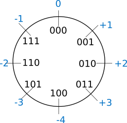

=  Estructura de Computadores
// classic AsciiDoctor attributes
//:stem: latexmath
:stem:
:background-color="#ff0000":
:icons: font
:imagesdir: images
:customcss: styles/myCustomCSS.css
// Despite the warning of the documentation, https://github.com/asciidoctor/asciidoctor-reveal.js, highlight.js syntax highlighting WORKS, BUT, you need to explicitly set the highlighter using the below attribute
// see http://discuss.asciidoctor.org/Highlighting-source-code-for-reveal-js-backend-td2750.html
:source-highlighter: highlight.js
:highlightjs-languages: vhdl
:source-language: vhdl 
//:source-highlighter: rouge
//:source-highlighter: pygments
// revealjs attributes
:revealjs_theme: white
:revealjs_slideNumber: true
// Al actualizar el slide no cambia de transpa y no se va al inicio
:revealjs_hash: true   
:revealjs_history: true

:revealjs_center: true
:revealjs_width: "100%"
:revealjs_height: "100%"
:revealjs_margin: 0

//:revealjs_minScale: 1,
//:revealjs_maxScale: 1

// plugins copiados de tutoriales/asciidoctor-revealjs/../primer.js
:revealjs_plugins_configuration: revealjs-plugins-conf.js
:revealjs_plugins: revealjs-plugins.js

//:scrollable: no pirula

//:revealjs_history: true para go to file no pirula

//:doctype: book
//:lang: es
//:encode: ISO-8859-1
//:ascii-ids:
:show-link-uri:
:asciidoctor-fetch-kroki:
:experimental:
:notitle:

:ruta-transpas: /home/candido/Dropbox/apuntes/apuntes_Estr_Computadores/upna/apuntes_repositorio/transpas_eecc

:ruta-apuntes: home/candido/Dropbox/apuntes

////
[data-visibility="hidden"]
== Transparencias en Formato PDF

* link:./PDF/eecc/eecc_slides.pdf[Transparencias PDF]
* Si hay algún error de forma en el documento PDF que dificulte su interpretación, por favor, enviar un mensaje para su correción. Gracias.
////

== Indice

[%hardbreaks]
Tema 1: <<Tema1_Intro, Introducción a la Asignatura Estructura de Computadores.>>
Tema 2: <<Tema2_VonNeum, Arquitectura de Von Neumann.>>
Tema 3: Representación Digital de la Información: los Datos: <<ascii,ASCII >>, <<num_nat, Nº Naturales>>, <<num_ent, Nº Enteros>>
Tema 4: Operaciones Aritméticas y Lógicas: <<op_nat, Nº Naturales>>, <<op_ent, Nº Enteros>>, <<op_log, Operaciones Lógicas>>   
Tema 5: <<Tema5_RepInstrucciones, Representación Digital de la Información: las Instrucciones.>>
Tema 6: <<Tema6_ProgAsm, Programación en Lenguaje Ensamblador (x86): Construcciones básicas de los lenguajes de alto nivel..>>

[#Tema1_Intro]
[.columns]
== Tema 1 : Introducción a los Sistemas Digitales Electrónicos

[.column]
* Profesorado

[.column]
* Organización Académica
** Programa
** Prácticas
** Ejercicios
** Evaluación
** Metodología

// [%notitle]
=== Profesorado

* Profesor Cándido Aramburu Mayoz.
** Doctor Ingeniero Telecomunicación (UPNA-Universidad Politécnica de Madrid) 
** Empresa Ikusi S.A. (Sistemas de Telemedida 1989)
** Profesor Titular UPNA (Dpto Ingeniería Electrónica y Comunicaciones 2000)
* Profesor Teoría: Carlos Juan de Dios
* Profesor Prácticas: Andrés Garde 

[.notes]
--
* https://www.etsit.upm.es/
* https://www.velatia.com/es/empresas-que-forman-velatia/ikusi/
* https://www.unavarra.es/eu/sites/Portada/home.html
--

=== Organización Académica

=== Aulas y Horarios

* Aulas
** Teoría: G91 -> A019, G1 ->A113, G2->A122
** Prácticas: P91->A015, P1->A305, P2->E-ISM, P3->E-ISM
** E-ISM : Edificio “Las Encinas” , lado derecho entre la Biblioteca y el Rectorado) en el Sótano, Laboratorio de Informática “ISM”

* Horario
** Teoría: G91(L-15:00), G1(X-17:00), G2(L-17:00)
** Prácticas: P91(X-19:00), P1(J-17:00), P2(M-19:00), P3(M-17:00)

=== Tutorías

* Despacho: Edificio Los Tejos 2 Planta: Despacho 2028 (Prof. Candido Aramburu)
* Miaulario -> correo interno
* https://www.unavarra.es/pdi?uid=364&dato=tutorias[Tutorías]
** Lunes (10-13) y  Miércoles (10-13) 

=== Programa de la Asignatura

* https://www.unavarra.es/ficha-asignaturaDOA?languageId=100000&codPlan=240&codAsig=240306&anio=2023[Ficha Web Upna]
** Programa en 3 partes 
... *_C_*
... *_C_*
... Otros: 

=== Bibliografía
* Fundamentos de Electrónica Digital. Cecilio Blanco

=== Metodología

* Trabajo en clase: principalmente Ejercicios con su teoría asociada

=== Prácticas
* Tipo de prácticas:

=== Ejercicios

* x

=== Evaluación

* Sistema de Evaluación:
** 35% teoría , 35% prácticas, 15% programación en papel, 15% otros

[#Tema2_VonNeum]
[.columns]
== Tema 2 : Arquitectura de Von Neumann

=== Indice

[.column]
* P

[.column]
* O

=== Qué conocemos de una computadora

* CPU? 3GHz? RAM? Memoria? 12GB? Disco Duro? Tarjeta gráfica? Pantalla? Ethernet? Placa base?
* Hardware, Software, Firmware? BIOS? Windows? Linux?
* Cuál es su arquitectura? Qué se entiende por arquitectura?

=== Organización de una computadora: niveles

* Los elementos básicos de una computadora desde el punto de vista del programador se pueden organizar por NIVELES: 
** del nivel más bajo y cercano a la máquina al nivel más alto y cercano al programador.

=== Organización de una computadora: llamadas

* Cada nivel llama a un nivel inferior

image::eecc_tema2_niveles_call.svg[]

=== Organización de un automóvil: concepto de Abstracción

* Un símil sería la relación entre un conductor y el coche. El coche físico (motor,ventilador,ejes,inyector,válvulas,caja de cambios,etc...) se *ABSTRAE* y para el conductor un coche son unos pedales, una palanca de cambios y un volante. La Arquitectura del coche también se podría describir por niveles, del nivel más bajo al nivel más alto, al más abstracto.

* El conductor conduce (programa) una máquina ABSTRACTA: acelera,frena,cambia y gira. No tiene por qué saber que la máquina real, la física, lleva aceite, ni siquiera tiene que saber que son necesarias unas ruedas.

* Gracias a la abstracción las máquinas se acercan en su uso a los humanos.

* Es necesario saber el QUE hace una máquina y no el COMO lo hace.

[.columns, state=txikiago]
=== Organización de una computadora: ISA

[.column]
--
* El Hardware de la computadora tiene como función interpretar y ejecutar un conjunto de instrucciones con el objeto de procesar datos para obtener algún tipo de resultado.
** lenguaje de la máquina : lenguaje binario
** las instrucciones y los datos de la máquina están en lenguaje binario: 0,1
** instrucciones máquina: P.ej sumar dos datos (números enteros) -> 
*** instrucción suma de 2 más 5 en código máquina: 0101010001000010101010101
*** misma instrucción máquina pero en lenguaje ensamblador (texto): add 2,5 
*** La CPU mediante sus circuitos electrónicos digitales realiza la suma binaria de los dos datos binarios

--

[.column]
--
* *I.S.A* : Instruction Set Architecture
** Arquitectura del Conjunto de Instrucciones máquina de una computadora 
** Conjunto: sumar, restar, mover un dato, saltar a una instrucción de memoria 
** Arquitectura: 
*** instrucciones: qué operaciones? ¿cuál es el tamaño de una instrucción?¿cuantos operandos tiene?¿cuál es su código binario? ¿cómo se hace referencia a un operando?
*** datos: tipo de datos: enteros?reales? su tamaño? su codificación?
--

=== Organización de una computadora: ISA

* El Hardware de la computadora tiene como nivel superior las instrucciones máquina que es capaz de ejecutar y los datos máquina que es capaz de ejecutar

image::eecc_tema2_isa.svg[align:left]

image::eecc_tema2_niveles_isa.svg[]

[.columns,state=txikiago]
=== Organización de una computadora: ISA

* Un programador de bajo nivel , pej los creadores de sistemas operativos, de compiladores, etc..., necesitan conocer la ISA de la máquina. 
* La programación de un sistema operativo como Windows  y Linux, en los lenguajes C y el lenguaje ensamblador, requiere conocer la arquitectura ISA.
* Los manuales ISA de un microprocesador tienen toda la información que necesita el programador, por lo tanto el programador de bajo nivel no necesita conocer todo el hardware interno de la CPU, de la memoria y de los controladores de entrada salida, sino únicamente la información disponible en el manual ISA.
* Para el programador la máquina es la ISA, el programador ve una máquina ABSTRACTA, ve la FUNCION de la máquina, QUÉ hace la máquina...y no COMO lo hace.
* En el laboratorio programaremos en lenguaje del nivel más bajo, es decir, en el lenguaje de la máquina pero no en binario sino en modo texto mediante el lenguaje ensamblador. Las operaciones de las instrucciones de la máquina en lenguaje ensamblador se expresan mediante mnemónicos como ADD, SUB, LOAD, MOV ... que son reducciones de palabras inglesas.  
* Buscar en google los manuales isa de intel x86 de 64 bits que son ejecutados por los microprocesadores de intel: core i3, core i5, core i7, etc...

=== Una máquina abstracta y muchas reales: compatibilidad

* De la misma forma que cuan do aprendemos a conducir (pedales+cambio+volante) nos sirve para cualquier coche, la *arquitectura del conjunto de instrucciones* es la misma para múltiples procesadores.
* La ISA amd64 ó x86-64 es la misma para todos los procesadores de Intel (core,xeon,etc...) o de AMD (Ryzen, etc). De esta forma un programa binario que se ejecute en un core-i7 también lo puede hacer en un Ryzen 9.

=== Programa en lenguaje texto: suma de los 5 primeros números enteros 

* Algoritmo latexmath:[$\sum_{i=1}^{5}i$]
* Lenguaje de texto Python 

+
[source,phyton]
----
sum(range(5,0,-1))
----

[.columns, state=txikiago]
=== Programa en lenguaje texto: suma de los 5 primeros números enteros 

[.column]
--
Lenguaje C +

[source,C]

/*
 Programa: sum1toN.c
 Descripción: 
   1+2+3+4+...+N
*/
#include <stdlib.h>
int main ()
{
  short N=5,y;
  while(N>=0)
    y+=N--;
  exit(y);
}
--

[.column]
--
Lenguaje Java +

[source,java]

/* Programa Fuente: sum1toN.java
 compilación: javac sum1toN.java -> sum1toN.class 
 ejecución   -> java -cp . sum1toN 
*/ 
public class sum1toN {
// método main encapsulado en la clase class
  public static void main(String[] args) { 
    System.out.println("Suma de Números enteros"); 
      int x=5, suma=0;
    while (x >= 0 ) {
      System.out.print( x );
      System.out.print(",");
      suma=suma+x;
      x--;
      }
    System.out.print("\n");
    System.out.print("suma="+suma);
    System.out.print("\n");
  }
}
-- 

[state=txikiago]
=== Módulo binario: en código binario

[source,shell]
----
gcc -o sum1toN sum1toN.c    
    -> genera el módulo ejecutable sum1toN para la arquitectura x86-64 +
ls -l sum1toN -> 16696 bytes 
file sum1toN 
   sum1toN: ELF 64-bit LSB shared object, x86-64, version 1 (SYSV), 
   dynamically linked, interpreter /lib64/ld-linux-x86-64.so.2,
   BuildID[sha1]=8df3de7b9ba05ceb7861b39d703c8ef11161284a, for GNU/Linux 3.2.0,
   not   stripped
----

----
gcc -m32 sum1toM sum1toN.c  
  -> genera el módulo ejecutable sum1toN para la arquitectura x86-32
hexdump sum1toN
  0000000 457f 464c 0102 0001 0000 0000 0000 0000
  0000010 0003 003e 0001 0000 1060 0000 0000 0000
  0000020 0040 0000 0000 0000 3978 0000 0000 0000
  0000030 0000 0000 0040 0038
----
programa ejecutable en código *hexadecimal*, más compacto que el binario +
1ª columna: direcciones, apuntan o hacen referencia a un byte +
2ª columna: +
---  4 dígitos hexadecimales del contenido. Si cada dígito hexadecimal equivale a 4 bits, dos dígitos hex. equivalen a 1 byte. +
---  457f: 2 bytes de código ejecutable +
---  No podemos interpretar el código binario, pero el procesador x86-64 sí.

[.columns, state=txikiago]
=== Interpretación del código binario (del programa sum1toN)

[.column]
* Desensamblador: convierte el código binario en código texto ENSAMBLADOR
* +objdump -d sum1toN+
+

----
Disassembly of section .text:

0000000000001060 <_start>:
    1060:	f3 0f 1e fa          	endbr64 
    1064:	31 ed                	xor    %ebp,%ebp
    1066:	49 89 d1             	mov    %rdx,%r9
    1069:	5e                   	pop    %rsi
    106a:	48 89 e2             	mov    %rsp,%rdx
    106d:	48 83 e4 f0          	and    $0xfffffffffffffff0,%rsp
    1071:	50                   	push   %rax
    1072:	54                   	push   %rsp
    1073:	4c 8d 05 86 01 00 00 	lea    0x186(%rip),%r8        
    107a:	48 8d 0d 0f 01 00 00 	lea    0x10f(%rip),%rcx        
    1081:	48 8d 3d c1 00 00 00 	lea    0xc1(%rip),%rdi         
    1088:	ff 15 52 2f 00 00    	callq  *0x2f52(%rip)        
    108e:	f4                   	hlt    
    108f:	90                   	nop

    .....       ....................    .........................

0000000000001149 <main>:
    1149:	f3 0f 1e fa          	endbr64 
    114d:	55                   	push   %rbp
    114e:	48 89 e5             	mov    %rsp,%rbp
    1151:	48 83 ec 10          	sub    $0x10,%rsp
    1155:	66 c7 45 fc 05 00    	movw   $0x5,-0x4(%rbp)
    115b:	eb 19                	jmp    1176 <main+0x2d>
    115d:	0f b7 45 fc          	movzwl -0x4(%rbp),%eax
    1161:	89 c2                	mov    %eax,%edx
    1163:	83 ea 01             	sub    $0x1,%edx
    1166:	66 89 55 fc          	mov    %dx,-0x4(%rbp)
    116a:	89 c2                	mov    %eax,%edx
    116c:	0f b7 45 fe          	movzwl -0x2(%rbp),%eax
    1170:	01 d0                	add    %edx,%eax
    1172:	66 89 45 fe          	mov    %ax,-0x2(%rbp)
    1176:	66 83 7d fc 00       	cmpw   $0x0,-0x4(%rbp)
    117b:	79 e0                	jns    115d <main+0x14>
    117d:	0f bf 45 fe          	movswl -0x2(%rbp),%eax
    1181:	89 c7                	mov    %eax,%edi
    1183:	e8 c8 fe ff ff       	callq  1050 <exit@plt>
    1188:	0f 1f 84 00 00 00 00 	nopl   0x0(%rax,%rax,1)
    118f:	00 

----

[.column]

1ª columna: dirección de referencia a la instrucción +
 +
2ª columna:  código máquina en hexadecimal +
 +
3ª columna:  código de operación de la instrucción en *lenguaje ensamblador* +
 +
4ª columna:  operandos de la instrucción en *lenguaje ensamblador*.

=== Lenguaje Ensamblador

* Es el lenguaje máquina traducido del binario a TEXTO para poder programar módulos fuente los programadores
* El formato de la instrucción ensamblador se compone principalmente de 2 campos:
** campo del código de operación mediante MNEMONICOS como push(insertar),mov(mover),add(sumar),jmp(saltar),jne(saltar si not equal), etv
** campo de los operandos de la operación: son referencias a memoria donde está el operando ó se pone el propio operando

[.columns]
=== Institute Advanced Machine (IAS)

[.column]
* https://es.wikipedia.org/wiki/M%C3%A1quina_de_von_Neumann[John von Neumann]
** Matemático húngaro 1903
** Proyecto Manhattan -> Bomba atómica
** Concepto de Arquitectura von Neumann de un Computador 

[.column]
* https://es.wikipedia.org/wiki/Arquitectura_de_Von_Neumann[Arquitectura de von Neumann]
** https://es.wikipedia.org/wiki/ENIAC[máquina ENIAC]: programa cableado
** https://es.wikipedia.org/wiki/EDVAC[máquina EDVAC]: programa almacenado -> *unidad de memoria
*** arquitectura von neumann: unidad de procesamiento + unidad de memoria + unidad de entrada salida
*** https://www.youtube.com/watch?v=jhlSEIbxO0E[youtube EDVAC]

[state=taula]
=== Repertorio de la máquina IAS: tabla

.Instruction Set
[width="100%",cols="1,2,^1,6,2",options="header"]
|============================================================================
|Instruction name| Instruction name 	|Op Code 	|Description				| Register Transfer Language (RTL)
|S(x)->Ac+ 	|LOAD M(X)	|1 	|copy the number in Selectron location x into AC	| AC <- M[x]
|S(x)->Ac- 	|LOAD -M(X)	|2 	|same as #1 but copy the negative of the number		| AC <- ~M[x]+1
|S(x)->AcM 	|LOAD \|M(X)\| 	|3 	|same as #1 but copy the absolute value			| AC <- \|M[x]\|
|S(x)->Ac-M 	|LOAD -\|M(X)\| |4 	|same as #1 but subtract the absolute value		| AC <- AC-\|M[x]\|
|S(x)->Ah+ 	|ADD M(X)	|5 	|add the number in Selectron location x into AC		|
|S(x)->Ah- 	|SUB M(X)	|6 	|subtract the number in Selectron location x from AC	|
|S(X)->AhM 	|ADD \|M(X)\| 	|7 	|same as #5, but add the absolute value			|
|S(X)->Ah-M 	|SUB \|M(X)\| 	|8 	|same as #7, but subtract the absolute value		|
|S(x)->R 	|LOAD MQ,M(X)	|9 	|copy the number in Selectron location x into AR	|
|R->A 	        |LOAD MQ	|A 	|copy the number in AR to AC				|
|S(x)*R->A 	|MUL M(X)	|B 	|Multiply the number in Selectron location x by the number in AR. Place the left half of the result in AC and the right half in AR.|
|A/S(x)->R 	|DIV M(X) 	|C 	|Divide the number in AC by the number in Selectron location x. Place the quotient in AR and the remainder in AC.|
|Cu->S(x) 	|JUMP M(X,0:19)	|D 	|Continue execution at the left-hand instruction of the pair at Selectron location x	|
|Cu`->S(x) 	|JUMP M(X,20:39)|E 	|Continue execution at the right-hand instruction of the pair at Selectron location x	|
|Cc->S(x) 	|JUMP+ M(X,0:19)|F 	|If the number in AC is >= 0, continue as in #D. Otherwise, continue normally. 		|
|Cc`->S(x) 	|JUMP+ M(X,20:39)|10 	|If the number in AC is >= 0, continue as in #E. Otherwise, continue normally. 		|
|At->S(x) 	|STOR M(X) 	|11 	|Copy the number in AC to Selectron location x						|
|Ap->S(x) 	| 	|12 	|Replace the right-hand 12 bits of the left-hand instruction at Selectron location x by the right-hand 12 bits of the AC|
|Ap`->S(x) 	| 	|13 	|Same as #12 but modifies the right-hand instruction			|
|L 	        |LSH	|14 	|Shift the number in AC to the left 1 bit (new bit on the right is 0)	|
|R 	        |RSH	|15 	|Shift the number in AC to the right 1 bit (leftmost bit is copied)	|
|halt 	        | 	|0 	|Halt the program (see paragraph 6.8.5 of the IAS r
|============================================================================

=== Repertorio de la máquina IAS: explicación

* En la versión original no había código ensamblador, se programaba directamente en lenguaje máquina.
** La 1ª columna: MNEMÓNICOS del lenguaje ensamblador del simulador académico IASSIM
** En la 2ª columna, los *MNEMONICOS* (LOAD,ADD,SUB,etc) de las operaciones de las instrucciones se corresponden con los diseñados por el libro de texto de William Stalling. 
** La 3ª columna describe la instrucción mediante el lenguaje de texto convencional
** La última columna describe la instrucción mediante un lenguaje de transferencia entre registros RTL

[.columns,state=txikiago]
=== IAS de la máquina ISA
[.column]
--

image::eecc_tema2_data_format.svg[]

* Formato de datos
** longitud de 40 bits
** números enteros con signo: código complemento a 2
--

[.column]
--
* Instrucciones: Sólo tiene 16 instrucciones por lo que el procesador es muy sencillo.
* Formato de las instrucciones
** Tamaño fijo de 20 bit
** la instrucción esta organizada en 2 campos: el campo de operaciones y el campo de operando
** campo de operación: longitud de 8 bits -> operaciones del tipo sumar,mover,saltar
** campo de operando: longitud de 12 bits
-- 

[state=txikiago]
=== Memoria de la máquina IAS

--

La memoria almacena el programa que ha de ejecutar la CPU +
El programa se encuentra codificado en lenguaje binario +
El programa es una secuencia de instrucciones y datos +
Los puertos de la memoria son MAR y MBR +
La dirección de memoria en código binario es la entrada del circuito decodificador que activa una de sus salidas
--

=== ALU de la máquina IAS

image::eecc_tema2_ALU.svg[]

[state=txikiago]
=== Unidad de Control de la máquina IAS

--

La unidad de control es el circuito digital microelectrónico que lleva a efecto el ciclo de instrucción de cada instrucción
ciclo de instrucción: cada instrucción pasa por 3 fases +
- captura de la instrucción por la unidad de control +
- intepretación de la instrucción por la unidad de control +
- ejecución de la instrucción por la unidad de control +
circuito secuenciador: electrónica para la secuencia de fases del ciclo de instrucción +
IR: almacena la instrucción a interpretar +
PC: apunta a la siguiente instrucción que tiene que comenzar su ciclo de instrucción
--

[state=txikiago]
=== Unidad de Control de la máquina IAS

--
image::eecc_tema2_mem-uc-alu-bus.svg[]

bus de datos: 40 hilos +
bus de direcciones: 12 hilos + 
bus de control (memoria): micro-órdenes de lectura y escritura +
bus de control (ALU): micro-órdenes de operaciones de suma,resta,and,or,etc..
--

[.columns]
=== Ciclo de instrucción

[.column]

[.column]
* Ejecución de un programa en la máquina IAS de von Neumann
** Las instrucciones se ejecutan una detrás de otra, secuencialmente
** Todas las instrucciones pasan por las distintas fases del ciclo de instrucción. 

=== Ciclo de instrucción: Animación

* Programa en lenguaje máquina
* 3 instrucciones
* Ruta de datos: transferencia de instrucciones y de datos a través de los registros y los buses
* Buses externos al procesador: buses de conexión entre el chip procesador y la tarjeta de  memoria -> buses de direcciones, datos y lectura/escritura
* Buses internos al procesador: microbuses entre registros, ALU y unidad de control
* Se va a visualizar la transferencia de información entre registros a través de la ruta de datos de la computadora
* https://www.youtube.com/watch?v=04UGopESS6A[Animación del ciclo instrucción]

[#Tema3_RepDatos]
== Tema 3 : Representación Digital de la Información: los DATOS

[.columns,state=txikiago]
=== Indice

[.column]
* Información: números, caracteres, imagen, sonido, etc ..
* Prefijos
* Digitalización de las señales
* Números
** Sistemas posicionales: base 10 (decimales), base 2 (binaria), base 16 (hexadecimal)
** Naturales: bases 10,2,8,16 . Conversión entre bases
** Enteros: Signo Magnitud,  Complemento a la base
** Operaciones aritméticas: Suma,Resta
** Operaciones lógicas: not,and,or,xor,desplazamiento de bits.

[.column]
* Caracteres
** Alfanuméricos y Signos de Puntuación
** ASCII standard y extendido

 

[state=taula]
=== Representación Científica y Prefijos de las Unidades

.Prefijos
[cols="<3,8*^1"]
|====
|Prefijos|Tera|Giga|Mega|Kilo|mili|micro|nano|pico
| Base 10 -> magnitudes:m,gr,Hz, ..| 10^12^| 10^9^| 10^6^| 10^3^| 10^-3^| 10^-6^| 10^-9^| 10^-12^
| Base 2 -> magnitudes: Byte | 2^12^| 2^9^| 2^6^| 2^3^| 2^-3^| 2^-6^| 2^-9^| 2^-12^
|====

[.text-left]
* Ejemplo: representar la magnitud=1000000000Hz debidamente
** Notación científica -> 10^9^Hz
** Debidamente: Notación científica con prefijos f=1GHz -> T=1/f=10^-9^seg= 1ns

=== Señales: Conversión Analógica Digital

=== Analogica vs Digital

* Señal Continua
** Amplitud: stem:[oo] valores posibles en el rango
** Tiempo: stem:[oo] valores posibles en el rango   
* Señal Discreta ó Digital
** Amplitud: finitos valores posibles en el rango
** Tiempo: finitos valores posibles en el rango 

=== Señales : Muestreo y Cuantificación

image:muestreo_cuantificacion.jpg[Mountain,900,400]

=== Codificación

image:ADC_codigo.webp[Mountain,600,500,float="left"]

[.text-left]
Calcular para las resoluciones de 3 bit y 16 bits cual es el mínimo incremento de señal codificable o error de cuantificación: con 3 bits el número de niveles es 2^3^=8niveles y el mínimo relativo es 2^-3^=1/8; con 16 bits el número de niveles es 2^16^ y el mínimo relativo es 2^-16^= 1/65536. 

[.text-left]
Representación de los números en código binario : <<Tema2_RepInf>>

=== Señales Binarias : Abstractas

image:clock-signals.png[Mountain,400,300,float="left"]

[.text-left%hardbreaks]
Eje ordenada: valores abstractos (0/1, High/Low, ON/OFF, etc ...).
Cronograma: Representación temporal de las señales digitales binarias.
Esa representación típica de los libros de texto, pizarra de clase, etc ... es ideal ya que físicamente siempre habrá distorsión.

=== Señales Binarias : Físicas

image:Digital-signal-noise.svg.png[Mountain,400,300,float="left"]

[.text-left%hardbreaks]
Eje ordenada: magnitudes físicas (mV ó mA).
La señal física está distorsionada por causas como pej: línea larga de transmisión (efectos capacitivos e inductivos).
Un ejemplo típico de distorsión son los tiempos de subida y bajada, que no son nulos sino del orden de unos nanosegundos.
La distancia considerable entre los dos niveles (binario) a la entrada del receptor hace fácil la discriminación entre el '0' y el '1'.

=== Digitalización de las Señales

=== Ventajas
* Calidad: Fácil de recuperar a pesar de la distorsión
* Almacenamiento: Fiabilidad, Diversidad Formatos
* Compatibilidad: Diversidad de Equipos (PC, móvil, coche, etc
* Procesamiento: Sencillo, Flexible
* Coste: Barato (componentes)

=== Abstracción

* Niveles: el 0 y el 1
* Lógica binaria 
** Matemáticas: Algebra de Boole

[#ascii]
=== Representación de los Caracteres

=== Representación de los Caracteres

* Tipos de Caracteres:
** Alfanuméricos: a,b,...z.0,1,...9,A,B...Z
** Signos de Puntuación: !"$%&/()=
** de Control: Salto de Línea (\n), Find de Fichero (EOF), Fin de String (\00, ...)
* Formatos
** ASCII: standard y extendido
** Unicode: UTF-8

[.columns]
=== ASCII Standard

[.column.zutabe]
----
          2 3 4 5 6 7       30 40 50 60 70 80 90 100 110 120
        -------------      ---------------------------------
       0:   0 @ P ` p     0:    (  2  <  F  P  Z  d   n   x
       1: ! 1 A Q a q     1:    )  3  =  G  Q  [  e   o   y
       2: " 2 B R b r     2:    *  4  >  H  R  \  f   p   z
       3: # 3 C S c s     3: !  +  5  ?  I  S  ]  g   q   {
       4: $ 4 D T d t     4: "  ,  6  @  J  T  ^  h   r   |
       5: % 5 E U e u     5: #  -  7  A  K  U  _  i   s   }
       6: & 6 F V f v     6: $  .  8  B  L  V  `  j   t   ~
       7: ' 7 G W g w     7: %  /  9  C  M  W  a  k   u  DEL
       8: ( 8 H X h x     8: &  0  :  D  N  X  b  l   v
       9: ) 9 I Y i y     9: '  1  ;  E  O  Y  c  m   w
       A: * : J Z j z
       B: + ; K [ k {
       C: , < L \ l |
       D: - = M ] m }
       E: . > N ^ n ~
       F: / ? O _ o DEL

----

[.column.zutabe_gehi]
[%hardbreaks]
American Standard Code for Information Interchange
Alfabeto anglosajón
7 bits -> 2^7^=128 caracteres : 0x00 hasta 0x1F son 32 caracteres de control y el resto alfanuméricos
En hexadecimal rango [0x00-0x7F]
En decimal rango [0-127]
*Upna* : 0x55706E61
*año 2023*: 0x61--6F2032303233

=== ASCII Extendido

* Para poder representar caracteres de otras culturas Europeas es necesrio expandir el standard con 1 bit más
* ASCII 8 bits -> 2^8^ = 256 caracteres
* https://www.programiz.com/python-programming/online-compiler/[Python Intepreter Shell]
+

[source,python]
---------
ord('A')
hex(ord('A'))
hex(ord('\n'))
chr(65)
chr(0x41)
[hex(ord(c)) for c in "Hola"]
[chr(c) for c in [0x48, 0x6f, 0x6c, 0x61, 0x20, 0x4d, 0x75, 0x6e, 0x64, 0x6f]]
[hex(ord(c)) for c in "ñ"]
[hex(ord(c)) for c in "\n \t"]
---------
** La ñ tiene el código ASCII 0xF1

[#num_nat]
=== Representación de los Números NATURALES

[state="taula"]
=== Representación de los Números Decimales

[.text-left]
* Decimal
** 10 dígitos : 0,1,2,3,4,5,6,7,8,9
** Pesos con base 10 : 10^n^ donde n es la posición del dígito dentro del número
* Ejemplo: número 5421

.Número 5451
[width=60%,cols="<3s,4*^1"]
|===
|Representación: 4+| los símbolos 5421
|Posiciones: | 3 | 2 | 1 | 0
| Pesos:
a|10^3^ -> 1000|10^2^ -> 100|10^1^->10|10^0^->1
| Dígitos:
a|5|4|5|1
| Valores : ponderación
a|5*1000=cinco mil|4*100=cuatrocientos|5*10=cincuenta|1*1=uno
| Valor: 4+| 5*1000+4*100+5*10+1= cinco mil cuatrocientos cincuenta y uno
|===

[state="taula"]
=== Representación de los Valores Enteros en Código Binario

* ¿Número?¿Valor?¿Código?¿Representación?
** 2 dígitos : 0,1
** Pesos con base 2 : 2^n^ donde n es la posición del dígito dentro del número: ....-1024-512-256-128-64-32-16-8-4-2-1...
* Ejemplo: número 0b1011

.Número 0b1011
[width=60%,cols="<3s,4*^1"]
|===
|Representación: 4+| los símbolos 1011
|Posiciones: | 3 | 2 | 1 | 0
| Pesos:
a|2^3^ -> 8|2^2^ -> 4|2^1^->2|2^0^->1
| Dígitos:
a|1|0|1|1
| Valores : ponderación
a|1*8=ocho|0*4=cero|1*2=dos|1*1=uno
| Valor: 4+| ocho+cero+dos+uno= once
|===

=== Representación de los Valores Enteros en Código Binario

* ¿Cómo se representa en binario el valor 123.125? b1111011.001
* ¿Cómo se calcula el valor del número binario b1111011.001?
* Parte Entera: divisiones sucesivas por la base 2
* Parte Fracción: multiplicaciones sucesivas por la base 2

=== Representación de los Valores Enteros en Código Octal

* Dígitos: 0,1,2,3,4,5,6,7
* Posiciones y Pesos
* ¿Cómo se representa en octal el valor 123.125? 0o173.1
* ¿Cómo se calcula el valor del número octal 0o173.1?
* Parte Entera: divisiones sucesivas por la base 8
* Parte Fracción: multiplicaciones sucesivas por la base 8

=== Representación de los Números en Hexadecimal

* Dígitos: 0,1,2,3,4,5,6,7,8,9,A,B,C,D,E,F ___ el valor de A es 10, B->11, C->12, D->13, E-14, F->15
* Posiciones y Pesos
* ¿Cómo se representa en hexadecimal el valor 123.125? 0x7B.2
* ¿Cómo se calcula el valor del número octal 0x7B.2?
* Parte Entera: divisiones sucesivas por la base 16
* Parte Fracción: multiplicaciones sucesivas por la base 16

=== Calculadora de Python

https://www.programiz.com/python-programming/online-compiler/[Python Intepreter Shell]

[source,python]
----
bin(123)
oct(123)
hex(123)
int(0b1111011)
int(0o173)
int(0x7B)
----

[.columns]
=== Conversiones entre el sistema binario y sistemas con base potencia de 2

[.column]
* Conversión Binaria-Hexadecimal
** base 16=2^4^
** grupos de 4 bits empezando por la dcha
** b1111011 ->  111 - 1011  -> 0x7B 
* Conversión Hexadecimal-Binaria
** grupos de 4 bits

[.column]
* Conversión Binaria-Octal
** base 8=2^3^
** grupos de 3 bits empezando por la dcha
** b1111011 -> 1 - 111 - 011  -> 0o173
* Conversión Octal-Binaria
** grupos de 3 bits

[#op_nat]
=== Operaciones Aritméticas con los Números NATURALES

=== Suma binaria

* Suma 10011011+00011011 = 10110110
+  

....
  Llevadas -->          1 1   1 1 
  	                         
                    1 0 0 1 1 0 1 1  <--sumando
                  + 0 0 0 1 1 0 1 1  <--sumando
  	                         
  Valor suma        1 0 1 3 2 1 3 2  <- ¿cómo se representan los valores de cada posición?      
                  *****************
  Resultado -->     1 0 1 1 0 1 1 0  <--suma
....

* LLEVADA
** Valor suma: el valor 3 de la posición 1 -> 3*2¹=6 -> 110
*** el dígito 1 de la posición 1 es el resultado
*** el dígito 1 de la posición 2 es la LLEVADA
** Conclusión:Cuando la suma en una posición específica tiene un valor es mayor o igual a la base hay que restar *n* veces la base y el valor *n* será la llevada a sumar en la posición siguiente.

=== Resta binaria

* Resta 10110110 - 10011011 = 00011011
+

----
Sumar crédito al minuendo            2  2     2  2

                            1  0  1  1  0  1  1  0  <--minuendo
      	                  - 1  0  0  1  1  0  1  1  <--sustraendo
 
               
Sumar llevada al sustraendo       1  1     1  1 
                          *************************
Resta                       0  0  0  1  1  0  1  1
----

* Cuando en una posición específica el minuendo es menor que el sustraendo se suma la base al minuendo antes de realizar la resta y se suma la llevada al sustraendo de la posición siguiente.
 
=== Aritmética Modular: la rueda

image::rueda_unsigned.png[Rueda,500,500,float="left"]

[.text-left%hardbreaks]
Representación binaria de números con 3 digitos.
2^3^ : 8 combinaciones posibles,-> MODULO 8
Ejemplo: cuentakilómetros del coche.
Ejemplo: registro de 3 celdas -> limitado a 8 combinaciones posibles.
¿Cual es la siguiente combinación a 111?, 111+1 = ¿ ?.
Calcular la representación del valor 33 en módulo 8 -> Resto(33/8)=1 -> en binario 001
33 pasos en la rueda equivale al número 001 -> aritmética modular en módulo 8

=== Operaciones aritméticas: Hexadecimal

* Base hexadecimal
** 0xD1B+0xAFF = 0x181A
** 0xE53-0xBAA = 0x2A9

[#num_ent]
=== Representación de los Números ENTEROS

=== Representación de Números con Valores Enteros

* Signo-Magnitud
* Complemento a la base

[state=txikiago]
=== Representación en Signo-Magnitud

* Signo -> un bit (Binary digIT)
* Base 2 : 
** valores positivos: el signo el *bit 0* en la posición MSB (More Significant Bit) y resto de bits representa el mód
** valores negativos: el signo el *bit 1* (base-1) en la posición MSB (More Significant Bit) y resto de bits representa el módulo
** Ejemplo +123 -> 0b01111011 y -123 -> 0b11111011
** Dibujar la tabla y la rueda con todos los valores con sus representaciones.
** ¿Cuantas representaciones son posibles?¿Es simétrico el rango de valores representado?¿Cuantas representaciones tiene el cero?
** ¿Cuál es la relación entre los números positivos y negativos?
** Extender el número de bits del número sin cambiar su valor

=== Extensión del signo en Signo-Magnitud

* Números positivos
** ¿Cuánto vale un cero a la izda?
** Extender el valor  '+123' a 12 bits -> 000001111011
* Números negativos
** ¿Cuánto vale .... a la izda?
** Extender el valor -123 a 12 bits -> Convertimos el valor positivo en negativo
*** 100001111011

[state=txikiago]
=== Representación en complemento a la base 2 : C2

* Signo -> un dígito
* Base 2: Complemento a 2 -> *C2*
* Valores positivos: Definición: igual que los valores positivos en código Signo-Magnitud
* Valores negativos: Definición: Hay que restar el código del valor en positivo del  minuendo 0000000 (base)
** Ejemplo '+123' -> 0b01111011 y -123 -> *00000000-01111011* = 0b100000101
** *Alternativa 1* a la definición: El código del valor negativo se puede calcular invirtiendo los bits del código del valor positivo y después sumarle 1
*** Equivale a calcular el C1 y sumarle 1
** *Alternativa 2* a la definición: El código del valor negativo se puede calcular a partir del código del valor positivo
*** empezando por la dcha repetir los bits hasta el primer uno e invertir el resto de bits

=== Representación en complemento a la base 2 : C2

* ¿Cuál es la relación entre los números positivos y negativos?
** El C2 de un número positivo es el código C2 de su valor en negativo
** El C2 de un número negativo es el código C2 de su valor en positivo
** Dibujar la tabla y la rueda con todos los valores con sus representaciones.
** ¿Cuantas representaciones son posibles?¿Es simétrico el rango de valores representado?¿Cuantas representaciones tiene el cero?
** Extender el número de bits del número sin cambiar su valor -> Extensión del bit de SIGNO 

[state=txiki]
=== Extensión del signo en C2

.Razonamiento de la extensión de signo de un número negativo: números de 3 bits
[width=60%,<1,2*<2]
|===
|Valor| C2 sin extensión | C2 con extensión
|  +33 |  0100001    | 00100001
.4+|  -33  l| 
 0000000  
-0100001 
--------  
 1011111 l|

 00000000 
-00100001 
---------
 11011111  
|===

* Aplicamos la definición para los dos ejemplos, el segundo caso es una extensión del primero ya que hemos añadido un digito más al minuendo y al sustraendo:
** Se observa que en el C2 con extensión, al hacer la resta y extender con un 0 más el minuendo y el substraendo, provoca la extensión con un bit más en la resta de valor 1 en el digito más significante. Según añado ceros al minuendo y sustraendo, aparecen unos en la resta sin alterar su valor.

=== Asimetría del rango en C2: -4 con 3 bits

* Con números de 3 bits el formato S-M es simétrico con valores en el rango (+3,-3), en cambio el formato C2 tiene el rango (+3,-4)
* En C2 el valor +4 se representa como 0b0100 y necesita por lo tanto 4 bits, no se puede representar con 3 bits, y el valor -4 se reprenta con el C2(0100), es decir, 1100 también con 4 bits. El 1100 se puede comprimir ya que tiene el signo extendido con la repetición de 1 de bit más significativo, por lo que la representación 100 es la representación del -4

=== Complemento a 2 : Ejemplos

* 0b101010101 está en C2 -> ¿Cual es su valor?
** como es negativo no es un sistema posicional
** tenemos que calcular el valor negativo a través del valor positivo
** La representación del valor positivo es el C2 del valor negativo
*** C2(0b101010101) = 0b010101011 cuyo valor es 2^7^+2^5^+2^3^+2^1^+2^0^=128+32+8+2+1=+171
*** El valor de 0b101010101 es -171

* Si la representación de -123 es 0b100000101 ¿cual es la de '+123' ?
** C2(0b100000101)=0b011111011 representa el valor '+123'

=== Número en complemento a 2 y base hexadecimal

CAUTION: Un número
 binario se puede representar en hexadecimal y hacer la interpretación en complento a 2. Hay que tener cuidado con las extensiones del signo

* Calcular el valor del número 0xAAA si dicho número tiene formato en complemento a 2
** si lo convertimos a binario el número empieza por 1, luego es negativo
** para saber su valor calculo su complementario C2 y tendré la representación del positivo
*** 0x000-0xAAA =0x556 -> 5*16^2^+5*16^1^+5*16^0^ = 5*256+5*16+5 = 1280+80+5 = '+213' -> 0xAAA tiene de valor -213

=== Número en complemento a 2 y base hexadecimal

* Realizar la suma de los números en formato complemento a 2: 0x80+0x80
** sumar sin extender el signo de los operandos ¿Hay overflow?
+

CAUTION: Extender el número 0x80. ¿ Por qué hay que tener cuidado ?
+

* sumar extendiendo un dígito el signo de los operandos 0x80

[state=taula_ta]
=== Extensión del signo en C2: problema de la BASE

.Extensión del Signo del Nº 0x80 en C2 en binario, hexadecimal y octal

[width=80%,cols="^1,2*<3"]
|===
|  NºBits | Binario | Hexadecimal 
|  8 |     10000000 |           1000_0000 ->   0x80 
|  9 |    110000000 |      1111_1000_0000 ->  0xF80 
| 10 |   1110000000 |      1111_1000_0000 ->  0xF80
| 11 |  11110000000 |      1111_1000_0000 ->  0xF80 
| 12 | 111110000000 |      1111_1000_0000 ->  0xF80 
| 13 |1111110000000 | 1111_1111_1000_0000 -> 0xFF80 
|===

[#op_ent]
=== Operaciones Aritméticas con los números ENTEROS

=== Operaciones Aritméticas: Suma y Resta

[.columns, state=txiki]
=== Operaciones aritméticas en C2

[.column]
* Suma
** Se realiza de la misma manera como se ha visto para números naturales. 
** Si hay llevada en el MSBit, NO se tiene en cuenta, se elimina.
** A=0b11011011. Suma A+A
+

....
Llevadas -> 1 1   1 1   1 1 
  	                         
              1 1 0 1 1 0 1 1 (Valor -37)
            + 1 1 0 1 1 0 1 1 (Valor -37)
  	                         
Valor suma      2 1 3 2 1 3 2        
            *****************
Resultado --> 1 0 1 1 0 1 1 0<--(Valor -74)
....

[.column]
* Resta
** La resta de números con signo se puede realizar de dos formas: A-B ó A-B = A+(-B)
** A = 0b00110110 y B = 0b10011011 
** Si hay llevada en el MSBit, no se tiene en cuenta, se elimina.
+

----
Crédito   2 2   2 2   2 2

          1 0 1 1 0 1 1 0<--(Valor -74)
        - 1 1 0 1 1 0 1 1<--(Valor -37)
 
               
LLevada 1 1 1   1 1   1 1 
         ****************
Resta     1 1 0 1 1 0 1 1 (Valor -101)
----

[state=txiki]
=== Operaciones ariméticas C2: Overflow o Desbordamiento

* A = 0b00110110 y B = 0b10011011 -> Calcular A-B
* Con 8 bits el máximo valor es 01111111 de valor 2^7^-1=128-1=127
* La resta A-(B)=A+(-B)=54+103=157>127 -> *Overflow* o *Desbordamiento*
+

----
Crédito  2     2 2   2 2

         0 0 1 1 0 1 1 0<--(Valor = 54)
       - 1 0 0 1 1 0 1 1<--(Valor = -103)
 
               
LLevada      1 1   1 1 
        ****************
Resta    1 0 0 1 1 0 1 1 (Valor -101)
----
** El valor -101 en lugar de la resta correcta +157 es debido a que el resultado esta fuera de rango -> 
** Observarmos que hemos hecho la SUMA de dos números POSITIVOS y el resultado ha sido NEGATIVO

=== Operaciones ariméticas C2: Overflow

IMPORTANT: Al realizar la suma de dos valores con el mismo signo si el resultado es de signo contrario hay overflow

[state=txiki]
=== Operaciones aritméticas C2: Overflow 

* Overflow: la operación requiere operandos con mayor número de bits manteniendo el valor para que el resultado sea correcto.
* Si dos operandos a sumar tienen diferente signo nunca hay overflow
* Si dos operandos a sumar tienen el mismo signo y resultado tiene signo contrario : *Error* de Overflow.
* Ejemplo:
** Operandos de 1 byte :  01111111+01111111=11111110 -> sumandos positivos y resultado negativo
*** Solución: *Extensión del signo* : Operandos  9 bits -> 001111111+001111111=011111110
*** la repetición del bit más significativo no altera el valor de la representación
*** el bit más significativo es 0 si es positivo y 1 si es negativo. Por lo tanto, 01010 equivale a 01010 ó 001010 ó 0....0001010. Por lo tanto, 1010 equivale a 11010 ó 111010 ó 1....1111010

=== C2: Representación gráfica del Overflow

[.text-left%hardbreaks]
Si a partir de la posición 010 nos movemos dos posiciones en sentido  horario llegamos a la posición 100.
Si a 010 le sumamos el valor 2 nos da como resultado 100
Por lo tanto 010+010=100, es decir, 2+2=-4 -> *overflow* ya que el _+4_ necesita 4 bits y estamos trabajando con 3 bits únicamente.

=== Aritmética Modular de valores representados en Complemento a 2

[.text-left%hardbreaks]
Representación de números binarios de 3 bits en C2
Operaciones de suma y resta modular -> método gráfico
A partir de la posición 001 si nos movemos en sentido horario (SUMA modular) 2 posiciones obtenemos la posición 011, es decir, 1+2=3
A partir de la posición 110 si nos movemos en sentido horario (SUMA modular) 9 posiciones obtenemos la posición 111, es decir, -2+9=-1
A partir de la posición 110 si nos movemos en sentido antihorario (RESTA modular) 4 posiciones obtenemos la posición 010, es decir, -2-4=+2
Los errores de *overflow* se resuelven aumentando el número de bits de la representación, pero siempre existira un rango que si lo traspasamos dará overflow.

[state=taula]
=== Comparación S-M, y C2

.Números de 3 bits
[width=80%,cols="3*^"]
|===
|Valor|S-M| C2

|+3| 011 |011
|+2| 010 |010
|+1| 001 |001
.2+|0 | 000| 000
| 100 |---
|-1 | 101 |111
|-2 | 110 |110
|-3 | 111 |101
|-4 | - | 100
|===

[#op_log]
=== Operaciones Lógicas

* Operadores
** Operadores aritméticos: suma, resta, multiplicación, ...
** Operadores lógicos: or (suma), and (producto), negación, or exclusiva, etc...
** Operadores comparadores: > (..mayor que..), > (..menor que..), == (..igual a..), etc
** Operadores de desplazamiento: >> (desplazar hacia la derecha), << (desplazar hacia la izquierda)

[.columns, state=taula_ta]
=== Tablas de la Verdad de los operadores NOT, OR, AND, XOR

[.column]
.NOT
|===
|x|z=x&#773;
|0|1
|1|0
|===

[.column]
.OR
[cols="2*^1,^2"]
|===
|x|y|z = x + y
|0|0|0
|0|1|1
|1|0|1
|1|1|1
|===

[.column]
.AND
[cols="2*^1,^2"]
|===
|x|y|z = x &#8729; y
|0|0|0
|0|1|0
|1|0|0
|1|1|1
|===

[.column]
.XOR
[cols="2*^1,^2"]
|===
|x|y|z = x &#8853; y
|0|0|0
|0|1|1
|1|0|1
|1|1|0
|===

[#Tema5_RepInstrucciones]
== Representación Digital de la Información: las INSTRUCCIONES

[.columns,state=txikiago]
=== Registro

[.column]
* Un registro es un circuito que funciona como una unidad de memoria y que almacena un único dato o una instrucción máquina.
* Los registros:
** 'almacenan' una palabra formada por una secuencia de bits.
** son una array de celdas en una dimensión, donde cada celda almacena un bit.
* Su tamaño normalmente es un múltiplo de 8 bytes y recibe un nombre para poder ser referencia, por ej RAX
** 8 bits: 1 Byte
** 16 bits: Word. Por razones históricas.(recordad que el tamaño de una palabra en otro contexto depende de la máquina de que se trate)

[.column]
* .
** 32 bits: double word
** 64 bits: quad word
* Las celdas se enumeran empezando por cero. 
* LSB: Least Significant Bit es el bit de menor peso  
* MSB: Most Significant Bit es el bit de mayor peso
+

=== Lenguaje RTL: operador transferencia

* El lenguaje RTL es un Lenguaje para la descripción de INSTRUCCIONES MAQUINA: Register Transfer Language (RTL)

* El lenguaje RTL tiene como objetivo poder expresar las instrucciones máquina que ejecuta la CPU como sumar(ADD),restar(SUB),mover(MOV), etc. La descripción se realiza a nivel de transferencia de datos entre 'registros' internos de la CPU o entre registros internos y la memoria externa. 

* La operación de *transferencia* se representa con una flecha de derecha a izquierda
** Operador transferencia <-
** Sentencia transferencia: R2<-R1
** A R1 se le llama registro fuente y a R2 registro destino
** Interpretación: Copiamos o Transferimos el contenido del registro R1 en el registro R2

=== Lenguaje RTL: otras sentencias

--
Sentencia Condicional: +
If (K1=1) then R2<-R1 +
  K1:R2<-R1 +
  La transferencia o copia se realiza únicamente si K1 es verdad, es decir, si K1 vale el valor lógico 1 (TRUE).
 +
 +
Sentencia Concurrente: +
Operador coma +
 K3:R2<-R1,R3<-R1 +
 Si K3 es verdad el contenido de R1 se copia en R2 y R3
--

[state=txikiago]
=== Sintaxis de las instrucciones en el lenguaje INTEL 

* El formato de las instrucciones en lenguaje ensamblador se conoce como 'sintaxis' de las instrucciones.
* SINTAXIS ASM: Etiqueta-Código de Operación- Operando1- Operando2- Comentario
* Arquitecturas x86-64 y x86 
+

.Sintaxis Intel: Estructura
[width="100%", cols="<2m,<4m,<6m,<1m,<5m,<3m"]
|=====================================================
|label: |op_mnemonic |operand_destination |, | operand_source |#comment
|=====================================================

[state=txikia]
=== Sintaxis de las instrucciones en el lenguaje INTEL : Ejemplo

* Ejemplo:
+

----
bucle:  sub     rsp,16                ;RSP <- RSP-16. Resta
        je      bucle                 ;je: jump equal: 
                                      ;salto si la última operación dió resultado cero
suma:   add     eax,esi               ;EAX <- EAX+M[ESI] . Sumar
        mov     ax,[resultado]        ;AX <- M[resultado]. 
                                      ;Copiar en el registro AX el contenido de la posición de memoria resultado       

resultado: "reserva de memoria"
----

[state=txikiago]
=== Sintaxis de las instrucciones en el lenguaje de la compañía telefónica AT&T

* SINTAXIS ASM: Etiqueta-Código de Operación- Operando1- Operando2- Comentario
* Arquitecturas x86-64 y x86 
+

.Sintaxis AT&T: Estructura
[width="100%", cols="<2m,<4m,<6m,<1m,<5m,<3m"]
|=====================================================
|label: |op_mnemonic |operand_source |, | operand_destination |#comment
|=====================================================

* La gran diferencia con el lenguaje de Intel son el orden de los dos operandos
* Otra pequeña diferencia son los prefijos de los operandos para indicar el modo de direccionar el operando

[state=txikia]
=== Sintaxis de las instrucciones en el lenguaje AT&T : Ejemplo

* Ejemplo:
+

----
bucle:  sub     $16,%rsp              ;RSP <- RSP-16. Resta
        je      bucle                 ;je: jump equal: 
                                      ;salto si la última operación dió resultado cero
suma:   add     %esi,%eax             ;EAX <- EAX+M[ESI] . Sumar
        mov     resultado,%ax         ;AX <- M[resultado]. 
                                      ;Copiar en el registro AX el contenido de la posición de memoria resultado       

resultado: "reserva de memoria"
----

=== Sintaxis AT&T

La sintaxis del lenguaje ensamblador depende del "traductor" del proceso de ensamblaje (*assembler*) utilizado, en este caso, se utiliza el assembler GAS.

....
ETIQUETA: Se especifica en la primera columna. Tiene el sufijo ":" 
CODIGO DE OPERACION: Se utilizan símbolos mnemónicos que ayudan a interpretar intuitivamente la operación.
		 Pej: ADD sumar, MOV mover, SUB restar, …​ 
OPERANDO FUENTE Y/O DESTINO: 
  dato alfanumérico: representación alfanumérica → 16 
    direccionamiento inmediato: prefijo $ 
  dirección de memoria externa: etiqueta → resultado 
    direccionamiento directo 
  registros internos de la CPU: %rax,%rbx,%rsp,%esi,.. 
    El prefijo "%" significa que el nombre hace referencia a un registro 
  tamaño del dato operando: sufijos de los mnemónicos: 
		q(quad):8 bytes, l(long):4 bytes, w(word):2 bytes, b(byte):1 byte. 
    Sin sufijo se toma la limitación del tamaño del registro referenciado
    y si no hay limitación el traductor avisa del error 
....

[state=txikiago]
=== Operandos: Modo de Direccionamiento

* Direccionamientos:
+

[.text-left%hardbreaks]
INMEDIATO: El valor del operando está ubicado inmediatamente después del código de operación de la instruccion. Unicamente se especifica el operando fuente.
    sintaxis: el valor del operando se indica con el prefijo *$* .
        ejemplo: *movl $0xabcd1234, %ebx*. El operando fuente es el valor 0xABCD1234
 +
 REGISTRO: El valor del operando está localizado en un registro de la CPU.
    sintaxis: Nombre del registro con el prefijo *%*.
        ejemplo: *movl %eax, %ebx*. El operando fuente es el REGISTRO EAX y el destino es el REGISTRO EBX
 +
DIRECTO:  La dirección efectiva apuntando al operando almacenado en la Memoria Principal es la dirección absoluta referenciada por la etiqueta especificada en el campo de operando. El programador utiliza el direccionamiento directo pero el compilador lo transforma en un direccionamiento relativo al contador de programa. Ver direccionamiento con desplazamiento.
    sintaxis: una etiqueta definida por el programador 
	ejemplo: *je somePlace*   . Salto a la dirección marcada por la etiqueta somePlace si el resultado de la operación anterior activa el flag ZF=1 del registro RFLAG.
 +
INDEXADO: El valor del operando está localizado en memoria. La dirección efectiva apuntando a Memoria es la SUMA del valor del registro_base MAS scale POR el valor en el registro_índice, MAS el offset. 'EA=Offset+R_Base+R_índice*Scale'
    sintaxis: lista de valores separados por coma y entre paréntesis (base_register, index_register, scale) y precedido por un offset.
        ejemplo: *movl $0x6789cdef, -16(%edx, %eax, 4)* . La dirección efectiva del destino es  *EDX + EAX*4 - 16*.

[state=txikiago]
=== Operandos: Modo de Direccionamiento

* Direccionamientos:
+

[.text-left%hardbreaks]
INDIRECTO: Si  el modo general de indexación  lo particularizamos en +(base_register)+ entonces la dirección del operando no se obtiene mediante una indexación sino que la dirección efectiva es el contenido de rdx y por lo tanto se accede al operando indirectamente.
    sintaxis:  (base_register)
        ejemplo: *movl $0x6789cdef, (%edx)* . La dirección efectiva del destino es  EDX. EDX es un puntero.
 +
RELATIVO: registro base más un offset:  El valor del operando está ubicado en memoria. La dirección efectiva del operando es la suma del valor contenido en un registro base más un valor de offset.
  	sintaxis: registro entre paréntesis y el offset inmediatamente antes del paréntesis.
      	ejemplo: *movl $0xaabbccdd, -12(%eax)*  . La dirección efectiva del operando destino es  EAX-12 

[state=txikiago]
=== Operandos: Modo de Direccionamiento

* Direccionamientos *prohibidos*
** En la misma instrucción los campos operando fuente y el operando destino no pueden hacer referencia a direcciones de memoria
* Ejemplos de direccionamientos prohibidos ó erróneos:
** mov dato,suma -> siendo dato y suma dos direcciones de la memoria
** mov (%edx),suma -> siendo EDX un puntero a memoria y suma una dirección de memoria

[state=taula]
=== Modos de direccionar los operandos: Ejemplos

.Modos de Direccionamiento de los Operandos
[width="100%",cols="<1m,<1m,<1m",options="header"]
|====
|Direccionamiento Operando | Valor Operando | Nombre del Modo
|$0   | Valor Cero   | Inmediato
|%rax | RAX | Registro
|loop_exit | M[loop_exit] | Directo
|data_items(,%rdi,4) | M[data_item + 4*RDI] | Indexado
|(%rbx) | M[RBX] | Indirecto
|(%rbx,%rdi,4) | M[RBX + 4*RDI] | Indirecto Indexado
|====

* M[loop_exit]: directo ya que loop_exit es una dirección de memoria externa y M indica la memoria externa.
* M[RBX]: indirecto ya que RBX es una dirección de memoria interna y M indica memoria externa: A la mem. externa se accede a través de la mem. interna.

=== Programa sum1toN: Organigrama

* Calcular la suma de los 5 primeros números naturales

image::sum1toN_organigrama.png[]

=== Programa sum1toN en lenguaje C

[source,c]
---------
/*
  Programa:       sum1toN.c
  Descripción:    realiza la suma de la serie 1,2,3,...N
                  
  Arquitectura del Procesador: La programación de este algoritmo en lenguaje C NO DEPENDE de la arquitectura del pocesador ¿Por qué y Cómo es posible?
  Lenguaje:       C99
  Descripción:    Suma de los primeros 5 números naturales
  Entrada:        Definida en una variable
  Salida:         Sin salida
  Compilación:    gcc -m32 -g -o sum1toN sum1toN.c -> -g: módulo binario depurable
                                                   -> -m32: módulo binario arquitectura x86-32 bits
  S.O:            GNU/linux 4.10 ubuntu 17.04 x86-64
  Librería:       /usr/lib/x86_64-linux-gnu/libc.so
  CPU:            Intel(R) Core(TM) i5-6300U CPU @ 3.0GHz
  Compilador:     gcc version 6.3 
  Ensamblador:    GNU assembler version 2.28
  Linker/Loader:  GNU ld (GNU Binutils for Ubuntu) 2.28
  Asignatura:     Estructura de Computadores
  Fecha:          20/09/2017
  Autor:          Cándido Aramburu
*/

#include <stdio.h>  // cabecera de la librería de la función printf()

// función de entrada al programa
void  main (void)
{
  // Declaración de variables locales
  char suma=0;
  char n=0b101;	
  // bucle
  while(n>0){
    suma+=n;
    n--;
  }
 printf("\n La suma es = %d \n",suma);
}
---------

=== Programa sum1toN para la máquina x86 en lenguaje AT&T  
 

* Lenguaje ensamblador ATT para la arquitectura x86-32
+

[source,asm]
----
### Programa: sum1toN.s
### Descripción: realiza la suma de la serie 1,2,3,...N
### Arquitectura del Procesador: x86 32 bits
### Compilación
###     gcc -m32 -g -nostartfiles -o sum1toN sum1toN.s
### o como alternativa
###     Ensamblaje as --32 --gstabs sum1toN.s -o sum1toN.o
###     linker -> ld -melf_i386 -I/lib/i386-linux-gnu/ld-linux.so.2   -o sum1toN sum1toN.o -lc

        ##  Declaración de variables
        .section .data

n:	.int 5
       
        .global _start

        ##  Comienzo del código
        .section .text
_start:
        mov $0,%ecx # ECX implementa la variable suma
        mov n,%edx
bucle:
        add %edx,%ecx
        sub $1,%edx
        jnz bucle
       
        mov %ecx, %ebx # el argumento de salida al S.O. a través de EBX según convenio
                
        ## salida
        mov $1, %eax  # código de la llamada al sistema operativo: subrutina exit
        int $0x80     # llamada al sistema operativo

        
        .end
----

=== Programa sum1toN para la máquina x86 en lenguaje Intel 
 

* Lenguaje ensamblador INTEL y assembler nasm
+

[source,nasm]
----
;;; Programa: sum1toN.asm
;;; Descripción: realiza la suma de la serie 1,2,3,...N
;;; Arquitectura del Procesador: x86 32 bits
;;; Lenguaje INTEL
;;; Assembler NASM

;;; nasm -hf -> ayuda de la opción f 
;;; Ensamblaje nasm -g -f elf  sum1toN.asm -o sum1toN.o
;;; linker -> ld -m elf_i386    -o sum1toN sum1toN.o 

	BITS 32	; cpu MODE
        ;;  Declaración de variables
        section .data

n:	dd 5	; 4 bytes
       
        global _start

        ;;  Comienzo del código
        section .text
_start:
        mov ecx,0 ; ECX implementa la variable suma
        mov edx,[n]  ; EDX implementa es un alias de la variable n
bucle:
        add ecx,edx
        sub edx,1
        jnz bucle
       
        mov ebx, ecx ; el argumento de salida al S.O. a través de EBX según convenio
                
        ;; salida
        mov eax,1  ; código de la llamada al sistema operativo: subrutina exit
        int 0x80     ; llamada al sistema operativo
----

[#Tema6_ProgAsm]
==  Programación en Lenguaje Ensamblador (x86): Construcciones básicas de los lenguajes de alto nivel.

=== Arquitecturas x86 i386 x86-64 amd64 

*  La arquitectura de Intel x86 de 32 bits  comenzó en el año 1985 con el microprocessador 80386 qué más adelante fue renuraombrado como "i386"
* x86-64 (también conocido como x64, x86_64, AMD64 e Intel 64) es la versión de 64 bits del conjunto de instrucciones x86. La especificación fue creada por AMD
* Linux denomina a la arquitectura x86 como i386 y a la arquitectura x86-64 como amd64.
* En esta asignatura se va a trabajar principalmente con la arquitectura x86 ya que las prácticas se realizan en esta arquitectura de 32 bits.

=== ISA x86

* El objetivo de este capítulo es tener las conocimientos necesarios para la programación de bajo de nivel (lenguaje ensamblador) de la arquitectura de 32 bits de Intel: x86
* Fases en el proceso de traducción (compilación,ensamblaje, módulos fuente, módulo objeto, módulo ejecutable, enlazado,resolución de referencias, librerías, sistema operativo ,etc) del módulo fuente y carga en memoria del módulo ejecutable.  
* El programador de bajo de nivel necesita el conocimiento de la ISA, es decir:
** Registros de propósito general internos de la CPU
** Registro de estado o registro de flags
** Direccionamiento de la memoria principal
** Diferencia entre la memoria interna (registros) y la memoria externa (memoria principal)
** Tipos de datos y su formato
** Tamaño de los operandos
** Alineamiento de los datos en la memoria
** Modos de direccionamiento
** Sintaxis del lenguaje
** Directivas del traductor assembler

=== Ejercicios

*  link:./as_code/sum1toN.s[sum1toN.s]
** Programa inicial de referencia
** sección de datos y sección de instrucciones: directivas .section  .data y .section .text
** direccionamientos: inmediato, a registro y directo
** estructura de un bloque: saltos incondicionales y condicionales
** etiqueta global
** llamada a funciones del sistema operativo y paso del argumento por registro
*  link:./as_code/sum1toN_v2.s[sum1toN_v2.s]
** Declaración de variables: En la sección de datos reservar memoria para el dato e inicializarlo. Directivas .byte, 2byte, 4byte
** instrucción de salto condicional: jnz ó jne
*  link:./as_code/sum1toN_v3.s[sum1toN_v3.s]
*  link:./as_code/sum1toN_v4.s[sum1toN_v4.s]
