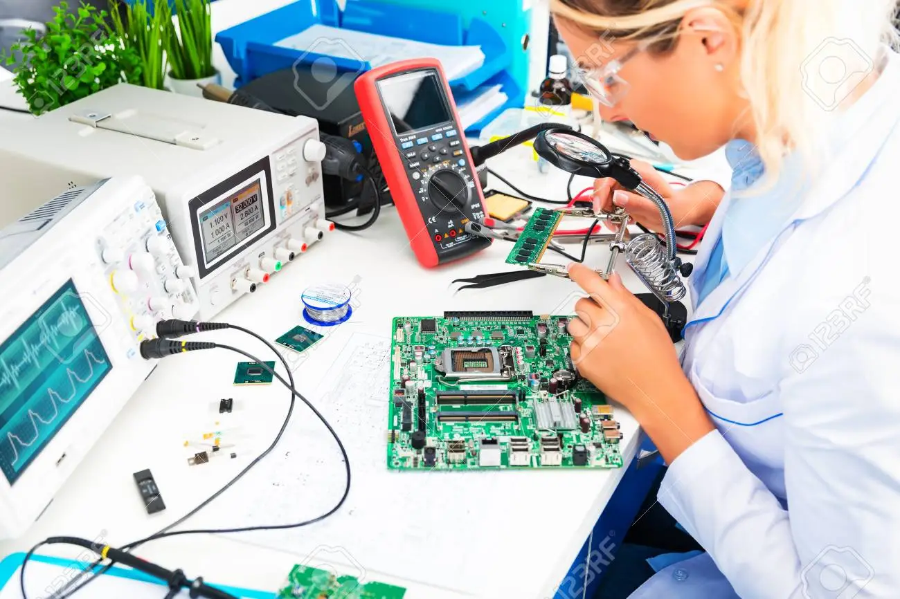

= Sistemas Digitales 
// classic AsciiDoctor attributes
:stem:
:background-color="#ff0000":
:icons: font
:imagesdir: images
:customcss: styles/myCustomCSS.css
// Despite the warning of the documentation, https://github.com/asciidoctor/asciidoctor-reveal.js, highlight.js syntax highlighting WORKS, BUT, you need to explicitly set the highlighter using the below attribute
// see http://discuss.asciidoctor.org/Highlighting-source-code-for-reveal-js-backend-td2750.html
:source-highlighter: highlight.js
:highlightjs-languages: vhdl
//:source-highlighter: rouge
//:source-highlighter: pygments
// revealjs attributes
:revealjs_theme: white
:revealjs_slideNumber: true
// Al actualizar el slide no cambia de transpa y no se va al inicio
:revealjs_hash: true   
:revealjs_history: true

:revealjs_center: true
:revealjs_width: "100%"
:revealjs_height: "100%"
:revealjs_margin: 0

//:revealjs_minScale: 1,
//:revealjs_maxScale: 1

// plugins copiados de tutoriales/asciidoctor-revealjs/../primer.js
:revealjs_plugins_configuration: revealjs-plugins-conf.js
:revealjs_plugins: revealjs-plugins.js

//:scrollable: no pirula

//:revealjs_history: true para go to file no pirula

[state="txiki"]
== Indice
* Presentación
** Profesor
** Calendario
** Sistemas Digital: TAC
** Electrónica
** Procesamiento de señales eléctricas

// [%notitle]
[state="txiki"]
== Profesorado

* Prof. Cándido Aramburu Mayoz.
** Doctor Ingeniero Telecomunicación (UPNA-Universidad Politécnica de Madrid) 
** Empresa Ikusi S.A. (Sistemas de Telemedida 1989)
** Profesor Titular UPNA (Dpto Ingeniería Electrónica y Comunicaciones 2000)
* Profesor Prácticas: Aitor Urrutia
* Profesor Euskera: Marko Galarza
* Profesor Inglés: Ignacio del Villar

[.notes]
--
* https://www.etsit.upm.es/
* https://www.velatia.com/es/empresas-que-forman-velatia/ikusi/
* https://www.unavarra.es/eu/sites/Portada/home.html
--

== Contacto

* Despacho: Edificio Los Tejos 2 Planta: Despacho 2028 (Prof. Candido Aramburu)
* Miaulario -> correo interno
* Clase
** G1: A112 : Lunes (12-14) y Jueves (10-12) 
** G2: A012 : Lunes (10-12) y Miércoles (12-14)
* Tutorías
** Lunes (14-17)
** Miércoles (14-17)
** Cita Previ

	
	Profesor Teoría: Cándido Aramburu

== Calendario

[state=taula]
=== Febrero

[%header, format=csv]
|===
Lunes,Martes,Miércoles,Jueves,Viernes,Sábado ,Domingo
,,1,2,3,4,5
6,7,8,9,10,11,12
13,14,15,16,17,18,19
20,21,22,23,24,25,26
27,28,,,,,
|===

[state=taula]
=== Marzo

[%header, format=csv]
|===
Lunes,Martes,Miércoles,Jueves,Viernes,Sábado ,Domingo
,,1,2,3,4,5
6,7,8,9,10,11,12
13,14,15,16,17,18,19
20,21,22,23,24,25,26
27,28,29,30,31,,
|===

== Tomografía axial computarizada

image:bio_tac_clinic.jpeg[Mountain,400,300,float="left]
image:bio_tac_hw.jpeg[Mountain,400,300,float="right"]

[state="txiki"]
=== Sistema Digital

image:bio_tac_block_fpga_2.jpeg[Mountain,650,550,float="left"]

[.text-left]
Entrada *_Analógica_* -> Sensores Magnéticos. +
*_Conversor_* A/D: Señal Analógica a Señales Digitales. +
Circuitos *_lógicos_* : multiplexores, filtros, codificadores, etc ... +
*_Procesadores lógicos_*: procesamiento de las señales digitales para obtener la imagen. +
# FPGA : Field Programming Gate Array. +
# DSP  : Digital Signal Processing. +
# CPU  : Centra Procesor Unit. +
# GPU  : Graphic Procesor Unit. +

== Electrónica

=== Equipos de Electrónica

image:equipos_electronica.jpeg[Mountain,400,300,float="left]

=== Esquema Eléctrico

image:esquema_electrico.png[Mountain,600,400,float="left]

=== Componentes de una tarjeta de circuito impreso

image:pcb_componentes.png[Mountain,400,300,float="left]
Componentes: Discretos, Integrados (semiconductor,"chips",microelectrónica)

=== Printed Circuit Board

image:print_circuit_board.jpg[Mountain,600,400,float="left]

=== Instrumentación

== La Electrónica en la Profesión

image:electronics_job.png[Mountain,750,600,float="left]

=== Técnico

image:tecnico_electronica.jpeg[Mountain,400,300,float="left]

=== ¿?

[state="txiki"]
== La Electrónica en la Carrera Universitaria

* Conocimientos de Electrónica
** ¿ Para .... ?
** Tecnología Hardware
*** Fabricación de Prototipos
*** Diseño de Prototipos : Conceptos Teóricos y Herramientas de diseño por computador
*** Desarrollo de Sistemas: Equipos, Plataformas
*** Comercialización
*** Usuario: Equipos, Plataformas

== Señales: Conversión Analógica Digital

=== Señales: Muestreo y Cuantificación

image:muestreo_cuantificacion.jpg[Mountain,900,400,float="left"]

[state=txiki]
=== Codificación

image:ADC_codigo.webp[Mountain,600,500,float="left"]

[.text-left]
Calcular para las resoluciones de 8 bit y 16 bits cual es el mínimo incremento de señal codificable o error de cuantificación

=== Procesado Digital

* FPGA
* DSP
* CPU
* GPU
* Sistemas de Microcontrolador Empotrados

=== Señales Binarias : Abstractas

image:clock-signals.png[Mountain,400,300,float="left"]

[.text-left]
Eje ordenada: valores abstractos (0/1, High/Low, ON/OFF, etc ...)

=== Señales Binarias : Abstractas

image:Digital-signal-noise.svg.png[Mountain,400,300,float="left"]

[.text-left]
Eje ordenada: magnitudes físicas (mV ó mA)

== Digitalización de las Señales

=== Ventajas
* Calidad: Fácil de recuperar a pesar de la distorsión
* Almacenamiento: Fiabilidad, Diversidad Formatos
* Compatibilidad: Diversidad de Equipos (PC, móvil, coche, etc
* Procesamiento: Sencillo, Flexible
* Coste: Barato (componentes)

=== Abstracción

* Niveles: el 0 y el 1
* Lógica binaria 
** Matemáticas: Algebra de Boole

=== Fases de Diseño de Circuitos Electrónicos Binarios

. Funcional (manual): abstracción matemática
. Automatización del proceso matemático
.. Herramientas de Diseño con ayuda del Computador (EDA)
.. Simulación del Diseño del Circuito Electrónico antes de fabricar el prototipo: Depuración
. Fabricación del prototipo
.. Instrumentación
.. Verificación del funcionamiento en el Laboratorio
.. Verificación del funcionamiento en Campo
. Comercialización
. Producción

== Organización de la Asignatura

=== Evaluación

* Sistema de Evaluación:
** 75% teoría y 25% prácticas
** Evaluación continua Teoría: dos parciales (30% 1º parcial y 45% 2º parcial). Nota mínima en el 2º parcial: 5. El Primer parcial se realizará el sábado 27 de Marzo a las 9:00, el segundo parcial el 26 de Mayo a las 16:00 y la recuperación el 9 de Junio a las 8:00
** Recuperación Teoría: Entra todo. Nota mínima: 5.
** Evaluación Prácticas: Un único exámen el sábado 14 de Mayo, no recuperable.

=== Prácticas
* Tipo de prácticas:
** Diseño manual
** Simulación con la herramienta software Quartus de Intel.
** Captura gráfica de Esquemas Electrónicos
** Descripción del Circuito mediante el Lenguaje VHDL. Fabricación del Circuito en tecnología FPGA

[state=txiki]
=== Ejercicios

* Tipo de problemas: Libro Verde -> Ejercicios tipo examen -> Sin calculadora y sin libros
+

-----
El libro verde se adquiere en el edificio de rectorado, en la sección de comunicacion,
que se encuentra en planta baja del edificio.
El horario: 8 a 14:30. Precio 8.5$. 
-----
+

----
* Capítulo 1: 1.1, 1.2, 1.4, 1.5, 1.6, 1.8, 1.9
* Capítulo 2: 2.1
* Capítulo 3: 3.2 3.3 -> 2º parcial
* Capítulo 4: 4.2, 4.4, 4.6
* Capítulo 5: 5.2, 5.3, 5.4
* Capítulo 6: 6.1, 6.2 -> 2º parcial
* Capítulo 7: 7.2, 7.3 y 7.4 -> 2º parcial
* Capítulo 8: 8.1, 8.3 y 8.5 -> 2º parcial
----
* Los ejercicios del tema 2 (Representación de la Información) no están en el libro verde
** Miaulario -> Recursos -> Ejercicios

=== Programa de la Asignatura

* http://www.unavarra.es/ficha-asignaturaDOA/?languageId=100000&codPlan=246&codAsig=246110&anio=2022[Ficha Web Upna]
** Programa en 3 partes 
... *_Circuitos Combinacionales_*
... *_Circuitos Secuenciales_*
... Otros: Números, Lógica Programable (VHDL), Teoría Tecnología
* Bibliografía

=== Metodología

* Trabajo en clase: principalmente Ejercicios con su teoría asociada
* Trabajo en casa
** Teoría desarrollada en los apuntes PDF en mi aulario
** Prácticas
*** En casa: Ejercicios de diseño manual
*** En casa: Utilización de Quartus y Memorias
* Tutorías
** Resolución de dudas
