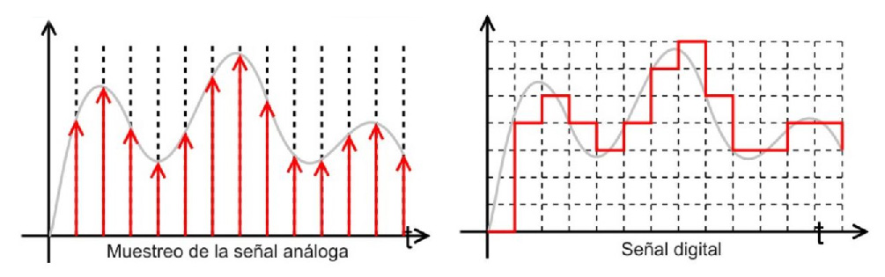

= Sistemas Digitales 
// classic AsciiDoctor attributes
:stem: latexmath
:background-color="#ff0000":
:icons: font
:imagesdir: images
:customcss: styles/myCustomCSS.css
// Despite the warning of the documentation, https://github.com/asciidoctor/asciidoctor-reveal.js, highlight.js syntax highlighting WORKS, BUT, you need to explicitly set the highlighter using the below attribute
// see http://discuss.asciidoctor.org/Highlighting-source-code-for-reveal-js-backend-td2750.html
:source-highlighter: highlight.js
:highlightjs-languages: vhdl
//:source-highlighter: rouge
//:source-highlighter: pygments
// revealjs attributes
:revealjs_theme: white
:revealjs_slideNumber: true
// Al actualizar el slide no cambia de transpa y no se va al inicio
:revealjs_hash: true   
:revealjs_history: true

:revealjs_center: true
:revealjs_width: "100%"
:revealjs_height: "100%"
:revealjs_margin: 0

//:revealjs_minScale: 1,
//:revealjs_maxScale: 1

// plugins copiados de tutoriales/asciidoctor-revealjs/../primer.js
:revealjs_plugins_configuration: revealjs-plugins-conf.js
:revealjs_plugins: revealjs-plugins.js

//:scrollable: no pirula

//:revealjs_history: true para go to file no pirula

:doctype: book
:lang: es
:encode: ISO-8859-1
:ascii-ids:
:show-link-uri:
:asciidoctor-fetch-kroki:
:experimental:

:ruta-transpas: home/candido/Dropbox/apuntes/apuntes_sistemas_digitales/upna/apuntes_repositorio/transpas_ssdd

:ruta-apuntes: home/candido/Dropbox/apuntes

== Indice

[%hardbreaks]
Tema 1: Introducción a los Sistemas Digitales Electrónicos <<Tema1_Intro>>.
Tema 2: Representación Digital de la Información <<Tema2_RepInf>>.
Tema 3: Algebra de Boole. Puertas Lógicas.<<Tema3_BoolePuertas>>
Tema 4: Lenguaje de Descripción Hardware VHDL.
Tema 5: Circuitos Aritméticos.
Tema 6: Otros Circuitos Combinacionales.

[#Tema1_Intro]
[.columns]
== Tema 1 : Introducción a los Sistemas Digitales Electrónicos

[.column]
* Presentación
** Profesor
** Calendario
** Sistemas Digital: TAC
** Electrónica
** Procesamiento de señales eléctricas

[.column]
* Organización Académica
** Programa
** Prácticas
** Ejercicios
** Evaluación
** Metodología

// [%notitle]
=== Profesorado

* Prof. Cándido Aramburu Mayoz.
** Doctor Ingeniero Telecomunicación (UPNA-Universidad Politécnica de Madrid) 
** Empresa Ikusi S.A. (Sistemas de Telemedida 1989)
** Profesor Titular UPNA (Dpto Ingeniería Electrónica y Comunicaciones 2000)
* Profesor Prácticas: Aitor Urrutia
* Profesor Euskera: Marko Galarza
* Profesor Inglés: Ignacio del Villar

[.notes]
--
* https://www.etsit.upm.es/
* https://www.velatia.com/es/empresas-que-forman-velatia/ikusi/
* https://www.unavarra.es/eu/sites/Portada/home.html
--

=== Contacto

* Despacho: Edificio Los Tejos 2 Planta: Despacho 2028 (Prof. Candido Aramburu)
* Miaulario -> correo interno
* Clase
** G1: A112 : Lunes (12-14) y Jueves (10-12) 
** G2: A012 : Lunes (10-12) y Miércoles (12-14)
* Tutorías
** Lunes (14-17) y  Miércoles (9-12)
** Cita Previa

=== Calendario

[.state=topleft]
=== Febrero

[%header, format=csv]
|===
Lunes,Miércoles

30-Presentación.-Repre_info: bases,1-Repre_Info:Enteros.C2:Expansion Signo
6-C2:overflow.Boole:Morgan,8-Boole:Morgan.DK:examples
13,15
20,22
27,
|===

[.state=topleft]
=== Marzo

[%header, format=csv]
|===
Lunes,Miércoles
,1
6,8
13,15
20,22
27,29
|===

=== Sistemas Digitales

=== Tomografía axial computarizada

image:bio_tac_clinic.jpeg[Mountain,400,300,float="left"]
image:bio_tac_hw.jpeg[Mountain,400,300,float="right"]

=== Sistema Digital

image:bio_tac_block_fpga_2.jpeg[Mountain,650,550,float="left"]

[.text-left]
Entrada *_Analógica_* -> Sensores Magnéticos. +
*_Conversor_* A/D: Señal Analógica a Señales Digitales. +
Circuitos *_lógicos_* : multiplexores, filtros, codificadores, etc ... +
*_Procesadores lógicos_*: procesamiento de las señales digitales para obtener la imagen. +
# FPGA : Field Programming Gate Array. +
# DSP  : Digital Signal Processing. +
# CPU  : Centra Procesor Unit. +
# GPU  : Graphic Procesor Unit. +

=== Electrónica

=== Equipos de Electrónica

image:equipos_electronica.jpeg[Mountain,400,300,float="left"]

=== Esquema Eléctrico

=== Componentes de una tarjeta de circuito impreso

image:pcb_componentes.png[Mountain,400,300,float="left"]

[.text-left]
Componentes: +  
 -Discretos: resistencias, condensadores, transistores, transformadores, etc. +
 -Integrados ("chips",microelectrónica). +
 --material de semicoductor: Silicio. +
 --el componente básico es el transistor -> un procesador puede tener cientos de millones. +
 --los microcircuitos hechos de transistores pueden ser tanto circuitos analógicos (un amplificador) como digitales (puertas lógicas) +

=== Printed Circuit Board

image:print_circuit_board.jpg[Mountain,600,400,float="left"]

=== Instrumentación

image:instrumentacion.webp[Mountain,600,500,float="left"]

=== La Electrónica en la Profesión

image:electronics_job.png[Mountain,750,600,float="left"]

=== Técnico

=== ¿ Profesiones relacionadas con la Electrónica?

[state=txiki]
=== Fases de Diseño de Circuitos Electrónicos Binarios

. Funcional (manual): abstracción matemática
. Automatización del proceso matemático
.. Herramientas de Diseño con ayuda del Computador (EDA)
.. Simulación del Diseño del Circuito Electrónico antes de fabricar el prototipo: Depuración
. Fabricación del prototipo
.. Instrumentación
.. Verificación del funcionamiento en el Laboratorio
.. Verificación del funcionamiento en Campo
. Comercialización
. Producción

=== La Electrónica en la Carrera Universitaria

* Conocimientos de Electrónica
** ¿ Para .... ?
** Tecnología Hardware
*** Fabricación de Prototipos
*** Diseño de Prototipos : Conceptos Teóricos y Herramientas de diseño por computador
*** Desarrollo de Sistemas: Equipos, Plataformas
*** Comercialización
*** Usuario: Equipos, Plataformas

[state=taula]
=== Representación Científica y Prefijos de las Unidades

.Prefijos
[cols="<3,8*^1"]
|====
|Prefijos|Tera|Giga|Mega|Kilo|mili|micro|nano|pico
| Base 10 -> magnitudes:m,gr,Hz, ..| 10^12^| 10^9^| 10^6^| 10^3^| 10^-3^| 10^-6^| 10^-9^| 10^-12^
| Base 2 -> magnitudes: Byte | 2^12^| 2^9^| 2^6^| 2^3^| 2^-3^| 2^-6^| 2^-9^| 2^-12^
|====

[.text-left]
* Ejemplo: representar la magnitud=1000000000Hz debidamente
** Notación científica -> 10^9^Hz
** Debidamente: Notación científica con prefijos f=1GHz -> T=1/f=10^-9^seg= 1ns

=== Señales: Conversión Analógica Digital

=== Analogica vs Digital

* Señal Continua
** Amplitud: stem:[oo] valores posibles en el rango
** Tiempo: stem:[oo] valores posibles en el rango   
* Señal Discreta ó Digital
** Amplitud: finitos valores posibles en el rango
** Tiempo: finitos valores posibles en el rango 

=== Señales : Muestreo y Cuantificación

=== Codificación

image:ADC_codigo.webp[Mountain,600,500,float="left"]

[.text-left]
Calcular para las resoluciones de 3 bit y 16 bits cual es el mínimo incremento de señal codificable o error de cuantificación: con 3 bits el número de niveles es 2^3^=8niveles y el mínimo relativo es 2^-3^=1/8; con 16 bits el número de niveles es 2^16^ y el mínimo relativo es 2^-16^= 1/65536. 

[.text-left]
Representación de los números en código binario : <<Tema2_RepInf>>

=== Señales Binarias : Abstractas

image:clock-signals.png[Mountain,400,300,float="left"]

[.text-left%hardbreaks]
Eje ordenada: valores abstractos (0/1, High/Low, ON/OFF, etc ...)
Cronograma: Representación temporal de las señales digitales binarias.
Esa representación típica de los libros de texto, pizarra de clase, etc ... es ideal ya que físicamente siempre habrá distorsión.

=== Señales Binarias : Físicas

image:Digital-signal-noise.svg.png[Mountain,400,300,float="left"]

[.text-left%hardbreaks]
Eje ordenada: magnitudes físicas (mV ó mA).
La señal física está distorsionada por causas como pej: línea larga de transmisión (efectos capacitivos e inductivos).
Un ejemplo típico de distorsión son los tiempos de subida y bajada, que no son nulos sino del orden de unos nanosegundos.
La distancia considerable entre los dos niveles (binario) a la entrada del receptor hace fácil la discriminación entre el '0' y el '1'.

=== Digitalización de las Señales

=== Ventajas
* Calidad: Fácil de recuperar a pesar de la distorsión
* Almacenamiento: Fiabilidad, Diversidad Formatos
* Compatibilidad: Diversidad de Equipos (PC, móvil, coche, etc
* Procesamiento: Sencillo, Flexible
* Coste: Barato (componentes)

=== Abstracción

* Niveles: el 0 y el 1
* Lógica binaria 
** Matemáticas: Algebra de Boole

=== Organización Académica

=== Programa de la Asignatura

* http://www.unavarra.es/ficha-asignaturaDOA/?languageId=100000&codPlan=246&codAsig=246110&anio=2022[Ficha Web Upna]
** Programa en 3 partes 
... *_Circuitos Combinacionales_*
... *_Circuitos Secuenciales_*
... Otros: Números, Lógica Programable (VHDL), Teoría Tecnología
* Bibliografía

=== Prácticas
* Tipo de prácticas:
** Diseño manual
** Simulación con la herramienta software Quartus de Intel.
** Captura gráfica de Esquemas Electrónicos
** Descripción del Circuito mediante el Lenguaje VHDL. Fabricación del Circuito en tecnología FPGA

=== Ejercicios

* Tipo de problemas: Libro Verde -> Ejercicios tipo examen -> Sin calculadora y sin libros
+

-----
El libro verde se adquiere en el edificio de rectorado, en la sección de comunicacion,
que se encuentra en planta baja del edificio.
El horario: 8 a 14:30. Precio 8.5$. 
-----
+

----
* Capítulo 1: 1.1, 1.2, 1.4, 1.5, 1.6, 1.8, 1.9
* Capítulo 2: 2.1
* Capítulo 3: 3.2 3.3 -> 2º parcial
* Capítulo 4: 4.2, 4.4, 4.6
* Capítulo 5: 5.2, 5.3, 5.4
* Capítulo 6: 6.1, 6.2 -> 2º parcial
* Capítulo 7: 7.2, 7.3 y 7.4 -> 2º parcial
* Capítulo 8: 8.1, 8.3 y 8.5 -> 2º parcial
----
* Los ejercicios del tema 2 (Representación de la Información) no están en el libro verde
** Miaulario -> Recursos -> Ejercicios

=== Evaluación

* Sistema de Evaluación:
** 75% teoría y 25% prácticas
** Evaluación continua Teoría: dos parciales (30% 1º parcial y 45% 2º parcial). Nota mínima en el 2º parcial: 5. El Primer parcial se realizará el sábado 25 de Marzo a las 9:00, el segundo parcial el 24 de Mayo a las 8:00 y la recuperación el 12 de Junio a las 8:00
** Recuperación Teoría: Entra todo. Nota mínima: 5.
** Evaluación Prácticas: Un único exámen el sábado XX de Mayo, no recuperable.

=== Metodología

* Trabajo en clase: principalmente Ejercicios con su teoría asociada
* Trabajo en casa
** Teoría desarrollada en los apuntes PDF en mi aulario
** Prácticas
*** En casa: Ejercicios de diseño manual
*** En casa: Utilización de Quartus y Memorias
* Tutorías
** Resolución de dudas

[#Tema2_RepInf]
== Tema 2 : Representación Digital de la Información

[state=txiki]
=== Indice

* Información: números, caracteres, imagen, sonido, etc ..
* Números
** Sistemas posicionales: base 10 (decimales), base 2 (binaria)
** Naturales: bases 10,2,8,16 . Conversión entre bases
** Enteros: Signo Magnitud, Complemento a la base-1, Complemento a la base
** Operaciones aritméticas: Suma,Resta
** Reales: coma fija y coma flotante
* Caracteres
** Alfanuméricos y Signos de Puntuación
** ASCII standard y extendido
** Unicode: UTF-8 
 

=== Representación de los Números 

[state="taula"]
=== Representación de los Números Decimales

[.text-left]
* Decimal
** 10 dígitos : 0,1,2,3,4,5,6,7,8,9
** Pesos con base 10 : 10^n^ donde n es la posición del dígito dentro del número
* Ejemplo: número 5421

.Número 5451
[width=60%,cols="<3s,4*^1"]
|===
|Representación: 4+| los símbolos 5421
|Posiciones: | 3 | 2 | 1 | 0
| Pesos:
a|10^3^ -> 1000|10^2^ -> 100|10^1^->10|10^0^->1
| Dígitos:
a|5|4|5|1
| Valores : ponderación
a|5*1000=cinco mil|4*100=cuatrocientos|5*10=cincuenta|1*1=uno
| Valor: 4+| 5*1000+4*100+5*10+1= cinco mil cuatrocientos cincuenta y uno
|===

[state="taula"]
=== Representación de los Valores Enteros en Código Binario

* ¿Número?¿Valor?¿Código?¿Representación?
** 2 dígitos : 0,1
** Pesos con base 2 : 2^n^ donde n es la posición del dígito dentro del número: ....-1024-512-256-128-64-32-16-8-4-2-1...
* Ejemplo: número 0b1011

.Número 0b110011
[width=60%,cols="<3s,4*^1"]
|===
|Representación: 4+| los símbolos 1011
|Posiciones: | 3 | 2 | 1 | 0
| Pesos:
a|2^3^ -> 8|2^2^ -> 4|2^1^->2|2^0^->1
| Dígitos:
a|1|0|1|1
| Valores : ponderación
a|1*8=ocho|0*4=cero|1*2=dos|1*1=uno
| Valor: 4+| ocho+cero+dos+uno= once
|===

=== Representación de los Valores Enteros en Código Binario

* ¿Cómo se representa en binario el valor 123.125? b1111011.001
* ¿Cómo se calcula el valor del número binario b1111011.001?
* Parte Entera: divisiones sucesivas por la base 2
* Parte Fracción: multiplicaciones sucesivas por la base 2

=== Representación de los Valores Enteros en Código Octal

* Dígitos: 0,1,2,3,4,5,6,7
* Posiciones y Pesos
* ¿Cómo se representa en octal el valor 123.125? 0o173.1
* ¿Cómo se calcula el valor del número octal 0o173.1?
* Parte Entera: divisiones sucesivas por la base 8
* Parte Fracción: multiplicaciones sucesivas por la base 8

=== Representación de los Números en Hexadecimal

* Dígitos: 0,1,2,3,4,5,6,7,8,9,A,B,C,D,E,F ___ el valor de A es 10, B->11, C->12, D->13, E-14, F->15
* Posiciones y Pesos
* ¿Cómo se representa en hexadecimal el valor 123.125? 0x7B.2
* ¿Cómo se calcula el valor del número octal 0x7B.2?
* Parte Entera: divisiones sucesivas por la base 16
* Parte Fracción: multiplicaciones sucesivas por la base 16

=== Calculadora de Python

https://www.programiz.com/python-programming/online-compiler/[Python Intepreter Shell]

[source,python]
----
bin(123)
oct(123)
hex(123)
int(0b1111011)
int(0o173)
int(0x7B)
----

[.columns]
=== Conversiones entre el sistema binario y sistemas con base potencia de 2

[.column]
* Conversión Binaria-Hexadecimal
** base 16=2^4^
** grupos de 4 bits empezando por la dcha
** b1111011 ->  111 - 1011  -> 0x7B 
* Conversión Hexadecimal-Binaria
** grupos de 4 bits

[.column]
* Conversión Binaria-Octal
** base 8=2^3^
** grupos de 3 bits empezando por la dcha
** b1111011 -> 1 - 111 - 011  -> 0o173
* Conversión Octal-Binaria
** grupos de 3 bits

=== Suma binaria

* Suma 10011011+00011011 = 10110110
+  

....
  Llevadas -->          1 1   1 1 
  	                         
                    1 0 0 1 1 0 1 1  <--sumando
                  + 0 0 0 1 1 0 1 1  <--sumando
  	                         
  Valor suma          1 3 2 1 3 2        
                  *****************
  Resultado -->     1 0 1 1 0 1 1 0  <--suma
....

* Cuando la suma en una posición específica tiene un valor es mayor o igual a la base hay que restar *n* veces la base y el valor *n* será la llevada a sumar en la posición siguiente.

=== Resta binaria

* Resta 10110110 - 10011011 = 00011011
+

----
Sumar crédito al minuendo            2  2     2  2

                            1  0  1  1  0  1  1  0  <--minuendo
      	                  - 1  0  0  1  1  0  1  1  <--sustraendo
 
               
Sumar llevada al sustraendo       1  1     1  1 
                          *************************
Resta                       0  0  0  1  1  0  1  1
----

* Cuando en una posición específica el minuendo es menor que el sustraendo se suma la base al minuendo antes de realizar la resta y se suma la llevada al sustraendo de la posición siguiente.
 
=== Aritmética Modular: la rueda

image::rueda_unsigned.png[Rueda,500,500,float="left"]

[.text-left%hardbreaks]
Representación binaria de números con 3 digitos.
2^3^ : 8 combinaciones posibles,
Ejemplo: cuentakilómetros del coche.
Ejemplo: registro de 3 celdas -> limitado a 8 combinaciones posibles.
¿Cual es la siguiente combinación a 111?, 111+1 = ¿ ?.
Calcular la representación del valor 33 en módulo 8 -> Resto(33/8)=1 -> en binario 001
33 pasos en la rueda equivale al número 001 -> aritmética modular en módulo 8

=== Operaciones aritméticas: Octal y Hexadecimal

* Base Octal 
** 0o675+0o304 = 0o1201
** 0o632-0o374 = 0o236
* Base hexadecimal
** 0xD1B+0xAFF = 0x181A
** 0xE53-0xBAA = 0x2A9

=== Representación de Números con Valores Enteros

* Signo-Magnitud
* Complemento a la base menos 1
* Complemento a la base

=== Representación en Signo-Magnitud

* Signo -> un dígito
* Base 10: 
** valores positivos: el signo el dígito 0 en la posición MSD (More Significant Digit) y resto de dígitos representa el módulo 
** valores negativos: el signo el dígito 9 (base-1) en la posición MSD (More Significant Dit) y resto de dígitos representa el módulo 
** Ejemplo +123 -> 0123 y -123 -> 9123

[state=txikiago]
=== Representación en Signo-Magnitud

* Signo -> un bit (Binary digIT)
* Base 2 : 
** valores positivos: el signo el bit 0 en la posición MSB (More Significant Bit) y resto de bits representa el mód
** valores negativos: el signo el bit 1 (base-1) en la posición MSB (More Significant Bit) y resto de bits representa el módulo
** Ejemplo +123 -> 0b01111011 y -123 -> 0b11111011
** Dibujar la tabla y la rueda con todos los valores con sus representaciones.
** ¿Cuantas representaciones son posibles?¿Es simétrico el rango de valores representado?¿Cuantas representaciones tiene el cero?
** Extender el número de bits del número sin cambiar su valor

=== Representación en complemento a la base menos 1. C9

* Base 10: Complemento a 9 -> C9
* Signo -> un dígito
* Valores positivos: igual que los valores positivos en código Signo-Magnitud
* Valores negativos: Hay que restar el código del valor en positivo del minuendo 99999999 (base-1)
** Ejemplo +123 -> 0123 y -123 -> 9999-0123 = 9876
* El C9 de un número positivo es el código de su valor en negativo
* El C9 de un número negativo es el código de su valor en positivo

[state=txikiago]
=== Representación en complemento a la base menos 1. C1

* Base 2 : base-1=1 -> Complemento a 1 -> C1
* Signo -> un dígito
* Valores positivos: igual que los valores positivos en código Signo-Magnitud
* Valores negativos: Hay que restar el código del valor en positivo del  minuendo 11111111 (base-1)
** Ejemplo '+123' -> 0b01111011 y -123 -> 11111111-01111011 = 10000100
** El código del valor negativo se puede calcular invirtiendo los bits del código del valor positivo
* El C1 de un número positivo es el código C1 de su valor en negativo y del de un número negativo es el código C1 de su valor en positivo
** Dibujar la tabla y la rueda con todos los valores con sus representaciones.
** ¿Cuantas representaciones son posibles?¿Es simétrico el rango de valores representado?¿Cuantas representaciones tiene el cero?
** Extender el número de bits del número sin cambiar su valor

=== Representación en complemento a la base 10 : C10

* Signo -> un dígito
* Base 10: Complemento a 10 -> C10
* Valores positivos: igual que los valores positivos en código Signo-Magnitud
* Valores negativos: Hay que restar el código del valor en positivo del minuendo 0000000 (base)
** Ejemplo '+123' -> 0123 y -123 -> 0000-0123 = 9877
* El C10 de un número positivo es el código de su valor en negativo
* El C10 de un número negativo es el código de su valor en positivo

[state=txikiago]
=== Representación en complemento a la base 2 : C2

* Signo -> un dígito
* Base 2: Complemento a 2 -> C2
* Valores positivos: igual que los valores positivos en código Signo-Magnitud
* Valores negativos: Hay que restar el código del valor en positivo del  minuendo 0000000 (base)
** Ejemplo *+123* -> 0b01111011 y *-123* -> 00000000-01111011 = 0b100000101
** El código del valor negativo se puede calcular invirtiendo los bits del código del valor positivo y después sumarle 1
*** Equivale a calcular el C1 y sumarle 1
** El código del valor negativo se puede calcular a partir del código del valor positivo
*** empezando por la dcha repetir los bits hasta el primer uno e invertir el resto de bits

=== Representación en complemento a la base 2 : C2

* El C2 de un número positivo es el código C2 de su valor en negativo
* El C2 de un número negativo es el código C2 de su valor en positivo
** Dibujar la tabla y la rueda con todos los valores con sus representaciones.
** ¿Cuantas representaciones son posibles?¿Es simétrico el rango de valores representado?¿Cuantas representaciones tiene el cero?
** Extender el número de bits del número sin cambiar su valor -> Extensión del bit de SIGNO 

[state=txiki]
=== Extensión del signo en C2

.Razonamiento de la extensión de signo de un número negativo: números de 3 bits
[width=60%,<1,2*<2]
|===
|Valor| C2 sin extensión | C2 con extensión
|  +33 |  0100001    | 00100001
.4+|  -33  l| 
 0000000  
-0100001 
--------  
 1011111 l|

 00000000 
-00100001 
---------
 11011111  
|===

Se observa que en el C2 con extensión, al hacer al resta y extender con un 0 más el minuendo y el substraendo, provoca la extensión con un bit más en la resta de valor 1 en el digito más significante. Según añado ceros al minuendo y sustraendo, aparecen unos en la resta sin alterar su valor.

[.columns, state=txiki]
=== Operaciones aritméticas en C2

[.column]
* Suma
** Se realiza como se ha visto para números naturales. 
** Si hay llevada en el MSBit, no se tiene en cuenta, se elimina.
** A=0b11011011. Suma A+A
+

....
Llevadas -> 1 1   1 1   1 1 
  	                         
              1 1 0 1 1 0 1 1 (Valor -37)
            + 1 1 0 1 1 0 1 1 (Valor -37)
  	                         
Valor suma      2 1 3 2 1 3 2        
            *****************
Resultado --> 1 0 1 1 0 1 1 0<--(Valor -74)
....

[.column]
* Resta
** La resta de números con signo se puede realizar de dos formas: A-B ó A-B = A+(-B)
** A = 0b00110110 y B = 0b10011011 
** Si hay llevada en el MSBit, no se tiene en cuenta, se elimina.
+

----
Crédito   2 2   2 2   2 2

          1 0 1 1 0 1 1 0<--(Valor -74)
        - 1 1 0 1 1 0 1 1<--(Valor -37)
 
               
LLevada 1 1 1   1 1   1 1 
         ****************
Resta     1 1 0 1 1 0 1 1 (Valor -101)
----

[state=txiki]
=== Operaciones ariméticas C2: Overflow o Desbordamiento

* A = 0b00110110 y B = 0b10011011 -> Calcular A-B
* Con 8 bits el máximo valor es 01111111 de valor 2^7^-1=128-1=127
* La resta A-(B)=A+(-B)=54+103=157>127 -> *Overflow* o *Desbordamiento*
+

----
Crédito  2     2 2   2 2

         0 0 1 1 0 1 1 0<--(Valor = 54)
       - 1 0 0 1 1 0 1 1<--(Valor = -103)
 
               
LLevada      1 1   1 1 
        ****************
Resta    1 0 0 1 1 0 1 1 (Valor -101)
----
** El valor -101 en lugar de la resta correcta +157 es debido a que el resultado esta fuera de rango -> 
** Observarmos que hemos hecho la SUMA de dos números POSITIVOS y el resultado ha sido NEGATIVO

=== Operaciones ariméticas C2: Overflow

IMPORTANT: Al realizar la suma de dos valores con el mismo signo si el resultado es de signo contrario hay overflow

[state=txiki]
=== Operaciones aritméticas C2: Overflow 

* Overflow: la operación requiere operandos con mayor número de bits manteniendo el valor para que el resultado sea correcto.
* Si dos operandos a sumar tienen diferente signo nunca hay overflow
* Si dos operandos a sumar tienen el mismo signo y resultado tiene signo contrario : *Error* de Overflow.
* Ejemplo:
** Operandos de 1 byte :  01111111+01111111=11111110 -> sumandos positivos y resultado negativo
*** Solución: *Extensión del signo* : Operandos  9 bits -> 001111111+001111111=011111110
*** la repetición del bit más significativo no altera el valor de la representación
*** el bit más significativo es 0 si es positivo y 1 si es negativo. Por lo tanto, 01010 equivale a 01010 ó 001010 ó 0....0001010. Por lo tanto, 1010 equivale a 11010 ó 111010 ó 1....1111010

=== C2: Representación gráfica del Overflow

image::rueda_signed.png[Rueda,500,500,float="left"]

[.text-left%hardbreaks]
Si a partir de la posición 010 nos movemos dos posiciones en sentido  horario llegamos a la posición 100.
Si a 010 le sumamos el valor 2 nos da como resultado 100
Por lo tanto 010+010=100, es decir, 2+2=-4 -> *overflow* ya que el _+4_ necesita 4 bits y estamos trabajando con 3 bits únicamente.

=== Asimetría del rango en C2: -4 con 3 bits

* Con números de 3 bits los formatos S-M y C1 son simétricos con valores en el rango (+3,-3), en cambio el formato C2 tiene el rango (+3,-4)
* En C2 el valor +4 se representa como 0b0100 y necesita por lo tanto 4 bits, no se puede representar con 3 bits, y el valor -4 se reprenta con el C2(0100), es decir, 1100 también con 4 bits. El 1100 se puede comprimir ya que tiene el signo extendido con la repetición de 1 de bit más significativo, por lo que la representación 100 es la representación del -4

=== Complemento a 2 : Ejemplos

* 0b101010101 está en C2 -> ¿Cual es su valor?
** como es negativo no es un sistema posicional
** tenemos que calcular el valor negativo a través del valor positivo
** La representación del valor positivo es el C2 del valor negativo
*** C2(0b101010101) = 0b010101011 cuyo valor es 2^7^+2^5^+2^3^+2^1^+2^0^=128+32+8+2+1=+171
*** El valor de 0b101010101 es -171

* Si la representación de -123 es 0b100000101 ¿cual es la de '+123' ?
** C2(0b100000101)=0b011111011 representa el valor '+123'

=== Aritmética Modular de valores representados en Complemento a 2

image::rueda_signed.png[Rueda,500,500,float="left"]

[.text-left%hardbreaks]
Representación de números binarios de 3 bits en C2
Operaciones de suma y resta modular -> método gráfico
A partir de la posición 001 si nos movemos en sentido horario (SUMA modular) 2 posiciones obtenemos la posición 011, es decir, 1+2=3
A partir de la posición 110 si nos movemos en sentido horario (SUMA modular) 9 posiciones obtenemos la posición 111, es decir, -2+9=-1
A partir de la posición 110 si nos movemos en sentido antihorario (RESTA modular) 4 posiciones obtenemos la posición 010, es decir, -2-4=+2
Los errores de *overflow* se resuelven aumentando el número de bits de la representación, pero siempre existira un rango que si lo traspasamos dará overflow.

[state=taula]
=== Comparación S-M, C1 y C2

.Números de 3 bits
[width=80%,cols="4*^"]
|===
|Valor|S-M| C1 | C2

|+3| 011 |011|011
|+2| 010 |010|010
|+1| 001 |001|001
.2+|0 | 000 |000|000
| 100 |011| ---
|-1 | 101 |110|111
|-2 | 110 |101|110
|-3 | 111 |100|101
|-4 | - | - | 100
|===

=== Número en complemento a 2 y base hexadecimal

CAUTION: Un número
 binario se puede representar en hexadecimal y hacer la interpretación en complento a 2. Hay que tener cuidado con las extensiones del signo

* Calcular el valor del número 0xAAA si dicho número tiene formato en complemento a 2
** si lo convertimos a binario el número empieza por 1, luego es negativo
** para saber su valor calculo su complementario C2 y tendré la representación del positivo
*** 0x000-0xAAA =0x556 -> 5*16^2^+5*16^1^+5*16^0^ = 5*256+5*16+5 = 1280+80+5 = '+213' -> 0xAAA tiene de valor -213

=== Número en complemento a 2 y base hexadecimal

* Realizar la suma de los números en formato complemento a 2: 0x80+0x80
** sumar sin extender el signo de los operandos ¿Hay overflow?
+

CAUTION: Extender el número 0x80. ¿ Por qué hay que tener cuidado ?
+

* sumar extendiendo un dígito el signo de los operandos 0x80

[state=taula_ta]
=== Extensión del signo en C2: problema de la BASE

.Extensión del Signo del Nº 0x80 en C2 en binario, hexadecimal y octal

[width=80%,cols="^1,3*<3"]
|===
|  NºBits | Binario | Hexadecimal | Octal

|  8 |     10000000 |           1000_0000 ->   0x80 |         110_000_000 ->  0o600
|  9 |    110000000 |      1111_1000_0000 ->  0xF80 |         110_000_000 ->  0o600
| 10 |   1110000000 |      1111_1000_0000 ->  0xF80 |     111_110_000_000 -> 0o7600
| 11 |  11110000000 |      1111_1000_0000 ->  0xF80 |     111_110_000_000 -> 0x7600
| 12 | 111110000000 |      1111_1000_0000 ->  0xF80 |     111_110_000_000 -> 0x77600
| 13 |1111110000000 | 1111_1111_1000_0000 -> 0xFF80 | 111_111_110_000_000 -> 0x77600
|===

=== Números Reales Binarios

* Coma Fija
** 123.125 -> b1111011.001
* Coma flotante
** Notación científica: potencias en la base del sistema (decimal,binario,etc)
** En decimal -> 1.23125*10^2^
** En binario ->1.111011001*2^6^
*** el factor que no es potencia se denomina mantisa
*** Se dice que el número real en binario y en notación científica está normalizado si la parte entera de la mantisa vale 1.

[state="txiki"]
=== Números Reales Binarios: Norma IEEE-754

* Campos del formato en notación científica : Signo, parte entera de la mantisa, parte fracción de la mantisa, base , exponente (módulo y signo)
* ¿Es necesario representar los *seis* campos del formato de la notación científica?
** Si esta normalizado la parte entera de la mantisa siempre vale 1
** La base del factor potencia siempre vale 2
** Por lo tanto la parte entera y la base no son necesario representarlas. Son ímplicitas a la representación.
** Hay una forma de no tener que representar el signo del exponente del factor potencia
*** es sumarle una cantidad para que al representarlo en EXCESO siempre sea positivo
* Resumiendo, sólo es necesario representar: el signo del número , la fracción de la mantisa y el exponente en exceso. Por lo tanto el formato IEEE-754 tiene 3 campos.

=== Formato IEEE-754 simple

* representación de 32 bits: 1 bit para el signo / 8 bits para el exponente en exceso a 127 / 23 bits para la fracción
* bit de signo: 0 si es positivo y 1 si es negativo
+

["ditaa"]
----------------------------------------------------------------------
  1      8bits              23bits                       <-- tamaño en bits
 +-+-------------+------------------------------------+
 |S|  Exp + 127  | Fracción de la Mantisa  Normalizada|
 +-+-------------+------------------------------------+
 31 30         23 22                                 0   <--  bit pos 0 a la dcha      
----------------------------------------------------------------------

=== Formato IEEE-754 doble

* representación de 64 bits: 1 bit para el signo / 11 bits para el exponente en exceso a 1023 / 52 bits para la fracción
* bit de signo: 0 si es positivo y 1 si es negativo
+

["ditaa"]
----------------------------------------------------------------------
  1      11bits              52bits            <-- tamaño en bits
 +-+-------------+-----------------------+
 |S|  Exp + 1023 | Fracción Mantisa  Norm|
 +-+-------------+-----------------------+
 63 62         52 51                     0   <-- bit pos 0 a la dcha      
----------------------------------------------------------------------

[.columns, state=txikiago]
=== El Nº -5.5/1024 en los dos Formatos IEEE-754

[.column]
* Signo negativo
* Conversión binaria del módulo
** módulo: 5.5/1024 = 5.5*2^-10^ = 101.1*2^-10^ 
** Normalización de la mantisa -> 1.011*2^-8^

[.column]
* Formato Simple de 32 bits
** Signo negativo: bit 1
** Exponente en exeso 127=-8+127=119=01110111
** Fracción de la mantisa=011
** Solución:
*** 1_01110111_01100000000000000000000  
*** 0b10111011101100000000000000000000 
*** *0xBBB00000* 
*** http://weitz.de/ieee/[calculador ieee]
    
[.column]
* Formato Doble de 64 bits
** Signo negativo:  bit 1
** Exponente en exeso 1023=-8+1023=1015=01111110111
** Fracción de la mantisa=011
** Solución:
*** 1_01111110111_0110...0  
*** 0b1011111101110110...0
*** *0xBF76000000000000*

=== Representación de los Caracteres

=== Representación de los Caracteres

* Tipos de Caracteres:
** Alfanuméricos: a,b,...z.0,1,...9,A,B...Z
** Signos de Puntuación: !"$%&/()=
** de Control: Salto de Línea (\n), Find de Fichero (EOF), Fin de String (\00, ...)
* Formatos
** ASCII: standard y extendido
** Unicode: UTF-8

[.columns]
=== ASCII Standard

[.column.zutabe]
----
          2 3 4 5 6 7       30 40 50 60 70 80 90 100 110 120
        -------------      ---------------------------------
       0:   0 @ P ` p     0:    (  2  <  F  P  Z  d   n   x
       1: ! 1 A Q a q     1:    )  3  =  G  Q  [  e   o   y
       2: " 2 B R b r     2:    *  4  >  H  R  \  f   p   z
       3: # 3 C S c s     3: !  +  5  ?  I  S  ]  g   q   {
       4: $ 4 D T d t     4: "  ,  6  @  J  T  ^  h   r   |
       5: % 5 E U e u     5: #  -  7  A  K  U  _  i   s   }
       6: & 6 F V f v     6: $  .  8  B  L  V  `  j   t   ~
       7: ' 7 G W g w     7: %  /  9  C  M  W  a  k   u  DEL
       8: ( 8 H X h x     8: &  0  :  D  N  X  b  l   v
       9: ) 9 I Y i y     9: '  1  ;  E  O  Y  c  m   w
       A: * : J Z j z
       B: + ; K [ k {
       C: , < L \ l |
       D: - = M ] m }
       E: . > N ^ n ~
       F: / ? O _ o DEL

----

[.column.zutabe_gehi]
[%hardbreaks]
American Standard Code for Information Interchange
Alfabeto anglosajón
7 bits -> 2^7^=128 caracteres : 0x00 hasta 0x1F son 32 caracteres de control y el resto alfanuméricos
En hexadecimal rango [0x00-0x7F]
En decimal rango [0-127]
*Upna* : 0x55706E61
*año 2023*: 0x61--6F2032303233

=== ASCII Extendido

* Para poder representar caracteres de otras culturas Europeas es necesrio expandir el standard con 1 bit más
* ASCII 8 bits -> 2^8^ = 256 caracteres
* https://www.programiz.com/python-programming/online-compiler/[Python Intepreter Shell]
+

[source,python]
---------
ord('A')
hex(ord('A'))
hex(ord('\n'))
chr(65)
chr(0x41)
[hex(ord(c)) for c in "Hola"]
[chr(c) for c in [0x48, 0x6f, 0x6c, 0x61, 0x20, 0x4d, 0x75, 0x6e, 0x64, 0x6f]]
[hex(ord(c)) for c in "ñ"]
[hex(ord(c)) for c in "\n \t"]
---------
** La ñ tiene el código ASCII 0xF1

[.state=txikiago]
=== UTF-8

* https://www.charset.org/utf-8[Character Set, HTML Converter, etc ...]
* Unicode Transformation Format (UTF)
* UTF-8: Esta orientado a la transmisión de palabras de 1 byte
* Los caracteres pueden tener entre 1 y 4 bytes -> 2^21^ code points  &#x2243; 2 millones;
* The dominant encoding on the World Wide Web and on most Unix-like operating systems
* En linux comando *localectl status* : informa sobre el sistema del teclado
* ñ: 
** hex code 0xC3B1  
** unicode point U+00F1  -> los primeros 256 caracteres equivalen al ascii extendido

[.columns]
=== Unicode Points

[.column]
* https://html-css-js.com/[html css js online]: \&#x00f1;
* U+2228: &#x2228;
* U+22bc: &#x22bc;
* U+22bd: &#x22bd;
* U+22a6:  &#x22a6;
* U+1f60b:  &#x1f60b;

[.column]
* U+00f1: &#x00f1;
* OrduU+00F1a: Ordu&#x00F1;a
* U+2190: &#x2190;
* U+2192: &#x2192;

=== Tema 2: Ejercicios

*  Miaulario/Recursos/Ejercicios
*  Fundamentos de sistemas digitales Thomas Floyd

[#Tema3_BoolePuertas]
== Tema 3 : Algebra de Conmutación ó Boole. Funciones Lógicas.

[state=txikiago]
=== Matemática Lógica Binaria

* Valores Lógicos Binarios : "0" , "1"
** representa dos estados: los estados de una señal binaria (High/Low), los estados de una bombilla (encendido/apagado), de un conmutador (on/off), de una condición (verdadero/falso), etc, cualquier situación que se pueda modelar mediante dos estados.
* Variables lógicas: ...u,  x1, x2, y, v1, u2, ...
** Una variable independiente que puede tomar los valores "0" y "1"
* Función lógica:  z1, z2, z3, F, ....
** Una función lógica expresa una relación lógica o/y aritmética o/y comparativa o/y etc entre las variables independientes a través de unos operadores matemáticos.

* Operadores
** Operadores aritméticos: suma, resta, multiplicación, ...
** Operadores lógicos: or (suma), and (producto), negación, or exclusiva, etc...
** Operadores comparadores: > , >, ==, etc

[.columns, state=taula_ta]
=== Tablas de la Verdad de los operadores NOT, OR, AND, XOR

[.column]
.NOT
|===
|x|z=x&#773;
|0|1
|1|0
|===

[.column]
.OR
[width=10%,cols="2*^1,^2"]
|===
|x|y|z = x + y
|0|0|0
|0|1|1
|1|0|1
|1|1|1
|===

[.column]
.AND
[width=10%,cols="2*^1,^2"]
|===
|x|y|z = x &#8729; y
|0|0|0
|0|1|0
|1|0|0
|1|1|1
|===

[.column]
.XOR
[width=10%,cols="2*^1,^2"]
|===
|x|y|z = x &#8853; y
|0|0|0
|0|1|1
|1|0|1
|1|1|0
|===

[.columns, state=taula_ta]
=== Tablas de la Verdad de los operadores NOR, NAND, XNOR

[.column]
.NOR
[width=10%,cols="2*^1,^2"]
|===
|x|y|z = [ovlin]#x + y#
|0|0|1
|0|1|0
|1|0|0
|1|1|0
|===

[.column]
.NAND
[width=10%,cols="2*^1,^2"]
|===
|x|y|z = [ovlin]#x &#8729; y#
|0|0|1
|0|1|1
|1|0|1
|1|1|0
|===

[.column]
.XNOR
[width=10%,cols="2*^1,^2"]
|===
|x|y|z = [ovlin]#x &#8853; y#
|0|0|1
|0|1|0
|1|0|0
|1|1|1
|===

=== Puertas Lógicas

image::puertas_logicas.png[]

[.columns]
=== Circuitos Digitales : Expresiones Lógicas

[.column]
[%hardbreaks]
F(x,y)= x&#773;y+xy&#773;.
F(x,y,z)= x&#773;y&#773;z&#773; + xyz&#773; + x&#773;yz + xyz&#773;.
Circuito digital en 3 niveles: not-and-or.

[.column]
image::circuito_logic.png[]

[.columns, state=txiki]
=== Transparencias PDF: Miaulario/Recursos/Apuntes

[.column]
* Postulados del Algebra de Boole
* Teoremas del Algebra de Boole ([.step.highlight-red]#Leyes de Morgan#)
* (a*b)+(c*d); a+a*b
* Generación de funciones con puertas lógicas: Ejemplo 1 a)yb)
* Simplificación de funciones mediante Teoremas: Al final
* Formas canónicas: Sum of Products (SOP) y Product of Sums (POS)
** minitérminos y maxitérminos
** Ejemplos básicos

[.column]
* Diagramas de Karnaugh (DK)
** Agrupar celdas adyacentes en potencias de 2^n^
** Ejemplos básicos
* Relación SOP-POS
** ejemplo1: a+ab
** ejemplo2: general 3 variables x,y,z
* Simplificación de funciones mediante Teoremas
** Extender los términos como minitérminos
** Dibujar DK y agrupar celdas equivale a sacar factor común

=== Link: algebra de conmutación funciones.pdf

* link:./PDF/03_algebra_de_conmutacion_funciones_logicas.pdf[Algebra de Boole. Funciones Lógicas]

=== Generación de Funciones mediante puertas Lógicas NAND 

image::tema3_genfun_nand.png[]

=== Formas Canónicas de una Función: Síntesis por minitérminos y maxitérminos

* Hay dos formas canónicas (standard) de expresar una función
** suma de productos (SOP) de variables
** producto de sumas (POS) de variables

[.columns, state=taula_ta]
=== Forma Canónica SOP: Suma de Minitérminos

[.column]
.Tabla de la Verdad de la Función F(x1,x2,x3)
|===
| x1 | x2 | x3 | F | minitérminos

| 0  | 0  | 0  | 0 | m0 : x&#773;1x&#773;2x&#773;3
| 0  | 0  | 1  | 0 | m1 : x&#773;1x&#773;2x3
| 0  | 1  | 0  | 0 | m2 : x&#773;1x2x&#773;3
| 0  | 1  | 1  | 1 | m3 : x&#773;1x2x3
| 1  | 0  | 0  | 1 | m4 : x1x&#773;2x&#773;3
| 1  | 0  | 1  | 1 | m5 : x1x&#773;2x3
| 1  | 1  | 0  | 0 | m6 : x1x2x&#773;3
| 1  | 1  | 1  | 0 | m7 : x1x2x3
|===

[.column%hardbreaks]
Lenguaje natural -> F vale 1 si m3 ó m4 ó m5 vale 1.
Lenguaje lógico -> F = SOP = m3+m4+m5. 
F(x1,x2,x3) = x&#773;1x2x3 + x1x&#773;2x&#773;3 + x1x&#773;2x3.
Cada minitermino se sintetiza mediante una puerta AND.
La síntesis de la función F tendría un nivel de puertas AND de 3 entradas y un nivel con una puerta OR con tantas entradas como minitérminos hacen 1 a la función.

[.columns, state=taula_ta]
=== Forma Canónica POS: Producto de Maxiterminos

[.column]
.Tabla de la Verdad de la Función F(x1,x2,x3)
|===
| x1 | x2 | x3 | F | maxitérminos

| 0  | 0  | 0  | 0 | M0 : x1+x2+x3
| 0  | 0  | 1  | 0 | M1 : x1+x2+x&#773;3
| 0  | 1  | 0  | 0 | M2 : x1+x&#773;2+x3
| 0  | 1  | 1  | 1 | M3 : x1+x&#773;2+x&#773;3 
| 1  | 0  | 0  | 1 | M4 : x&#773;1+x2+x3
| 1  | 0  | 1  | 1 | M5 : x&#773;1+x2+x&#773;3
| 1  | 1  | 0  | 0 | M6 : x&#773;1+x&#773;2+x3
| 1  | 1  | 1  | 0 | M7 : x&#773;1+x&#773;2+x&#773;3
|===

[.column%hardbreaks]
Lenguaje natural -> F vale 0 si M0 ó M1 ó M2 ó M6 ó M7 vale 0.
Lenguaje lógico -> F = POS = M0M1M2M6M7.
F(x1,x2,x3) = (x1+x2+x3)(x1+x2+x&#773;3)(x1+x&#773;2+x3)(x&#773;1+x&#773;2+x3)(x&#773;1+x&#773;2+x&#773;3).
Cada maxitérmino se sintetiza mediante una puerta OR.
La síntesis función F tendría un nivel de puertas OR de 3 entradas y un nivel con una puerta AND con tantas entradas como maxitérminos hacen 0 a la función.

=== Relación entre la forma canónica SOP y POS

* Ejemplo F= F(x1,x2,x3) = m3+m4+m5
* F&#773;= m0+m1+m2+m6+m7
* [doble-ovlin]#F# = [ovlin]#m0+m1+m2+m6+m7# =
* [doble-ovlin]#F# = m&#773;0 &#8729; m&#773;1 &#8729; m&#773;2 &#8729; m&#773;6 &#8729; m&#773;7
* [doble-ovlin]#F# = M7&#8729; M6&#8729; M5&#8729; M1&#8729; M0 = F

=== Simplificación de las funciones mediante los Diagramas de Karnaugh (DK)

* El Diagrama de Karnaugh es una representación gráfica multidimensional (2D, 3D, etc) mediante celdas de los minitérminos y maxitérminos de la tabla de la verdad unidimensional 1D
* Ejemplo F(x1,x2,x3) = x&#773;1x2x3 + x1x&#773;2x&#773;3 + x1x&#773;2x3.
** los minitérminos y maxitérminos siguen la secuencia unidimensional 000-001-010-011-100-101-110-111
** Los reorganizamos en una matriz de celdas *adyacentes*, donde dos celdas adyacentes tienen todas las variables *comunes* excepto una

[.columns]
=== Diagrama de Karnaugh de la funcion F(x1,x2,x3)

[.column]
image::tema3_DK_1.png[]

[.column]

* Son adyacentes las celdas de la misma columna o de la misma fila con variables comunes
* Observar que cada celda equivale a un minitérmino y un maxitérmino de la Tabla de la verdad
* Por lo tanto, el diagrama DK representa las formas canónicas SOP y POS.

=== Simplificación de funciones mediante axiomas y teoremas del Algebra de Boole

IMPORTANT: celdas adyacentes equivale a minitérminos con factores comunes, que pueden ser agrupados y simplificados.

* Ejemplo 1: Y=f(x1,x2,x3)= x&#773;1x&#773;2x&#773;3 +  x&#773;1x&#773;2x3 +  x1x&#773;2x&#773;3 +  x1x&#773;2x3 +  x1x2x&#773;3 +  x1x2x3 
* Dibujar  la TV y el DK.
* Partiendo del agrupamiento DK razonar la simplificación mediante los axiomas y teoremas del algebra de Boole. 

[state=txiki]
=== Simplificación de funciones mediante el Diagrama de Karnaugh

* Agrupar celdas adyacentes en grupos de un número de celdas 2^n^ : 2, 4, 8, etc ...
* Cuanto mayor sea el número de celdas agrupadas mayor será el número de variables y términos simplificados.
* latexmath:[y=f(x_1,x_2,x_3,x_4)=\overline x_1\overline x_2\overline x_3+\overline x_1\overline x_2x_3+...]
* latexmath:[y=f(x_1,x_2,x_3,x_4)=\sum ( m_0+m_1+m_3+m_4+m_5+m_7+m_9+m_{11}+m_{13}+m_{14}+m_{15} ) ]
* latexmath:[y=f(x_1,x_2,x_3,x_4)=\sum ( 0,1,3,4,5,7,9,11,13,14,15 ) ]
* Simplificar la función "y" tanto simplificando la forma SOP como simplificando la forma POS y dibujar el resultado de la síntesis.

=== Ejercicios del Algebra de Boole

* latexmath:[F=f(x_1,x_2)=x_1=x_1 + x_2\overline x_2]
** obtener la forma canónica SOP y POS mediante TV y DK
** obtener la forma canónica SOP analíticamente: propiedad identidad
** obtener la forma canónica POS analíticamente: propiedad distributiva
** convertir la forma canónica POS a SOP mediante la equivalencia entre minitérminos y máxitérminos
** convertir la forma canónica POS a SOP analíticamente

* latexmath:[F=f(x_1,x_2,x_3)=x_1\overline x_2x_3+x_1x_2\overline x_3+x_2x_3]
** obtener analíticamente la forma canónica SOP
*** primero expandir por la propiedad distributiva
*** simplificar cada factor
*** simplificar factores repetidos
*** extender cada factor para que tenga las 3 variables
*** aplicar la propiedad distributiva

=== Cuaderno de Ejercicios: Capítulo 1

* 1.1, 1.2, 1.4, 1.5, 1.6, 1.8, 1.9
* Metodología: antes de comenzar a resolver el ejercicio hay que describir el método a seguir para resolver el ejercicio.

[.columns]
=== Planteamiento de los Ejercicios

[.column]
* Ejercicio 1.1
** Resolverlo primero por DK
** asociar DK con algebra de Boole
* Ejercicio 1.2
** xx
* Ejercicio 1.3
** xx

[.column]
* Ejercicio 1.4
** Resolverlo primero por DK
** asociar DK con algebra de Boole
* Ejercicio 1.5
** xx
* Ejercicio 1.6
** xx

[.column]
* Ejercicio 1.8
** Resolverlo primero por DK
** asociar DK con algebra de Boole
* Ejercicio 1.9
** xx

== Tema 4: Lenguaje de Descripción Hardware VHDL
== Tema 5: Circuitos Aritméticos
== Tema 6: Otros Circuitos Combinacionales

== Fin del Primer Parcial

=== Generación de Funciones mediante puertas Lógicas NAND 

[.espacio-linea]
Y=f(x1,x2,x3)=x1+x&#773;1x2x3= transformar suma en producto con morgan +
=[doble-ovlin]#x1+x&#773;1x2x3#=aplico morgan=x&#773;1*[ovlin]#x&#773;1x2x3# +

[.ovlin]#x# +

latexmath:[\overline {x_1x_2x_3}] +
latexmath:[\overline {\overline {x_1x_2x_3}}]

[.visibilidad]
== Text Formatting

[.underline]*text with id and role* +
[CYAN]#some text# +
[ovlin]#some text#

[source,c,data-lang-family=compiled]
----
printf("Hello world %d\n", x)
----

[.visibilidad]
== step 1

[TIP,step=3]
Finally, a pro tip...

[WARNING,step=1]
First, watch out for...

[IMPORTANT.fade-up,step=2]
Second, don't forget...

[.visibilidad]
== step 2

The [.step.highlight-red]#greatest glory in living# lies not in never falling, but in [.step.highlight-red]#rising every time we fall#. +
The [.step.underline]#greatest glory in living# lies not in never falling, but in [.step.highlight-red]#rising every time we fall#. +

[.visibilidad]
== step 3

[.highlight-blue%step]
blue

[%step]
white

[.highlight-red%step]
red

[.visibilidad]
== overline

z = [doble-ovlin]#x# +

z = [double-overline]#x# +

z = [double-underline]#x# +

