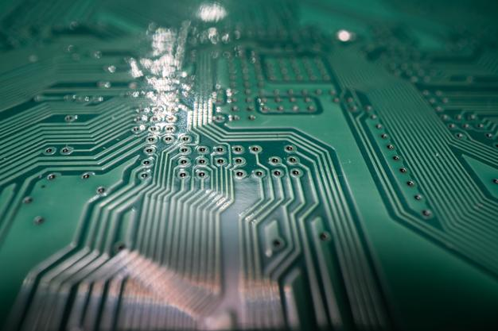

= Sistemas Digitales -UPNA-
// classic AsciiDoctor attributes
:stem:
:background-color="#ff0000":
:icons: font
:imagesdir: /home/candido/Dropbox/apuntes/apuntes_sistemas_digitales/upna/images
:customcss: styles/myCustomCSS.css
// Despite the warning of the documentation, https://github.com/asciidoctor/asciidoctor-reveal.js, highlight.js syntax highlighting WORKS, BUT, you need to explicitly set the highlighter using the below attribute
// see http://discuss.asciidoctor.org/Highlighting-source-code-for-reveal-js-backend-td2750.html
:source-highlighter: highlight.js
:highlightjs-languages: vhdl
//:source-highlighter: rouge
//:source-highlighter: pygments
// revealjs attributes
:revealjs_theme: white
:revealjs_slideNumber: true
// Al actualizar el slide no cambia de transpa y no se va al inicio
:revealjs_hash: true   
:revealjs_history: true

:revealjs_center: true
:revealjs_width: "100%"
:revealjs_height: "100%"
:revealjs_margin: 0

//:revealjs_minScale: 1,
//:revealjs_maxScale: 1

// plugins copiados de tutoriales/asciidoctor-revealjs/../primer.js
:revealjs_plugins_configuration: revealjs-plugins-conf.js
:revealjs_plugins: revealjs-plugins.js

//:scrollable: no pirula

//:revealjs_history: true para go to file no pirula

[state="txiki"]
== Indice
* Presentación
** Profesor
** Calendario
** Sistemas Digital: TAC
** Electrónica
** Procesamiento de señales eléctricas

[%notitle]
== About me

* Prof. Cándido Aramburu Mayoz.

* Doctor Ingeniero Telecomunicación (UPNA-Universidad Politécnica de Madrid) 

* Empresa Ikusi S.A. (Sistemas de Telemedida 1989)

* Profesor Titular UPNA (Dpto Ingeniería Electrónica y Comunicaciones 2000)

[.notes]
--
* https://www.etsit.upm.es/
* https://www.velatia.com/es/empresas-que-forman-velatia/ikusi/
* https://www.unavarra.es/eu/sites/Portada/home.html
--

== Contacto

* Miaulario -> correo interno
* Clase
** G1: A112 : Lunes (12-14) y Jueves (10-12) 
** G2: A012 : Lunes (10-12) y Miércoles (12-14)
* Tutorías
** Lunes (14-17)
** Miércoles (14-17)

== Calendario

[state=taula]
=== Febrero

[%header, format=csv]
|===
Lunes,Martes,Miércoles,Jueves,Viernes,Sábado ,Domingo
,,1,2,3,4,5
6,7,8,9,10,11,12
13,14,15,16,17,18,19
20,21,22,23,24,25,26
27,28,,,,,
|===

[state=taula]
=== Marzo

[%header, format=csv]
|===
Lunes,Martes,Miércoles,Jueves,Viernes,Sábado ,Domingo
,,1,2,3,4,5
6,7,8,9,10,11,12
13,14,15,16,17,18,19
20,21,22,23,24,25,26
27,28,29,30,31,,
|===

== Tomografía axial computarizada

image:bio_tac_clinic.jpeg[Mountain,400,300,float="left]
image:bio_tac_hw.jpeg[Mountain,400,300,float="right"]

[state="txiki"]
=== Sistema Digital

image:bio_tac_block_fpga_2.jpeg[Mountain,650,550,float="left"]

[.text-left]
Entrada *_Analógica_* -> Sensores Magnéticos. +
*_Conversor_* A/D: Señal Analógica a Señales Digitales. +
Circuitos *_lógicos_* : multiplexores, filtros, codificadores, etc ... +
*_Procesadores lógicos_*: procesamiento de las señales digitales para obtener la imagen. +
# FPGA : Field Programming Gate Array. +
# DSP  : Digital Signal Processing. +
# CPU  : Centra Procesor Unit. +
# GPU  : Graphic Procesor Unit. +

== Electrónica

=== Equipos de Electrónica

image:equipos_electronica.jpeg[Mountain,400,300,float="left]

=== Esquema Eléctrico

image:esquema_electrico.png[Mountain,600,400,float="left]

=== Componentes de una tarjeta de circuito impreso

image:pcb_componentes.png[Mountain,400,300,float="left]

=== Printed Circuit Board

=== Instrumentación

image:instrumentacion.webp[Mountain,600,500,float="left]

== La Electrónica en la Profesión

image:electronics_job.png[Mountain,750,600,float="left]

=== Técnico

image:tecnico_electronica.jpeg[Mountain,400,300,float="left]

=== ¿?

== La Electrónica en la Carrera Universitaria

* Conocimientos de Electrónica
** ¿ Para .... ?
** Tecnología Hardware
*** Fabricación de Prototipos
*** Diseño de Prototipos : Conceptos Teóricos y Herramientas de diseño por computador
*** Desarrollo de Sistemas: Equipos, Plataformas
*** Comercialización
*** Usuario: Equipos, Plataformas

== Señales: Conversión Analógica Digital

=== Señales: Muestreo y Cuantificación

image:muestreo_cuantificacion.jpg[Mountain,900,400,float="left]

[state=txiki]
=== Codificación

image:ADC_codigo.webp[Mountain,600,500,float="left"]

[.text-left]
Calcular para las resoluciones de 8 bit y 16 bits cual es el mínimo incremento de señal codificable o error de cuantificación

=== Procesado Digital

* FPGA
* DSP
* CPU
* GPU
* Sistemas de Microcontrolador Empotrados

=== Señales Binarias 

image:clock-signals.png[Mountain,400,300,float="left]
image:Digital-signal-noise.svg[Mountain,400,300,float="right"]

