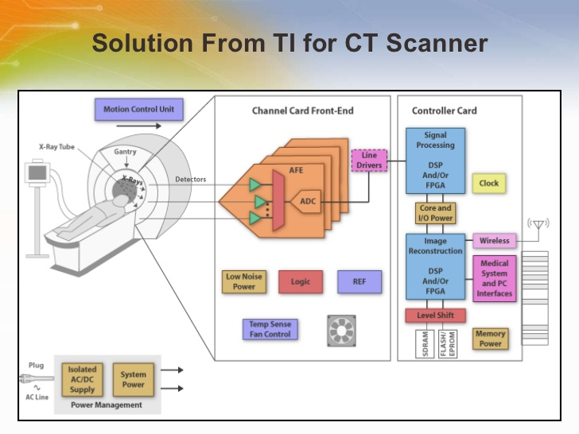

= Sistemas Digitales 
// classic AsciiDoctor attributes
:stem:
:background-color="#ff0000":
:icons: font
:imagesdir: images
:customcss: styles/myCustomCSS.css
// Despite the warning of the documentation, https://github.com/asciidoctor/asciidoctor-reveal.js, highlight.js syntax highlighting WORKS, BUT, you need to explicitly set the highlighter using the below attribute
// see http://discuss.asciidoctor.org/Highlighting-source-code-for-reveal-js-backend-td2750.html
:source-highlighter: highlight.js
:highlightjs-languages: vhdl
//:source-highlighter: rouge
//:source-highlighter: pygments
// revealjs attributes
:revealjs_theme: white
:revealjs_slideNumber: true
// Al actualizar el slide no cambia de transpa y no se va al inicio
:revealjs_hash: true   
:revealjs_history: true

:revealjs_center: true
:revealjs_width: "100%"
:revealjs_height: "100%"
:revealjs_margin: 0

//:revealjs_minScale: 1,
//:revealjs_maxScale: 1

// plugins copiados de tutoriales/asciidoctor-revealjs/../primer.js
:revealjs_plugins_configuration: revealjs-plugins-conf.js
:revealjs_plugins: revealjs-plugins.js

//:scrollable: no pirula

//:revealjs_history: true para go to file no pirula

== Indice

[%hardbreaks]
Tema 1: Introducción a los Sistemas Digitales Electrónicos <<Tema1_Intro>>.
Tema 2: Representación Digital de la Información <<Tema2_RepInf>>.
Tema 3: Algebra de Boole. Puertas Lógicas.<<Tema3_BoolePuertas>>
Tema 4: Lenguaje de Descripción Hardware VHDL.
Tema 5: Circuitos Aritméticos.
Tema 6: Otros Circuitos Combinacionales.

[#Tema1_Intro]
[.columns]
== Tema 1 : Introducción a los Sistemas Digitales Electrónicos

[.column]
* Presentación
** Profesor
** Calendario
** Sistemas Digital: TAC
** Electrónica
** Procesamiento de señales eléctricas

[.column]
* Organización Académica
** Programa
** Prácticas
** Ejercicios
** Evaluación
** Metodología

// [%notitle]
== Profesorado

* Prof. Cándido Aramburu Mayoz.
** Doctor Ingeniero Telecomunicación (UPNA-Universidad Politécnica de Madrid) 
** Empresa Ikusi S.A. (Sistemas de Telemedida 1989)
** Profesor Titular UPNA (Dpto Ingeniería Electrónica y Comunicaciones 2000)
* Profesor Prácticas: Aitor Urrutia
* Profesor Euskera: Marko Galarza
* Profesor Inglés: Ignacio del Villar

[.notes]
--
* https://www.etsit.upm.es/
* https://www.velatia.com/es/empresas-que-forman-velatia/ikusi/
* https://www.unavarra.es/eu/sites/Portada/home.html
--

== Contacto

* Despacho: Edificio Los Tejos 2 Planta: Despacho 2028 (Prof. Candido Aramburu)
* Miaulario -> correo interno
* Clase
** G1: A112 : Lunes (12-14) y Jueves (10-12) 
** G2: A012 : Lunes (10-12) y Miércoles (12-14)
* Tutorías
** Lunes (14-17) y  Miércoles (9-12)
** Cita Previa

== Calendario

[state=taula]
=== Febrero

[%header, format=csv]
|===
Lunes,Martes,Miércoles,Jueves,Viernes
30-Presentación,31,1-Repre_Info,2,3
6,7,8,9,10
13,14,15,16,17
20,21,22,23,24
27,28,,,,,
|===

[state=taula]
=== Marzo

[%header, format=csv]
|===
Lunes,Martes,Miércoles,Jueves,Viernes,Sábado ,Domingo
,,1,2,3,4,5
6,7,8,9,10,11,12
13,14,15,16,17,18,19
20,21,22,23,24,25,26
27,28,29,30,31,,
|===

== Tomografía axial computarizada

image:bio_tac_clinic.jpeg[Mountain,400,300,float="left"]
image:bio_tac_hw.jpeg[Mountain,400,300,float="right"]

=== Sistema Digital

[.text-left]
Entrada *_Analógica_* -> Sensores Magnéticos. +
*_Conversor_* A/D: Señal Analógica a Señales Digitales. +
Circuitos *_lógicos_* : multiplexores, filtros, codificadores, etc ... +
*_Procesadores lógicos_*: procesamiento de las señales digitales para obtener la imagen. +
# FPGA : Field Programming Gate Array. +
# DSP  : Digital Signal Processing. +
# CPU  : Centra Procesor Unit. +
# GPU  : Graphic Procesor Unit. +

== Electrónica

=== Equipos de Electrónica

=== Esquema Eléctrico

image:esquema_electrico.png[Mountain,600,400,float="left"]

=== Componentes de una tarjeta de circuito impreso

image:pcb_componentes.png[Mountain,400,300,float="left"]

[.text-left]
Componentes: +  
 -Discretos: resistencias, condensadores, transistores, transformadores, etc. +
 -Integrados ("chips",microelectrónica). +
 --material de semicoductor: Silicio. +
 --el componente básico es el transistor -> un procesador puede tener cientos de millones. +
 --los microcircuitos hechos de transistores pueden ser tanto circuitos analógicos (un amplificador) como digitales (puertas lógicas) +

=== Printed Circuit Board

image:print_circuit_board.jpg[Mountain,600,400,float="left"]

=== Instrumentación

image:instrumentacion.webp[Mountain,600,500,float="left"]

== La Electrónica en la Profesión

image:electronics_job.png[Mountain,750,600,float="left"]

=== Técnico

image:tecnico_electronica.jpeg[Mountain,400,300,float="left"]

=== ¿ Profesiones relacionadas con la Electrónica?

[state=txiki]
=== Fases de Diseño de Circuitos Electrónicos Binarios

. Funcional (manual): abstracción matemática
. Automatización del proceso matemático
.. Herramientas de Diseño con ayuda del Computador (EDA)
.. Simulación del Diseño del Circuito Electrónico antes de fabricar el prototipo: Depuración
. Fabricación del prototipo
.. Instrumentación
.. Verificación del funcionamiento en el Laboratorio
.. Verificación del funcionamiento en Campo
. Comercialización
. Producción

== La Electrónica en la Carrera Universitaria

* Conocimientos de Electrónica
** ¿ Para .... ?
** Tecnología Hardware
*** Fabricación de Prototipos
*** Diseño de Prototipos : Conceptos Teóricos y Herramientas de diseño por computador
*** Desarrollo de Sistemas: Equipos, Plataformas
*** Comercialización
*** Usuario: Equipos, Plataformas

[state=taula]
== Representación Científica y Prefijos de las Unidades

.Prefijos
[cols="<3,8*^1"]
|====
|Prefijos|Tera|Giga|Mega|Kilo|mili|micro|nano|pico
| Base 10 -> magnitudes:m,gr,Hz, ..| 10^12^| 10^9^| 10^6^| 10^3^| 10^-3^| 10^-6^| 10^-9^| 10^-12^
| Base 2 -> magnitudes: Byte | 2^12^| 2^9^| 2^6^| 2^3^| 2^-3^| 2^-6^| 2^-9^| 2^-12^
|====

[.text-left]
* Ejemplo: representar la magnitud=1000000000Hz debidamente
** Notación científica -> 10^9^Hz
** Debidamente: Notación científica con prefijos f=1GHz -> T=1/f=10^-9^seg= 1ns

== Señales: Conversión Analógica Digital

=== Analogica vs Digital

* Señal Continua
** Amplitud: stem:[oo] valores posibles en el rango
** Tiempo: stem:[oo] valores posibles en el rango   
* Señal Discreta ó Digital
** Amplitud: finitos valores posibles en el rango
** Tiempo: finitos valores posibles en el rango 

=== Señales : Muestreo y Cuantificación

image:muestreo_cuantificacion.jpg[Mountain,900,400]

=== Codificación

image:ADC_codigo.webp[Mountain,600,500,float="left"]

[.text-left]
Calcular para las resoluciones de 3 bit y 16 bits cual es el mínimo incremento de señal codificable o error de cuantificación: con 3 bits el número de niveles es 2^3^=8niveles y el mínimo relativo es 2^-3^=1/8; con 16 bits el número de niveles es 2^16^ y el mínimo relativo es 2^-16^= 1/65536. 

[.text-left]
Representación de los números en código binario : <<Tema2_RepInf>>

=== Señales Binarias : Abstractas

image:clock-signals.png[Mountain,400,300,float="left"]

[.text-left%hardbreaks]
Eje ordenada: valores abstractos (0/1, High/Low, ON/OFF, etc ...)
Cronograma: Representación temporal de las señales digitales binarias.
Esa representación típica de los libros de texto, pizarra de clase, etc ... es ideal ya que físicamente siempre habrá distorsión.

=== Señales Binarias : Físicas

image:Digital-signal-noise.svg.png[Mountain,400,300,float="left"]

[.text-left%hardbreaks]
Eje ordenada: magnitudes físicas (mV ó mA).
La señal física está distorsionada por causas como pej: línea larga de transmisión (efectos capacitivos e inductivos).
Un ejemplo típico de distorsión son los tiempos de subida y bajada, que no son nulos sino del orden de unos nanosegundos.
La distancia considerable entre los dos niveles (binario) a la entrada del receptor hace fácil la discriminación entre el '0' y el '1'.

== Digitalización de las Señales

=== Ventajas
* Calidad: Fácil de recuperar a pesar de la distorsión
* Almacenamiento: Fiabilidad, Diversidad Formatos
* Compatibilidad: Diversidad de Equipos (PC, móvil, coche, etc
* Procesamiento: Sencillo, Flexible
* Coste: Barato (componentes)

=== Abstracción

* Niveles: el 0 y el 1
* Lógica binaria 
** Matemáticas: Algebra de Boole

== Organización Académica

=== Programa de la Asignatura

* http://www.unavarra.es/ficha-asignaturaDOA/?languageId=100000&codPlan=246&codAsig=246110&anio=2022[Ficha Web Upna]
** Programa en 3 partes 
... *_Circuitos Combinacionales_*
... *_Circuitos Secuenciales_*
... Otros: Números, Lógica Programable (VHDL), Teoría Tecnología
* Bibliografía

=== Prácticas
* Tipo de prácticas:
** Diseño manual
** Simulación con la herramienta software Quartus de Intel.
** Captura gráfica de Esquemas Electrónicos
** Descripción del Circuito mediante el Lenguaje VHDL. Fabricación del Circuito en tecnología FPGA

=== Ejercicios

* Tipo de problemas: Libro Verde -> Ejercicios tipo examen -> Sin calculadora y sin libros
+

-----
El libro verde se adquiere en el edificio de rectorado, en la sección de comunicacion,
que se encuentra en planta baja del edificio.
El horario: 8 a 14:30. Precio 8.5$. 
-----
+

----
* Capítulo 1: 1.1, 1.2, 1.4, 1.5, 1.6, 1.8, 1.9
* Capítulo 2: 2.1
* Capítulo 3: 3.2 3.3 -> 2º parcial
* Capítulo 4: 4.2, 4.4, 4.6
* Capítulo 5: 5.2, 5.3, 5.4
* Capítulo 6: 6.1, 6.2 -> 2º parcial
* Capítulo 7: 7.2, 7.3 y 7.4 -> 2º parcial
* Capítulo 8: 8.1, 8.3 y 8.5 -> 2º parcial
----
* Los ejercicios del tema 2 (Representación de la Información) no están en el libro verde
** Miaulario -> Recursos -> Ejercicios

=== Evaluación

* Sistema de Evaluación:
** 75% teoría y 25% prácticas
** Evaluación continua Teoría: dos parciales (30% 1º parcial y 45% 2º parcial). Nota mínima en el 2º parcial: 5. El Primer parcial se realizará el sábado 25 de Marzo a las 9:00, el segundo parcial el 24 de Mayo a las 8:00 y la recuperación el 12 de Junio a las 8:00
** Recuperación Teoría: Entra todo. Nota mínima: 5.
** Evaluación Prácticas: Un único exámen el sábado XX de Mayo, no recuperable.

=== Metodología

* Trabajo en clase: principalmente Ejercicios con su teoría asociada
* Trabajo en casa
** Teoría desarrollada en los apuntes PDF en mi aulario
** Prácticas
*** En casa: Ejercicios de diseño manual
*** En casa: Utilización de Quartus y Memorias
* Tutorías
** Resolución de dudas

[#Tema2_RepInf]
== Tema 2 : Representación Digital de la Información

[state=txiki]
=== Indice

* Información: números, caracteres, imagen, sonido, etc ..
* Números
** Sistemas posicionales: base 10 (decimales), base 2 (binaria)
** Naturales: bases 10,2,8,16 . Conversión entre bases
** Enteros: Signo Magnitud, Complemento a la base-1, Complemento a la base
** Operaciones aritméticas: Suma,Resta
** Reales: coma fija y coma flotante
* Caracteres
** Alfanuméricos y Signos de Puntuación
** ASCII standard y extendido
** Unicode: UTF-8 
 

=== Representación de los Números 

[state="taula"]
=== Representación de los Números Decimales

[.text-left]
* Decimal
** 10 dígitos : 0,1,2,3,4,5,6,7,8,9
** Pesos con base 10 : 10^n^ donde n es la posición del dígito dentro del número
* Ejemplo: número 5421

.Número 5451
[width=60%,cols="<3s,4*^1"]
|===
|Representación: 4+| los símbolos 5421
|Posiciones: | 3 | 2 | 1 | 0
| Pesos:
a|10^3^ -> 1000|10^2^ -> 100|10^1^->10|10^0^->1
| Dígitos:
a|5|4|5|1
| Valores : ponderación
a|5*1000=cinco mil|4*100=cuatrocientos|5*10=cincuenta|1*1=uno
| Valor: 4+| 5*1000+4*100+5*10+1= cinco mil cuatrocientos cincuenta y uno
|===

[state="taula"]
=== Representación de los Valores Enteros en Código Binario

* ¿Número?¿Valor?¿Código?¿Representación?
** 2 dígitos : 0,1
** Pesos con base 2 : 2^n^ donde n es la posición del dígito dentro del número: ....-1024-512-256-128-64-32-16-8-4-2-1...
* Ejemplo: número 0b1011

.Número 0b110011
[width=60%,cols="<3s,4*^1"]
|===
|Representación: 4+| los símbolos 1011
|Posiciones: | 3 | 2 | 1 | 0
| Pesos:
a|2^3^ -> 8|2^2^ -> 4|2^1^->2|2^0^->1
| Dígitos:
a|1|0|1|1
| Valores : ponderación
a|1*8=ocho|0*4=cero|1*2=dos|1*1=uno
| Valor: 4+| ocho+cero+dos+uno= once
|===

=== Representación de los Valores Enteros en Código Binario

* ¿Cómo se representa en binario el valor 123.125? b1111011.001
* ¿Cómo se calcula el valor del número binario b1111011.001?
* Parte Entera: divisiones sucesivas por la base 2
* Parte Fracción: multiplicaciones sucesivas por la base 2

=== Representación de los Valores Enteros en Código Octal

* Dígitos: 0,1,2,3,4,5,6,7
* Posiciones y Pesos
* ¿Cómo se representa en octal el valor 123.125? 0o173.1
* ¿Cómo se calcula el valor del número octal 0o173.1?
* Parte Entera: divisiones sucesivas por la base 8
* Parte Fracción: multiplicaciones sucesivas por la base 8

=== Representación de los Números en Hexadecimal

* Dígitos: 0,1,2,3,4,5,6,7,8,9,A,B,C,D,E,F ___ el valor de A es 10, B->11, C->12, D->13, E-14, F->15
* Posiciones y Pesos
* ¿Cómo se representa en hexadecimal el valor 123.125? 0x7B.2
* ¿Cómo se calcula el valor del número octal 0x7B.2?
* Parte Entera: divisiones sucesivas por la base 16
* Parte Fracción: multiplicaciones sucesivas por la base 16

=== Calculadora de Python

[source,python]
----
bin(123)
oct(123)
hex(123)
int(0b1111011)
int(0o173)
int(0x7B)
----

[.columns]
=== Conversiones entre el sistema binario y sistemas con base potencia de 2

[.column]
* Conversión Binaria-Hexadecimal
** base 16=2^4^
** grupos de 4 bits empezando por la dcha
** b1111011 ->  111 - 1011  -> 0x7B 
* Conversión Hexadecimal-Binaria
** grupos de 4 bits

[.column]
* Conversión Binaria-Octal
** base 8=2^3^
** grupos de 3 bits empezando por la dcha
** b1111011 -> 1 - 111 - 011  -> 0o173
* Conversión Octal-Binaria
** grupos de 3 bits

=== Aritmética Modular: la rueda

image::rueda_unsigned.png[Rueda,500,500,float="left"]

[.text-left%hardbreaks]
Representación binaria de números con 3 digitos.
2^3^ : 8 combinaciones posibles,
Ejemplo: cuentakilómetros del coche.
Ejemplo: registro de 3 celdas -> limitado a 8 combinaciones posibles.
¿Cual es la siguiente combinación a 111?, 111+1 = ¿ ?.
Calcular la representación del valor 33 en módulo 8 -> Resto(37/8)=5 -> en binario 101
33 pasos en la rueda equivale al número 101 -> aritmética modular en módulo 8

=== Representación de Números con Valores Enteros

* Signo-Magnitud
* Complemento a la base menos 1
* Complemento a la base

=== Representación en Signo-Magnitud

* Signo -> un dígito
* Base 10: 
** valores positivos: el signo el dígito 0 en la posición MSD (More Significant Digit) y resto de dígitos representa el módulo 
** valores negativos: el signo el dígito 9 (base-1) en la posición MSD (More Significant Dit) y resto de dígitos representa el módulo 
** Ejemplo '+123' -> 0123 y -123 -> 9123

[state=txikiago]
=== Representación en Signo-Magnitud

* Signo -> un bit (Binary digIT)
* Base 2 : 
** valores positivos: el signo el bit 0 en la posición MSB (More Significant Bit) y resto de bits representa el mód
** valores negativos: el signo el bit 1 (base-1) en la posición MSB (More Significant Bit) y resto de bits representa el módulo
** Ejemplo '+123' -> 0b01111011 y -123 -> 0b11111011
** Dibujar la tabla y la rueda con todos los valores con sus representaciones.
** ¿Cuantas representaciones son posibles?¿Es simétrico el rango de valores representado?¿Cuantas representaciones tiene el cero?
** Extender el número de bits del número sin cambiar su valor

=== Representación en complemento a la base menos 1. C9

* Base 10: Complemento a 9 -> C9
* Signo -> un dígito
* Valores positivos: igual que los valores positivos en código Signo-Magnitud
* Valores negativos: Hay que restar el código del valor en positivo del minuendo 99999999 (base-1)
** Ejemplo '+123' -> 0123 y -123 -> 9999-0123 = 9876
* El C9 de un número positivo es el código de su valor en negativo
* El C9 de un número negativo es el código de su valor en positivo

=== Representación en complemento a la base menos 1. C1

* Base 2: Complemento a 1 -> C1
* Signo -> un dígito
* Valores positivos: igual que los valores positivos en código Signo-Magnitud
* Valores negativos: Hay que restar el código del valor en positivo del  minuendo 11111111 (base-1)
** Ejemplo '+123' -> 0b01111011 y -123 -> 11111111-01111011 = 10000100
** El código del valor negativo se puede calcular invirtiendo los bits del código del valor positivo
* El C1 de un número positivo es el código C1 de su valor en negativo
* El C1 de un número negativo es el código C1 de su valor en positivo
** Dibujar la tabla y la rueda con todos los valores con sus representaciones.
** ¿Cuantas representaciones son posibles?¿Es simétrico el rango de valores representado?¿Cuantas representaciones tiene el cero?
** Extender el número de bits del número sin cambiar su valor

=== Representación en complemento a la base 10 : C10

* Signo -> un dígito
* Base 10: Complemento a 10 -> C10
* Valores positivos: igual que los valores positivos en código Signo-Magnitud
* Valores negativos: Hay que restar el código del valor en positivo del minuendo 0000000 (base)
** Ejemplo '+123' -> 0123 y -123 -> 0000-0123 = 9877
* El C10 de un número positivo es el código de su valor en negativo
* El C10 de un número negativo es el código de su valor en positivo

[state=txikiago]
=== Representación en complemento a la base 2 : C2

* Signo -> un dígito
* Base 2: Complemento a 2 -> C2
* Valores positivos: igual que los valores positivos en código Signo-Magnitud
* Valores negativos: Hay que restar el código del valor en positivo del  minuendo 0000000 (base)
** Ejemplo *+123* -> 0b01111011 y *-123* -> 00000000-01111011 = 0b100000101
** El código del valor negativo se puede calcular invirtiendo los bits del código del valor positivo y después sumarle 1
*** Equivale a calcular el C1 y sumarle 1
** El código del valor negativo se puede calcular a partir del código del valor positivo
*** empezando por la dcha repetir los bits hasta el primer uno e invertir el resto de bits

=== Representación en complemento a la base 2 : C2

* El C2 de un número positivo es el código C2 de su valor en negativo
* El C2 de un número negativo es el código C2 de su valor en positivo
** Dibujar la tabla y la rueda con todos los valores con sus representaciones.
** ¿Cuantas representaciones son posibles?¿Es simétrico el rango de valores representado?¿Cuantas representaciones tiene el cero?
** Extender el número de bits del número sin cambiar su valor -> Extensión del bit de SIGNO

=== Complemento a 2 : Ejemplos

* 0b101010101 está en C2 -> ¿Cual es su valor?
** como es negativo no es un sistema posicional
** tenemos que calcular el valor negativo a través del valor positivo
** La representación del valor positivo es el C2 del valor negativo
*** C2(0b101010101) = 0b010101011 cuyo valor es 2^7^+2^5^+2^3^+2^1^+2^0^=128+32+8+2+1=+171
*** El valor de 0b101010101 es -171

* Si la representación de -123 es 0b100000101 ¿cual es la de '+123' ?
** C2(0b100000101)=0b011111011 representa el valor '+123'

=== Aritmética Modular de valores representados en Complemento a 2

image::rueda_signed.png[Rueda,500,500,float="left"]

[.text-left%hardbreaks]
Representación de números binarios de 3 bits en C2
Operaciones de suma y resta modular -> método gráfico

[.columns]
=== Operaciones aritméticas: sumas y restas : naturales y C2

[.column]
* Números naturales
** Suma (decimal y binaria) 
*** Llevada a la siguiente posición
** Resta (decimal y binaria)
*** Si el dígito minuendo es menor que el sustraendo: Crédito de la siguiente posición y Devolver en la siguiente posición

[.column]
* Números enteros en complemento a 2
** Suma binaria: 
*** Llevada a la siguiente posición
** Resta binaria:
*** Si el dígito minuendo es menor que el sustraendo: Crédito de la siguiente posición y Devolver en la siguiente posición

=== Operaciones aritméticas C2: Overflow y Extensión del signo

* Overflow: la operación requiere operandos con mayor número de bits manteniendo el valor para que el resultado sea correcto.
* Si dos operandos a sumar tienen diferente signo nunca hay overflow
* Si dos operandos a sumar tienen el mismo signo y resultado tiene signo contrario : *Error* de Overflow.
* Ejemplo:
** Operandos de 1 byte :  01111111+01111111=11111110 -> sumandos positivos y resultado negativo
*** Solución: *Extensión* del signo : Operandos  9 bits -> 001111111+001111111=011111110

=== Operaciones aritméticas: Otras Bases.

* Suma y resta
* Base Octal 
** 0o675+0o304
** 0o632-0o374
* Base hexadecimal
** 0xD1B+0xAFF
** 0xE53-0xBAA

=== Número en complemento a 2 y base hexadecimal

CAUTION: Un número binario se puede representar en hexadecimal y hacer la interpretación en complento a 2. Hay que tener cuidado con las extensiones del signo

* Calcular el valor del número 0xAAA si dicho número tiene formato en complemento a 2
** si lo convertimos a binario el número empieza por 1, luego es negativo
** para saber su valor calculo su complementario C2 y tendré la representación del positivo
*** 0x000-0xAAA =0x556 -> 5*16^2^+5*16^1^+5*16^0^ = 5*256+5*16+5 = 1280+80+5 = '+213' -> 0xAAA tiene de valor -213

=== Número en complemento a 2 y base hexadecimal

* Realizar la suma de los números en formato complemento a 2: 0x80+0x80
** sumar sin extender el signo de los operandos ¿Hay overflow?
+

CAUTION: Extender el número 0x80. ¿ Por qué hay que tener cuidado ?
+

* sumar extendiendo un dígito el signo de los operandos

=== Números Reales Binarios

* Coma Fija
** 123.125 -> b1111011.001
* Coma flotante
** Notación científica: potencias en la base del sistema (decimal,binario,etc)
** En decimal -> 1.23125*10^2^
** En binario ->1.111011001*2^6^
*** el número que no es potencia se denomina mantisa
*** Se dice que el número real en binario y en notación científica está normalizado si la parte entera vale 1.

=== Números Reales Binarios: Norma IEEE-754

* Campos del formato en notación científica : Signo, parte entera de la mantisa, parte fracción de la mantisa, base , exponente (módulo y signo)
* ¿Es necesario representar los *seis* campos del formato de la notación científica?
** Si esta normalizado la parte entera de la mantisa siempre vale 1
** La base siempre vale 2
** Por lo tanto la parte entera y la base no es necesario representar. Son ímplicitos a la representación.
** Hay una forma de no tener que representar el signo del exponente
*** es sumarle una cantidad para que al representarlo en EXCESO siempre sea positivo
* Resumiendo, sólo es necesario representar: el signo del número , la fracción de la mantisa y el exponente en exceso.

=== Formatos IEEE-754

* Formato simple: 
** representación de 32 bits: 1 bit para el signo / 8 bits para el exponente en exceso a 127 / 23 bits para la fracción
** bit de signo: 0 si es positivo y 1 si es negativo
* Formato doble:
** representación de 64 bits: 1 bit para el signo / 11 bits para el exponente en exceso a 1023 / 52 bits para la fracción
** bit de signo: 0 si es positivo y 1 si es negativo
* Ejemplo: representar -5.5/1024 en los dos formatos

=== Representación de los Caracteres

=== Representación de los Caracteres

* Tipos de Caracteres:
** Alfanuméricos
** Signos de Puntuación
** de Control
* Formatos
** ASCII: standard y extendido
** Unicode: UTF-8

[#Tema3_BoolePuertas]
== Tema 3 : Algebra de Boole. Puertas Lógicas

