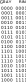
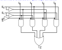
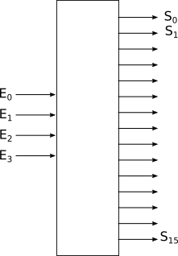
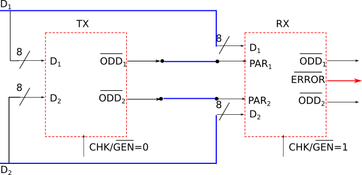
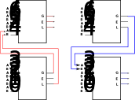

= Sistemas Digitales 
candido@unavarra.es
#elije uno de: beige, black, league, night, serif, simple, sky, solarized, white
:revealjs_theme: white
:stem:
:background-color="#ff0000":
:customcss: styles/mipruebaCSS.css
:imagesdir: images
:iconsdir: /home/candido/Dropbox/tutoriales/asciidoctor_reveal_slides/primer_rb/imagenes/iconos
:icontype: png
:icons: font
:source-highlighter: highlightjs
:highlightjs-languages: python, vhdl
:source-language:  python, vhdl
:revealjs_slidenumber: true
:revealjs_plugins_configuration: revealjs-plugins-conf.js
:revealjs_plugins: revealjs-plugins.js

// /////////////////////////////:background-color="#ff0000":

// Despite the warning of the documentation, https://github.com/asciidoctor/asciidoctor-reveal.js, highlight.js syntax highlighting WORKS, BUT, you need to explicitly set the highlighter using the below attribute
// see http://discuss.asciidoctor.org/Highlighting-source-code-for-reveal-js-backend-td2750.html
// /////////////////////////////:source-language: vhdl 
//:source-highlighter: rouge
//e:source-highlighter: pygments
// revealjs attributes
// Al actualizar el slide no cambia de transpa y no se va al inicio
:revealjs_hash: true   
:revealjs_history: true
:revealjs_center: false
//:revealjs_width: "100%"
//:revealjs_height: "100%"
//:revealjs_margin: 0
:revealjs_minScale: 0.4
:revealjs_maxScale: 2.0
// plugins copiados de tutoriales/asciidoctor-revealjs/../primer.js
//:revealjs_history: true para go to file no pirula

//:doctype: book
//:lang: es
//:encode: ISO-8859-1
//:ascii-ids:

:show-link-uri:
:asciidoctor-fetch-kroki:
:experimental:

:ruta-transpas: home/candido/Dropbox/apuntes/apuntes_sistemas_digitales/upna/apuntes_repositorio/transpas_ssdd

:ruta-apuntes: home/candido/Dropbox/apuntes

//:ruta-gh-pages: https://github.com/kandido/kandido.github.io/blob/gh-pages

:ruta-gh-pages: https://github.com/kandido/kandido.github.io/raw/gh-pages

////
== Introduction
NOTE: Any questions?

[%header,cols="1,2,1",frame=bottom,grid=rows]
|===
h| Weeks h| Topics                  h| Staff 
h| 1-5    | Stuff                    | Fred
h| 6      | More advanced stuff      | Jim
h| 7-12   | Very advanced stuff      | Sheila
|===
////

== Transparencias en Formato PDF

* link:{ruta-gh-pages}/PDF/ssdd.pdf?download=[Transparencias PDF]
* Si hay algún error de forma en el documento PDF que dificulte su interpretación enviar un mensaje para su correción. Gracias.

[.scrollable]
== Indice

[%hardbreaks]
Tema 1: <<Tema1_Intro, Introducción a los Sistemas Digitales Electrónicos.>>
Tema 2: <<Tema2_RepInf, Representación Digital de la Información.>>
Tema 3: <<Tema3_BoolePuertas, Algebra de Boole. Puertas Lógicas.>>
Tema 4: <<Tema4_VHDL, Lenguaje de Descripción Hardware VHDL.>>
Tema 5: <<Tema5_CircArit, Circuitos Aritméticos.>>
Tema 6: <<Tema6_OtrosCirc, Otros Circuitos Combinacionales.>>
Parte 2ª : link:ssdd2.html[Sistemas Digitales: Segunda Parte]
Tema 7: link:ssdd2.html#/Tema7_Seq[Circuitos Secuenciales]
Tema 8: link:ssdd2.html#/Tema8_Fam[Circuitos Digitales Integrados. Familias Lógicas.]
Tema 9: link:ssdd2.html#/Tema9_Mem[Memorias.]
Tema 10: link:ssdd2.html#/Tema10_PLD[Dispositivos de Lógica Programable (PLD).]
Tema 11: link:ssdd2.html#/Tema11_Dac[Convertidores Analógico/Digiales DAC/ADC.]

[#Tema1_Intro]
[.columns]
== Tema 1 : Introducción a los Sistemas Digitales Electrónicos

[.column]
* Presentación
** Profesor 
** Calendario 
** Sistemas Digital: TAC
** Electrónica
** Procesamiento de señales eléctricas

[.column]
* Organización Académica
** Programa
** Prácticas
** Ejercicios
** Evaluación
** Metodología

// [%notitle]
=== Profesorado

[compact]
* Prof. Cándido Aramburu Mayoz.
** Doctor Ingeniero Telecomunicación (UPNA-Universidad Politécnica de Madrid) 
** Empresa Ikusi S.A. (Sistemas de Telemedida 1989)
** Profesor Titular UPNA (Dpto Ingeniería Electrónica y Comunicaciones 2000)
* Profesor Prácticas: Aitor Urrutia
* Profesor Euskera: Marko Galarza
* Profesor Inglés: Ignacio del Villar

[.notes]
--
* https://www.etsit.upm.es/
* https://www.velatia.com/es/empresas-que-forman-velatia/ikusi/
* https://www.unavarra.es/eu/sites/Portada/home.html
--

=== Contacto

* Despacho: Edificio Los Tejos 2 Planta: Despacho 2028 (Prof. Candido Aramburu)
* Miaulario -> correo interno
* Clase
** G1: A234 : Miércoles (10-12) y Viernes (12-14) 
** G2: A322 : Martes (12-14) y Viernes (10-12)
* Tutorías
** Martes (14-18) y  Miércoles (12-14)
** Cita Previa

=== Calendario

[state=topleft]
=== Febrero

[%header, format=csv]
|===
Martes,Viernes

30-Presentación..Repre_info:Numeros bases, 2-Repre_Info:Enteros..C2:Expansion Signo
6-C2:Overflow..Tema3:Morgan,9-Tema3:Morgan..DK:examples
13-BCD..Tema3:Repaso y Ejercicios,16-Tema4_VHDL:Intro..Archit y Tema3:Dudas y Ejercicios
20-Tema5_Aritmética:Intro..Tema5:Sumador/Restador y Tema4:Paquetes;STD y Standard_Logic,23-X:¿?
27-Tema5:Semirestador..ALU y Tema4:Process()
|===

* COMIENZO PRACTICAS: 28 de Febrero y 1 de Marzo

[state=topleft]
=== Marzo

[%header, format=csv]
|===
Martes,Martes

5-Tema6:Multiplexor-Decodificador,12-Tema6:BCD y Ejercicios Examen
19-Tema7:Sist.Secu-Introducción y Ejercicios Examen 23 de Marzo,26-Tema7:Sist.Secu-Ascensor 
|===

* 23 de Marzo 9:00: EXAMEN 1º PARCIAL

[state=topleft]
=== Abril

[%header, format=csv]
|===
Martes,Martes
2-*Vacación* S. Santa,9-Tema7:Sist.Secu.Ascensor.VHDL
16-Tema7:Registros y Contadores, 23-Tema8:Familias Lógicas y Memorias
30-Tema9: Lógica Programable y Ejercicios
|===

[state=topleft]
=== Mayo

[%header, format=csv]
|===
Martes,Martes

7-Ejercicios,14-Ejercicios
|===

=== EXAMENES

* 23 de Marzo 9:00: EXAMEN 1º PARCIAL
* 17 de Mayo 15:00: EXAMEN PRACTICO 
* 22 de Mayo 08:00: EXAMEN ORDINARIO 
* 8 de Junio 08:00: EXAMEN RECUPERACION

=== Tomografía axial computarizada

image:bio_tac_hw.jpeg[Mountain,400,300,float="right"]

=== Sistema Digital

image:bio_tac_block_fpga_2.jpeg[Mountain,650,550,float="left"]

[.text-left]
Entrada *_Analógica_* -> Sensores Magnéticos. +
*_Conversor_* A/D: Señal Analógica a Señales Digitales. +
Circuitos *_lógicos_* : multiplexores, filtros, codificadores, etc ... +
*_Procesadores lógicos_*: procesamiento de las señales digitales para obtener la imagen. +
# FPGA : Field Programming Gate Array. +
# DSP  : Digital Signal Processing. +
# CPU  : Centra Procesor Unit. +
# GPU  : Graphic Procesor Unit. +

=== Electrónica

image::equipos_electronica.jpeg[Mountain,200,250,float="left"]
image::esquema_electrico.png[Mountain,300,250,float="left"]
image::pcb_componentes.png[Mountain,340,250,align="left"]
image::print_circuit_board.jpg[Mountain,340,250,float="left"]
image::instrumentacion.webp[Mountain,300,250,float="left"]

=== La Electrónica en la Profesión

image:electronics_job.png[Mountain,750,600,float="left"]

[state=txiki]
=== Fases de Diseño de Circuitos Electrónicos Binarios

. Funcional (manual): abstracción matemática
. Automatización del proceso matemático
.. Herramientas de Diseño con ayuda del Computador (EDA)
.. Simulación del Diseño del Circuito Electrónico antes de fabricar el prototipo: Depuración
. Fabricación del prototipo
.. Instrumentación
.. Verificación del funcionamiento en el Laboratorio
.. Verificación del funcionamiento en Campo
. Comercialización
. Producción

=== La Electrónica en la Carrera Universitaria

* Conocimientos de Electrónica
** ¿ Para .... ?
** Tecnología Hardware
*** Fabricación de Prototipos
*** Diseño de Prototipos : Conceptos Teóricos y Herramientas de diseño por computador
*** Desarrollo de Sistemas: Equipos, Plataformas
*** Comercialización
*** Usuario: Equipos, Plataformas

=== Analogica vs Digital

* Señal Continua
** Amplitud: stem:[oo] valores posibles en el rango
** Tiempo: stem:[oo] valores posibles en el rango   
* Señal Discreta ó Digital
** Amplitud: finitos valores posibles en el rango
** Tiempo: finitos valores posibles en el rango 

[state=taula]
=== Representación Científica y Prefijos de las Unidades

.Prefijos
[cols="<3,8*^1"]
|====
|Prefijos|Tera|Giga|Mega|Kilo|mili|micro|nano|pico
| Base 10 -> magnitudes:m,gr,Hz, ..| 10^12^| 10^9^| 10^6^| 10^3^| 10^-3^| 10^-6^| 10^-9^| 10^-12^
| Base 2 -> magnitudes: Byte | 2^40^| 2^30^| 2^20^| 2^10^| | | | 
|====

[.text-left]
* Ejemplo: representar la magnitud=1000000000Hz debidamente
** Notación científica -> 10^9^Hz
** Debidamente: Notación científica con prefijos f=1GHz -> T=1/f=10^-9^seg= 1ns

=== Señales : Muestreo y Cuantificación

image:muestreo_cuantificacion.jpg[Mountain,900,400]

=== Codificación

image:ADC_codigo.webp[Mountain,600,500,float="left"]

[.text-left]
*EJERCICICIO*: Calcular para las resoluciones de 3 bits y 16 bits cual es el mínimo incremento de señal codificable o error de cuantificación: con 3 bits el número de niveles es 2^3^=8niveles y el mínimo relativo es 2^-3^=1/8; con 16 bits el número de niveles es 2^16^ y el mínimo relativo es 2^-16^= 1/65536. 
 
[.text-left]
Representación de los números en código binario : <<Tema2_RepInf>>

=== Señales Binarias : Abstractas

[.text-left%hardbreaks]
Eje ordenada: valores abstractos (0/1, High/Low, ON/OFF, etc ...).
Cronograma: Representación temporal de las señales digitales binarias.
Esa representación típica de los libros de texto, pizarra de clase, etc ... es ideal ya que físicamente siempre habrá distorsión.

=== Señales Binarias : Físicas

image:Digital-signal-noise.svg.png[Mountain,400,300,float="left"]

[.text-left%hardbreaks]
Eje ordenada: magnitudes físicas (mV ó mA).
La señal física está distorsionada por causas como pej: línea larga de transmisión (efectos capacitivos e inductivos).
Un ejemplo típico de distorsión son los tiempos de subida y bajada, que no son nulos sino del orden de unos nanosegundos.
La distancia considerable entre los dos niveles (binario) a la entrada del receptor hace fácil la discriminación entre el '0' y el '1'.

=== Digitalización de las Señales

=== Ventajas
* Calidad: Fácil de recuperar a pesar de la distorsión
* Almacenamiento: Fiabilidad, Diversidad Formatos
* Compatibilidad: Diversidad de Equipos (PC, móvil, coche, etc
* Procesamiento: Sencillo, Flexible
* Coste: Barato (componentes)

=== Abstracción

* Niveles: el 0 y el 1
* Lógica binaria 
** Matemáticas: Algebra de Boole

=== Ejercicio

* *EJERCICICIO*:  La calidad de un CD que almacena información de audio se consigue con una frecuencia de muestreo de la señal analógica de 44.1KHz y una resolución de 16 bits. Si la transmisión del código binario entre el grabador láser y el disco CD se realiza a la misma velocidad que el proceso de muestreo, calcular cual es el ancho de banda en MB/s durante la transmisión.
** 1Byte = 8 bits

=== Organización Académica

=== Programa de la Asignatura

* http://www.unavarra.es/ficha-asignaturaDOA/?languageId=100000&codPlan=246&codAsig=246110&anio=2022[Ficha Web Upna]
** Programa en 3 partes 
... *_Circuitos Combinacionales_*
... *_Circuitos Secuenciales_*
... Otros: Números, Lógica Programable (VHDL), Teoría Tecnología
* Bibliografía
** Fundamentos de Electrónica Digital. Cecilio Blanco
** Circuitos Electrónicos Digitales. Manuel Mazo
** Fundamentos de Sistemas digitales. Thomas Floyd

=== Prácticas
* Tipo de prácticas:
** Diseño manual
** Simulación con la herramienta software Quartus de Intel.
** Captura gráfica de Esquemas Electrónicos
** Descripción del Circuito mediante el Lenguaje VHDL. Fabricación del Circuito en tecnología FPGA

=== Ejercicios

* Cuaderno de problemas: Libro Verde -> Ejercicios tipo examen -> Sin calculadora y sin libros +
+

----
El libro verde se adquiere en el edificio de rectorado, en la sección de comunicacion,
que se encuentra en planta baja del edificio.
El horario: 8 a 14:30. Precio 8.5$. 
----
+

----
* Capítulo 1: 1.1, 1.2, 1.4, 1.5, 1.6, 1.8, 1.9
* Capítulo 2: 2.1
* Capítulo 3: 3.2 3.3 -> 2º parcial
* Capítulo 4: 4.2, 4.4, 4.6
* Capítulo 5: 5.2, 5.3, 5.4
* Capítulo 6: 6.1, 6.2 -> 2º parcial
* Capítulo 7: 7.2, 7.3 y 7.4 -> 2º parcial
* Capítulo 8: 8.1, 8.3 y 8.5 -> 2º parcial
----

* Los ejercicios del tema 2 (Representación de la Información) no están en el libro verde
** Miaulario -> Recursos -> Ejercicios

=== Evaluación

* Sistema de Evaluación:
** 75% teoría y 25% prácticas
** Evaluación continua Teoría: dos parciales (30% 1º parcial y 45% 2º parcial). Nota mínima en el 2º parcial: 4. El Primer parcial se realizará el sábado 1 de Abril a las 9:00, el segundo parcial el 22 de Mayo a las 8:00 y la recuperación el 8 de Junio a las 8:00
** Recuperación Teoría: Entra todo. Nota mínima: 5.
** Evaluación Prácticas: Un único exámen el sábado XX de Mayo, no recuperable.

=== Metodología

* Trabajo en clase: principalmente Ejercicios con su teoría asociada
* Trabajo en casa
** Teoría desarrollada en los apuntes PDF en mi aulario
** Prácticas
*** En casa: Ejercicios de diseño manual
*** En casa: Utilización de Quartus y Memorias
* Tutorías
** Resolución de dudas

[#Tema2_RepInf]
[state=txikiago]
[.columns]
== Tema 2 : Representación Digital de la Información

[.column]
--
* Información: números, caracteres, imagen, sonido, etc ..
* Números
** Sistemas posicionales: base 10 (decimales), base 2 (binaria)
** Naturales: bases 10,2,8,16 . Conversión entre bases
** Enteros: Signo Magnitud, Complemento a la base-1, Complemento a la base
** Operaciones aritméticas: Suma,Resta
** Reales: coma fija y coma flotante
--

[.column]
--
* Otros Códigos Binarios
** Binary Coded Decimal (BCD) natural
** BCD Aiken
** BCD exceso 3
** Gray
** Johnson

* Caracteres
** Alfanuméricos y Signos de Puntuación
** ASCII standard y extendido
** Unicode: UTF-8 
--

=== Representación de los Números 

[state="taula"]
=== Representación de los Números Decimales

[.text-left]
* Decimal
** 10 dígitos : 0,1,2,3,4,5,6,7,8,9
** Pesos con base 10 : 10^n^ donde n es la posición del dígito dentro del número
* Ejemplo: número 5451
+

.Número 5451
[width=60%,cols="<3s,4*^1"]
|===
|Representación: 4+| los símbolos 5451
|Posiciones: | 3 | 2 | 1 | 0
| Pesos:
a|10^3^ -> 1000|10^2^ -> 100|10^1^->10|10^0^->1
| Dígitos:
a|5|4|5|1
| Valores : ponderación
a|5*1000=cinco mil|4*100=cuatrocientos|5*10=cincuenta|1*1=uno
| Valor: 4+| 5*1000+4*100+5*10+1= cinco mil cuatrocientos cincuenta y uno
|===

[.columns,state="taula"]
=== Representación de los Valores Enteros en Código Binario

[.column]
--
* ¿Número?¿Valor?¿Código?¿Representación?
** 2 dígitos : 0,1
** Pesos con base 2 : 2^n^ donde n es la posición del dígito dentro del número: ....-1024-512-256-128-64-32-16-8-4-2-1...
--

[.column]
--
* Ejemplo: número 0b1011
+

.Número 0b1011
[width=60%,cols="<3s,4*^1"]
|===
|Representación: 4+| los símbolos 1011
|Posiciones: | 3 | 2 | 1 | 0
| Pesos:
a|2^3^ -> 8|2^2^ -> 4|2^1^->2|2^0^->1
| Dígitos:
a|1|0|1|1
| Valores : ponderación
a|1*8=ocho|0*4=cero|1*2=dos|1*1=uno
| Valor: 4+| ocho+cero+dos+uno= once
|===
--

=== Representación de los Valores Enteros en Código Binario

* ¿Cómo se representa en binario el valor 123.125? b1111011.001
* ¿Cómo se calcula el valor del número binario b1111011.001?
* Parte Entera: divisiones sucesivas por la base 2
* Parte Fracción: multiplicaciones sucesivas por la base 2

=== Representación de los Valores Enteros en Código Octal

* Dígitos: 0,1,2,3,4,5,6,7
* Posiciones y Pesos
* ¿Cómo se representa en octal el valor 123.125? 0o173.1
* ¿Cómo se calcula el valor del número octal 0o173.1?
* Parte Entera: divisiones sucesivas por la base 8
* Parte Fracción: multiplicaciones sucesivas por la base 8

=== Representación de los Números en Hexadecimal

* Dígitos: 0,1,2,3,4,5,6,7,8,9,A,B,C,D,E,F ___ el valor de A es 10, B->11, C->12, D->13, E-14, F->15
* Posiciones y Pesos
* ¿Cómo se representa en hexadecimal el valor 123.125? 0x7B.2
* ¿Cómo se calcula el valor del número octal 0x7B.2?
* Parte Entera: divisiones sucesivas por la base 16
* Parte Fracción: multiplicaciones sucesivas por la base 16

=== Calculadora de Python

https://www.programiz.com/python-programming/online-compiler/[Python Intepreter Shell]

[source,python]
----
bin(123)
oct(123)
hex(123)
int(0b1111011)
int(0o173)
int(0x7B)
----

[.columns]
=== Conversiones entre el sistema binario y sistemas con base potencia de 2

[.column]
* Conversión Binaria-Hexadecimal
** base 16=2^4^
** grupos de 4 bits empezando por la dcha
** b1111011 ->  111 - 1011  -> 0x7B 
* Conversión Hexadecimal-Binaria
** grupos de 4 bits

[.column]
* Conversión Binaria-Octal
** base 8=2^3^
** grupos de 3 bits empezando por la dcha
** b1111011 -> 1 - 111 - 011  -> 0o173
* Conversión Octal-Binaria
** grupos de 3 bits

=== Suma binaria

* Suma 10011011+00011011 = 10110110
+  

----
  Llevadas -->          1 1   1 1 
  	                         
                    1 0 0 1 1 0 1 1  <--sumando
                  + 0 0 0 1 1 0 1 1  <--sumando
  	                         
  Valor suma          1 3 2 1 3 2        
                  *****************
  Resultado -->     1 0 1 1 0 1 1 0  <--suma
----

* Cuando la suma en una posición específica tiene un valor es mayor o igual a la base hay que restar *n* veces la base y el valor *n* será la llevada a sumar en la posición siguiente.

=== Resta binaria

* Resta 10110110 - 10011011 = 00011011
+

----
Sumar crédito al minuendo            2  2     2  2

                            1  0  1  1  0  1  1  0  <--minuendo
      	                  - 1  0  0  1  1  0  1  1  <--sustraendo
 
               
Sumar llevada al sustraendo       1  1     1  1 
                          *************************
Resta                       0  0  0  1  1  0  1  1
----

* Cuando en una posición específica el minuendo es menor que el sustraendo se suma la base al minuendo antes de realizar la resta y se suma la llevada al sustraendo de la posición siguiente.
 
=== Aritmética Modular: la rueda

image::rueda_unsigned.png[Rueda,500,500,float="left"]

[.text-left%hardbreaks]
Representación binaria de números con 3 digitos.
2^3^ : 8 combinaciones posibles,
Ejemplo: cuentakilómetros del coche.
Ejemplo: registro de 3 celdas -> limitado a 8 combinaciones posibles.
¿Cual es la siguiente combinación a 111?, 111+1 = ¿ ?.
Calcular la representación del valor 33 en módulo 8 -> Resto(33/8)=1 -> en binario 001
33 pasos en la rueda equivale al número 001 -> aritmética modular en módulo 8

=== Operaciones aritméticas: Octal y Hexadecimal

* Base Octal 
** 0o675+0o304 = 0o1201
** 0o632-0o374 = 0o236
* Base hexadecimal
** 0xD1B+0xAFF = 0x181A
** 0xE53-0xBAA = 0x2A9

=== Representación de Números con Valores Enteros

* Signo-Magnitud
* Complemento a la base menos 1
* Complemento a la base

=== Representación en Signo-Magnitud

* Signo -> un dígito
* Base 10: 
** valores positivos: el signo el dígito 0 en la posición MSD (More Significant Digit) y resto de dígitos representa el módulo 
** valores negativos: el signo el dígito 9 (base-1) en la posición MSD (More Significant Dit) y resto de dígitos representa el módulo 
** Ejemplo +123 -> 0123 y -123 -> 9123

[state=txikiago]
=== Representación en Signo-Magnitud

* Signo -> un bit (Binary digIT)
* Base 2 : 
** valores positivos: el signo el bit 0 en la posición MSB (More Significant Bit) y resto de bits representa el mód
** valores negativos: el signo el bit 1 (base-1) en la posición MSB (More Significant Bit) y resto de bits representa el módulo
** Ejemplo +123 -> 0b01111011 y -123 -> 0b11111011
** Dibujar la tabla y la rueda con todos los valores con sus representaciones.
** ¿Cuantas representaciones son posibles?¿Es simétrico el rango de valores representado?¿Cuantas representaciones tiene el cero?
** Extender el número de bits del número sin cambiar su valor

=== Representación en complemento a la base menos 1. C9

* Base 10: Complemento a 9 -> C9
* Signo -> un dígito
* Valores positivos: igual que los valores positivos en código Signo-Magnitud
* Valores negativos: Hay que restar el código del valor en positivo del minuendo 99999999 (base-1)
** Ejemplo +123 -> 0123 y -123 -> 9999-0123 = 9876
* El C9 de un número positivo es el código de su valor en negativo
* El C9 de un número negativo es el código de su valor en positivo

[state=txikiago]
=== Representación en complemento a la base menos 1. C1

* Base 2 : base-1=1 -> Complemento a 1 -> C1
* Signo -> un dígito
* Valores positivos: igual que los valores positivos en código Signo-Magnitud
* Valores negativos: Hay que restar el código del valor en positivo del  minuendo 11111111 (base-1)
** Ejemplo '+123' -> 0b01111011 y -123 -> 11111111-01111011 = 10000100
** El código del valor negativo se puede calcular invirtiendo los bits del código del valor positivo
* El C1 de un número positivo es el código C1 de su valor en negativo y del de un número negativo es el código C1 de su valor en positivo
** Dibujar la tabla y la rueda con todos los valores con sus representaciones.
** ¿Cuantas representaciones son posibles?¿Es simétrico el rango de valores representado?¿Cuantas representaciones tiene el cero?
** Extender el número de bits del número sin cambiar su valor

=== Representación en complemento a la base 10 : C10

* Signo -> un dígito
* Base 10: Complemento a 10 -> C10
* Valores positivos: igual que los valores positivos en código Signo-Magnitud
* Valores negativos: Hay que restar el código del valor en positivo del minuendo 0000000 (base)
** Ejemplo '+123' -> 0123 y -123 -> 0000-0123 = 9877
* El C10 de un número positivo es el código de su valor en negativo
* El C10 de un número negativo es el código de su valor en positivo

[state=txikiago]
=== Representación en complemento a la base 2 : C2

* Signo -> un dígito
* Base 2: Complemento a 2 -> C2
* Valores positivos: igual que los valores positivos en código Signo-Magnitud
* Valores negativos: Hay que restar el código del valor en positivo del  minuendo 0000000 (base)
** Ejemplo *+123* -> 0b01111011 y *-123* -> 00000000-01111011 = 0b100000101
** El código del valor negativo se puede calcular invirtiendo los bits del código del valor positivo y después sumarle 1
*** Equivale a calcular el C1 y sumarle 1
** El código del valor negativo se puede calcular a partir del código del valor positivo
*** empezando por la dcha repetir los bits hasta el primer uno e invertir el resto de bits

=== Representación en complemento a la base 2 : C2

* El C2 de un número positivo es el código C2 de su valor en negativo
* El C2 de un número negativo es el código C2 de su valor en positivo
** Dibujar la tabla y la rueda con todos los valores con sus representaciones.
** ¿Cuantas representaciones son posibles?¿Es simétrico el rango de valores representado?¿Cuantas representaciones tiene el cero?
** Extender el número de bits del número sin cambiar su valor -> Extensión del bit de SIGNO 

[state=txiki]
=== Extensión del signo en C2

.Razonamiento de la extensión de signo de un número negativo: números de 3 bits
[width=60%,<1,2*<2]
|===
|Valor| C2 sin extensión | C2 con extensión
|  +33 |  0100001    | 00100001
.4+|  -33  l| 
 0000000  
-0100001 
--------  
 1011111 l|

 00000000 
-00100001 
---------
 11011111  
|===

Se observa que en el C2 con extensión, al hacer al resta y extender con un 0 más el minuendo y el substraendo, provoca la extensión con un bit más en la resta de valor 1 en el digito más significante. Según añado ceros al minuendo y sustraendo, aparecen unos en la resta sin alterar su valor.

[.columns, state=txiki]
=== Operaciones aritméticas en C2

[.column]
* Suma
** Se realiza como se ha visto para números naturales. 
** Si hay llevada en el MSBit, no se tiene en cuenta, se elimina.
** A=0b11011011. Suma A+A
+

----
Llevadas -> 1 1   1 1   1 1 
  	                         
              1 1 0 1 1 0 1 1 (Valor -37)
            + 1 1 0 1 1 0 1 1 (Valor -37)
  	                         
Valor suma      2 1 3 2 1 3 2        
            *****************
Resultado --> 1 0 1 1 0 1 1 0<--(Valor -74)
----

[.column]
* Resta
** La resta de números con signo se puede realizar de dos formas: A-B ó A-B = A+(-B)
** A = 0b00110110 y B = 0b10011011 
** Si hay llevada en el MSBit, no se tiene en cuenta, se elimina.
+

----
Crédito   2 2   2 2   2 2

          1 0 1 1 0 1 1 0<--(Valor -74)
        - 1 1 0 1 1 0 1 1<--(Valor -37)
 
               
LLevada 1 1 1   1 1   1 1 
         ****************
Resta     1 1 0 1 1 0 1 1 (Valor -101)
----

[state=txiki]
=== Operaciones ariméticas C2: Overflow o Desbordamiento

* A = 0b00110110 y B = 0b10011011 -> Calcular A-B
* Con 8 bits el máximo valor es 01111111 de valor 2^7^-1=128-1=127
* La resta A-(B)=A+(-B)=54+103=157>127 -> *Overflow* o *Desbordamiento*
+

----
Crédito  2     2 2   2 2

         0 0 1 1 0 1 1 0<--(Valor = 54)
       - 1 0 0 1 1 0 1 1<--(Valor = -103)
 
               
LLevada      1 1   1 1 
        ****************
Resta    1 0 0 1 1 0 1 1 (Valor -101)
----
** El valor -101 en lugar de la resta correcta +157 es debido a que el resultado esta fuera de rango -> 
** Observarmos que hemos hecho la SUMA de dos números POSITIVOS y el resultado ha sido NEGATIVO

=== Operaciones ariméticas C2: Overflow

IMPORTANT: Al realizar la suma de dos valores con el mismo signo si el resultado es de signo contrario hay overflow

[state=txiki]
=== Operaciones aritméticas C2: Overflow 

* Overflow: la operación requiere operandos con mayor número de bits manteniendo el valor para que el resultado sea correcto.
* Si dos operandos a sumar tienen diferente signo nunca hay overflow
* Si dos operandos a sumar tienen el mismo signo y resultado tiene signo contrario : *Error* de Overflow.
* Ejemplo:
** Operandos de 1 byte :  01111111+01111111=11111110 -> sumandos positivos y resultado negativo
*** Solución: *Extensión del signo* : Operandos  9 bits -> 001111111+001111111=011111110
*** la repetición del bit más significativo no altera el valor de la representación
*** el bit más significativo es 0 si es positivo y 1 si es negativo. Por lo tanto, 01010 equivale a 01010 ó 001010 ó 0....0001010. Por lo tanto, 1010 equivale a 11010 ó 111010 ó 1....1111010

=== C2: Representación gráfica del Overflow

image::rueda_signed.png[Rueda,500,500,float="left"]

[.text-left%hardbreaks]
Si a partir de la posición 010 nos movemos dos posiciones en sentido  horario llegamos a la posición 100.
Si a 010 le sumamos el valor 2 nos da como resultado 100
Por lo tanto 010+010=100, es decir, 2+2=-4 -> *overflow* ya que el _+4_ necesita 4 bits y estamos trabajando con 3 bits únicamente.

=== Asimetría del rango en C2: -4 con 3 bits

* Con números de 3 bits los formatos S-M y C1 son simétricos con valores en el rango (+3,-3), en cambio el formato C2 tiene el rango (+3,-4)
* En C2 el valor +4 se representa como 0b0100 y necesita por lo tanto 4 bits, no se puede representar con 3 bits, y el valor -4 se reprenta con el C2(0100), es decir, 1100 también con 4 bits. El 1100 se puede comprimir ya que tiene el signo extendido con la repetición de 1 de bit más significativo, por lo que la representación 100 es la representación del -4

=== Complemento a 2 : Ejemplos

* 0b101010101 está en C2 -> ¿Cual es su valor?
** como es negativo no es un sistema posicional
** tenemos que calcular el valor negativo a través del valor positivo
** La representación del valor positivo es el C2 del valor negativo
*** C2(0b101010101) = 0b010101011 cuyo valor es 2^7^+2^5^+2^3^+2^1^+2^0^=128+32+8+2+1=+171
*** El valor de 0b101010101 es -171

* Si la representación de -123 es 0b100000101 ¿cual es la de '+123' ?
** C2(0b100000101)=0b011111011 representa el valor '+123'

=== Aritmética Modular de valores representados en Complemento a 2

image::rueda_signed.png[Rueda,500,500,float="left"]

[.text-left%hardbreaks]
Representación de números binarios de 3 bits en C2
Operaciones de suma y resta modular -> método gráfico
A partir de la posición 001 si nos movemos en sentido horario (SUMA modular) 2 posiciones obtenemos la posición 011, es decir, 1+2=3
A partir de la posición 110 si nos movemos en sentido horario (SUMA modular) 9 posiciones obtenemos la posición 111, es decir, -2+9=-1
A partir de la posición 110 si nos movemos en sentido antihorario (RESTA modular) 4 posiciones obtenemos la posición 010, es decir, -2-4=+2
Los errores de *overflow* se resuelven aumentando el número de bits de la representación, pero siempre existira un rango que si lo traspasamos dará overflow.

[state=taula]
=== Comparación S-M, C1 y C2

.Números de 3 bits
[width=80%,cols="4*^"]
|===
|Valor|S-M| C1 | C2

|+3| 011 |011|011
|+2| 010 |010|010
|+1| 001 |001|001
.2+|0 | 000 |000|000
| 100 |011| ---
|-1 | 101 |110|111
|-2 | 110 |101|110
|-3 | 111 |100|101
|-4 | - | - | 100
|===

=== Número en complemento a 2 y base hexadecimal

[.align-left]
CAUTION: Un número binario se puede representar en hexadecimal y hacer la interpretación en complento a 2. Hay que tener cuidado con las extensiones del signo.

* Calcular el valor del número 0xAAA si dicho número tiene formato en complemento a 2
** si lo convertimos a binario el número empieza por 1, luego es negativo
** para saber su valor calculo su complementario C2 y tendré la representación del positivo
*** 0x000-0xAAA =0x556 -> 5*16^2^+5*16^1^+5*16^0^ = 5*256+5*16+5 = 1280+80+5 = '+213' -> 0xAAA tiene de valor -213

=== Número en complemento a 2 y base hexadecimal

* Realizar la suma de los números en formato complemento a 2: 0x80+0x80
** sumar sin extender el signo de los operandos ¿Hay overflow?
+

CAUTION: Extender el número 0x80. ¿ Por qué hay que tener cuidado ?
+

* sumar extendiendo un dígito el signo de los operandos 0x80

[state=taula_ta]
=== Extensión del signo en C2: problema de la BASE

.Extensión del Signo del Nº 0x80 en C2 en binario, hexadecimal y octal

[width=80%,cols="^1,3*<3"]
|===
|  NºBits | Binario | Hexadecimal | Octal

|  8 |     10000000 |           1000_0000 ->   0x80 |         110_000_000 ->  0o600
|  9 |    110000000 |      1111_1000_0000 ->  0xF80 |         110_000_000 ->  0o600
| 10 |   1110000000 |      1111_1000_0000 ->  0xF80 |     111_110_000_000 -> 0o7600
| 11 |  11110000000 |      1111_1000_0000 ->  0xF80 |     111_110_000_000 -> 0x7600
| 12 | 111110000000 |      1111_1000_0000 ->  0xF80 |     111_110_000_000 -> 0x77600
| 13 |1111110000000 | 1111_1111_1000_0000 -> 0xFF80 | 111_111_110_000_000 -> 0x77600
|===

[#C1_suma-resta]
[state=txikiago]
=== Suma y Resta aritmética en C1

[%hardbreaks]
-Ejemplos con datos de 4 bits -> Rango (-7,+7). +
-¿Qué ocurre si *sumamos* dos números sin que haya overflow?.
- Primer caso: dos operandos positivos 0011+0011=0110 -> correcto.
- Segundo caso: dos operandos negativos donde todas ellas tienen acarreo en el MSB
--- 1111+1111=1110 -> 0+0=-1  ; 1100+1100=1000 -> -3-3=-7. ; 1100+1011=0111 -> -3-3=+7.
--- el valor del resultado siempre da una *unidad menor* y siempre hay acarreo en el MSB.
--- Solución: la suma en C1 es la suma de los sumandos *más el acarreo MSB*.
--- 1111+1111=1110+1 -> 0  ; 1100+1100=1000+1 -> -6 ; 1100+1011=0111+1=1000 -> -7.
-¿Qué ocurre si *restamos* dos números?.
--- El resultado es correcto si no hay acarreo MSB.
--- Si hay acarreo la resta da una *unidad mayor*, por lo tanto el resultado es la resta *menos uno*.
--- El resultado es la resta *menos el acarreo MSB*.

-Caso de overflow: el resultado es incorrecto por limitación del tamaño de los datos

[state=txikiago]
=== Suma aritmética en C1

Razonamiento gráfico:

image::tema2_c1_suma.png[600,600]

[%hardbreaks]
Si nos fijamos en los números negativos su valor esta [verde]#desplazado una unidad# de la rueda hacia la izda: el valor cero está en la marca [verde]#1# de la rueda, el valor -1 está en la marca [verde]#2# de la rueda, etc. El valor representado por el segmento perimetral de la circunferencia tiene una unidad inferior: el valor -1 tiene un segmento de [verde]#2# marcas del [verde]#0# hacia la izda.
El segmento o distancia del cero (1111) es [verde]#UNO#, el del -1 es DOS, el del -2 es TRES.....

=== Suma aritmética en C1

Ejemplos a completar para A=2 y B=5 :

image::tema2_c1_suma-resta.png[align="center"]

[state=txikiago]
=== Suma y Resta aritmética en C1

* Ej_1: suma: no hay conflicto -> 2+5=7 -> 0010+0101=0111
* Ej_2: suma: sí hay conflicto : el segmento B por ser negativo tiene un segmento superior en una unidad, por lo que a la suma hay que *sumarle 1* -> -2+(-5)=-7 -> 1101+1010=0111 y acarreo_MSB -> 0111+1=1000 -> -7
* Ej_3: suma
** si la flecha B cruza el cero (1111), el segmento B, por ser negativa tiene un segmento mayor en 1, compensa el desplazamiento entre ceros y la suma es correcta. -> 2+(-5)=-3 -> 0010+1010=1100 -> -3
** si la flecha B no cruza el cero (1111), a la suma hay que *sumarle 1*
* Ej_4: resta
** si la flecha B cruza el cero (1111), B por ser positivo no compensa el desplazamiento entre ceros. A la resta hay que *restarle 1* -> 2-(+5)=-3 -> 0010-0101=1101 y acarreo_MSB -> 1101-1=1100 -> -3
* Ej_5: resta: no cruza el cero (1111), B por ser negativo tiene un segmento mayor en 1. A la resta hay que *restarle 1* -> 2-(-5)=+7 -> 0010-1010=1000 y acarreo_MSB -> 1000-1=0111 ->+7

=== Números Reales Binarios

* Coma Fija
** 123.125 -> b1111011.001
* Coma flotante
** Notación científica: potencias en la base del sistema (decimal,binario,etc)
** En decimal -> 1.23125*10^2^
** En binario ->1.111011001*2^6^
*** el factor que no es potencia se denomina mantisa
*** Se dice que el número real en binario y en notación científica está normalizado si la parte entera de la mantisa vale 1.

[state="txiki"]
=== Números Reales Binarios: Norma IEEE-754

* Campos del formato en notación científica : Signo, parte entera de la mantisa, parte fracción de la mantisa, base , exponente (módulo y signo)
* ¿Es necesario representar los *seis* campos del formato de la notación científica?
** Si esta normalizado la parte entera de la mantisa siempre vale 1
** La base del factor potencia siempre vale 2
** Por lo tanto la parte entera y la base no son necesario representarlas. Son ímplicitas a la representación.
** Hay una forma de no tener que representar el signo del exponente del factor potencia
*** es sumarle una cantidad para que al representarlo en EXCESO siempre sea positivo
* Resumiendo, sólo es necesario representar: el signo del número , la fracción de la mantisa y el exponente en exceso. Por lo tanto el formato IEEE-754 tiene 3 campos.

=== Formato IEEE-754 simple

* representación de 32 bits: 1 bit para el signo / 8 bits para el exponente en exceso a 127 / 23 bits para la fracción
* bit de signo: 0 si es positivo y 1 si es negativo
+

["ditaa"]
----------------------------------------------------------------------
  1      8bits              23bits                       <-- tamaño en bits
 +-+-------------+------------------------------------+
 |S|  Exp + 127  | Fracción de la Mantisa  Normalizada|
 +-+-------------+------------------------------------+
 31 30         23 22                                 0   <--  bit pos 0 a la dcha      
----------------------------------------------------------------------

=== Formato IEEE-754 doble

* representación de 64 bits: 1 bit para el signo / 11 bits para el exponente en exceso a 1023 / 52 bits para la fracción
* bit de signo: 0 si es positivo y 1 si es negativo
+

["ditaa"]
----------------------------------------------------------------------
  1      11bits              52bits            <-- tamaño en bits
 +-+-------------+-----------------------+
 |S|  Exp + 1023 | Fracción Mantisa  Norm|
 +-+-------------+-----------------------+
 63 62         52 51                     0   <-- bit pos 0 a la dcha      
----------------------------------------------------------------------

=== IEEE 754: Números especiales

* Cero
** bit de signo = 0
** exponente en exceso: todo con bits 0
** fracción mantisa: todo con bits 0

* Infinito positivo y negativo
** exponente en exceso = todo con bits  1
** fracción mantisa: todo con bits 0

* NaN (Not-A-Number)
** exponente en exceso = todo con bits  1
** fracción mantisa = distinto de todos los bits a cero

[.columns, state=txikiago]
=== El Nº -5.5/1024 en los dos Formatos IEEE-754

[.column]
* Signo negativo
* Conversión binaria del módulo
** módulo: 5.5/1024 = 5.5*2^-10^ = 101.1*2^-10^ 
** Normalización de la mantisa -> 1.011*2^-8^

[.column]
* Formato Simple de 32 bits
** Signo negativo: bit 1
** Exponente en exeso 127=-8+127=119=01110111
** Fracción de la mantisa=011
** Solución:
*** 1_01110111_01100000000000000000000  
*** 0b10111011101100000000000000000000 
*** *0xBBB00000* 
*** http://weitz.de/ieee/[calculador ieee]
    
[.column]
* Formato Doble de 64 bits
** Signo negativo:  bit 1
** Exponente en exeso 1023=-8+1023=1015=01111110111
** Fracción de la mantisa=011
** Solución:
*** 1_01111110111_0110...0  
*** 0b1011111101110110...0
*** *0xBF76000000000000*

=== Representación de los Caracteres

* Tipos de Caracteres:
** Alfanuméricos: a,b,...z.0,1,...9,A,B...Z
** Signos de Puntuación: !"$%&/()=
** de Control: Salto de Línea (\n), Find de Fichero (EOF), Fin de String (\00, ...)
* Formatos
** ASCII: standard y extendido
** Unicode: UTF-8

[.columns]
=== ASCII Standard

[.column.zutabe]
----
          2 3 4 5 6 7       30 40 50 60 70 80 90 100 110 120
        -------------      ---------------------------------
       0:   0 @ P ` p     0:    (  2  <  F  P  Z  d   n   x
       1: ! 1 A Q a q     1:    )  3  =  G  Q  [  e   o   y
       2: " 2 B R b r     2:    *  4  >  H  R  \  f   p   z
       3: # 3 C S c s     3: !  +  5  ?  I  S  ]  g   q   {
       4: $ 4 D T d t     4: "  ,  6  @  J  T  ^  h   r   |
       5: % 5 E U e u     5: #  -  7  A  K  U  _  i   s   }
       6: & 6 F V f v     6: $  .  8  B  L  V  `  j   t   ~
       7: ' 7 G W g w     7: %  /  9  C  M  W  a  k   u  DEL
       8: ( 8 H X h x     8: &  0  :  D  N  X  b  l   v
       9: ) 9 I Y i y     9: '  1  ;  E  O  Y  c  m   w
       A: * : J Z j z
       B: + ; K [ k {
       C: , < L \ l |
       D: - = M ] m }
       E: . > N ^ n ~
       F: / ? O _ o DEL

----

[.column.zutabe_gehi]
[%hardbreaks]
American Standard Code for Information Interchange
Alfabeto anglosajón
7 bits -> 2^7^=128 caracteres : 0x00 hasta 0x1F son 32 caracteres de control y el resto alfanuméricos
En hexadecimal rango [0x00-0x7F]
En decimal rango [0-127]
*Upna* : 0x55706E61
*año 2023*: 0x61--6F2032303233

=== ASCII Extendido

* Para poder representar caracteres de otras culturas Europeas es necesrio expandir el standard con 1 bit más
* ASCII 8 bits -> 2^8^ = 256 caracteres
* https://www.programiz.com/python-programming/online-compiler/[Python Intepreter Shell]
+

[source,python]
---------
ord('A')
hex(ord('A'))
hex(ord('\n'))
chr(65)
chr(0x41)
[hex(ord(c)) for c in "Hola"]
[chr(c) for c in [0x48, 0x6f, 0x6c, 0x61, 0x20, 0x4d, 0x75, 0x6e, 0x64, 0x6f]]
[hex(ord(c)) for c in "ñ"]
[hex(ord(c)) for c in "\n \t"]
---------
** La ñ tiene el código ASCII 0xF1

[state=txikiago]
=== UTF-8

* https://www.charset.org/utf-8[Character Set, HTML Converter, etc ...]
* Unicode Transformation Format (UTF)
* UTF-8: Esta orientado a la transmisión de palabras de 1 byte
* Los caracteres pueden tener entre 1 y 4 bytes -> 2^21^ code points  &#x2243; 2 millones;
* The dominant encoding on the World Wide Web and on most Unix-like operating systems
* En linux comando *localectl status* : informa sobre el sistema del teclado
* ñ: 
** hex code 0xC3B1  
** unicode point U+00F1  -> los primeros 256 caracteres equivalen al ascii extendido

[.columns]
=== Unicode Points

[.column]
* https://html-css-js.com/[html css js online]: \&#x00f1;
* U+2228: &#x2228;
* U+22bc: &#x22bc;
* U+22bd: &#x22bd;
* U+22a6:  &#x22a6;
* U+1f60b:  &#x1f60b;

[.column]
* U+00f1: &#x00f1;
* OrduU+00F1a: Ordu&#x00F1;a
* U+2190: &#x2190;
* U+2192: &#x2192;

=== Otros Códigos Binarios

* Binary Coded Decimal (BCD) natural
* BCD Aiken
* BCD exceso 3
* Gray
* Johnson

===  Binary Coded Decimal : BCD

Codificación de números Naturales +

BCD natural: Para un número decimal representar en binario con 4 bits los valores de *cada digito decimal*. +
- Pesos de cada uno de los 4 bits: 8-4-2-1 +
- 347 ->0011-0100-0111 -> 001101000111 +
- Codificación sencilla pero códigos de mayor tamaño que el binario natural +

BCD Aiken 2421: Mismo concepto que el natural pero los 4 bits tienen pesos 2-4-2-1 +
- En los digitos 5,6,7,8 y 9 el bit de peso 2 de la posición 3ª tiene prioridad sobre el bit de la posición 1ª +
- 2 -> 0010, 4 -> 0100, 5 -> *1* 011, 347 -> 01101001101 +

BCD Aiken 5421: Mismo concepto que el Aiken 2421 pero con los pesos 5421 +
- 5 -> 1000, 347 -> 01101001010 +

BCD en exceso a 3 : Al valor a representar se le suma 3 antes de la codificación binaria
- 0 -> 0011, 7-> 1010, 347 -> 011001111010

=== Código Gray

Codificación de números Naturales +
Es un  código reflejado -> Espejo +

image::tema2_gray.svg[align="center"]

El valor 4 en código Gray: 110, 0110, 00110, etc +
La secuencia de los números es adyacente: únicamente cambia un bit

[.columns]
=== Codificador Gray Binario

[.column]

[.column]
--
Codificador binario -> gray: +
- Herramienta DK -> 4 funciones y 4 variables +
- latexmath:[g_i = b_i \oplus b_{i+1}] +
- latexmath:[g_{MSB} = b_{MSB}] +

Codificador gray -> binario: +
- Herramienta DK -> 4 funciones y 4 variables +
- latexmath:[b_i = g_i \oplus g_{i+1} ... \oplus g_{n-1}] +
- latexmath:[b_{MSB} = g_{MSB}] 
--

=== Johnson

* Números Naturales
* A partir del número 0000 desplazar 1 bit a la izda y entra el bit 1
* A partir del número 1111 desplazar 1 bit a la izda y entra el bit 0
* Johnson (4 bits) : 0000-0001-0011-0111-1111-1110-1100-1000

=== Tema 2: Ejercicios

*  MiAulario/Recursos/Ejercicios
** link:{ruta-gh-pages}/PDF/ejercicios_tema_1-2-3-4.pdf?download=[PDF: Ejercicios Temas 1-2-3-4]
*  Bibliografía. Libros de texto:
** Fundamentos de Electrónica Digital. Cecilio Blanco
** Circuitos Electrónicos Digitales. Manuel Mazo
** Fundamentos de Sistemas digitales. Thomas Floyd

[#Tema3_BoolePuertas]
[.columns,state=txikiago]
== Tema 3 : Algebra de Conmutación ó Boole. Funciones Lógicas.

[.column]
* Matemática Binaria: Valores, Variables, Funciones y Expresiones Lógicas
* Operadores Binarios: Tablas de la Verdad
* Puertas Lógicas
* Algebra de Boole: Teoremas
* Diagramas de Karnaugh

[.column]
* Formas Canónicas: SOP y POS -> Síntesis
* Minitérminos y Maxitérminos 
* Lenguajes: Natural, Lógico
* Simplificación de funciones:
** Método analítico:axiomas y teoremas del Algebra de Boole
** Método gráfico: Diagramas de Karnaugh

[state=txikiago]
=== Matemática Lógica Binaria

* Valores Lógicos Binarios : "0" , "1"
** representa dos estados: los estados de una señal binaria (High/Low), los estados de una bombilla (encendido/apagado), de un conmutador (on/off), de una condición (verdadero/falso), etc, cualquier situación que se pueda modelar mediante dos estados.
* Variables lógicas: ...u,  x1, x2, y, v1, u2, ...
** Una variable independiente que puede tomar los valores "0" y "1"
* Función lógica:  z1, z2, z3, F, ....
** Una función lógica expresa una relación lógica o/y aritmética o/y comparativa o/y etc entre las variables independientes a través de unos operadores matemáticos.

* Operadores
** Operadores aritméticos: suma, resta, multiplicación, ...
** Operadores lógicos: or (suma), and (producto), negación, or exclusiva, etc...
** Operadores comparadores: > , >, ==, etc

[.columns, state=taula_ta]
=== Tablas de la Verdad de los operadores NOT, OR, AND, XOR

[.column]
.NOT
|===
|x|z=x&#773;
|0|1
|1|0
|===

[.column]
.OR
[cols="2*^1,^2"]
|===
|x|y|z = x + y
|0|0|0
|0|1|1
|1|0|1
|1|1|1
|===

[.column]
.AND
[cols="2*^1,^2"]
|===
|x|y|z = x &#8729; y
|0|0|0
|0|1|0
|1|0|0
|1|1|1
|===

[.column]
.XOR
[cols="2*^1,^2"]
|===
|x|y|z = x &#8853; y
|0|0|0
|0|1|1
|1|0|1
|1|1|0
|===

[.columns, state=taula_ta]
=== Tablas de la Verdad de los operadores NOR, NAND, XNOR

[.column]
.NOR
[cols="2*^1,^2"]
|===
|x|y|z = [ovlin]#x + y#
|0|0|1
|0|1|0
|1|0|0
|1|1|0
|===

[.column]
.NAND
[cols="2*^1,^2"]
|===
|x|y|z = [ovlin]#x &#8729; y#
|0|0|1
|0|1|1
|1|0|1
|1|1|0
|===

[.column]
.XNOR
[cols="2*^1,^2"]
|===
|x|y|z = [ovlin]#x &#8853; y#
|0|0|1
|0|1|0
|1|0|0
|1|1|1
|===

=== Puertas Lógicas

image::puertas_logicas.png[align="center"]

[.columns]
=== Circuitos Digitales : Expresiones Lógicas

[.column]
[%hardbreaks]
F(x,y)= x&#773;y+xy&#773;.
F(x,y,z)= x&#773;y&#773;z&#773; + xyz&#773; + x&#773;yz + xyz&#773;.
Circuito digital en 3 niveles: not-and-or.

[.column]
image::circuito_logic.png[align="center"]

[.columns, state=txiki]
=== Algebra de Boole

[.column]
* Postulados del Algebra de Boole
* Teoremas del Algebra de Boole ([.step.highlight-red]#Leyes de Morgan#)
* (a*b)+(c*d); a+a*b
* Generación de funciones con puertas lógicas: Ejemplo 1 a)yb)
* Simplificación de funciones mediante Teoremas: Al final
* Formas canónicas: Sum of Products (SOP) y Product of Sums (POS)
** minitérminos y maxitérminos
** Ejemplos básicos

[.column]
* Diagramas de Karnaugh (DK)
** Agrupar celdas adyacentes en potencias de 2^n^
** Ejemplos básicos
* Relación SOP-POS
** ejemplo1: a+ab
** ejemplo2: general 3 variables x,y,z
* Simplificación de funciones mediante Teoremas
** Extender los términos como minitérminos
** Dibujar DK y agrupar celdas equivale a sacar factor común

=== Link: algebra de conmutación funciones.pdf

* link:{ruta-gh-pages}/PDF/03_algebra_de_conmutacion_funciones_logicas.pdf?download=[PDF 2020:Algebra de Boole. Funciones Lógicas]

=== Generación de Funciones mediante puertas Lógicas NAND 

image::tema3_genfun_nand.png[align="center"]

=== Síntesis matemática de una función lógica

* La síntesis matemática consiste en obtener la expresión matemática de una función lógica que cumpla las condiciones lógicas que describen dicha función. Es decir, a partir de un enunciado que describe de forma natural la funcionalidad de un sistema digital obtener la misma descripción mediante una expresión matemática. Se dice que se ha generado una función lógica. 

* Hay distintas herramientas para sintetizar una función lógica y en este capítulo se van a ver las principales herramientas manuales o racionales a diferencia de las herramientas con ayuda de aplicaciones computacionales.

* Herramientas manuales o racionales:
** Analíticas: Formas matemáticas canónicas: SOP y POS
** Gráficas: Tablas de la Verdad y Diagramas de Karnaugh.

=== Formas Canónicas de una Función: Síntesis por minitérminos y maxitérminos

* Hay dos formas canónicas (standard) de expresar una función
** suma de productos (SOP) de variables
** producto de sumas (POS) de variables

[.columns, state=taula_ta]
=== Lógica Positiva: Relación y/o con */+

[.column]
--
.OR
[width=60%,cols="2*^2,^4"]
|===
|x|y|z = x + y
|0|0|0
|0|1|1
|1|0|1
|1|1|1
|===
Lógica positiva -> ¿Cuando vale *1* una función, una expresión, una variable, etc ? +
Z= *1* si "X" *o* "Y"  valen *1* -> z=x+y
--

[.column]
--
.AND
[width=60%,cols="2*^2,^4"]
|===
|x|y|z = x &#8729; y
|0|0|0
|0|1|0
|1|0|0
|1|1|1
|===
Lógica positiva -> ¿Cuando vale *1* una función, una expresión, una variable, etc ? +
Z= *1* si "X" *e* "Y"  valen *1* -> z=x &#8729; y
--

[.columns, state=taula_ta]
=== Lógica Negativa: Relación y/o con */+

[.column]
--
.OR
[width=60%,cols="2*^2,^4"]
|===
|x|y|z = x + y
|0|0|0
|0|1|1
|1|0|1
|1|1|1
|===
Lógica negativa -> ¿Cuando vale *0* una función, una expresión,  una variable, etc ? +
Z= *0* si "X" *e* "Y"  valen *0*  -> z=x + y +
--

[.column]
--
.AND
[width=60%,cols="2*^2,4"]
|===
|x|y|z = x &#8729; y
|0|0|0
|0|1|0
|1|0|0
|1|1|1
|===
Lógica negativa -> ¿Cuando vale *0* una función, una expresión,  una variable, etc ? +
Z= *0* si "X" *o* "Y"  valen *0* -> z=x&#8729;y 
--

[.columns]
=== Razonamiento de Y / O

[.column]
--
* Ejemplo de una proposición lógica
** Para ganar dinero es necesario trabajar O/Y que te toque la lotería
* Traducción a matemática binaria: Función binaria? Variables binarias? 
* Escribir proposiciones con todas la combinaciones posibles de los valores de las variables y el valor correspondiente a la función 
* Descripción medinate la Tabla de la Verdad 
* ¿Por qué la preposición Y de una proposición del lenguaje natural lleva asociada la multiplicación lógica?
** ... y no el de la suma lógica si también se cumple para F=1 y x1=x2=1
--

[.column]
--
* ¿Por qué la preposición O de una proposición del lenguaje natural lleva asociada la suma lógica?
** ... y no el de la suma lógica si también se cumple para F=1 y x1=x2=1
* Síntesis matemática:
** Forma canónica SOP
** Forma canónica POS
* Relación SOP/POS -> Función negada
* Ley de Morgan
--
=== Ejercicio: Síntesis Función XOR 

* Tabla de la Verdad
* Lenguaje natural -> lógica positiva -> minitérminos 
* Lenguaje natural -> lógica negativa -> maxitérminos 
* Formas canónicas SOP/POS
** minitérminos/maxitérminos
** conversión función negada

===  Optimización mediante los diagramas de Karnaugh

* Herramienta gráfica para la síntesis matemática: Diagrama de Karnaugh DK -> matriz en filas y columnas
** Celdas
** Simplificación: agrupar celdas *adyacentes* en número de potencias de 2
** Relación agrupar celdas con agrupar minitérminos o maxitérminos
*** grupos de minitérminos: sacar factor común
*** grupos de maxitérminos: multiplicar

[.columns, state=taula_ta]
=== Forma Canónica SOP: Suma de Minitérminos

[.column]
.Tabla de la Verdad de la Función F(x1,x2,x3)
|===
| x1 | x2 | x3 | F | minitérminos

| 0  | 0  | 0  | 0 | m0 : x&#773;1x&#773;2x&#773;3
| 0  | 0  | 1  | 0 | m1 : x&#773;1x&#773;2x3
| 0  | 1  | 0  | 0 | m2 : x&#773;1x2x&#773;3
| 0  | 1  | 1  | 1 | m3 : x&#773;1x2x3
| 1  | 0  | 0  | 1 | m4 : x1x&#773;2x&#773;3
| 1  | 0  | 1  | 1 | m5 : x1x&#773;2x3
| 1  | 1  | 0  | 0 | m6 : x1x2x&#773;3
| 1  | 1  | 1  | 0 | m7 : x1x2x3
|===

[.column%hardbreaks]
Lenguaje natural -> F vale *1* (lógica positiva) si m3 *o* m4 *o* m5 vale *1* ->  *suma*
Lenguaje natural -> m3 vale *1* (lógica positiva) si x&#773;1 *y* x2 *y* x3 valen *1* ->  *multiplicación*
Lenguaje lógico -> F = SOP = m3+m4+m5. 
F(x1,x2,x3) = x&#773;1x2x3 + x1x&#773;2x&#773;3 + x1x&#773;2x3.
Cada minitermino se sintetiza mediante una puerta AND.
La síntesis de la función F tendría un nivel de puertas AND de 3 entradas y un nivel con una puerta OR con tantas entradas como minitérminos hacen 1 a la función.

[.columns, state=taula_ta]
=== Forma Canónica POS: Producto de Maxiterminos

[.column]
.Tabla de la Verdad de la Función F(x1,x2,x3)
|===
| x1 | x2 | x3 | F | maxitérminos

| 0  | 0  | 0  | 0 | M0 : x1+x2+x3
| 0  | 0  | 1  | 0 | M1 : x1+x2+x&#773;3
| 0  | 1  | 0  | 0 | M2 : x1+x&#773;2+x3
| 0  | 1  | 1  | 1 | M3 : x1+x&#773;2+x&#773;3 
| 1  | 0  | 0  | 1 | M4 : x&#773;1+x2+x3
| 1  | 0  | 1  | 1 | M5 : x&#773;1+x2+x&#773;3
| 1  | 1  | 0  | 0 | M6 : x&#773;1+x&#773;2+x3
| 1  | 1  | 1  | 0 | M7 : x&#773;1+x&#773;2+x&#773;3
|===

[.column%hardbreaks]
Lenguaje natural -> F vale *0* (lógica negativa) si M0 *ó* M1 *ó* M2 *ó* M6 *ó* M7 vale *0* -> *multiplicación*
Lenguaje natural -> M1 vale *0* (lógica negativa) si x1 *y* x2 *y* x&#773;3 valen *0* -> *suma*
Lenguaje lógico -> F = POS = M0M1M2M6M7.
F(x1,x2,x3) = (x1+x2+x3)(x1+x2+x&#773;3)(x1+x&#773;2+x3)(x&#773;1+x&#773;2+x3)(x&#773;1+x&#773;2+x&#773;3).
Cada maxitérmino se sintetiza mediante una puerta OR.
La síntesis función F tendría un nivel de puertas OR de 3 entradas y un nivel con una puerta AND con tantas entradas como maxitérminos hacen 0 a la función.

=== Relación entre la forma canónica SOP y POS

* Ejemplo F= F(x1,x2,x3) = m3+m4+m5
* F&#773;= m0+m1+m2+m6+m7
* [doble-ovlin]#F# = [ovlin]#m0+m1+m2+m6+m7# =
* [doble-ovlin]#F# = m&#773;0 &#8729; m&#773;1 &#8729; m&#773;2 &#8729; m&#773;6 &#8729; m&#773;7
* [doble-ovlin]#F# = M0&#8729; M1&#8729; M2&#8729; M6&#8729; M7 = F

=== Simplificación de las funciones mediante los Diagramas de Karnaugh (DK)

* El Diagrama de Karnaugh es una representación gráfica multidimensional (2D, 3D, etc) mediante celdas de los minitérminos y maxitérminos de la tabla de la verdad unidimensional 1D
* Ejemplo F(x1,x2,x3) = x&#773;1x2x3 + x1x&#773;2x&#773;3 + x1x&#773;2x3.
** los minitérminos y maxitérminos siguen la secuencia unidimensional 000-001-010-011-100-101-110-111
** Los reorganizamos en una matriz de celdas *adyacentes*, donde dos celdas adyacentes tienen todas las variables comunes *excepto una*
* *Simplificación:* 
** Agrupar celdas adyacentes en grupos de un número de celdas potencia de dos -> 2^n^ : 2, 4, 8, etc ...
** Cuanto mayor sea el número de celdas agrupadas mayor será el número de variables y términos simplificados.

[.columns]
=== Diagrama de Karnaugh de la funcion F(x1,x2,x3)

[.column]
image::tema3_DK_1.png[align="center"]

[.column]

* Son adyacentes las celdas de la misma columna o de la misma fila con todas las variables comunes *menos una*. Por eso la tercera columna ha de ser 11
* Observar que cada celda equivale a un minitérmino y un maxitérmino de la Tabla de la verdad
* Por lo tanto, el diagrama DK representa las formas canónicas SOP y POS.

=== Simplificación de la Función mediante DK

Si sumamos los miniterminos de la 4ª columna  latexmath:[Y=f(x_1,x_2,x_3)=m_4+m_5=x_1\overline x_2\overline x_3+ x_1\overline x_2x_3 = x_1\overline x_2 (\overline x_3+x_3) = x_1\overline x_2], se ha simplificado el número de variables de 3 a dos. La función simplificada es latexmath:[Y= \overline x_1 x_2x_3+x_1\overline x_2] +
Sumar dos miniterminos adyacentes equivale a agrupar dos celdas adyacentes y reducir una variable.

=== Ejercicios básicos matemáticos en el dominio del Algebra de Boole

* latexmath:[x*0=0; x*1=x \:\: ; \:\: x*\overline x=0 \:\: ; \:\: x+\overline x=1]
* latexmath:[x=x*1=x*(y+\overline y) \:\: ; \:\: x=x+0=x+y*\overline y]
* latexmath:[x\cdot(x+u+v+ ...)= x(1+u+v+ ...)=x\cdot 1 = x ]
* latexmath:[x+(x\cdot u\cdot v \cdot ...)= x(1+ u\cdot v \cdot ...) = x\cdot 1 = x]

* Transformar una suma de productos de variables lógicas en producto de sumas de variables lógicas

** latexmath:[F=y\overline z + x\overline y + x\overline yz ] 
** cambio de nomenclatura para facilitar la explicación latexmath:[F=a_1a_2 + b_1b_2 + c_1c_2c_3] 

[.columns]
=== Ejercicios básicos : representación gráfica mediante conjuntos

[.column]
--
latexmath:[x+(x\cdot u\cdot v \cdot ...)= x(1+ u\cdot v \cdot ...) =\\ x\cdot 1 = x] +

image::tema3_absorcion_conjunto.png[align=left]
--

[.column]
--
latexmath:[x\cdot(x+u+v+ ...)= x(1+u+v+ ...)=\\x\cdot 1 = x ]

--

[state="txikiago"]
=== Ejercicios básicos matemáticos en el dominio del Algebra de Boole

image::tema3_distributiva.png[align="center"]
latexmath:[F=a_1a_2 + b_1b_2 + c_1c_2c_3 = (a_1+b_1+c_1)(a_1+b_1+c_2)(a_1+b_1+c_3)\cdot\\   
 \cdot (a_1+b_2+c_1)(a_1+b_2+c_2)(a_1+b_2+c_3)\cdot\\
 \cdot (a_2+b_1+c_1)(a_2+b_1+c_2)(a_2+b_1+c_3)\cdot\\
 \cdot (a_2+b_2+c_1)(a_2+b_2+c_2)(a_2+b_2+c_3)] 

latexmath:[F=y\overline z + x\overline y + x\overline yz = (y+x+x)(y+x+\overline y)(y+x+z)\cdot\\
\cdot (y+\overline y+x)(y+\overline y+\overline y)(y+\overline y+z)\cdot\\
\cdot (\overline z+x+x)(\overline z+x+\overline y)(\overline z+x+z)\cdot\\
\cdot (\overline z+\overline y+x)(\overline z+\overline y+\overline y)(\overline z+\overline y+z)] 

=== Ejercicios básicos matemáticos en el dominio del Algebra de Boole

Simplificación

latexmath:[F=(y+x)(1)(y+x+z)(1)(1)(1)(\overline z+x)(\overline z+x+\overline y)(1)(\overline z+\overline y+x)(\overline z+\overline y)(1)=\\
=(y+x)(y+x+z)(\overline z+x)(\overline z+x+\overline y)(\overline z+\overline y+x)(\overline z+\overline y) ] 

POS -> Expansión para que tenga cada término las 3 variables 

latexmath:[F=(y+x+z\overline z)(y+x+z)(\overline z+x+y\overline y)(\overline z+x+\overline y)(\overline z+\overline y+x)(\overline z+\overline y+x\overline x)]

Aplico la propiedad Distributiva a cada término

latexmath:[F=(y+x+z)(y+x+\overline z)(y+x+z)(\overline z+x+y)(\overline z+x+\overline y)(\overline z+x+\overline y)\cdot\\
(\overline z+\overline y+x)(\overline z+\overline y+x)(\overline z+\overline y+\overline x) =  (y+x+z)(y+x+\overline z)(\overline z+x+\overline y)(\overline z+\overline y+\overline x)= \\
= (x+y+z)(x+y+\overline z)(x+\overline y+\overline z)(\overline x+\overline y+\overline z)=M_0M_1M_3M_7
]

=== Ejercicios básicos matemáticos en el dominio del Algebra de Boole

* F en la 1ª forma canónica
* latexmath:[F=y\overline z + x\overline y + x\overline yz = y\overline z\cdot (x+\overline x) + x\overline y\cdot (z+\overline z) + x\overline yz = y\overline zx+ y\overline z\cdot\overline x+ x\overline yz +\\
x\overline y\overline z + x\overline yz = xy\overline z + \overline x y\overline z + x\overline yz + x\overline y\overline z = m_6+m_2+m_5+m_4 ]

=== Nominación Teoremas

* conmutativa latexmath:[a\cdot b =] 
* idempotencia latexmath:[a+a=]
* identidad latexmath:[a\cdot 1=]
* complementario latexmath:[a+\overline a =]
* absorción latexmath:[a+ab =]
* distributiva  latexmath:[ab+cd =]
* a+1
* a*0

=== Simplificación de funciones mediante axiomas y teoremas del Algebra de Boole

IMPORTANT: celdas adyacentes equivale a minitérminos con factores comunes, que pueden ser agrupados y simplificados.

* Ejemplo 1: Y=f(x1,x2,x3)= x&#773;1x&#773;2x&#773;3 +  x&#773;1x&#773;2x3 +  x1x&#773;2x&#773;3 +  x1x&#773;2x3 +  x1x2x&#773;3 +  x1x2x3 
* Dibujar  la TV y el DK de la función Y
* Simplificar la función Y mediante el agrupamiento de celdas en el DK
* Partiendo del agrupamiento DK razonar la simplificación de la función Y mediante los *axiomas y teoremas del algebra de Boole*. 

[state=txiki]
=== Simplificación de funciones mediante el Diagrama de Karnaugh

* Agrupar celdas adyacentes en grupos de un número de celdas 2^n^ : 2, 4, 8, etc ...
* Cuanto mayor sea el número de celdas agrupadas mayor será el número de variables y términos simplificados.
* latexmath:[y=f(x_1,x_2,x_3,x_4)=\overline x_1\overline x_2\overline x_3+\overline x_1\overline x_2x_3+...]
* latexmath:[y=f(x_1,x_2,x_3,x_4)=\sum ( m_0+m_1+m_3+m_4+m_5+m_7+m_9+m_{11}+m_{13}+m_{14}+m_{15} ) ]
* latexmath:[y=f(x_1,x_2,x_3,x_4)=\sum ( 0,1,3,4,5,7,9,11,13,14,15 ) ]
* Simplificar la función "y" tanto simplificando la forma SOP como simplificando la forma POS y dibujar el resultado de la síntesis.

[.columns, state="txikiago"]
=== Ejercicios matemáticos en dos dominios Gráfico/Algebra de Boole

[.column]
* latexmath:[F=f(x_1,x_2)=x_1=x_1 + x_2\overline x_2]
** obtener la forma canónica SOP y POS mediante TV y DK
** obtener la forma canónica SOP analíticamente: propiedad identidad
** obtener la forma canónica POS analíticamente: propiedad distributiva
** convertir la forma canónica POS a SOP mediante la equivalencia entre minitérminos y máxitérminos
** convertir la forma canónica POS a SOP analíticamente

[.column]
* latexmath:[F=f(x_1,x_2,x_3)=x_1\overline x_2x_3+x_1x_2\overline x_3+x_2x_3]
** obtener analíticamente la forma canónica SOP
*** primero expandir por la propiedad distributiva
*** simplificar cada factor
*** simplificar factores repetidos
*** extender cada factor para que tenga las 3 variables
*** aplicar la propiedad distributiva

=== Cuaderno de Ejercicios: Capítulo 1

* 1.1, 1.2, 1.4, 1.5, 1.6, 1.8, 1.9
* Metodología: antes de comenzar a resolver el ejercicio hay que describir el método a seguir para resolver el ejercicio.
* Herramientas a emplear de diferentes categorías:
** Gráficas : TV,DK ->  formas canónicas SOP/POS ó agrupar celdas para simplirficar la función
** Lenguaje Natural: lógica positiva / lógica negativa , Y/O -> convertir en operadores lógicos +/*
** Algebra de Boole : propiedades (distributiva, absorción, idempotencia, etc) , Ley de Morgan, etc
** Relacionar herramientas de distintas categorías

[.columns, state=txikiago]
=== Planteamiento de los Ejercicios Capítulo 1

[.column]
* Ejercicio 1.1
** Resolverlo primero por DK
** asociar DK con algebra de Boole
** SOP,POS,factor común,ordenar,simplificar
* Ejercicio 1.2
** Análisis,TV(combinaciones repeticiones)
** variable indiferente -> valor X
** variable nula -> TV y DK reducidas

[.column]
* Ejercicio 1.3
** lenguaje natural -> lenguaje lógico
** F=SOP
** lógica positiva (o/y -> */+)-> F=1 si ... 
** lógica negativa (o/y -> */+)-> F=0 si ...
*** deducir máxiterminos y miniterminos
** F=X si ...
*** Función: valor no definido: X
*** DK : definición libre para simplificar: 0 ó 1 

[.columns, state=txikiago]
=== Planteamiento de los Ejercicios Capítulo 1

[.column]
* Ejercicio 1.4
** Resolverlo por DK
*** Formato ajedrez -> Factor Común -> XOR

[.column]
* Ejercicio 1.5
** lenguaje natural -> lenguaje lógico
** lógica positiva - lógica negativa
*** o/y -> */+
** Condiciones -> miniterminos o maxiterminos

[.columns, state=txikiago]
=== Planteamiento de los Ejercicios Capítulo 1

[.column]
* Ejercicio 1.6
** lenguaje natural -> lenguaje lógico
** lógica positiva - lógica negativa
*** o/y -> */+
** Condiciones -> miniterminos o maxiterminos
* Ejercicio 1.8
** Escenificación -> Diferentes Casos
*** Entro al pasillo por la izda y salgo por la dcha
*** Entro al pasillo por la izda y salgo por la izda

[.column]
* Ejercicio 1.9
** Señal binaria: Relación de aspecto
*** Período: Duración nivel alto respecto nivel bajo
** Módulos o subcircuitos:
*** Anidamiento de funciones -> subfunciones

[.columns, state=taula]
=== Binary Coded Decimal (BCD)

[.column]
* El código binario BCD codifica, cada dígito decimal de un número, de forma directa con 4 bits para cada dígito decimal.
* Ejemplos
** 23 -> [myOrange]#0010# [CYAN]#0011#
** 87045 -> [CYAN]#1000# [myOrange]#0111# [CYAN]#0000# [myOrange]#0100# [CYAN]#0101#

[.column]
* códigos y dígitos
+

|===
| Código | Dígito Decimal

|0000| 0
|0001| 1
|0010| 2
|0011| 3
|0100| 4
|===

[.column]
* códigos y dígitos
+

|===
| Código | Dígito Decimal

|0101| 5
|0110| 6
|0111| 7
|1000| 8
|1001| 9
|===

[.column]
* códigos y dígitos
+

|===
| Código | Dígito Decimal

|1010| X
|1011| X
|1100| X
|1101| X
|1101| X
|1111| X
|===

=== Binary Coded Decimal (BCD)
* Diseñar un circuito digital simplificado que decodifique el codigo binario BCD en uno de los diez dígitos: 0,1,...,9
+

image::tema3_BCD.png[align="center",350,250]

[#Tema4_VHDL]
[.columns, state=txikiago]
== Tema 4: Lenguaje de Descripción Hardware VHDLs

[.column]
* Introducción
* Estructura básica del módulo fuente
* Cnronograma
* Signals vs Variables
* Entity & Architecture
* Sentencias Concurrentes
* Asignación Concurrente

[.column]
* Hojas de Referencia
* Descripción del Circuito
* Síntesis: Herramientas EDA por ordenador (Quartus)
* Simulación: Funcional / Temporal
* Fabricación: FPGA
* Paquetes y Librerías

=== Very high speed integrated circuits Hardware Description Language (VHDL)

* HDL: Hardware Description Languages
* NO son lenguajes de programación sino de *descripción de Hardware*. Es una lenguaje que está pensado para describir circuitos de la misma forma que otras formas de describir un circuito digital: mediante un esquema eléctrico, mediante una tabla de la verdad, mediante diagramas de secuencias de estados, etc ...
* También sirve para describir las formas de onda cuadradas de las señales binarias de entrada de un circuito digital
* ... y por supuesto también tiene sentencias y estructuras de programación que no describen circuitos digitales, por ejemplo imprimir en la pantalla una frase como "Hello World".

[.columns]
=== Descripción del Hardware de un circuito digital.

[.column]
[source,vhdl]
--
-- Descripción VHDL Primavera 2023
-- Circuito light_bit.vhd:
-- Puerta lógica XOR extendida
entity light_bit is
  port (
    x,y : in bit;
    z   : out bit
);
end entity;

architecture rtl of light_bit is
 signal s,t,u,v : bit;
begin
  s <= not x;
  t <= not y;
  u <= x and t;
  v <= y and s;
  z <= u or v;
end rtl;
--

[.column]
--

image::tema4_xor.png[xor]
*Circuito light_bit.vhd*
--

=== Cronogramas 

image::light_bit.bmp[1000,1000]
  

=== Señales VHDL :tipos

* Hay dos *tipos de señales* en el lenguaje vhdl:
** [naranja]#PORT# : x,y,z
*** son señales de acceso al circuito: su *modo* puede ser de entrada ([naranja]#IN#) ó de salida ([naranja]#OUT#)
*** una señal de entrada tipo [naranja]#IN# no puede conectarse a la salida de una puerta lógica
*** una señal de salida tipo [naranja]#OUT# no puede conectarse a la entrada de una puerta lógica
** [naranja]#SIGNAL# : s,t,u,v
*** son señales internas al circuito y son bidireccionales: pueden conectarse tanto a la entrada como a la salida de una puerta lógica

=== Señales VHDL : tipos de datos

* hay diferentes *tipos de datos* para las señales
* tipo de dato bit único : [naranja]#BIT# : admite únicamente dos valores: el *'* 0 *'* y el *'* 1 *'* 
* en VHDL los valores de los bits hay que entrecomillarlos para diferenciarlos de los datos de tipo [naranja]#INTEGER#
* tipo de dato secuencia de bits: *"* 010001010101 *"* -> doble entrecomillado si el dato se representa con más de un bit.

=== Señales VHDL : Buses

Físicamente un Bus es un conjunto de pistas metálicas que sirven para transportar señales conectandos dos unidades +
Por ejemplo el "bus de direcciones" de 32 hilos ó pistas de la memoria RAM sirve para seleccionar una dirección de 32 bits de la memoria. La dirección *01100110011001100110011001100110* se transporta desde la CPU hasta la memoria RAM a través de un bus de 32 pistas. Al bus de direcciones de memoria (address bus) se le podría llamar *A* y a cada hilo del bus *asciimath:[A_31]*,*asciimath:[A_30]*,...,*asciimath:[A_1]*,*asciimath:[A_0]*. +
Desde el punto de vista lógico un bus es un vector o un array de dimensión "n", por ejemplo n=32. + 
El tipo de datos de los buses *A* y *B* de 32 bits se podrían declarar como: +
-[naranja]#signal A,B :bit_vector(31 downto 0);# donde el bit MSB(más a la izquierda) sería el hilo asciimath:[A_31] y el bit LSB(más a la derecha) el bit asciimath:[A_0] y lo mismo con el bus B +
- [naranja]#signal A,B :bit_vector(0 to 31);# donde el bit MSB(más a la izquierda) sería el hilo asciimath:[A_0]y el bit LSB(más a la derecha) el bit asciimath:[A_31] y lo mismo con el bus B

=== Señales VHDL : Buses

[source,vhdl]
----
-- Sistemas Digitales I año 2022			
-- Laboratorio Remoto de la Upna
-- FICHERO light_bit.vhdl : OBLIGATORIAMENTE debe ser el MISMO nombre que el utilizado en ENTITY.
-- tutorial: primera práctica en aula

-- El tipo de señal "bit" se define en el paquete standard.vhdl

library std;  -- La librería std no es necesario declararla
use std.standard.all; -- Si no se declara la librería std, tampoco el paquete standard

-- Entidad						
entity light_bit is
    port (
      x   : in bit_vector(1 downto 0);
      z   : out bit
    );
end gate_and;

--ARQUITECTURA						
architecture rtl of light_bit is
begin
 s <= NOT x(0);
 t <= NOT x(1);
 u <= x(0) AND t;
 v <= x(1) AND s;
 z <= u OR v;            
end rtl;
----

[.columns]
=== Sentencias VHDL : Asignación Concurrente

[.column]
--
* CAS : Concurrent Assignment Sentence
* La sentencia CAS se representa mediante el símbolo [naranja]#<=#
* El valor resultante de *evaluar* la expresión a la derecha del símbolo [naranja]#<=# se asigna a la señal a la izquierda del símbolo [naranja]#<=#
--

[.column.is-one-fifth]
--
[source,vhdl]

s <= not x;
t <= not y;
u <= x and t;
v <= y and s;
z <= u or v;
--

[.columns, state=txikiago]
=== Sentencias Concurrentes

[.column]
--
Concepto de concurrencia: ¿ CUANDO se ejecuta una sentencia concurrente? cuando hay un *evento* en una de las *señales sensibles* de la sentencia. En el caso de la sentencia CAS la señales sensibles son las señales a la derecha del símbolo [naranja]#<=#. +
Ejemplo: +

[source,vhdl,%linenums]

s <= not x;
t <= not y;
u <= x and t;
v <= y and s;
z <= u or v;
--
[.column]
Ejemplo: Ver cronograma +
0- "x" = "y" = *0* => s = t = *1* => u = v = *0* => z = *0* +
1- Se produce un EVENTO (*0->1*) en la señal puerto "x" +
2- "x" es una señal sensible en la línea 1 del código +
y en la línea 3 del código +
3- Se ejecutan las líneas 1 y 3 del código +
4- Ejecución de la línea 1: "s" (*1->0*) +
5- Ejecución de la línea 3: "u" (*0->1*) +
6- Hay un evento en "s": se ejecuta la línea 4 : "v" no cambia -> no evento +
7- Hay un evento en "u": se ejecuta la línea 5 : "z" cambia (*0->1*) +
8- La señal z no es una señal sensible en ninguna de las sentencias [naranja]#<=# : FIN +
9- FIN de la actualización de todas las señales hasta el próximo evento en "x" o/y "y" +

[.columns, state="txikiago"]
=== Sentencias Concurrentes

[.column]
Las sentencias concurrentes NO se ejecutan secuencialmente, sino *simultáneamente*, de la misma forma que en el circuito *"light_bit.vhd"* la puerta lógica OR procesa sus dos entradas al mismo tiempo que las puertas NOT y AND del mismo circuito. +
 +
En los 4 ejemplos siguientes la actualización de los valores de todas las señales, ante el evento de una de ellas, da el MISMO resultado, ya que la ejecución no es secuencial, sino que se ejecutan UNICAMENTE las sentencias concurrentes cuyas señales sensibles varían; y las sentencias que se ejecutan lo hacen SIMULTANEAMENTE.

[.column.is-one-forth]
--
[source,vhdl]

s <= not x;
t <= not y;
u <= x and t;
v <= y and s;
z <= u or v;

[source,vhdl]

z <= u or v;
v <= y and s;
u <= x and t;
t <= not y;
s <= not x;
--

[.column.is-one-forth]
--
[source,vhdl]

u <= x and t;
v <= y and s;
z <= u or v;
s <= not x;
t <= not y;

[.column]
[source,vhdl]

u <= x and t;
t <= not y;
s <= not x;
z <= u or v;
v <= y and s;
--

[.columns, state=txikiago]
=== Entidad ===

[.column]
--
La *entidad* describe el comportamiento del circuito digital visto desde fuera, es decir, describe únicamente los accesos de entrada y salida del circuito. Los accesos de entrada y salida se realizan a través de señales digitales binarias denominadas *puertos*. +

La entidad se define con el keyword [naranja]#ENTITY# +

La entidad que hay nominarla con un nombre. Este nombre condiciona el nombre del fichero donde se almacena, que ha de tener el mismo nombre con y la extensión *.vhd* +

Las señales tipo [naranja]#PORT# pueden ser de entrada ([naranja]#IN#) ó salida ([naranja]#OUT#) ó salida_y_entrada ([naranja]#BUFFER#). +

Además del *modo* de la señal (IN-OUT-BUFFER) es necesario declarar el tipo de los datos ([naranja]#BIT#)
--

[.column.is-vcentered.iturri]
--
image::tema4_entity_light.png[align="center"] 

Las señales cuyos datos son de tipo [naranja]#BIT# admiten los valores [naranja]#'0'# y [naranja]#'1'#

.Sintaxis
[source,vhdl]
entity light_bit is
  port (
    x,y : in bit;
    z   : out bit
);
end entity;
--

=== Arquitectura ===

image::tema4_architecture.png[align="left",750,750,float="left"]
3 Tipos de arquitecturas: +
a) RTL: Expresiones lógicas +
b) Behavioral o comportamental: funcionalidad  y +
c) Structural: conectar subcircuitos. +
La descripción más sencilla es la *behavioral* ... pero también es la que exige un mayor esfuerzo al sintetizador.

[.columns]
=== Arquitectura "Lógica Transferencia entre Registros" (RTL) ===

[.column]
.Sintaxis
[source,vhdl]
--
architecture rtl of light_bit is
 signal s,t,u,v : bit;
begin
  s <= not x;
  t <= not y;
  u <= x and t;
  v <= y and s;
  z <= u or v;
end rtl;
--

[.column]
--
La arquitectura del circuito se declara con el keyword [naranja]#architecture# +

La arquitectura del circuito hay que nominarla con cualquier nombre: rtl, fun, etc... y relacionarla con una entidad +

Las señales internas hay que declararlas con el keyword [naranja]#signal# y definir el tipo de datos: pej [naranja]#bit# +

La relación entre las señales (puertos e internas) se define mediante "sentencias vhdl" entre los keywords [naranja]#begin# y [naranja]#end# +

--

=== Arquitectura "Funcional" ===

* Arquitectura Funcional: Describimos el circuito mediante su FUNCIÓN, no mediante su expresión matemática
** La función se puede expresar de distintas formas, una de ellas sería la "Tabla de la Verdad": Si la entrada *x vale "00"* entonces la salida *z vale '1'*, etc
 
* sentencia CSA (Conditional Signal Assignment)
+

[source,vhdl]
----

ENTITY light_csa IS
PORT(x : IN bit_vector (1 downto 0) ;
     z : OUT bit_vector (0 downto 0));
END light_csa ;

ARCHITECTURE TablaVerdad OF light_csa IS
BEGIN
 LEDR(0) <= 
	'1' when x(0)='0' AND x(1)='1' else
	'1' when x(0)='1' AND x(1)='0' else
	'0'; -- CASO DEFAULT :  NO es obligatorio

END TablaVerdad ;
----

=== Hojas de Referencia

link:{ruta-gh-pages}/PDF/VHDL_Cheat_Sheet.pdf?download=[PDF: Hoja de referencia simple]

link:{ruta-gh-pages}/PDF/VHDL_QRC__01.pdf?download=[PDF: Hoja de referencia completa]

[.columns]
=== Síntesis: Herramienta Quartus ===

[.column]
--
image::quartus_front-end.png[align="center"] 

Entrada: código VHDL "light_bit.vhd"
--
[.column]
--
image::quartus_compilation.png[align="center"]

Salida: simulación y síntesis : bitstream "quartus_light.sof"
--

[.columns]
=== Simulación: Herramienta Modelsim/Questa

[.column]
image::questa_front-end.png[align="center"]

[.column]
--
image::light_xor.bmp[align="center"]

Verificar el correcto funcionamiento del circuito antes de su Fabricación
--
=== Fabricación: FPGA Cyclone V de Intel

* Tarjeta de prototipado de Terasic *DE1 SoC*
* La tarjeta contiene la *FPGA Cyclone V* y sus periféricos
* El diseño "light_bit" se implementa en el chip FPGA (*Field Programmable Gate Array*)

[.columns]
=== Librerías y Paquetes

[.column]
* Las definiciones de las sentencias, tipos de señales, tipos de datos, etc se encuentran definidas en las librerías.
* Por ejemplo el tipo de dato [naranja]#bit# y [naranja]#bit_vector# se encuentran definidos en la librería  [naranja]#std# y en el paquete [naranja]#standard#
* Las librerías y los paquetes hay que declararlos al principio, antes de las entidades y de las arquitecturas

[.column]

--
La librería std *NO* es obligado declararla

[source,vhdl]
library std;
use std.standard.all;
entity light_bit is
  port (
    x,y : in bit;
    z   : out bit
);
end entity;
architecture rtl of light_bit is
 signal s,t,u,v : bit;
begin
  s <= not x;
  t <= not y;
  u <= x and t;
  v <= y and s;
  z <= u or v;
end rtl;
--

=== Primer Diseño

Descripción del circuito minimalista *z=x* +

[#mini]
----
entity light_bit is
  port (
    x   : in bit;
    z   : out bit
);
end entity;
architecture minima of light_bit is
begin
  z <= x;
end minima;
----
* El objetivo de este código es ser lo suficientemente simple para no dificultar su comprensión y centrarse en poner a punto la herramienta de desarrollo *Intel Quartus Prime Lite* desde cualquier computadora utilizando los recursos remotos de la UPNA.

=== Primer Diseño

Para poder ser fabricado en el laboratorio Remoto, es necesario que los puertos tenga los mismos nombres que se utilizan en el servidor del laboratorio Remoto. En este ejemplo la entrada serán los switches [naranja]#SW# y la salida los leds rojos [naranja]#LEDR#.

----
entity light_bit is
  port (
    SW   : in bit_vector (0 downto 0);
    LEDR   : out bit_vector (0 downto 0);
);
end entity;
architecture minima of light_bit is
begin
  LEDR(0) <= SW(0);
end minima;
----

=== Ejercicios Prácticos de Diseño de Circuitos

// * link:./PDF/vhdl_lab_remoto.pdf[VHDL mediante recursos Remotos]:PDF 

* link:vhdl_lab_remoto.html[Tutorial de VHDL mediante recursos Remotos: Quartus Prime Lite, Questa Intel, Laboratorio de dispositivos FPGA]
* link:{ruta-gh-pages}/PDF/vhdl_lab_remoto.pdf?download=[PDF: Tutorial de VHDL mediante recursos Remotos: Quartus Prime Lite, Questa Intel, Laboratorio de dispositivos FPGA]

* La única forma de aprender un lenguaje de descripción de HW o de programación es practicando.
* La Upna brinda la posibilidad de utilizar los recursos EDA de diseño automático de circuitos integrados de forma remota, bien desde dentro del Campus Universitario o desde fuera de él, sin la necesidad de realiza ningún tipo de instalación en el portátil personal ni de acceder a ningún laboratorio.

CAUTION: En el escritorio virtual de la Upna al utilizar el programa Quartus no utilizar la carpeta de Descargas como ubicación del proyecto de diseño. Si se utiliza la carpeta Descargas es necesario utilizar un SUBDIRECTORIO como por ejemplo "Descargas\ssdd"

[state="txikiago"]
=== Ejercicios Prácticos de Diseño de Circuitos

. light_bit: inicio 
. light_de1soc: señales [naranja]#std_logic# y fabricación del diseño
. light_signal: ver el esquema del circuito sintetizado
. light_de1soc: simulación Questa
. light_csa: sentencia concurrente, Tabla de la Verdad
. light_process: sentencias secuenciales
. light_if: sentencia secuencial
. light_with: sentencia concurrente
. light_case: sentencia secuencial
. light_sum: librería [naranja]#ieee# paquete [naranja]#numeric_std#

=== Librerías y Paquetes

* Librerías: contienen paquetes que definen tipos de señales, tipos de datos, operadores, etc
* Librería std
** Paquete standard -> definición del tipo [naranja]#BIT#, [naranja]#BIT_VECTOR#, etc
** Paquete textio
** no es necesario declararla
** declaración
+

----
library std;  
use std.standard.all; 

----
** El paquete está descrito en el propio lenguaje VHDL ->  C:/intelFPGA_lite/21.1/questa_fse/vhdl_src/std/standard.vhdl

=== Señales std_logic

--
*Señales binarias distorsionadas* 

image::tema4_signal_stdlogic.png[align="center"]
--

* 8 Umbrales para definir el valor de la señal binaria
* 6 tipos medibles: 1,H,W,X,L,0

[.columns]
=== Señales std_logic
[.column]
--
*Valores Medibles* : 8 umbrales

image::tema4_umbral_stdlogic.png[align="center"]
--

[.column]
*Valores No medibles:* +
*-* : don't care  -> puede tomar cualquiera de los valores definidos "mesurables" y no afecta al funcionamiento del circuito. +
*U* : indefinido  -> representa el estado de un circuito secuencial al encenderse y sin estado de reset de reset. Puede ser cualquiera de los 6 valores definidos pero al no tener estado inicial, no puede determinarse su estado. +
*Z*: alta impedancia : salida en circuito abierto

=== Librería IEEE: Paquete std_logic_1164

* tipos de señales: [naranja]#std_logic# y [naranja]#std_logic_vector#
+

----
library ieee;
use ieee.std_logic_1164.all;

ENTITY light_de1soc IS
PORT(SW : IN std_logic_vector (1 downto 0) ;
     LEDR : OUT std_logic);
END light_de1soc ;
----

* El paquete [naranja]#std_logic_1164# está localizado en: C:/intelFPGA_lite/21.1/questa_fse/vhdl_src/ieee/stdlogic.vhdl

=== Variables vs Señales

* Las variables se declaran dentro de los procesos y se les asigna un valor o expresión mediante el operador :=
** En cambio, Las [naranja]#señales# pueden utilizarse dentro y fuera de los procesos
* La variable actualiza su nuevo valor en el preciso  instante en que se ejecuta sin esperar a que finalice el proceso.
** En cambio, La sentencia <= se ejecuta cuando hay un evento en una [naranja]#señal# sensible a la sentencia.
** En cambio, Los valores de las [naranja]#señales# se actualizan cuando el proceso esta en estado de pausa  
* Una variable que es utilizada en un proceso no se puede compartir (no se puede ver) en otro proceso.
** En cambio, Una misma [naranja]#señal# puede ser utilizada en múltiples procesos.

=== Variables vs Señales

* Ejemplo:Descripción de la función "d1 AND d2 XOR d3" de dos formas diferentes: mediante el proceso proc1 y mediante el proceso proc2
+

----
entity sig_var is
  port( d1, d2, d3: in std_logic;
    res1, res2: out std_logic);
end sig_var;

architecture behv of sig_var is
  signal sig_s1: std_logic;
begin

  proc1: process(d1,d2,d3)
    variable var_s1: std_logic;   --DECLARACION DE LA VARIABLE var_s1 DENTRO DEL PROCESO
  begin
    var_s1 := d1 and d2;       --ASIGNACION DE UN VALOR a la variable var_s1 mediante el operador :=
    res1 <= var_s1 xor d3;
  end process;

  proc2: process(d1,d2,d3)
  begin
    sig_s1 <= d1 and d2;
    res2 <= sig_s1 xor d3;
  end process;

end behv;
----

=== Variables vs Señales

image:var_sig.png[var_sig,900,400]

* ¿ Por qué la señal res1 conmuta al valor 1 antes que la señal res2 si las expresiones matemáticas son las mismas?

=== Simulación y Fabricación

* Simulación
** Simulador Questa 
** Simulador Waveform

* Fabricación: acceso a través de Miaulario : Pestaña *DE1-SoC->>>Remoto*

[#Tema5_CircArit]
[state=txikiago]
== Tema 5: Circuitos Aritméticos

* link:{ruta-gh-pages}/PDF/04_circuitos_aritmeticos.pdf?download=[PDF 2020: Tema4 Circuitos Aritméticos] 
* Operaciones Aritméticas: Suma, Resta, Complemento C1-C2, Multiplicación
* Circuitos sumadores
* Circuitos restadores
* Ciruitos sumador/restador
* Circuito Multiplicador
* Unidad Aritmetico-Lógica (ALU) 

=== Operaciones Aritméticas

* Suma y Resta : binario, hexadecimal y números enteros C1-C2
* Multiplicación
+

----

                         1 0 1 1 0 1   -> 45
                       x 1 0 1 1 0 1   -> 45
                        ------------
                         1 0 1 1 0 1
                       0 0 0 0 0 0
                     1 0 1 1 0 1
                   1 0 1 1 0 1
                 0 0 0 0 0 0
               1 0 1 1 0 1 
                                          
Llevadas       - 1 1 1 2 1 1 1 - - 
               ----------------------
               1 1 1 1 1 1 0 1 0 0 1     -> 2025                 
                                  

----

El resultado de la multiplicación tiene un tamaño de bits suma del número de bits de los factores.

[state=txikiago]
=== Semi-Sumador (Half Adder)

* Función: Suma de dos bits -> resultado suma y carry (llevada,acarreo) 
* Suma aritmética -> latexmath:[Suma=A_i+B_i]
* Resultado: 2 funciones : latexmath:[S_i] y el acarreo de la posición i a la posición i+1-> latexmath:[C_i] 
* Diseño: dibujar diagrama de bloques del circuito
** Dos funciones y dos variables ->  TV, DK -> expresión lógica positiva
* latexmath:[S_i=\overline A_i\cdot B_i+A_i\cdot \overline B_i = A_i \oplus B_i] 
* latexmath:[C_i=A_i\cdot B_i]

image::tema5_HA.png[align="center"]

=== Sumador Completo (Full Adder)

* Función: Suma de dos bits y acarreo anterior -> resultado suma y acarreo posterior
* Suma aritmética -> latexmath:[S_i=A_i+B_i+C_{i-1}]
* Resultado: 2 funciones : latexmath:[S_i] y el acarreo -> latexmath:[C_i]
* Diseño: dibujar diagrama de bloques del circuito 
** Dos funciones y tres variables -> Herramienta TV, DK -> expresión lógica positiva
* latexmath:[S_i=\overline A_i\cdot \overline B_i\cdot C_{i-1} + \overline A_i\cdot B_i\cdot \overline C_{i-1} + A_i\cdot B_i\cdot C_{i-1} +  A_i\cdot \overline B_i\cdot \overline C_{i-1}= \\ 
\overline A_i\cdot (\overline B_i\cdot C_{i-1} + B_i\cdot \overline C_{i-1}) + A_i\cdot ( B_i\cdot C_{i-1} + \overline B_i\cdot \overline C_{i-1}) = \\
\overline A_i\cdot (B_i \oplus C_{i-1} ) + A_i\cdot \overline {(B_i \oplus C_{i-1} )} = A_i \oplus B_i \oplus C_{i-1}] 
* latexmath:[C_i=A_i\cdot B_i + A_i\cdot C_{i-1}+ B_i\cdot C_{i-1}]
* Herramienta alternativa: proposiciones en lenguaje natural Y/O

=== Full Adder

.Full Adder
image::tema5_FA_symbol.png[align="center"]

=== Sumador Completo usando semi-sumadores

IMPORTANT: Concepto nuevo: Diseñar un circuito no como combinación de puertas lógicas sino como combinación de otros circuitos o bloques

IMPORTANT: Concepto nuevo: introducir en la tabla de la verdad variables-funcion nuevas como Sa,Ca,Sb,Cb para obtener las funciones C1 y S1 en función de ellas. 

=== Sumador Completo usando semi-sumadores

Particionamiento: utilizar señales intermedias +
A_1+B_1 puede ser sustituido por un Half Adder +
Razonar la suma de 3 bits con sumas parciales de 2 bits +

-----
   A_1        1              
   B_1        1                   A_1          S_a
+  C_0      + 1        ->       + B_1        + C_0                 
  ----      ---                 -----        ----- 
C_1S_1       11               C_a S_a      C_b S_b
            
-----
S_1=S_b +
 +
¿ C_1 ?

[state="txikiago"]
=== Sumador Completo usando semi-sumadores

latexmath:[Suma=(A_1+B_1)+C_0=(S_a,C_a)+C_0=\\
 C_a, (S_a+C_0) = C_a, (S_b,C_b)=(S_1,C_1)]

HA_a -> (S_a,C_a) 

HA_b -> (S_b,C_b)

¿ C1 ?

[.columns, state=taula]
=== Sumador Completo usando semisumadores

[.column]
--
Tabla de la verdad con 3 variables y 6 funciones +
latexmath:[A_1, B_1, C_0, S_a, C_a, S_b, C_b, C_1, S_1] +
latexmath:[S_1=S_b] +
latexmath:[C1=\overline C_a \cdot Cb + C_a \cdot \overline  Cb = C_a \oplus C_b] +

latexmath:[C1=C_a + C_b]  -> interpretarlo con lógica negativa
--

[.column]
--
.Full Adder
[width=10%,cols="9*^1"]
|===
|A1|B1|C0|Sa|Ca|Sb|Cb|C1|S1
| 0| 0| 0| 0| 0| 0| 0| 0| 0 
| 0| 0| 1| 0| 0| 1| 0| 0| 1 
| 0| 1| 0| 1| 0| 1| 0| 0| 1
| 0| 1| 1| 1| 0| 0| 1| 1| 0
| 1| 0| 0| 1| 0| 1| 0| 0| 1
| 1| 0| 1| 1| 0| 0| 1| 1| 0
| 1| 1| 0| 0| 1| 0| 0| 1| 0
| 1| 1| 1| 0| 1| 1| 0| 1| 1
|===

--

=== Sumador Completo usando semisumadores

image::tema5_FA.png[align="center"]

=== Sumador Paralelo Acarreo Serie

.Full Adders en Cadena
image::tema5_sumpaacse.png[align="center"]

=== Sumador Paralelo Acarreo Paralelo

* El acarreo serie ralentiza la obtención de la suma -> ¿solución? -> Carry Look Ahead
* Full Adder: Tabla de la verdad :
** segmentar la tabla de la verdad
*** fijarse en la relación entre los dos acarreos , el anterior y el posterior, cada dos filas, ya que son el problema.
*** 3 casos: no hay acarreo, se propaga el acarreo, se genera el acarreo -> lo expresamos lógicamente mediante las funciones *G* y *P*
* Particionamiento: Variables ó Funciones Intermedias -> generación y propagación
** 2 funciones-variables intermedias para codificar 3 casos -> *G* y *P* se pueden calcular en paralelo en función de los sumandos ya que NO DEPENDEN de los acarreos -> Los acarreos de salida se pueden calcular en función de G y P, que no dependen de los acarreos de entrada
* Diseñar el circuito
** Más rápido pero más complejo

[state=taula_ta]
=== Sumador Paralelo Acarreo Paralelo

.Funciones de Generación y Propagación del Acarreo
[width=100%,cols="4*^1,1*^3,2*^1"]
|===
|A_i|B_i|C_i-1|C_i| Descripción | *G*|*P*
| 0| 0| 0 | *0* .2+|  Ni se Genera Ni se Propaga |0| 0 
| 0| 0| 1| *0* | 0| 0 
| 0| 1| *0* | *0* .4+| Se Propaga| 0| 1 
| 0| 1| *1* | *1* | 0| 1
| 1| 0| *0* | *0* | 0| 1
| 1| 0| *1* | *1* | 0| 1
| 1| 1| 0 | *1* .2+| Se Genera| 1| 0 
| 1| 1| 1 | *1* | 1| 0
|===

=== Sumador Paralelo Acarreo Paralelo

latexmath:[C_i=\overline A_i B_i C_{i-1} + A_i \overline B_i C_{i-1} +  A_i B_i \overline C_{i-1} +  A_i B_i C_{i-1}=\\
=(A_i \oplus B_i) \cdot C_{i-1} + A_i B_i = P_i \cdot C_{i-1} + G_i ]

image:tema5_sumpaacpaprop.png[align="center"]   image:tema5_sumpaacpagen.png[align="center"]

Conclusión: P_i y G_i permiten expresar el acarreo de forma más clara. 

latexmath:[C_1=G_1 + P_1 \cdot C_0] +
latexmath:[C_2=G_2 + P_2 \cdot C_1 = G_2 + P_2G_1 + P_2P_1C_0 ] +
latexmath:[C_3=G_3 + P_3 \cdot C_2 = ... = G_3 + P_3G_2 + P_3P_2G_1 + P_3P_2P_1C_0 ] +

Interpretar el resultado mediante su descripción proposicional Y/O

[state=txikiago]
=== Sumador Serie

Sumador serie: +

-Un Full Adder con 3 entradas (sumandos y acarreo anterior) y dos salidas (suma y acarreo) +
-Necesita de 3 "registros de desplazamiento" para memorizar los operandos y la suma. Cuando el *reloj* genera un disparo positivo, el contenido de las celdas del registro se desplazan una posición hacia la derecha. +
-Celda de memoria para recordar el acarreo previo. La escritura de la memoria es síncrona con el *reloj*. +
-Puerta de bloqueo: mientras el *reloj* está a cero los sumandos valen cero +
-Dispositivo de *sincronismo*: el reloj

image::tema5_sum-serie.png[align="center"]

[.columns]
=== Sumador/Restador de 4 bits

[.column]
* Operandos: números con signo en formato C1 ó C2
* Diagrama de bloques del circuito:
** Señal de control para sumar o restar -> la resta equivale a sumar cambiando de signo al sustraendo
** Resta: cambiar el signo para sólo sumar
*** bloque complementador para generar el complementario
** bloque sumador completo de 4 bits

[.column]
* Diseño C1 :
** C1 : complementario
** suma: la última llevada (MSB) se suma. Ver <<C1_suma-resta, Suma-Resta C1>>
* Diseño C2 :
** C2 : complemenario más 1
** suma: la última llevada no se tiene en cuenta

[.columns, state="taula"]
=== Complementador

[.column.is-one-fifth]
[width=40%]
|===
| Control | Entrada | Salida
.2+|    1    | 0  | 0
             | 1  | 1
.2+|    0    | 0  | 1
             | 1  | 0  
|===

[.column]

--
latexmath:[Salida_i=\overline {Control \oplus Entrada_i}]

image::tema5_complementador.png[align="center"]

latexmath:[Control=1  \:\:  O_i=B_i]

latexmath:[Control=0  \:\:   O_i=\overline B_i]
--
=== Sumador/Restador de 4 bits

image::tema5_sumador-restador.png[align="center"]

=== Sumador/Restador de 4 bits

image::tema5_sumarestac1c2.png[align="center"]

=== Semi-Restador

* Mismos conceptos de diseño que para el Semi-Sumador
** TV -> lógica positiva o negativa -> Obtener Expresión lógica
* La llevada (L) en lugar de acarreo recibe el nombre de Borrow

=== Restador Completo

* Mismos conceptos de diseño que para el Sumador Completo
** TV -> lógica positiva o negativa -> Obtener Expresión lógica

=== Acumulador

* Almacenar resultados parciales y reutilizarlos como operandos

=== Multiplicador

* Concepto de diseño: 
** Estructura matricial: el bus A en "m" Filas y el bus B en "n" columnas
** En cada punto de la matriz *(i,j)* se dispone de un sumador Full-Adder para realizar las sumas de dos en dos verticalmente y teniendo en cuenta el acarreo de la columna anterior, al igual que se realiza manualmente.
** Tener en cuenta que el número de bits del resultado es m+n.

=== Unidad Aritmético Lógica (ALU)

* Puede realizar diferentes operaciones: aritméticas , lógicas, etc
* El circuito tiene como entrada señales de control para seleccionar la operación a realizar
* ALUs comercial 714181 -> Interpretación de las Hoja de Características
** la entrada M: selecciona la categoría de la operaciones: Aritmética o Lógica.
** la entrada stem:[C_n] : selecciona la subcategoría de las operaciones dentro de la categoría Aritmética: 
** En total hay 3x2^4^ operaciones = 48 operaciones
** las entradas latexmath:[S_3S_2S_1S_0]  seleccionan el tipo de operación dentro de las 2 categorías.
** Los datos de entrada A y B y el de salida F son de 4 bits
** Los datos de entrada y salida siguen la lógica  negativa : son activas las señales de valor 0.
** Lógica negativa -> el dato 1000 representa al valor 7.

[#Tema6_OtrosCirc]
[state=txikiago]
== Tema 6: Otros Circuitos Combinacionales

* link:{ruta-gh-pages}/PDF/05_otros_circuitos_combinacionales.pdf?download=[PDF 2020: Tema5 Otros Circuitos Combinacionales] 
. <<circ_combi, Circuitos Combinacionales.>>
. <<mux,Multiplexor>>
. <<codi,Codificador (Encoder)>>
. <<decodi,Decodificador / Demux>>
. <<conver,Convertidores de Código>>
. <<gen_par,Generador-Comprobador de Paridad>>
. <<compa,Comparador Binario>>

[#circ_combi]
=== Circuitos Combinacionales

* Concepto: Circuitos cuya salida un instante es resultado de la entrada en ese mismo instante sin tener cuenta la historia pasada
* No tienen MEMORIA

[#mux]
=== Multiplexor

. Concepto
. Símbolo
. Diseño
. Esquema Eléctrico
. Hoja de características comercial
. Extensión
. Aplicaciones: Generador de Funciones

[.columns]
=== Concepto - Símbolo

[.column]
--
El circuito multiplexor de N entradas de datos y 1 salida de datos tiene la función de seleccionar una de las entradas y conectarla a la salida. Para ello se sirve de M entradas de control donde 2^M^=N +

.Multiplexor 4x1
image::tema6_multiplexor.png[align="center"]
--

[.column]
image::tema6_multiplexor-mov.gif[width=540,heigth=480]

[state=taula]
=== Diseño

lenguaje natural: función del multiplexor ->  F=I0 si S1=0 y S0=0 ó F=I1 si S1=0 y S0=1 ó ...... +

latexmath:[F=lógica \: positiva=\overline S_1 \overline S_0 I_0 + \overline S_1  S_0 I_1 +  S_1 \overline S_0 I_2 +  S_1  S_0 I_3]

.TV
[width=50%]
|===
| I3 | I2 | I1 | I0 | S2 | S1 | F

| X  | X  | X  | 0  | 0  |  0 | 0
| X  | X  | X  | 1  | 0  |  0 | 1
| X  | X  | 0  | X  | 0  |  1 | 0
| X  | X  | 1  | X  | 0  |  1 | 1
| X  | 0  | X  | X  | 1  |  0 | 0
| X  | 1  | X  | X  | 1  |  0 | 1
| 0  | X  | X  | X  | 1  |  1 | 0
| 1  | X  | X  | X  | 1  |  1 | 1
|===

=== Diseño

DK para una función de 6 variables +
Gráfica de 2^6^=64 celdas +
4 matrices de 16 celdas cada una, representadas en 3 dimensiones +
1 matriz de variables latexmath:[I_3, I_2, I_1, I_0] para cada combinación latexmath:[S_2S_1] +

=== Esquema Eléctrico

* Señal Strobe : señal de validación, habilitación. Es necesario que este activa para que el circuito procese los datos de entrada y la salida sea válida. 
** Se implementa mediante la función  ( Z= Strobe AND F ) donde es necesario activar Strobe para que la salida Z tenga el valor de F, en caso contrario Z=0. Si la señal strobe se activa con lógica negativa -> latexmath:[Z=\overline {Strobe} \cdot F]

=== Hoja de Características Comercial

image::tema6_mux-comercial.png[align="center"]

=== Extensión de Multiplexores

* El número de entradas de los multiplexores es limitado. No hay multiplexores con 64 entradas. Para diseñar un multiplexor de 64 entradas es necesario utilizar multiplexores con un número de entradas inferior : 16,8,4,2 entradas. 

* Pej cómo diseñar un mux de 64 entradas con mux de 16 entradas de datos
** Un mux de 64 entradas necesita 6 señales de selección o control ->  2^6^
** Un mux de 64 entradas es la combinación de 4 mux de 16 entradas de datos y 4 entradas de selección . Las 4 salidas de los 4 mux se multiplexan con un segundo mux de 4 entradas.
** Las señales de selección del 1º nivel de mux están interconectadas dando lugar a 4 entradas de control y el 2º nivel de mux tendría 2 entradas de control. Los dos niveles suman 6 entradas de control.

=== Extensión de Multiplexores

image::tema6_mux-extension.svg[width=440,heigth=340]

=== Aplicaciones: Generador de Funciones

* Las salida del multiplexor tiene el formato de una función canónica SOP donde las entradas de control son las variables independientes de la función. Las entradas de datos tomar valores "0" ó "1" o ser también variables.
* Por lo tanto un multiplexor con 3 entradas de control puede implementar una función lógica de 3 o más variables independientes.
* Ejemplos.

=== Ejemplos: Generador de Funciones

. Generar con un MUX 8x1 la función latexmath:[F=\overline BCD +A\overline BD + \overline A \overline BC]
** Para hacer la equivalencia con la función de un MUX la función F tiene que tener formato SOP
** Variables independientes: las 3 entradas de selección del MUX 8x1 -> Pej las variables A,B y C
** La variable independiente D se implemente mediante las entradas de datos del MUX.
. Implementar mediante un MUX Nx1 la función latexmath:[F=\overline A \cdot \overline B \cdot C \cdot D+\overline A \cdot B \cdot C \cdot E+A \cdot \overline B  \cdot \overline C \cdot F+A \cdot B \cdot C \cdot G]
** Se observan variables comunes en todos los sumandos -> SOP

[#codi]
=== Codificador (Encoder) 

. Concepto
. Símbolo
. Ejemplo de Diseño: BCD sin prioridad, 4x2 con prioridad

[state=txikiago]
=== Concepto

* Un codificador realiza la conversión de un número con cualquier tipo de código no binario a código binario.
* Pej: un codificador de código hexadecimal a código binario se implementa mediante un circuito con un bus de datos de entrada de 16 hilos donde únicamente (codificador sin prioridad) se activa el hilo asociado a uno de los 16 dígitos hexadecimales. Para codificar en binario los 16 dígitos son necesarios 4 bits (2^4^ combinaciones), por lo que el bus de datos de entrada tiene un tamaño de 16 pistas y el de salida tiene un tamaño de 4 pistas.

[state=taula]
=== Codificador Hexadecimal sin Prioridad : Diseño

.TV del Codificador Hexadecimal
[width=60%]
|===
|latexmath:[E_{15}]|latexmath:[E_{14}]|latexmath:[E_{13}]|..|latexmath:[E_1]|latexmath:[E_0]|latexmath:[S_3]|latexmath:[S_2]|latexmath:[S_1]|latexmath:[S_0]| Fila
|  0 |  0 |  0 |..|  0 |  *1* |  0 |  0 |  0 |  0 | 0ª
|  0 |  0 |  0 |..|  *1* |  0 |  0 |  0 |  0 |  1 | 1ª
| .. | .. | .. |..| .. | .. | .. | .. | .. |  ..  |
|  0 |  0 |  *1* |..|  0 |  0 |  1 |  1 |  0 |  1 | 13ª
|  0 |  *1* |  0 |..|  0 |  0 |  1 |  1 |  1 |  0 | 14ª
|  *1* |  0 |  0 |..|  0 |  0 |  1 |  1 |  1 |  1 | 15ª
6+| RESTO de COMBINACIONES POSIBLES | X | X | X | X |
|===

* El resto de combinaciones "no van a ocurrir" por lo que salida queda "X" en DK ó "dont't care" en VHDL , es decir, no importa que la salida valga cero ó uno para dichas entradas y las tenemos que definir 0 ó 1 en función de su optimización.

[state=txikiago]
=== Codificador Hexadecimal : Diseño

* No se puede recurrir directamente a un DK ya que el número de celdas es muy elevado
* Es necesario recurrir al lenguaje natural para obtener las 4 salidas y optimizarlas mediante la matemática booleana.
* Función latexmath:[S_0] -> lógica positiva
** vale 1 si: filas 1ª,3ª,5ª...15ª
*** fila 1ª: 0000000000000010 -> es el minitérmino latexmath:[m_2] de 16 variables -> optimización: ¿se puede reducir el Nº de variables?
*** Si de las filas RESTO capturo todas las filas latexmath:[m_i] donde latexmath:[E_1] valga 1 y las sumo a la fila 1ª -> puedo sacar factor común latexmath:[E_1]
*** latexmath:[E_1*\sum(p_i)=E_1 \cdot 1] donde latexmath:[p_i] son los minitérminos de 15 variables. Y así con las filas 3ª para latexmath:[E_3],5ª, etc, 
** latexmath:[S_0=E_1+E_3+E_5+E_7+E_9+E_{11}+E_{13}+E_{15}]

=== Codificador Hexadecimal : Diseño

* Aplicamos el mismo método a las 4 salidas
** latexmath:[S_0=E_1+E_3+E_5+E_7+E_9+E_{11}+E_{13}+E_{15}]
** latexmath:[S_1=E_2+E_3+E_6+E_7+E_{10}+E_{11}]
** latexmath:[S_2=E_4+E_5+E_6+E_7+E_{12}+E_{13}+E_{14}+E_{15}]
** latexmath:[S_3=E_8+E_9+E_{10}+E_{11}+E_{12}+E_{13}+E_{14}+E_{15}]

* ¿ Hubiesemos llegado al mismo resultado mediante el lenguaje natural?
** La salida latexmath:[S_k] igual a 1 si la entrada latexmath:[E_i=1] ó la entrada latexmath:[E_j=1] ó etc ...

=== Ejemplo de Diseño: BCD sin prioridad

* Mismo procedimiento que el codificador Hexadecimal sin prioridad.

[.columns,state="taula"]
=== Ejemplo de Diseño: Codificador 4x2 con prioridad

[.column]
--
Se puede activar más de una entrada...pero se selecciona únicamente UNA -> la de mayor prioridad +
Ejemplo 1 : Codificador 4x2 con prioridad latexmath:[E_3 > E_2 > E_1 > E_0] +

.Tabla de la verdad
[width=50%]
|===
|latexmath:[E_3] |latexmath:[E_2] |latexmath:[E_1] |latexmath:[E_0] |latexmath:[S_1] |latexmath:[S_0] 
| 1 | X | X | X | 1 | 1
| 0 | 1 | X | X | 1 | 0
| 0 | 0 | 1 | X | 0 | 1
| 0 | 0 | 0 | 1 | 0 | 0
| 0 | 0 | 0 | 0 | 0 | 0
|===

--

[.column]
* lógica positiva
** latexmath:[S_0=E_3+\overline {E_3}\overline {E_2} E_1 = optimizar =]  latexmath:[E_3(1+\overline {E_2} E_1)+ \overline {E_3}\overline {E_2} E_1  = E_3+E_3 \overline {E_2} E_1+\overline {E_3}\overline {E_2} E_1 = E_3+ (E_3+ \overline E_3) \overline {E_2} E_1 = E_3+\overline {E_2} E_1] 

** latexmath:[S_1=E_3+ \overline E_3 E_2 = optimizar =] latexmath:[ E_3(1 + E_2)+ \overline E_3 E_2 = E_3+E_3E_2+ \overline E_3 E_2 = E_3+ (E_3+ \overline E_3) E_2 = E_3+E_2]
** Las optimizaciones realizadas mediante el algebra se pueden realizar también mediante el diagrama DK.

[#decodi]
=== Decodificador / Demux

. Concepto
. Diseño: Salidas mutuamente excluyentes
. Ejemplo de Diseño: Decodificador BCD
. Excitador de un Display de 7 segmentos
. Aplicaciones:
.. Generador de Funciones
.. Conversor Serie Paralelo
.. Generador de Funciones: Decodificador y Multiplexor

=== Concepto

* El Decodificador realiza la función inversa del codificador, es decir, convierte la entrada de datos binaria en una salida de datos en código no binario.

=== Diseño: Salidas mutuamente excluyentes

Salidas Mutuamente excluyentes: únicamente se activa una de las salidas

*Decodifificador Hexadecimal:*

=== Diseño: Salidas mutuamente excluyentes

* Lenguaje Natural
** La salida latexmath:[S_0] vale 1 si la entrada latexmath:[E_3E_2E_1E_0] vale 0000 -> minitérmino latexmath:[m_0]
*** latexmath:[S_0= \overline E_3 \overline E_2 \overline E_1 \overline E_0] 
** La salida latexmath:[S_1] vale 1 si la entrada latexmath:[E_3E_2E_1E_0] vale 0001 -> minitérmino latexmath:[m_1]
*** latexmath:[S_1= \overline E_3 \overline E_2 \overline E_1 E_0] 
** La salida latexmath:[S_{15}] vale 1 si la entrada latexmath:[E_3E_2E_1E_0] vale 1111 -> minitérmino latexmath:[m_{15}]
*** latexmath:[S_{15}= E_3 E_2  E_1 E_0] 

=== Ejemplo de Diseño: Decodificador BCD

* link:http://bit.ly/1ohdG23[Decodificador BCD/DEC sn74ls42]
* símbolo línea con lógica negativa +

=== Extensión de los Decodificadores

* https://www.ti.com/lit/ds/symlink/cd54act138.pdf[3-LINE TO 8-LINE DECODERS/DEMULTIPLEXERS]: Diseñar un Decodificador de 32 Salidas mediante decodificadores CD54ACT138 3x8
** Hacen falta 4 decodificadores CD54ACT138 cuyas características son:
** 2 tipos de entradas: de selección y de datos
** La función *enable* (habilitación) se obtiene mediante el operador *&* (and) de las 3 señales: latexmath:[\overline G2A ,\overline G2B \:y\: G1] correspondientes a los pines 4,5 y 6 del circuito integrado CD54ACT138.
** Las 8 salidas de datos operan en lógica *negativa* : se activan con un *0*

=== Extensión de los Decodificadores mediante CD54ACT138.

* El decodificador resultante de 32 salidas tendría una entrada binaria de 5 bits -> 2^5^ , latexmath:[A_4, A_3, A_2, A_1, A_0] y el decodificador CD54ACT138 3x8  solo tiene 3  entradas de datos, por lo que es necesario utilizar las señales "Enable".
* Las entradas latexmath:[A_2, A_1, A_0] se asignan al bus de datos del decodificador 3x8 
** Una combinación latexmath:[A_2, A_1, A_0] seleccionará la misma salida de los 4 decodificadores 3x8 : tendremos seleccionadas 4 salidas del decodificador 5x32, por lo que es necesaria una segunda selección para seleccionar únicamente uno se los 4 decodificadores 3x8.
* Para realizar la segunda selección las entradas latexmath:[A_4, A_3] se asignan al bus de control Enable de los 4 decodificadores 3x8

[.columns, state="taula"]
=== Extensión de los Decodificadores mediante CD54ACT138.

[.column]
Hay que conectar las 3 señales de control con las 2 entradas de datos latexmath:[A_4, A_3] +
La solución no es única: existen otras opciones para la síntesis de latexmath:[A_4, A_3]

[.column]
.Tabla de la Verdad
[width=60%,cols="1*<4,5*^1"]
|===
| Decodificador Seleccionado |latexmath:[A_4] | latexmath:[A_3] | latexmath:[\overline G2B] | latexmath:[\overline G2B]|  latexmath:[G1] 

| Primero| 0 | 0 | latexmath:[A_4]| latexmath:[A_3]| 1 
| Segundo| 0 | 1 | 0 | latexmath:[A_4]| latexmath:[A_3]
| Tercero| 1 | 0 | latexmath:[A_3]| 0 | latexmath:[A_4]
| Cuarto | 1 | 1 |latexmath:[ \overline A_4]| latexmath:[ \overline A_3] | 1
|===

[state=txikiago]
=== Diodo L.E.D.

* Light-Emited Diode : diodo LED

*Estructura:*

image::tema6_LED_estructura.svg[width=270,heigth=226]

El diodo LED es un dispositivo fabricado en una muestra de semicoductor formando una unión P-N con dos terminales: ánodo y cátodo.[.small]#By Inductiveload - Own work by uploader, drawn in Solid Edge and Inkscape., Public Domain, https://commons.wikimedia.org/w/index.php?curid=6431789#

[.columns]
=== LED: Circuito Excitador

[.column, state=txikiago]
--
image::tema6_LED_circuit.svg[width=340,heigth=280]

++++
<a href="https://creativecommons.org/licenses/by-sa/2.5" title="Creative Commons Attribution-Share Alike 3.5">CC BY-SA 2.5,</a>, <a href="https://commons.wikimedia.org/w/index.php?curid=2550282">Link</a>
++++

Para que el diodo LED se encienda es necesario inyectarle una corriente en la dirección Anodo -> Cátodo mediante una *tensión* del Anodo superior a la tensión del Cátodo.
--

[.column]
--

Controlando la *tensión* de uno de los dos terminales producimos el encendido/apagado (ON/OFF) del diodo LED.
--

[.columns]
=== Display 7 segmentos

[.column]
--
image::tema6_display-7seg.jpg[width=340,heigth=280]

++++
<a href="https://creativecommons.org/licenses/by-sa/3.0" title="Creative Commons Attribution-Share Alike 3.0">CC BY-SA 3.0</a>, <a href="https://commons.wikimedia.org/w/index.php?curid=2550282">Link</a>
++++

Cada uno de los 7 segmentos del Display es un diodo LED que se puede encender/apagar.
--

[.column]
--
image::tema6_display-16seg.gif[width=200,heigth=90]

++++
<a href="https://creativecommons.org/licenses/by-sa/4.0" title="Creative Commons Attribution-Share Alike 4.0">CC BY-SA 4.0</a>, <a href="https://commons.wikimedia.org/w/index.php?curid=105121223">Link</a>
++++
--

[.columns, state="txikiago"]
=== Excitador de un Display de 7 segmentos

[.column]
--

image::tema6_display-7seg-segs.svg[width=273,heigth=224]

++++
<a href="https://commons.wikimedia.org/w/index.php?curid=582271">Link</a>
++++

Los 7 LEDs del Display se nombran con 7 letras según su posición.
--

[.column%hardbreaks]
--

Los 7 LEDs del Display tienen el Anodo ó el Cátodo común.

Si el Display es de *Anodo Común*, se puede controlar el Cátodo de cada LED libremente con un *0 : lógica negativa*. +
-Iluminar el 0 : activar los segmentos f-e-d-c-b-a -> 1000000. +
-Iluminar el 5: activar los segmentos  g-f-d-c-a -> 0010010.

Si el Display es de *Cátodo Común*, se puede controlar el Anodo de cada LED libremente con un *1 : lógica positiva*. +
-Iluminar el 0 : activar los segmentos f-e-d-c-b-a -> 0111111. +
-Iluminar el 5: activar los segmentos g-f-d-c-a -> 1101101.

--

=== Decodificador Display 7 Segmentos

* Mediante un decodificador 4x7  (Binario/7seg_code) podemos visualizar en el display un dígito hexadecimal codificado en binario.
* Diseñar un Decodificador BIN_HEX a Display_7_segmentos de Anódo Común en código VHDL. Verificar su funcionamiento mediante la tarjeta DE1-SoC
** Utilizar como puerto de entrada las señales de los switches SW(3 downto 0) -> el hexadecimal x"F" equivale al binario "1111"
** Utilizar como puerto de salida las señales del Display de 7 segmentos HEX0(6 downto 0) -> g-f-e-d-c-b-a
** Cada digito hexadecimal de entrada estará codificado en binario con 4 bits y la salida será un bus de 7 líneas donde cada línea irá a uno de los LEDs 

[.notes]
--
-- Universidad Pública de Navarra
-- Sistemas Digitales
-- Primavera 2023
-- HEX0 -> gfedcba

library std;
use std.standard.all;

entity decod7seg is
  port (
    SW   : in bit_vector(3 downto 0);
    HEX0   : out bit_vector(6 downto 0)
);
end entity;

architecture beha of decod7seg is
begin
 process (SW)
 begin
    case SW is
        when x"0" =>
            HEX0 <= "1000000";
        when x"1" =>
            HEX0 <= "1111001";
        when x"2" =>
            HEX0 <= "0100100";
        when x"3" =>
            HEX0 <= "0110000";
        when x"4" =>
            HEX0 <= "0011001";
        when x"5" =>
            HEX0 <= "0010010";
        when x"6" =>
            HEX0 <= "0000010";
        when x"7" =>
            HEX0 <= "1111000";
        when x"8" =>
            HEX0 <= "0000000";
        when x"9" =>
            HEX0 <= "0010000";
        when x"A" =>
            HEX0 <= "0001000";
        when x"B" =>
            HEX0 <= "0000011";
        when x"C" =>
            HEX0 <= "1000110";
        when x"D" =>
            HEX0 <= "0100001";
        when x"E" =>
            HEX0 <= "0000110";
        when x"F" =>
            HEX0 <= "0001110";
        when others =>
            HEX0 <= "0111111";
        end case;
 end process;
end beha;
   
--

[.columns]
=== Decodificador Display 7 Segmentos

[.column]
image::tema6_LED_decod.png[]

[.column]

=== Aplicaciones: Generador de Funciones

* El Decodificador de salidas mutuamente excluyentes activa una salida para cada combinación de la entrada por lo que cada salida responde a un minitérmino.

* Las entradas del Decodificador representan las variables independientes.

* Se puede generar una función mediante la primera forma canónica SOP realizando la suma lógica, *exclusivamente* de las salidas correspondientes a los minitérminos que hacen uno a la función, mediante una puerta OR cuya salida representa a la Función.

image::tema6_decoder_func.png[]

* Si la función se expresa según la 2ª forma canónica sustituiríamos la puerta OR de salida por una puerta AND, NEGARIAMOS los minitérminos para convertirlos en maxitérminos y conectaríamos solo los maxitérminos que hacen cero a la función.

[.columns, state=txikiago]
=== Aplicaciones: Conversor Serie Paralelo

[.column]
Aplicación como *Demultiplexor*: 1 entrada ENABLE que se conecta a una de la salidas seleccionada mediante las entradas de selección.
- En realidad la entrada enable no se conecta físicamente sino que *inhibe* (todas las salidas desactivadas) o *habilita* (salida seleccionada activa) el dispositivo. +
Mediante un Decodificador con entrada ENABLE como bus  de datos serie se puede enviar cada bit de dicha entrada a una salida diferente del decodificador si hacemos un barrido de las combinaciones de entrada mediante la secuencia binaria de un contador. +
El contador: +
- El contador ve incrementada su cuenta a cada disparo positivo del reloj de entrada: cuenta pulsos del reloj +
- El tamaño del contador binario ha de ser igual al número de entradas binarias del decodificador. +
- El valor de la cuenta es accesible en el bus paralelo de salida del contador, donde cada línea del bus representa cada bit de la cuenta.

[.column]
--
image::tema6_demultiplexor.png[]

El contador cuenta pulsos del reloj +
Contador en módulo 16: 0000-0001-...-1111-0000-0001-... 

--

[.columns, state=txikiago]
=== Aplicaciones: Generador de Funciones: Decodificador y Multiplexor

[.column.is-half]
--
Se puede generar una función mediante un Decodificador y/o un Multiplexor. +
latexmath:[F=SUV\overline XYZ+ S\overline UVXY+ \overline S\overline UV\overline XY\overline Z] +
Una función con 6 variables puede distribuir las variables entre el decodificador (3x8) y el multiplexor (8x1) : 3 variables cada  uno. +
latexmath:[F=SOP=SUV\overline XYZ+ S\overline UVXYZ+ \\ S\overline UVXY\overline Z+ 
\overline S\overline UV\overline XY\overline Z] 

image::tema6_decoder_multiplexor.png[]
--

[.column]
--

F=1 Si SUV=111, entonces latexmath:[O_7=1],  XYZ=011 e latexmath:[I_3] y latexmath:[O_7] están conectados +
ó Si SUV=101, entonces latexmath:[O_5=1],  XYZ=111 e latexmath:[I_7] y latexmath:[O_5] están conectados +
ó Si SUV=101, entonces latexmath:[O_5=1],  XYZ=110 e latexmath:[I_6] y latexmath:[O_5] están conectados +
ó Si SUV=001, entonces latexmath:[O_1=1],  XYZ=010 e latexmath:[I_2] y latexmath:[O_1] están conectados 

--

[#conver1, state=txikiago]
=== Convertidores de Código

* link:https://www.digchip.com/datasheets/parts/datasheet/477/SN74184.php[Convertidor BCD a Binario , 74184] 
** Entrada de 6 bits para dos digitos BCD : 2bits MSD y 4 bits MSD -> rango 00 hasta 39
** Atención: el chip únicamente tiene 5 bits de entrada (A,B,C,D,E) ya que la posición 0 es directamente la salida latexmath:[Y_0], por eso en la tabla para cada par de valores los 5 bits de entrada, del chip, son idénticos
** Para el rango de entrada hacen falta 6 bits del código BINARIO de salida. El chip proporciona las salidas latexmath:[Y_5,Y_4,Y_3,Y_2,Y_1]

[#conver2, state=txikiago]
=== Convertidores de Código
* link:https://www.digchip.com/datasheets/parts/datasheet/477/SN74184.php[Convertidor Binario a BCD , 74185] 
** Entrada de 6 bits del código BINARIO: Rango 00-63 
** Atención: el chip únicamente tiene como entradas 5 bits (A,B,C,D,E) ya que la posición 0 es directamente la salida latexmath:[Y_0], por eso en la tabla para cada par de valores los 5 bits de entrada, del chip, son idénticos.
** Para el rango de entrada hacen falta 7 bits BCD y sólo hay 6 bits BCD, por lo que el rango queda limitado a los valores 00-39

[#gen_par]
=== Generador-Comprobador de Paridad

. Concepto de Paridad
. Detección de Errores
. Hoja de Datos Comercial

[.columns, state=taula]
=== Generador-Comprobador de Paridad

[.column]
--
Bit de paridad Par: Al dato hay que añadir un bit (el bit de paridad Par) para que el número total de *1* sea Par + 
- Ejemplo: el dato de 8 bits 01101101 tiene un número impar de 1, luego hay que añadirle un 1, quedando  los 9 bits -> *1* 01101101 +
Bit de paridad Impar: Al dato hay que añadir un bit (el bit de paridad Impar) para que el número total de *1* sea Impar + 
- Ejemplo: el dato de 8 bits 01101101 tiene un número impar de 1, luego hay que añadirle un 0, quedando  los 9 bits ->  *0* 01101101 +
--

[.column]
--
*Dato de 2 bits: Tabla de la Verdad Paridad Par:*

[width=60%]
|===
|stem:[X_1]|stem:[Y_1]| Bit de Paridad Par | Nº total de *1*
| 0 | 0 | 0 | 0
| 0 | 1 | 1 | 2
| 1 | 0 | 1 | 2
| 1 | 1 | 0 | 2
|===

La síntesis es la puerta XNOR de dos entradas
--

=== Generador-Comprobador de Paridad

--
Si el dato tiene más de dos bits la evaluación se realiza de dos en dos bits y en distintos niveles de evaluación. +
Ejemplo: Bit de paridad par del dato 01101101 +

--

=== Generador-Comprobador de Paridad: Comunicaciones

image::tema6_paridad_comunicacion.png[]

Si el generador de paridad del Receptor no coincide con el bit de paridad del Transmisor: Error en la línea de comunicaciones y hay que retransmitir el dato del bus de 4 bits.

[.columns, state=taula]
=== Generador-Comprobador de Paridad CY74FCT480T: Hoja de Características 

[.column]
--
link:https://www.digchip.com/datasheets/parts/datasheet/477/CY74FCT480ATPC.php[] +
Dos entradas de datos de 1 byte cada uno: latexmath:[(AB...H)_1 \:y \:(AB...H)_2] +
Funciona como generador CHK/GEN=0 o como detector CHK/GEN=1 +
Como generador: genera 2 bits de paridad impar (ODD), uno para cada *dato a transmitir*: latexmath:[ODD_1] y latexmath:[ODD_2] +
Como detector: recibe los 2 datos de 8 bits  y los 2 bits de paridad latexmath:[PAR_1] y latexmath:[PAR_2] +
-Como detector genera el bit de paridad impar del *dato recibido* y lo compara con el *bit recibido PAR* +
-En caso de error, no distingue si el error es en la línea de datos 1 o en la línea de datos 2.
--

[.column]

[#compa]
=== Comparador Binario

. Concepto
. Diseño comparador de 4 bits
. Extensión con Entradas de Expansión
. Extensión sin Entradas de Expansión
. Hoja de Datos Comercial

[state=txikiago]
=== Concepto

Comparador Binario: compara 2 datos A y B de entrada y expresa la relación entre ellos: A>B, A<B, A=B  +

.Tabla de la Verdad: 2 datos de 1 bit
[width=60%]
|===
| A | B | G | E | L

| 0 | 0 | 0 | 1 | 0
| 0 | 1 | 0 | 0 | 1 
| 1 | 0 | 1 | 0 | 0
| 1 | 1 | 0 | 1 | 0
|===

latexmath:[L=\overline A B] +
latexmath:[G=A \overline B] +
latexmath:[E=\overline A \overline B + AB = \overline {A \oplus B} = \overline { L \oplus G }] +

[.columns, state="taula"]
=== Diseño comparador de 4 bits

[.column]
--
Para comparar 2 datos de varios bits se realiza la comparación bit a bit (wise) comenzando por el bit MSB +
Síntesis de un comparador de 4 bits latexmath:[A_1,A_2,A_3,A_4 \:y\: B_1,B_2,B_3,B_4]. +
- Lenguaje natural: G=1 si latexmath:[ A_4 > B_4] ó latexmath:[A_4=B_4=0] y latexmath:[A_3 > B_3] ó latexmath:[A_4=B_4=1] y latexmath:[A_3 > B_3] ó ... +
- latexmath:[G=A_4\overline B_4 + \overline A_4 \overline B_4 A_3 \overline B_3 + ...] +
Síntesis por extensión de comparadores de 1 bit +
- Lenguaje natural: G=1 si latexmath:[G_4=1] ó latexmath:[E_4G_3=1] ó latexmath:[E_4E_3G_2=1] ó latexmath:[E_4E_3E_2G_1=1]: +
- - latexmath:[G=G_4 + E_4G_3 + E_4E_3G_2 + E_4E_3E_2G_1 ] +
- L=1 si latexmath:[L_4=1] ó latexmath:[E_4L_3=1] ó latexmath:[E_4E_3L_2=1] ó latexmath:[E_4E_3E_2L_1=1] +
- - latexmath:[L=L_4 + E_4L_3 + E_4E_3L_2 + E_4E_3E_2L_1 ] +
- E=1 si latexmath:[E_4E_3E_2E_1=1] +
- - latexmath:[E=E_4E_3E_2E_1 ] 
--

[.column]
--
[width=60%]
.Tabla de la Verdad. 2 datos de 1 bit
|===
| A | B | G | E | L
| 0 | 0 | 0 | 1 | 0
| 0 | 1 | 0 | 0 | 1 
| 1 | 0 | 1 | 0 | 0
| 1 | 1 | 0 | 1 | 0
|===
--

=== Comparadores de 4 bits con entradas de Expansión

--

latexmath:[G=G_4+E_4G_3+E_4E_3G_2+ E_4E_3E_2G_1+E_4E_3E_2E_1G_C] +
latexmath:[L=L_4+E_4L_3+E_4E_3L_2+ E_4E_3E_2L_1+E_4E_3E_2E_1L_C] +
latexmath:[E=E_4E_3E_2E_1E_C]
--

=== Comparadores de 4 bits con entradas de Expansión

--

latexmath:[G_C=0 \: L_C=0 \: E_C=1] +
latexmath:[G_L=G_4+E_4G_3+E_4E_3G_2+E_4E_3E_2G_1+E_4E_3E_2E_1G_C] +
latexmath:[L_L=L_4+E_4L_3+E_4E_3L_2+E_4E_3E_2L_1+E_4E_3E_2E_1L_C] +
latexmath:[E_L=E_4E_3E_2E_1E_C] +
latexmath:[G_H=G_8+E_8G_7+E_8E_7G_6+E_8E_7E_6G_5+E_8E_7E_6E_5G_L] +
latexmath:[L_H=L_4+E_4L_3+E_4E_3L_2+E_4E_3E_2L_1+E_4E_3E_2E_1L_C] +
latexmath:[E_H=E_8E_7E_6E_5E_L]
--

[state=ul-txikia]
=== Extensión de Comparadores sin Entradas de Expansión

* Diseñar un Comparador de datos de 7 bits mediante 2 comparadores de 4 bits.
** Métodos ascencente y descencente.

[state=txikiago]
=== Extensión de Comparadores sin Entradas de Expansión

* Método ascendente : primero se compara los 4 bits LSB y a continuación los 4 bits MSB
** La salida del comparador (G,E,L) es la del comparador MSB
** El bit latexmath:[A_5] del comparador MSB se conecta a la salida G del comparador LSB
** El bit latexmath:[B_5] del comparador MSB se conecta a la salida L del comparador LSB
* Método descendente : primero se compara los 4 bits MSB y a continuación los 4 bits LSB
** La salida del comparador  (G,E,L) es la del comparador LSB
** El bit latexmath:[A_3] del comparador LSB se conecta a la salida G del comparador MSB
** El bit latexmath:[B_3] del comparador LSB se conecta a la salida L del comparador MSB

=== Comparador Comercial

* https://www.digchip.com/datasheets/parts/datasheet/321/7485.php[Comparador CD74HC85]
** comparador de 2 datos de 4 bits cada uno.

[.columns, state="txikiago"]
=== Comparador CD74HC85: conexión mediante entradas de expansión en paralelo ===

[.column]

* Diseñar un comparador de 24 bits mediante 6 comparadores : 5 comparadores (latexmath:[C_A,C_B,C_C,C_D \: y \: C_E]) en el primer nivel de comparación y 1 comparador (latexmath:[C_F]) en el segundo nivel.
* El comparador latexmath:[C_A] tiene las entradas GEL=010
* Los comparadores del primer nivel (latexmath:[C_A,C_B,C_C,C_D \: y  \:C_E]) tienen 4 entradas de datos y las entradas GEL con los *bits dato* (latexmath:[C_A -> 0,1,0]), (latexmath:[C_B ->A_5,0,B_5]), (latexmath:[C_C ->A_{10},0,B_{10}]), (latexmath:[C_D ->A_{15},0,B_{15}]) y latexmath:[C_E -> A_{20},0,B_{20}]),
* El comparador de segundo nivel tiene como entradas de datos las salidas GEL de los 4 comparadores del primer nivel (latexmath:[C_B,C_C,C_D \: y \: C_E]) y como entrada GEL la salida GEL del comparador  latexmath:[C_A].

[.column]
image::tema6_comparador_24.svg[align="center"]

== Ejercicios de Análisis

=== BCD_adder_one_digit

image::app_BCD_adder_onedigit.png[align="center"]

=== BCD_adder_2digitos

image::app_BCD_adder_twodigit.png[align="center"]

=== BCD_sum_2digitos

image::app_BCD_sum_2digitos.png[align="center"]

=== mux_2displays

image::app_mux_2displays.png[align="center"]

=== demultiplexor

image::app_demultiplexor.png[width=400,heigth=400,align="center"]

=== mux_extension_decod

image::app_mux_extension_decod.png[align="center"]

=== paridad_tx_rx

image::app_paridad_tx_rx.png[align="center"]

=== Wind Meter: veleta_encoder

image::app_wind_veleta_encoder.png[width=400,heigth=400,align="center"]

=== Wind Meter: transductor

image::app_wind_transductor.png[width=600,heigth=600,align="center"]

=== Wind Meter:gray_bin_encode

image::app_wind_gray_bin_encoder_1.png[align="center"]

=== Wind Meter:encoder operation

image::app_wind_encoder_dynamic.gif[align="center"]

=== Wind Meter: input/output system

image::app_wind_elec_io_entity.png[width=800,heigth=800,align="center"]

=== Wind Meter: electrical blocks

image::app_wind_elec_blocks_diagram.png[align="center"]

=== recuento_pastillas

image::app_recuento_pastillas.png[align="center"]

== Ejercicios Libro Curso ==

* Capítulo 4: 4.2, 4.4, 4.6
* Capítulo 5: 5.2, 5.3, 5.4

== Fin del Primer Parcial

Parte 2ª : link:ssdd2.html[Sistemas Digitales: Segunda Parte]

