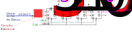
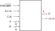

= Sistemas Digitales (2ª Parte)
// classic AsciiDoctor attributes
//:stem: latexmath
:stem:
:background-color="#ff0000":
:icons: font
:imagesdir: images
:customcss: styles/myCustomCSS.css
// Despite the warning of the documentation, https://github.com/asciidoctor/asciidoctor-reveal.js, highlight.js syntax highlighting WORKS, BUT, you need to explicitly set the highlighter using the below attribute
// see http://discuss.asciidoctor.org/Highlighting-source-code-for-reveal-js-backend-td2750.html
:source-highlighter: highlight.js
:highlightjs-languages: vhdl
:source-language: vhdl 
//:source-highlighter: rouge
//:source-highlighter: pygments
// revealjs attributes
:revealjs_theme: white
:revealjs_slideNumber: true
// Al actualizar el slide no cambia de transpa y no se va al inicio
:revealjs_hash: true   
:revealjs_history: true

:revealjs_center: true
:revealjs_width: "100%"
:revealjs_height: "100%"
:revealjs_margin: 0

//:revealjs_minScale: 1,
//:revealjs_maxScale: 1

// plugins copiados de tutoriales/asciidoctor-revealjs/../primer.js
:revealjs_plugins_configuration: revealjs-plugins-conf.js
:revealjs_plugins: revealjs-plugins.js

//:scrollable: no pirula

//:revealjs_history: true para go to file no pirula

//:doctype: book
//:lang: es
//:encode: ISO-8859-1
//:ascii-ids:
:show-link-uri:
:asciidoctor-fetch-kroki:
:experimental:

:ruta-transpas: home/candido/Dropbox/apuntes/apuntes_sistemas_digitales/upna/apuntes_repositorio/transpas_ssdd

:ruta-apuntes: home/candido/Dropbox/apuntes

== Transparencias en Formato PDF

* link:./PDF/ssdd2_slides.pdf[Transparencias PDF]
* Si hay algún error de forma en el documento PDF que dificulte su interpretación, por favor, enviar un mensaje para su correción. Gracias.

== Indice

[%hardbreaks]
Parte 1ª : link:ssdd.html[Sistemas Digitales: Primera Parte]
Tema 7: <<Tema7_Seq, Circuitos Secuenciales.>>
Tema 8: <<Tema8_Fam, Circuitos Digitales Integrados. Familias Lógicas.>>
Tema 9: <<Tema9_Mem, Memorias.>>
Tema 10: <<Tema10_PLD, Dispositivos de Lógica Programable (PLD).>>
Tema 11: <<Tema11_Dac, Convertidores Analógico/Digitales DAC/ADC.>>

[#Tema7_Seq]
[.columns, state=txikiago]
== Tema 7 : Circuitos Secuenciales

[.column]
Introducción a los Sistemas Secuenciales: +
- - Ejemplo +
- - Celdas de Memoria: R S, J K, T y D +
Análisis y diseño de circuitos secuenciales síncronos: +
- - Análisis de circuitos secuenciales síncronos. +
- - Tablas de transiciones y diagramas de estados: Máquina de Mealy y Máquina de Moore. +
- - Síntesis de sistemas secuenciales síncronos. +
Circuitos biestables: +
- - Definición de sistema secuencial. +
- -Tipos y características: Asíncronos y síncronos. +
- - Biestables: R S, J K, T y D +
- - Tiempos característicos en biestables.

[.column]
Registros de desplazamiento: +
- - Concepto de registro. +
- - Registros de desplazamiento. Entrada serie, salida serie. Entrada serie, salida paralelo. Entrada
paralelo, salida serie. Entrada paralelo, salida paralelo. Bidireccional. +
- - Aplicaciones de los registros. Generador de secuencia.
Contadores: +
- - Contadores digitales y sus aplicaciones. +
- - Contadores asíncronos. Contador de décadas. +
- - Contadores síncronos. Acarreo en serie y paralelo. +
- - Contador reversible. +
- - Contadores basados en registros de desplazamiento: en anillo, Johnson, con protección.

=== Introducción a los Sistemas Digitales Secuenciales

* Diseñar el controlador digital de un ascensor para un edificio de 2 plantas
** Motor del ascensor: El eje del motor eléctrico tiene un engranaje sobre el que se acopla una cadena unida al ascensor.
** Si el motor gira a la izda el ascensor sube y si gira a la derecha el ascensor baja.
** En cada planta hay botón para solicitar el servicio del ascensor.
** Dentro del ascensor hay un botón por planta para solicitar el destino del ascensor.
** En cada planta hay un sensor para detectar la llegada del ascensor.

=== Controlador Digital de un Ascensor

* Dibujar un esquema con los componentes del sistema: plantas del edificio, motor, cadena, ascensor, botones.
* Definir y codificar las entradas lógicas del controlador digital.
* Definir y codificar las salidas lógicas del controlador digital.
* Definir y codificar los estados del sistema.
* Dibujar el diagrama de estados del sistema (estados, transiciones, entradas, salidas).
* Desarrollar las 3 tablas: 
** transición de estados , excitación de biestables (pej JK) y funciones de salida.

[state=txikiago]
=== Unidades de Memoria: Biestables

* Una celda de memoria es un dispositivo capaz de almacenar un bit (estados lógicos 0 y 1) y sobre el que se pueden realizar distintas operaciones como:
** escribir el estado cero, escribir el estado uno, invertir su estado, no cambiar el estado, etc ..
** leer el estado
* Las celdas de memoria tienen 2 terminales de entrada para las operaciones de escritura y 2 terminales de salida para las operaciones de lectura. Además si son síncronas tienen 1 terminal para la señal de reloj.
* Las celdas de memoria que admiten dos estados estables reciben el nombre de Biestables.
* Sincronismo:
** Los biestables que realizan la operación de escritura de forma síncrona, respondiendo a la entrada en el instante de pendiente positiva o negativa de una señal reloj, reciben el nombre de *Flip-Flop*.
* Los biestables que realizan la operación de escritura inmediatamente después de un cambio en la entrada reciben el nombre de *Latch*.

[.columns,state=taula]
=== Tipos de Biestables

[.column]
--
.Flip-Flop S-R
[width=50%]
|===
| Clk | S | R | latexmath:[Q_{n+1}] | latexmath:[\overline Q_{n+1}] | Operación
| &#x2191; | 0 | 0 | latexmath:[Q_n] | latexmath:[\overline Q_n] | No cambia
| &#x2191; | 0 | 1 | 0 | 1 | RESET
| &#x2191; | 1 | 0 | 1 | 0 | SET
| &#x2191; | 1 |1 | *X* | *X* | Indeterminado
| Resto | X | X | latexmath:[Q_n] | latexmath:[\overline Q_n] | No cambia
|===
--

[.column]
--
.Flip-Flop J-K
[width=50%]
|===
| Clk | J | K | latexmath:[Q_{n+1}] | latexmath:[\overline Q_{n+1}] | Operación
| &#x2191; | 0 | 0 | latexmath:[Q_n] | latexmath:[\overline Q_n] | No cambia
| &#x2191; | 0 | 1 | 0 | 1 | RESET
| &#x2191; | 1 | 0 | 1 | 0 | SET
| &#x2191; | 1 |1 | latexmath:[\overline Q_n] | latexmath:[ Q_n] | Inversión
| Resto | X | X | latexmath:[Q_n] | latexmath:[\overline Q_n] | No cambia
|===
--

[.columns,state=taula]
=== Tipos de Biestables

[.column]
--
.Flip-Flop D (Data)
[width=50%]
|===
| Clk | D | latexmath:[Q_{n+1}] | latexmath:[\overline Q_{n+1}] | Operación
| &#x2191; | 0 | 0 | 1 | RESET
| &#x2191; | 1 | 1 | 0 | SET
| Resto | X | latexmath:[Q_n] | latexmath:[\overline Q_n] | No cambia
|===
--

[.column]
--
.Flip-Flop T (Toogle)
[width=50%]
|===
| Clk | T | latexmath:[Q_{n+1}] | latexmath:[\overline Q_{n+1}] | Operación
| &#x2191; | 0 | latexmath:[Q_n] | latexmath:[\overline Q_n] | No cambia
| &#x2191; | 1 | latexmath:[\overline Q_n] | latexmath:[ Q_n] | Inversión
| Resto | X | latexmath:[Q_n] | latexmath:[\overline Q_n] | No cambia
|===
--

=== Símbolos de los biestables

* S-R, J-K, D, T.
** Sincronismo con la pendiente + ó - del reloj.

image::tema7_flip-flop_tipos.svg[]

=== Características Temporales de los Biestables Flip-flops

* Tiempo de Retardo ó Propagación(Delay) : Desde que se activa el flanco del reloj para la escritura hasta que se estabiliza la nueva *salida Q* de la celda.
* Tiempo de Mantenimiento (Hold): El tiempo que debe de permanecer estable la *entrada* desde que se activa el flanco del reloj.
* Tiempo de Establecimiento(Set-Up) : El tiempo que debe de permanecer estable la *entrada* antes de que se active el flanco del reloj.

=== Cronogramas: Señales binarias de escritura y lectura de biestables

image::tema7_flip-flop_crono.svg[]

[state="txikiago"]
=== Controlador del Ascensor para 2 plantas

. Definir estados
** Estados: Ascensor en planta baja PB, en planta alta PA , subiendo SUB, bajando BAJ
. Definir entradas
** botón destino planta baja (BDB), botón destino  planta alta (BDA)
** botón llamada desde planta baja (BLB), botón llamada desde planta baja (BLB)
** sensores: planta baja SB y planta alta SA
. Definir salidas
** motor subiendo: MS
** motor bajando: MB
** motor parador: MP

[state="txikiago"]
=== C. Ascensor: Diagrama de estados

* El diagrama es una representación gráfica de las transiciones entre estados y las entradas y salidas del sistema.
* Máquina tipo *MOORE*: las salidas únicamente dependen del estado de la máquina digital -> salidas síncronas
** Representar los estados con círculos: dentro del círculo el estado y la salida del sistema correspondiente.
** Representar las transiciones entre estados mediante: Flecha entre dos estados y sobre la flecha el valor de las entradas.
* Máquina tipo *MEALY*: las salidas en un instante dependen del estado de la máquina digital y de la entrada en ese mismo instánte
** Representar los estados con círculos: dentro del círculo el estado.
** Representar las transiciones entre estados mediante: Flecha entre dos estados y sobre la flecha el valor de las entradas y su salida correspondiente

=== C. Ascensor: Diagrama de Bloques Mealy

=== C. Ascensor: Diagrama de Bloques Moore

image::tema7_ascen2_diag_block.svg[]

[.columns, state=txikiago]
=== C. Ascensor: Transición entre estados

[.column]
[.text-left%hardbreaks]
Cuando el motor se para en una planta:
--el sensor de dicha planta se resetea, se desactiva.
Transición *PB->PB*:.
--si se pulsa un botón para bajar([naranja]#bdb# y/ó [naranja]#blb#) ó no se pulsa ningún botón.
--las entradas [naranja]#sa# y [naranja]#sb# no afectan.
Transición *PA->PA*:.
--si se pulsa un botón para subir([naranja]#bda# y/ó [naranja]#bla#) ó no se pulsa ningún botón.
--las entradas [naranja]#sa# y [naranja]#sb# no afectan.

[.column]
[.text-left%hardbreaks]
Transición *PB->SUB*:.
--si se pulsa un botón para subir([naranja]#bda# y/ó [naranja]#bla#) y no se pulsa simultáneamente algún botón de bajar([naranja]#bdb# ó [naranja]#blb#).
--las entradas [naranja]#sa# y [naranja]#sb# no afectan.
Transición *SUB->SUB*:.
--mientras [naranja]#sa# esté desactivado.
--no afectan ni los botones ni [naranja]#sb#.
Transición *SUB->PA*:.
--si se activa [naranja]#sa#
--el resto de entradas no afecta

[.column]
[.text-left%hardbreaks]
Transición *PA->BAJ*:.
--si se pulsa un botón para bajar([naranja]#bdb# y/ó [naranja]#blb#)y no se pulsa simultáneamente algún botón de subir([naranja]#bda# ó [naranja]#bla#).
--las entradas [naranja]#sa# y [naranja]#sb# no afectan.
Transición *BAJ->BAJ*:.
--mientras [naranja]#sb# esté desactivado.
--no afectan ni los botones ni [naranja]#sa#
Transición *BAJ->PB*:.
--si se activa [naranja]#sb#
--el resto de entradas no afecta

=== C. Ascensor: Diagrama de estados Moore

=== C. Ascensor: Diagrama de estados Mealy

image::tema7_ascen2_diag_seq_mealy.svg[]

[.columns, state=txikiago]
=== C. Ascensor: Codificación

[.column]
--
Entradas del sistema: +
--Cada entrada 1 bit : sa,sb,bdb,blb,bda y bla +
Salidas del sistema: +
--Para codificar las 3 salidas (MS,MB y MP) hacen falta 2 bits -> Z1,Z0 +
--Código de salida *Z1Z0* -> 00 (MP), 01 (MS), 10 (MB)
Estados del Sistema: +
--Memoria -> celdas biestables flip-flop JK +
--Para 4 estados son necesarias 2 celdas Q1 y Q0 -> señales de excitación J1,K1,J0,K0 +
--Códigos de los estados -> *Q1Q0* -> 00(PB), 01(SUB), 10(BAJ), 11(PA) +
Excitación de los biestables: +
--Para 2 biestables JK -> Para el biestable Q1 -> J1K1 y para el biestable Q0 -> J0K0
--

[.column]
--
.Tabla transición JK
[width=50%]
|===
|latexmath:[Q_n->Q_{n+1}] | *J* | *K*
|0 -> 0 | 0 | x
|0 -> 1 | 1 | x
|1 -> 0 | x | 1
|1 -> 1 | x | 0
|===
--

=== C. Ascensor: Tablas de Estados, Excitación de Biestables y Salidas

* Convertir el diagrama de estados en 3 tablas
* MEMORIA: Es necesario escribir el estado SIGUIENTE [verde]#q1q0# en los 2 biestables JK en función de:
** El estado actual : [naranja]#q1q0#
** Las entradas del sistema: [naranja]#sa,sb,bdb,blb,bda y bla#
* Las señales de escritura de los biestables son J1 y K1 para el biestable Q1 y J0 y K0 para el biestable Q0. Por lo tanto es necesario diseñar un CIRCUITO COMBINACIONAL para cada señal de escritura de la memoria:
** J1(q1,q0,sa,sb,bdb,blb,bda,bla) ; K1(q1,q0,sa,sb,bdb,blb,bda,bla)
** J0(q1,q0,sa,sb,bdb,blb,bda,bla) ; K0(q1,q0,sa,sb,bdb,blb,bda,bla)

=== C. Ascensor: Tablas de Estados, Excitación de Biestables y Salidas

image::tema7_ascen2_tablas_plantilla.svg[]

[.columns,state=taula]
=== C. Ascensor: Tablas de Estados, Excitación de Biestables y Salidas

[.column]
--
.Transición *PB->PB*
[width=10%]
|===
|sa|sb|bdb|blb|bda|bla|PB->PB
| X | X | X | 1 | X | X | 1
| X | X | 1 | X | X | X | 1
| X | X | 0 | 0 | 0 | 0 | 1
|===

--si se pulsa un botón para bajar([naranja]#bdb# y/ó [naranja]#blb#) ó no se pulsa ningún botón. +
--las entradas [naranja]#sa# y [naranja]#sb# no afectan.
--

[.column]
--
.Transición *PB->SUB*
[width=10%]
|===
|sa|sb|bdb|blb|bda|bla|PB->SUB
| X | X | 0 | 0 | 1 | X | 1
| X | X | 0 | 0 | X | 1 | 1
|===

--si se pulsa un botón para subir([naranja]#bda# y/ó [naranja]#bla#) y no se pulsa simultáneamente algún botón de bajar([naranja]#bdb# ó [naranja]#blb#). +
--las entradas [naranja]#sa# y [naranja]#sb# no afectan.
--

[.columns,state=taula]
=== C. Ascensor: Tablas de Estados, Excitación de Biestables y Salidas

[.column]
--
.Transición *SUB->SUB*
[width=10%]
|===
|sa|sb|bdb|blb|bda|bla|SUB->SUB
| 0 | X | X | X | X | X | 1
|===

--mientras [naranja]#sa# esté desactivado. +
--no afectan ni los botones ni [naranja]#sb#.
--

[.column]
--
.Transición *SUB->PA*
[width=10%]
|===
|sa|sb|bdb|blb|bda|bdl|SUB->PA
| 1 | X | X | X | X | X | 1
|===

--si se activa [naranja]#sa# +
--el resto de entradas no afecta
--

=== C. Ascensor: Tablas de Estados, Excitación de Biestables y Salidas

image::tema7_ascen2_tablas.svg[]

=== C. Ascensor: Ecuaciones Lógicas

* latexmath:[J_1= \overline q_1 \cdot q_0 \cdot sa]
* latexmath:[K_1= q_1 \cdot \overline q_0 \cdot sb ]
* latexmath:[J_0 = \overline q_1 \cdot \overline q_0 \cdot \overline {bdb} \cdot \overline {blb} \cdot (bda  + bla)]
* latexmath:[K_0 = q_1 \cdot q_0 \cdot \overline {bda} \cdot \overline {bla} \cdot (bdb  + blb)]
* latexmath:[Z_1 = q_1 \cdot \overline q_0]
* latexmath:[Z_0 = q_0 \cdot \overline q_1]

=== C. Ascensor: Biestables con entradas asíncronas

* A los biestables se les puede añadir dos entradas más para realizar el PRESET (escribir un 1) y el RESET (escribir un 0) en cualquier momento (asíncrona).

image::tema7_flip-flop_async.svg[]

=== C. Ascensor: Reset

* Añadimos al controlador digital (driver) del ascensor una señal de Reset
* Al activar la señal de Reset con un *1* (lógica positiva) el controlador digital se reinicia en el *estado* Planta Baja (PB) denominado *estado de inicio* (start)
* Utilizaremos flip-flops JK con entradas asíncronas.

=== C. Ascensor: Esquema Eléctrico

image::tema7_ascen2_esquema_elect.svg[]

[.columns,state=txikiago]
=== C. Ascensor: Descripción VHDL

[.column%hardbreaks]
Alternativas de la descripción de la arquitectura.
--Arquitectura abstracta: describir el Diagrama de la secuencia de estados -> Arquitectura tipo BEHAVIORAL
--Arquitectura física: describir el Esquema Eléctrico resultado del diseño manual -> Arquitectura tipo RTL
*Caso 1*: Descripción del Diagrama de la secuencia de estados.
--Consiste en describir literalmente cada estado, las transiciones entre estados en función de las entradas y describir las salidas en función únicamente del estado (FSM Moore) o en función del estado y de las entradas (FSM Mealy).
--Hay que describir que los estados se sinteticen en un bloque de memoria.
--Hay que describir el sincronismo de las transiciones entre estados.

[.column]
--
*Caso 2*: Descripción del Esquema Eléctrico resultado del diseño manual +
--descripción de dos circuitos combinacionales : el de salida y el de excitación de los biestables. +
--descripción de los biestables: +
---se tienen que sintetizar como dispositivos con memoria. +
---describir las transiciones entre estados del biestable. +
---describir el sincronismo de las transiciones +

NOTE:  Los dos casos se corresponden a la misma ENTIDAD.
--

[.columns,state=txikiago]
=== Descripción VHDL: Síntesis de Circuitos con Memoria.

[.column]
--
Para conseguir que la descripción VHDL de un circuito se sintetice con memoria es necesario que la descripción de la relación entre la salida y la entrada del circuito *NO* contemple todas las situaciones posibles. De esta forma cuando la entrada no este contemplada en la descripción la salida no cambiará y será necesario haberla tenido *MEMORIZADA* para que continue igual que antes de dicha entrada. 

[source,vhdl]
----
entity  ej_mem is
  port(
    SW: in bit_vector(0 downto 0);
    LEDR: out bit_vector(0 downto 0)
  );
end entity;

architecture beh of ej_mem is
begin
  process (SW(0))
  begin
    if (SW(0) = '0') then
      LEDR(0) <= '1';
    end if;
  end process;
end architecture;

----
--

[.column]
--
La sentencia secuencial *IF* no contempla los casos SW(0) distintos de cero y habrá que memorizarlos. Si asignamos al interruptor SW(0) el valor '1' el estado (encendido/apagado) del led LEDR(0) no debe de cambiar. +
El compilador del sintetizador Quartus informa que sintetizará memoria (inferring latch(es)): +

----
Warning (10631): VHDL Process Statement 
inferring latch(es) for signal or variable "LEDR", 
which holds its previous value 
Info (10041): Inferred latch for "LEDR[0]" 
----
--

=== C. Ascensor: Descripción VHDL de la Entidad

* Descripción de la entidad
** 8 entradas : los 4 botones, los 2 sensores, el reloj y la señal de reset de la memoria.
** Los 4 *botones* y los 2 *sensores* los simulamos con los conmutadores SW -> SW(5 downto 0)
** El *reloj* lo simulamos con un botón KEY -> KEY(0)
** La señal de *reset* se activa con un botón KEY -> KEY(1)

CAUTION: los botones si *NO* se pulsan dan un *1* a su salida -> lógica negativa

** SalidaS: 
*** para visualizar el estado del ascensor utilizamos dos *display* de 7 segmentos HEX1 y HEX0.
*** para visualizar el estado del reloj utilizamos el *led* rojo LEDR(9)

[state=txikiago]
=== C. Ascensor: Descripción VHDL de la Arquitectura tipo RTL: Descripción del Esquema Electrico (Memoria y Sincronismo)

Descripción de los biestables Q1 y Q0 +
--Utilizaremos biestables JK disparados por el flanco negativo de un reloj y con señal asíncrona de reset. +
 +
Sincronismo: +
--Entrada asíncrona: Reset .Se activa independientemente de cualquier otra señal. +
--Entrada síncrona JK: A la salida Q se le asignará un valor determinado por la entrada JK cuando llegue un flanco negativo de la señal de reloj. +
--Para detectar el flanco negativo utilizaremos la función *falling_edge(signal)* definida en la librería ieee. +
 +
Describimos la tabla funcional del biestable mediante las sentencias: [naranja]#IF-THEN-ELSIF-END IF# -> [naranja]#PROCESS()# +
--En la sentencia [naranja]#IF# es opcional el [naranja]#ELSE# y el [naranja]#ELSIF#: esto permite NO describir todos los casos -> *MEMORIA* + 
--El proceso será sensible a la señal asíncrona de reset y a la señal de reloj CLK. Si no hay eventos en la señal RESET ni eventos en CLK(flancos positivos o negativos) -> no se ejecuta el proceso y la salida del biestable no cambia -> *MEMORIA* +
--La señal de RESET tiene prioridad sobre JK: Si se activa la señal de reset el estado siguiente es el estado de inicio (PB) y si no se activa entonces actua la señal JK -> Un primer [naranja]#IF-ELSE#:  +
--Si no Reset: JK escribe en la celda de memoria con el disparo de un flanco negativo del reloj CLK ->  Un segundo [naranja]#IF#  -> por lo que si flanco positivo *MEMORIA*: +
--Si flanco negativo de CLK: Escritura mediante la entrada jk (01,10,11). El caso JK(00) no se describe y se sintetizará como *MEMORIA* -> Un tercer [naranja]#IF-ELSIF# 

=== Descripción VHDL de los biestables JK con entrada asíncrona de reset.

* Código VHDL
+

[source,VHDL]
----
-- Biestable JK por flanco negativo con entrada asíncrona de reset
biestable0:process (clk,reset)
  begin
    if ( reset = '1') then
        q0 <= '0';
    else
      if (falling_edge(clk)) then
         if j0k0 = "10" then
              q0 <= '1';
         elsif j0k0 = "01" then
              q0 <= '0';
         elsif j0k0 = "11" then
              q0 <= not q0;
         end if;
     end if;
  end if;
end process biestable0;
----

=== C. Ascensor: Descripción VHDL Completa
 
[source,vhdl]
----
-- Ascensor de 2 plantas: Planta Baja y Planta Alta
-- Entradas: Switches SW 0-5 -> sensores sa, sb y botones bdb, blb, bda, bla
-- Salidas: Leds LEDR 0-1 -> código z0z1
-- Reloj: botón KEY(0)
-- Reset: botón KEY(1)
--  falling_edge (signal) : función que devuelve TRUE si hay un evento en signal de '1' a '0'
--                          definida en la librería ieee para señales std_logic

library ieee;
use ieee.std_logic_1164.all;

entity ascen2 is
    port (
        SW: in std_logic_vector(5 downto 0);
        KEY: in std_logic_vector(1 downto 0);
        LEDR: out std_logic_vector(9 downto 0);
        HEX0:  out std_logic_vector(6 downto 0);
        HEX1:  out std_logic_vector(6 downto 0)

    );
end ascen2;

architecture rtl of ascen2 is

-- Circuitos diseñados manualmente
-- cc salida z1z0=q1q0
-- cc excitacion biestables:
-- j1=~q1q0sa  k1=q1~q0sb
-- j0=~q1~q0~bdb~blb(bda+bla)
-- k0=q1q0~bda~bla(bdb+blb)
signal j0,k0,j1,k1,q0,q1,z0,z1,clk,reset: std_logic;
signal j0k0,j1k1,q1q0,z1z0: std_logic_vector(1 downto 0);
signal sa,sb,bdb,blb,bda,bla: std_logic;

begin
--  Componentes de los buses
    j0k0 <= j0 & k0;
    j1k1 <= j1 & k1;
    q1q0 <= q1 & q0;
    z1z0 <= z1 & z0;

--  Señales externas de entrada
    clk <= KEY(0);
    reset <= not KEY(1);
    sa <= SW(5);sb <= SW(4);bdb <= SW(3);blb <= SW(2);bda <= SW(1);bla <= SW(0);

-- cc de excitación de biestables
    j0 <= (not q1) and (not q0) and (not bdb) and (not blb) and (bda or bla);
    k0 <= q1 and q0 and (not bda) and (not bla) and (bdb or blb);
    j1 <= (not q1) and q0 and sa;
    k1 <= q1 and (not q0) and sb;

-- cc de salida
    z1 <= q1;
    z0 <= q0;

-- Memoria : 2 biestables JK
    biestable0:process (clk,reset)
    begin
        if ( reset = '1') then
            q0 <= '0';
        else
            if (falling_edge(clk)) then
                if j0k0 = "10" then
                    q0 <= '1';
                elsif j0k0 = "01" then
                    q0 <= '0';
                elsif j0k0 = "11" then
                    q0 <= not q0;
                end if;
            end if;
        end if;
    end process biestable0;

    biestable1:process (clk,reset)
    begin
     if ( reset = '1') then
            q1 <= '0';
        else
            if (falling_edge(clk)) then
                if j1k1 = "10" then
                    q1 <= '1';
                elsif j1k1 = "01" then
                    q1 <= '0';
                elsif j1k1 = "11" then
                    q1 <= not q1;
                end if;
            end if;
        end if;
    end process biestable1;

-- Visualización de la salida
    LEDR(0) <= z1z0(0);
    LEDR(1) <= z1z0(1);

-- Visualización de la entrada: reloj
   LEDR(9) <= clk;

-- Visualización de los estados
    decod7seg:process (q1q0)
    begin
       case q1q0 is
            when "00" =>
                HEX1 <= "0001100";
                HEX0 <= "0000011";
            when "01" =>
                HEX1 <= "0010010";
                HEX0 <= "1000001";
            when "10" =>
                HEX1 <= "0000011";
                HEX0 <= "0001000";
             when "11" =>
                HEX1 <= "0001100";
                HEX0 <= "0001000";
       end case;
    end process decod7seg;

end rtl;
----

[state=txikiago]
=== C. Ascensor: Descripción VHDL de la Arquitectura tipo BEHAVIORAL

* En este caso no es necesario realizar ningún diseño previo manual
* Se describe literalmente el *Diagrama de Secuencia de Estados*
* Es necesario definir un nuevo tipo de señal: el de los estados. Para la declaración de un tipo de señales definido por el DISEÑADOR se utiliza la palabra clave *TYPE*
+

[source,vhdl]
----
type tipo_estado is (pb,sub,baj,pa);  -- tipo enumeración : ESTADOS
signal estado_actual : tipo_estado := pb; -- estado inicial
signal estado_siguiente: tipo_estado := pb ; -- estado inicial
----

** Mediante la asignación [naranja]#:= pb# inicializamos el valor de las señales [naranja]#estado_actual# y [naranja]#estado_siguiente#. De esta manera queda definido el estado inicial nada más encender el controlador del ascensor.

[state=txikiago]
=== C. Ascensor: Descripción VHDL de la Arquitectura tipo BEHAVIORAL

* Es necesario describir la TABLA de TRANSICIONES:
** Estando en el *estado_actual=XX * si se activan las *entradas=YY* entonces se *transita* al *estado_siguiente=ZZ*
** La transición se ejecuta solo si se da algún *evento en las entradas*

* Es necesario describir la escritura en la MEMORIA del *estado_actual*: actualización del nuevo estado
** después de la transición es necesario que : *estado_actual <- estado_siguiente*
** la actualización del estado se da *síncronamente* con el flanco del reloj (*negativo* en este caso)

=== C. Ascensor: Descripción VHDL de las Transiciones y de la Salida

Para describir "Estando en el *estado_actual=XX* ..." -> sentencia [naranja]#CASE# +
Para describir "Si se activan las *entradas=YY* entonces *estado_siguiente=ZZ* " -> sentencia [naranja]#IF-ELSIF#  +
Para describir las salidas MOORE solo hay que tener en cuenta el estado_actual.  -> sentencia concurrente [naranja]#<=# +
Para describir que la transición se da solo si hay algún *evento en las entradas* -> el [naranja]#process(SW)# depende de las entradas SW
 
[source,vhdl]
----
-- Diagrama de Transiciones Moore
    process (SW)
    begin
       case estado_actual is
            when pb =>
                if (bdb='1' or blb='1' ) then
                    estado_siguiente <= pb;
                elsif ( bdb='0' and blb='0' and bda='0' and bla='0') then
                    estado_siguiente <= pb;
                elsif (bda='1' or bla='1' ) then
                   estado_siguiente <= sub;
                end if;
                z0 <= '0';
                z1 <= '0';
            when sub =>
                if (sa='1') then
                    estado_siguiente <= pa;
                else
                   estado_siguiente <= sub;
                end if;
                z0 <= '1';
                z1 <= '0';
           when pa =>
                if (bda='1' or bla='1' ) then
                   estado_siguiente <= pa;
                elsif ( bdb='0' and blb='0' and bda='0' and bla='0') then
                    estado_siguiente <= pa;
                elsif (bdb='1' or blb='1' ) then
                   estado_siguiente <= baj;
                end if;
                z0 <= '1';
                z1 <= '1';
           when baj =>
                if (sb='1') then
                    estado_siguiente <= pb;
                else
                   estado_siguiente <= baj;
                end if;
                z0 <= '0';
                z1 <= '1';
       end case;
    end process;
----

Si la transición sólo depende de las entradas ¿por qué ponemos que el proceso depende de la señal CLK?: la respuesta en la descripción de la memoria.

=== C. Ascensor: Descripción VHDL de la Memoria

Para describir *estado_actual <- estado_siguiente* sincronamente: [naranja]#IF(falling_edge(CLK))# +
Hay cambio de estado dependiendo tanto de las entradas síncronas como asíncronas: +
--Para describir *estado_actual <- estado_inicial* si *entrada=reset* : [naranja]#IF(reset='1')# +
Los [naranja]#IF# al ser secuenciales van en el cuerpo de un [naranja]#process# +
--El [naranja]#process()# será sensible a la entrada asíncrona *reset* y  al reloj *clk* +
 
[source,vhdl]
----
-- Memoria : 2 celdas de memoria síncrona
    memoria:process (clk,reset)
    begin
        if ( reset = '1') then
            -- actualizar el estado asíncronamente
            estado_actual<= pb;
        else
            -- actualizar el estado sincronamente
            if (falling_edge(clk)) then
                estado_actual <= estado_siguiente;
            end if;
        end if;
    end process memoria;
----
** Observar que el process se ejecutará si hay un evento en clk, es decir, tanto si hay flanco positivo o negativo...en cambio el IF del process solo se ejecuta en el flanco negativo del reloj clk.

=== C. Ascensor: Descripción VHDL de la Memoria

* ¿Puede darse el caso de que el estado_siguiente no esté definido? Sí. Al arrancar el sistema mediante el encendido del controlador el estado del sistema será el estado de inicio. Si no cambiamos las entradas no se ejecutará [naranja]#process(SW)# por lo que estado_siguiente *NO* estará definido y al producirse el disparo del reloj clk se ejecutará [naranja]#process(clk,reset)# con la señal estado_siguiente sin definir.
** Dos soluciones posibles: 
... Inicializar el estado_siguiente al arrancar el sistema con la declaración [naranja]#signal estado_siguiente: tipo_estado := *pb*;# que asigna el valor *pb* a la señal estado_siguiente.
... Definir el estado_siguiente al producirse el disparo de reloj activando el [naranja]#process(SW,*clk*)# añadiendo la señal clk a la lista de señales sensibles del process.

=== C. Ascensor: Descripción VHDL Completa
 
[source,vhdl]
----
-- Ascensor de 2 plantas: Planta Baja y Planta Alta
-- Entradas: Switches SW 0-5 -> sensores sa, sb y botones bdb, blb, bda, bla
-- Salidas: Leds LEDR 0-1 -> código z0z1
-- Estados: Leds LEDR 8-9 -> código q0q1
-- Reloj : botón KEY(0)
--  falling_edge (signal) : función que devuelve TRUE si hay un evento en signal de '1' a '0'
--                          definida en la librería ieee para señales std_logic

-- FSM Moore

library ieee;
use ieee.std_logic_1164.all;

entity ascen2 is
    port (
        SW: in std_logic_vector(5 downto 0);
        KEY: in std_logic_vector(1 downto 0);
        LEDR: out std_logic_vector(9 downto 0);
        HEX0:  out std_logic_vector(6 downto 0);
        HEX1:  out std_logic_vector(6 downto 0)

    );
end ascen2;

architecture behavioral of ascen2 is

signal clk,reset,z0,z1: std_logic;
signal sa,sb,bdb,blb,bda,bla: std_logic;

type tipo_estado is (pb,sub,baj,pa);  -- tipo enumeración : ESTADOS
signal estado_actual : tipo_estado := pb; -- estado inicial
signal estado_siguiente: tipo_estado := pb; -- estado inicial

begin
--  Señales externas de entrada
    clk <= KEY(0);
    reset <= not KEY(1);
    sa <= SW(5);sb <= SW(4);bdb <= SW(3);blb <= SW(2);bda <= SW(1);bla <= SW(0);

-- Diagrama de Transiciones Moore
    process (SW)
    begin
       case estado_actual is
            when pb =>
                if (bdb='1' or blb='1' ) then
                    estado_siguiente <= pb;
                elsif ( bdb='0' and blb='0' and bda='0' and bla='0') then
                    estado_siguiente <= pb;
                elsif (bda='1' or bla='1' ) then
                   estado_siguiente <= sub;
                end if;
                z0 <= '0';
                z1 <= '0';
            when sub =>
                if (sa='1') then
                    estado_siguiente <= pa;
                else
                   estado_siguiente <= sub;
                end if;
                z0 <= '1';
                z1 <= '0';
           when pa =>
                if (bda='1' or bla='1' ) then
                   estado_siguiente <= pa;
                elsif ( bdb='0' and blb='0' and bda='0' and bla='0') then
                    estado_siguiente <= pa;
                elsif (bdb='1' or blb='1' ) then
                   estado_siguiente <= baj;
                end if;
                z0 <= '1';
                z1 <= '1';
           when baj =>
                if (sb='1') then
                    estado_siguiente <= pb;
                else
                   estado_siguiente <= baj;
                end if;
                z0 <= '0';
                z1 <= '1';
       end case;
    end process;

-- Memoria : 2 celdas de memoria síncrona
    memoria:process (clk,reset)
    begin
        if ( reset = '1') then
            -- actualizar el estado asíncronamente
            estado_actual<= pb;
        else
            -- actualizar el estado sincronamente
            if (falling_edge(clk)) then
                estado_actual <= estado_siguiente;
            end if;
        end if;
    end process memoria;

-- Visualización de la salida
    LEDR(0) <= z0;
    LEDR(1) <= z1;

-- Visualización de la entrada: reloj
   LEDR(9) <= clk;

-- Visualización de los estados
    decod7seg:process (estado_actual)
    begin
       case estado_actual is
            when pb =>
                HEX1 <= "0001100";
                HEX0 <= "0000011";
            when sub =>
                HEX1 <= "0010010";
                HEX0 <= "1000001";
            when baj =>
                HEX1 <= "0000011";
                HEX0 <= "0001000";
             when pa =>
                HEX1 <= "0001100";
                HEX0 <= "0001000";
       end case;
    end process decod7seg;

end behavioral;

----

=== Secuenciadores Digitales

* Con el diseño del Secuenciador Digital o Controlador Digital del Ascensor se ha expuesto toda la teoría y práctica relacionada con las herramientas y metodología del diseño de los Circuitos Secuenciales Digitales.

* Se recomienda realizar los ejercicios recomendados del libro de problemas y especialmente la obtención del *Diagrama de Estados* partiendo de cero.

=== Ejemplo 2b Transparencias: Diagrama Secuencia de Estados MEALY

=== Ejemplo 2b Transparencias: Codificación Entradas, Salidas, Estados

* Entrada: Un bit -> X
* Salida: Un bit -> Z
* Biestables: 
** elección libre -> JK
** 4 estados -> 2 bits -> Q1Q0
** Codificación  Q1Q0 = 00 para el estado q0, 01 si q1, 10 si q2 y 11 si q3.

=== Ejemplo 2b Transparencias: Tablas de Transiciones, Salidas, Excitación

=== Ejemplo 2b Transparencias: Diseño Circuitos de Excitación y de Salidas

=== Ejemplo 2b Transparencias: Diseño Circuitos de Excitación y de Salidas

* latexmath:[Z=Q_1 \cdot \overline Q_0 \cdot X] +
* latexmath:[J1 = X + \overline Q1 \cdot Q0] +
* latexmath:[K1 = \overline X] +
* latexmath:[J0 = X] +
* latexmath:[K0 = 1]

[.columns,state=txikiago]
=== Registros: Introducción

[.column]
* Funcionalidad
** Registrar o Almacenar o *Memorizar* un dato, una instrucción, un código, etc
* Estructura
** Secuencia de celdas de memoria de 1 bit
* Tamaño
** Normalmente 1,2,4,8,..., bytes
** Por lo tanto es una unidad de memoria de muy pequeña capacidad pero de alta velocidad.

[.column]
* Aplicaciones:
** Bancos de Registros: conjunto de registros con una funcionalidad común. Por ejemplo el banco de registros de números enteros de un microprocesador de Intel.
** Controladores de entrada/salida de un computadora: controlador de video, controlador del disco externo, controlador ethernet... todos necesitan memoria para almacenar un pocos datos, comandos, etc...
* Tecnología
** Cada celda de memoria puede implementarse con un biestable Flip-Flop. Operaciones de Lectura y de Escritura. La escritura es síncrona con una señal de reloj.

=== Registros: Esquema

image::tema7_reg_esquema.svg[]

* D: Dato a registrar (Escritura) , Q: Dato registrado (Lectura)
* Clock: Sincronismo por flanco (para el instante de la escritura)
* Load: Cargar el dato de entrada -> Orden de escritura
* Reset: Iniciar el registro con el dato cero -> 00000000

=== Registros de Desplazamiento: Introducción

* *Desplazar* bits de un dato hacia la izda o hacia la dcha.
* En el lenguaje de programación ensamblador hay instrucciones como "SHL x,n" (shift-left n bits el dato x) ó "SHR n" (shift-right n bits el dato x)
+

----
  x=00001111
  shl x,4  -> x=11110000
  shr x,2  -> x=00111100
----
** Matemáticamente, desplazar "n" bits de un número binario hacia la derecha equivale a dividir por latexmath:[2^n] y desplazar "n" bits hacia la izquierda equivale a multiplicar por latexmath:[2^n]

=== Registros de Desplazamiento: Introducción

image::tema7_reg_desplaza.svg[]

[.columns,state=txikiago]
=== Registros de Desplazamiento: Estructura con Flip-flops

[.column]
--
* Conexión de los Flip-Flops en cascada o anillo: conectar salidas Q con entradas del flip-flop contiguo

--
[.column]
* Borrado -> entradas clear asíncronas
* SHIFT: *Desplazamiento síncrono*-> cada flanco de reloj
* Circuito Escritura: 
** serie: shift :set-reset del primer flip-flop 
* Lectura:
** línea salida serie 
** bus de salida Q

=== Registros de Desplazamiento: Tipos

* Entrada Serie - Salida Serie/Paralelo

* Entrada Serie/Paralelo - Salida Serie/Paralelo

* 74166: Comercial 

=== Registros de Desplazamiento: Entrada Serie/Paralelo - Salida Serie/Paralelo

image::tema7_reg_estru_in_paral.svg[]

* Inicializar Registro: bus datos -> LOAD asíncrono
* SHIFT: *Desplazamiento síncrono*-> cada flanco de reloj
* Circuito Escritura: 
** serie: shift :set-reset del primer flip-flop 
** paralelo: load : escritura asíncrona de todos los flip-flops

[state=taula]
=== Registros de Desplazamiento: Entrada Serie/Paralelo - Salida Serie/Paralelo

[.Load/Clear]
[width=60%]
|====
| Borrado | Inhibición | Función
| 0 | 0 | LOAD 
| 0 | 1 | Desplaza
| 1 | 0 | Prohibido
| 1 | 1 | Borrado
|====

[.text-left]
* La señal Inhibición (lógica negativa) realiza la función LOAD si su valor es cero
** Durante la *carga* (LOAD) del dato inicial el desplazamiento queda anulado al *inhibir al reloj*
** Si inhibición vale 1 entonces no inhibe el reloj y se produce el desplazamiento.
* No se puede Cargar y Desplazar al mismo tiempo
* No se puede Cargar y Borrar al mismo tiempo.

=== Registros de Desplazamiento: Diseño Entrada S/P y Salida S/P

* Herramienta LOGICA: Tablas de la Verdad -> Fundamental para Razonar

image::tema7_reg_desp_dise.svg[]

[.columns,state=txikiago]
=== Registros de Desplazamiento: Diseño Entrada S/P y Salida S/P

[.column]
--
* Diseño del circuito: RAZONAMIENTO
** Si latexmath:[S/ \overline L = 0] entonces : latexmath:[PR_i = \overline {d_i}] e inhibir el reloj (clock=0) y latexmath:[S_3=X \hspace{3mm} y \hspace{3mm} R_3=X]
** Si latexmath:[S/ \overline L = 1] entonces : latexmath:[PR_i = 1] y el reloj (clock=CLK) y latexmath:[S_3=b_i \hspace{3mm} y \hspace{3mm} R_3=\overline {S_3}]
* Herramienta LOGICA: Diagramas de Karnaugh

image::tema7_reg_dis_dk.svg[]
--

[.column]

* Solución:
** latexmath:[PR_i = S/ \overline L +\overline {d_i}]
** latexmath:[clock = S/ \overline L \cdot CLK]
** latexmath:[S_3 = b_i] y latexmath:[R_3 = \overline {S_3}]

=== Registros de Desplazamiento: Diseño Entrada S/P y Salida S/P

image::tema7_reg_dis_puertas.svg[]

[.columns,state=txikiago]
=== Registros de Desplazamiento: 74166

[.column]
* Estructura Interna:
** 8 biestables tipo D *sin entrada asíncrona* -> en cascada
** Control entrada Serie/Paralelo -> solo escritura síncrona
*** *LD+CLK* : Carga paralela síncrona

* latexmath:[SH/ \overline LD] : Shift-LoaD : desplaza o carga
* SER: Entrada de datos SERie
* CLK: flancos de sincronismo del desplazamiento
* CLK INH: inhibición del desplazamiento

[.column]
* PARALLEL: Entrada de Datos a través del bus 
* Qi: Salida del bit "i"
* latexmath:[Q_H]: Salida de datos serie
* CLR: clear

[.columns,state=txikiago]
=== Registros de Desplazamiento: hacia la IZDA

[.column]
* Cómo diseñar un registro de desplazamiento hacia la izda utilizando un Reg. Desp. hacia la derecha.
* Ejemplo: Registro de 4 bits D3-D2-D1-D0 que para cada flanco *negativo* desplaza 1 bit hacia la derecha
** Conectamos, externamente al registro, la salida Q0 a la entrada D1: Q0 -> D1 
** Conectamos externamente cada salida a la entrada del bit anterior: Q0->D1, Q1->D2, Q2->D3, Q3 sin conectar

[.column]
* Entrada [naranja]#S# hift/[naranja]#L# oad a *0* -> se inhibe la conexión en anillo de los flip-flops, por lo que NO hay desplazamiento hacia la derecha.
* Ahora la escritura síncrona es siempre a través del bus paralelo.

=== Registros de Desplazamiento: Ejercicio

* Diseñar un circuito externo que realice una carga de la entrada paralela cada flanco *positivo* (flanco contrario al de los flip-flops). ¿El circuito debe ser secuencial?

[.TV]
[width=90%,cols="1,1,3"]
|===
|latexmath:[CLK] | latexmath:[\overline {LOAD}] | Función
|latexmath:[\downarrow] | 1 | Escritura Síncrona a través de la entrada serie
|latexmath:[\uparrow] | 0 | Escritura Síncrona a través de la entrada paralelo
|===

=== Registros de Desplazamiento: Carga de la entrada de datos paralela de forma SINCRONA: Ejercicio
* Hasta ahora hemos visto que la carga (LOAD) del dato del bus de entrada paralelo se realiza asíncronamente a través de las entradas asíncronas, preset y reset, de los flip-flops. Una alternativa sería no utilizar las entradas asíncronas preset y reset de los flip-flops y utilizar sus entradas SÍNCRONAS.

* Ejercicio: Diseño del circuito excitador con FF tipo D: 
** Entradas del circuito excitador: LOAD, dato paralelo D3D2D1D0, dato serie ..b4b3b2b1b0 y el reloj CLK
** Salidas del circuito excitador: entrada D del FF
* Herramientas del RAZONAMIENTO -> Tabla de la verdad y Diagrama de Karnaugh
* Síntesis: Expresiones lógicas obtenidas y su implimentación con puertas lógicas

[.columns,state=txikiago]
=== Registros de Desplazamiento: Carga de la entrada de datos paralela de forma SINCRONA: Ejercicio

[.column]
* Método a desarrollar:
. Descripción funcional:
.. Dibujo el esquema de bloques -> Entradas y Salidas -> Entidad
. Descripción funcional lógica
.. Mediante la Tabla de la Verdad describo la relación entre las salidas y las entradas -> Arquitectura funcional
. Descripción funcional lógica
.. Mediante lenguaje Natural describo la relación entre las salidas y las entradas -> Arquitectura funcional

[.column]
. Descripción lógica matemática 
.. Directamente o mediante el Diagrama de Karnaugh expreso la relación matemática entre las salidas y las entradas -> Arquitectura RTL
. Esquema eléctrico
.. Circuito con puertas lógicas

[.columns,state=txikiago]
=== Registros de Desplazamiento: Carga de la entrada de datos paralela de forma SINCRONA: Ejercicio

[.column]
--
* Esquema de Bloques

--

[.column]
* SH/LOAD : desplazamiento/carga
* CLK : reloj externo
* P : entrada de datos paralelo latexmath:[P_3P_2P_1P_0] del registro
* D : entrada de datos Síncrona latexmath:[D_3D_2D_1D_0] de los 4 Flip-Flops
* clock : entrada de sincronismo de los 4 Flip-Flops
* Q : salida latexmath:[Q_3Q_2Q_1Q_0] de los 4 flip-flops 

[.columns, state=txikiago]
=== Registros de Desplazamiento: Carga de la entrada de datos paralela de forma SINCRONA: Ejercicio

[.column]
--
* Tabla de la Verdad : Descripción Funcional Lógica

image::tema7_reg_ejer_load-sync_TV.svg[]
--

[.column]
* latexmath:[D_i] Descripción Funcional con Lenguaje Natural
** Si L=0 entonces latexmath:[D_i = d_i] cuando haya un flanco positivo en la señal de sincronismo del FF
** Si L=1 entonces latexmath:[D_i = Q_{i+1}] cuando haya un flanco positivo en la señal de sincronismo del FF
* Descripción Lógica Matemática
** latexmath:[i \neq 3 \rightarrow D_i=d_i \cdot \overline L + Q_{i+1} \cdot S]
** latexmath:[i=3 \rightarrow D_i=d_i \cdot \overline L + b_{serie} \cdot S]

=== Registros de Desplazamiento: Carga de la entrada de datos paralela de forma SINCRONA: Ejercicio

* Esquema del circuito digital con puertas  lógicas

image::tema7_reg_ejer_load-sync_puertas.svg[]

* Cuando i=3 la entrada es latexmath:[b_{serie}] y para i=2,1,0 la entrada es latexmath:[Q_{i+1}]

=== Registros de Desplazamiento: Registro Universal (bidireccional) de 4 bits : 74194

* Entrada Ser/Par y Salida Ser/Par
* 4 canales: A,B,C,D y Qa,Qb,Qc,Qd
* Estructura interna: SR-FF
* Entradas Serie: Shift Right Serial (SR SER) y Shift Left Serial (SL SER) 
* CLK: sync
* Control S1-S0: LOAD, SER Right, SER Left, HOLD
* latexmath:[\overline {CLR}]: clear

=== Registros de Desplazamiento: Registro Universal (bidireccional) de 8 bits : 74299

* SR: shift right
* SL: shift left
* latexmath:[\overline {CLR}]: clear
* output: latexmath:[Q_A^{'}, Q_B^{'}, Q_C^{'},..., Q_H^{'}] 
* input/output latexmath:[A/Q_A, B/Q_B, C/Q_C,..., H/Q_H]
* OE: output enable
* MODE -> (Clear,Hold,Shift Right, Shift Left, Load)

=== Registros de Desplazamiento Rotacional

* El anillo es completo: se conecta la salida de la última celda a la primera celda.

[.columns,state=txikiago]
=== Contadores: Introducción

[.column]
* Función
** Registrar, Almacenar, Memorizar el valor de la cuenta de los pulsos de un reloj.
* Contador de Módulo N
** puede contar N valores diferentes: Pej: 0,1,2,...N-1
* Tipos:
** Síncronos: todas las celdas del contador se escriben síncronamente con el mismo reloj
** Asíncronos: las celdas del contador son escritas de forma no síncrona

[.column]
* Aplicaciones
** Divisor de la frecuencia: de una señal digital binaria
** Temporizador: reloj digital en tiempo real (Real Time Clock)
* Diseño:
** Contadores Síncronos: Método general de diseño de los sistemas secuenciales tipo Moore.
** Contadores Asíncronos.

=== Contadores: Ejemplo Contador Ascendente Módulo 8

* Secuencia: 0,1,2...7,0,...7,0,...
* 8 valores -> 3 bits -> 000,001,...,111,000,...
* Estructura: 3 celdas biestables y una señal de reloj -> Valor de la cuenta: Salida Q2Q1Q0
* Cronograma

image::tema7_cont_crono.svg[]

* Observar: el valor de la cuenta, el sincronismo, la relación de frecuencias entre las salidas

=== Contadores: Asíncronos

* Estructura Interna:
** El bit LSB latexmath:[Q_0] es el de la celda de la IZDA 
** La salida latexmath:[Q_i] se conecta al reloj latexmath:[CLK_{i+1}]
** Tipo de biestable: *JK* con las dos entradas  *11*

=== Contadores: Asíncronos -> Cronograma

* Cronograma real teniendo en cuenta los retardos latexmath:[t_{pb}] -> Propagation Biestable delay

image::tema7_cont_crono_fmax.svg[]

* La limitación viene determinada por los casos críticos: la acumulación de los retardos es mayor si en la transición o secuencia deben de conmutar todas las celdas, por ejemplo en la transición 1111 -> 0000 ó en la transición 0111 -> 1000
** Tmin -> latexmath:[3t_{pb}+t_x]   ->  ¿latexmath:[t_x]?

[.columns]
=== Contadores: Asíncronos -> Diseño

[.column]
* El diseño se basa en el CRONOGRAMA
** Q0 conmuta en el flanco de subida de CLK
** Q1 conmuta en el flanco de bajada de Q0
** Q2 conmuta en el flanco de bajada de Q1
* Conclusión
** conmuta en el flanco -> JK=11
** flip-flops por flanco positivo
*** flanco negativo de latexmath:[Q_0] -> flanco positivo de latexmath:[\overline Q_0]

[.column]

=== Contadores: Asíncronos -> Frecuencia Máxima

* fmax=1/Tmin
* ¿ De qué depende tx? ¿tx es el retardo de SET-UP?
* ¿ Ĺa salida Q3 está conectada a ...?
* ¿ Quien va a leer Q3? ¿Cuando va a cambiar proximamente Q3?¿Por qué tx viene limitado por el siguiente flanco de reloj?

[.columns,state=taula]
=== Contadores: Asíncrono Ascendente Módulo 10

[.column]
--
* Estructura: 4 celdas -> Cuenta 0000-0001-...-1111
** Un contador con 4 celdas es de Módulo 16, por lo que es necesario detectar el valor de cuenta "9" y que el valor siguiente no sea "diez" sino "cero".
* Una solución posible es que en el flanco positivo siguiente a la transición 8->9 (flanco negativo) se realice la transición 9->15, por lo que en el siguiente flanco negativo la transición será 15->0.
** Al llegar a 9 ("1001") ponemos el contador a 15 ("1111) seteando los dos biestables que están a cero -> Q1 y Q2

* latexmath:[G=Q_3 \cdot Q_0] -> sincronismo con clk=1 -> latexmath:[G=Q_3 \cdot Q_0 \cdot CLK]
* lógica negativa -> latexmath:[G= \overline {Q_3 \cdot Q_0 \cdot CLK}]
--

[.column]
[.DK G=Detector del 9 -> 1001]
|===
|Q3Q2 +
... +
Q1Q0|00|01|11|*10*
|00|0|0|X|0
|*01*|0|0|*X*|*1*
|11|0|0|*X*|*X*
|10|0|0|X|X
|===

=== Contador Síncrono: Introducción

* Diseño
** Método General Sistemas Secuencias de una máquina de estados finitos (FSM) Tipo Moore
** Los estados Q son el valor de la cuenta (salida Z) -> Z=Q
* Tipos
** Ascendente ó Descendente
** Reversible (Ascendente y Descendente)
** La cuenta no tiene porque ser números consecutivos -> pares, impares, johnson, etc

[state='txikiago']
=== Contador Síncrono: Contador Ascendete Módulo 8

* 8 estados -> Codificación con 3 bits  -> Estados latexmath:[Q_2Q_1Q_0=000,001,010,...,111]
** Memoria: 3 Flips-Flops FF por flanco positivo
* Diagrama de Secuencia de Estados tipo Moore
** La única entrada es la del reloj CLK. Las transiciones se dan con el sincronismo de los FF (flanco positivo del reloj)

image::tema7_cont_sincrono_diag.svg[]

* Habría que incluir la salida Z en los circulos, pero como ya está solucionada la salida con Z=latexmath:[Q_2Q_1Q_0], no hace falta incluir la salida. Tampoco haría falta poner los flancos positivos de reloj, los pongo  para tener en cuenta el instante de la transición.

[.columns]
=== Contador Síncrono: Ejemplos

[.column]
. Ascendente, Módulo 16
** FF-JK, flanco positivo
** Calcular la fmax
** Circuito combinacional (acarreo paralelo)
. Ascendente, Módulo 10
** FF-JK, flanco positivo
** Acarreo paralelo

[.column]
. Reversible Módulo 6 
** FF-JK, flanco positivo
. 74191 (Reversible Módulo 16) y 74190 (Reversible Módulo 10)
** D/U -> Down/Up ; latexmath:[\overline {CTEN}] Counter Enable, CLK, latexmath:[\overline {LOAD}]

[.columns,state=taula]
=== Contador Johnson 4 bits

[.column]

--
* Cuenta con 4 bits -> Módulo 8
+

----
0000
1000
1100
1110
1111
0111
0011
0001
0000
----

* Observamos que inicialmente entran 1 por la izquierda y se desplazan hacia la derecha 
* Después de completar los 1 entran 0 por la izquierda y se desplazan hacia la derecha
* Se puede intuir que la solución es un *registro con desplazamiento* hacia la derecha: Estructura FFs en Anillo
* Diagrama secuencia de estados:

image::tema7_cont_johnson_diag.svg[]
--

[.column]
--
[.Tabla de Transiciones y Tabla de Excitación]
|===
2+| Estados 4.2+| Excitación
| Actual | Próximo 
|Q3Q2Q1Q0 | Q3Q2Q1Q0 | J3K3 | J2K2 | J1K1 | J0K0
|0000|1000|1X|0X|0X|0X
|1000|1100|X0|1X|0X|0X
|1100|1110|X0|X0|1X|0X
|1110|1111|X0|X0|X0|1X
|1111|0111|X1|X0|X0|X0
|0111|0011|0X|X1|X0|X0
|0011|0001|0X|0X|X1|X0
|0001|0000|0X|0X|0X|X1
|===
--

[.columns,state=taula]
=== Contador Johnson 4 bits

[.column]
--
.latexmath:[J_0]
|===
|Q3Q2 +
... +
Q1Q0|00|01|11|10
|00|0| |0|0
|01| | | |
|11|[verde]###  |[verde]###  |[verde]###  |[verde]### 
|10|[verde]### |[verde]### |*1*|[verde]### 
|===

* latexmath:[J_0=Q_1]
* latexmath:[K_0= \overline{J_0} = \overline{Q_1}]
--

[.column]
--
.latexmath:[J_3]
|===
|Q3Q2 +
... +
Q1Q0|00|01|11|10
|00|*1*| [verde]### |[verde]###  |[verde]### 
|01|0| | |
|11|0|0| |
|10|[verde]###  | [verde]### | [verde]### |[verde]### 
|===

* latexmath:[J_3=\overline Q_0]
* latexmath:[K_3= \overline{J_3} = Q_0]
--

[.columns]
=== Contador Johnson 4 bits

[.column]
* latexmath:[J_0=Q_1]
* latexmath:[K_0= \overline{J_0} = \overline{Q_1}]
* latexmath:[J_1=Q_2]
* latexmath:[K_1= \overline{J_1} = \overline{Q_2}]
* latexmath:[J_2=Q_1]
* latexmath:[K_2= \overline{J_3} = \overline{Q_3}]
* latexmath:[J_3=\overline Q_0]
* latexmath:[K_3= \overline{J_3} = Q_0]

[.column]
--
* Las celdas 0,1 y 2 están en anillo y la celda 3 en anillo cruzado o invertido

--

=== Contador en anillo Módulo 2

* Cuenta Q1Q0: 10 -> 01
* Se observa que si desplazamos hacia la derecha y la última celda *rota* da como resultado el contador -> contador en anillo rotacional

* Qué ocurriría si debido a interferencias el contador entra en el estado 00 ó 11 que NO forman parte contador -> bloqueo!!
* Solución anti-bloqueo: detectar un estado de bloqueo y provocar una transición al estado inicial escribiendo mediante las entradas asíncronas.

[.columns,state=taula]
=== Contador en anillo Módulo 2

[.column]
--
* Contador con antibloqueo
** Señal de control latexmath:[P: Desplaza/ \overline {Inicializa}]
** Estado inicial "10"
+

.Tabla de Transiciones y Excitación
|===
| | E.Actual | E.Próximo | |
|P|Q1Q0 | Q1Q0 | latexmath:[\overline {CLR1}] | latexmath:[\overline {PR0}]  
|0|00|10| 0 | 0
|0|01|10| 0 | 0
|0|10|10| 0 | 0
|0|11|10| 0 | 0
|===
--

[.column]
--
.Tabla de Transiciones y Excitación
|===
| | E.Actual | E.Próximo | |
|P|Q1Q0 | Q1Q0 | latexmath:[\overline {CLR1}] | latexmath:[\overline {PR0}]  
|1|00|10| 0 | 0
|*1*|*01*|*10*| *1* | *1*
|*1*|*10*|*01*| *1* | *1*
|1|11|10| 0 | 0
|===
--

[#Tema8_Fam,state=txikiago]
== Tema 8: Circuitos Digitales Integrados. Familias Lógicas.

* Introducción
** Los circuitos digitales integrados de semiconductor son circuitos formados por transistores de efecto de campo MOSFET ó/y transistores bipolares de unión BJT. Según la tecnología de fabricación de los transistores de Silicio, los circuitos digitales se clasifican en distintas familias lógicas.
** Ejemplo de Familias Lógicas:
*** 2 grandes grupos : Bipolares (alto consumo y alta velocidad) y CMOS (bajo consumo y velocidad media)
*** Familia Transistor Transistor Logic (TTL) : Familia Bipolar
*** Familia Complementary Metal Oxide Semiconductor (CMOS)
** Es necesario conocer los niveles de tensión (voltios) y corrientes (miliamperios) en las entradas y salidas de los circuitos digitales integrados correspondientes digitos binarios '0' y '1' para poder analizar la compatibilidad entre las distintas familias lógicas.

[state=taula]
=== Familias Lógicas: Hoja de características eléctricas

.Hoja de Características Eléctricas
[width=80%]
|===
|Familia Lógica| latexmath:[V_{OHmin}] | latexmath:[V_{OLmax}] | latexmath:[V_{IHmin}] | latexmath:[V_{ILmax}]  
|F1|4,99V|0,001V|3,5V|1,5V
|F2|2,4V|0,4V|2V|0,8V
|===

.Hoja de Características Eléctricas
[width=80%]
|===
|Familia Lógica| latexmath:[I_{OHmax}] | latexmath:[I_{OLmax}] | latexmath:[V_{IHmax}] | latexmath:[V_{ILmax}]  
|F1|-0,5mA|0,4mA|10pA|-10pA
|F2|-800mA|16mA|40pA|-1,6mA
|===

* El ejercicio 3.3 del libro de problemas analiza la compatibilidad eléctrica entre dos familias lógicas

[.columns]
=== Familias Lógicas: Función de transferencia

[.column]
--
* Puerta Lógica Inversora -> función de transferencia Vo(Vi)

image::tema8_func_trans.svg[]
--

[.column]
* Determinar los Niveles Lógicos '0' (Low) y '1' (High) a la entrada y a la salida del circuito.
* La zona lineal: La salida Vo varía linealmente con la entrada Vi: amplifica K=Vo/Vi
* La zona no lineal, la salida Vo no varía con la entrada Vi -> Niveles de salida y entrada para el '1' (Nivel *Hight*) y el '0' (Nivel *Low*)
* Los niveles H y L tienen un rango entre los umbrales MAX y MIN.

[.columns]
=== Familias Lógicas: Compatibilidad de los niveles de Tensión.

[.column]

[.column]

* X>0 -> latexmath:[V_{ILmax_1} > V_{OLmax_2}]
* Y>0 -> latexmath:[V_{OHmin_1} > V_{IHmin_2} ]

[.columns]
=== Familias Lógicas: Fan-out

[.column]
* Puerta excitadora o driver
* Puertas de carga
* Corrientes de entrada y de salida correspondientes a los bits '0' y '1'

image::tema8_fan-out.svg[]

[.column]

* latexmath:[|I_{OLmax}| > \sum |I_{ILmax}| ]
* latexmath:[|I_{OHmax}| > \sum |I_{IHmax}| ]
* Fan-Out nivel alto -> latexmath:[FO(H) = I_{OHmax} /  I_{IHmax}]
* Fan-Out nivel bajo -> latexmath:[FO(H) = I_{OLmax} /  I_{ILmax}]
* Fan-Out -> Min{FO(H),FO(L)}

[.columns,state=txikiago]
=== Familias Lógicas: Ruido y Márgenes de Ruido.

[.column]

* Debido a interferencias se puede acoplar ruido (señal no deseada) en la línea de conexión entre dos puertas lógicas que modifique el valor de tensión a la salida de la unidad U1 y a la entrada de la unidad U2. 
* Debido a ello, en los sistemas electrónicos *reales*, para que la salida a nivel alto ('1') de la unidad U1 se interprete a la entrada de la unidad U2 como un '1' debe haber un intervalo o margen que permita dicha interpretación en presencia del ruido. Lo mismo con un '0'.
* Ejemplo: Si tenemos a la salida de U1 un '0' y ruido. Es caso peor sería una tensión de salida latexmath:[V_{OLmax}], justo en el limite del cero, más el ruido; para que ese '0' más ruido lo interprete U2 como un '0', la tensión total a la entrada de U2 debe de ser inferior a latexmath:[V_{ILmax}].

[.column]
--
image::tema8_ruido_margen.svg[]

* Margen de Ruido a nivel Alto : latexmath:[NM_H=V_{OHmin} - V_{IHmin}]
* Margen de Ruido a nivel Bajo : latexmath:[NM_L=V_{ILmax} - V_{OLmax}]
--

=== Familias Lógicas: Retardo de Propagación

* señal binaria real-> latexmath:[t_{rise}=t_{subida}] y latexmath:[t_{fall}=t_{bajada}]
* retardo de propagación de la salida respecto de la entrada -> propagation -> latexmath:[t_p=(t_{pLH}+t_{pHL})/2]

image::tema8_retardo_prop.svg[]

[.columns,state=txikiago]
=== Familias Lógicas:  Ejerciciio 3.3, Compatibilidad 

[.column]
* F1 como excitadora:
** latexmath:[V_{ILmax_1} > V_{OLmax_2}]: 1,5V > 1mV
** latexmath:[V_{OHmin_1} > V_{IHmin_2} ]: 4,99V > 2V
** latexmath:[|I_{OLmax_1}| > \sum |I_{ILmax_2}| ]: *0,4mA < 1,6mA* 
** latexmath:[|I_{OHmax_1}| > \sum |I_{IHmax_2}| ]: 0,5mA > 10pA

[.column]
* F2 como excitadora:
** latexmath:[V_{ILmax_2} > V_{OLmax_1}]: 0,8V > 0,4V
** latexmath:[V_{OHmin_2} > V_{IHmin_1} ]: *2,4V < 3,5V*
** latexmath:[|I_{OLmax_2}| > \sum |I_{ILmax_1}| ]: 16mA > 10pA
** latexmath:[|I_{OHmax_2}| > \sum |I_{IHmax_1}| ]: 800mA > 40pA

[.columns,state=txikiago]
=== Familias Lógicas:  Ejercicio 3.3, Fan-Out

[.column]
* F1 como excitadora:
** latexmath:[FO(H) = I_{OHmax1} /  I_{IHmax2} = 0,5mA/40pA = 12,5 millones]
** latexmath:[FO(H) = I_{OLmax1} /  I_{ILmax2} = 0,4mA/1,6mA = 0] -> *no compatible*
** FO=Min{FO(H),FO(L)} = 0 puertas

[.column]
* F2 como excitadora:
** latexmath:[FO(H) = I_{OHmax2} /  I_{IHmax1} = 800mA/10pA = 80 millones]
** latexmath:[FO(H) = I_{OLmax2} /  I_{ILmax1} = 16mA/10pA = 1600 millones] 
** FO=Min{FO(H),FO(L)} = 80 millones de puertas

[.columns,state=txikiago]
=== Familias Lógicas: Ejercicio 3.3, Noise Margin

[.column]
* F1 como excitadora:
** latexmath:[NM_H=V_{OHmin1} - V_{IHmin2}]=4,99V-2V=2,99V
** latexmath:[NM_L=V_{ILmax2} - V_{OLmax1}]=0,8V-0,001V=0,799V

[.column]
* F2 como excitadora:
** latexmath:[NM_H=V_{OHmin2} - V_{IHmin1}]=2,4V-3,5V ->*no compatible*
** latexmath:[NM_L=V_{ILmax1} - V_{OLmax2}]=1,5V-0,4V=1,1V

[#Tema9_Mem]
[.columns,state=txikiago]
== Tema 9: Memorias.

[.column]
* Introducción
* Tipos de Memorias
* Registros 
* Random Acces Memory (RAM)
* Dinamyc RAM (DRAM)
* Static RAM  (SRAM)
* Read Only Memory (ROM)
* Programable ROM (PROM)

[.column]
* Erasable PROM (EPROM)
* Electrically Erasable PROM (EEPROM)
* FLASH
* Flash-NOR
* Flash-NAND
* Solid-State Drive (SSD)
* Hard Disk (HD)
* Compact Disk (CD)

=== Introducción

* Unidades de Memoria de la Computadora Lenovo Thinkpad L560
** CPU 6th Generation Intel® Core™ i5: i5-6300U 
*** Banco de Registros de la CPU: *centenares* de registros para almacenar datos enteros, reales, vectoriales (video,game) con los que realizar operaciones aritméticas a alta velocidad. Registros de 64,128 y 256Bytes.
** BIOS EEPROM: 128KiB
*** Memoria no volatil: contiene el programa de arranque de la computadora (verifica el estado de la computadora, inicializa la memoria principal con los programas que cargan el sistema operativo)
** Cache:  Nivel L1 (*2 x 32 KB*), L2 (2 x 256 KB) y L3(3 MB) 
*** Memoria volátil RAM donde se copia parte de la Memoria Principal a donde tiene acceso la CPU
*** Velocidad: el acceso a la memoria caché es del orden de 20 nanosegundos -> 10 veces inferior al de la memoria principal.
** Memoria Principal: Synchronous DDR3 SODIMM *12GB*  con capacidad hasta 32GB
*** Memoria volátil RAM: almacena los programas a los que puede acceder la CPU
*** 1600 MT/s -> 1600*Mega*64Bytes/Transferencia/segundo -> *102 mil millones de bytes/segundo*
** Memoria Secundaria:
*** SSD: memoria no volatil -> no compatible con Thinkpad L560
*** HD:  *500GB*, *129.78 MB/sec*
**** memoria no volatil -> disco duro -> almacen de programas y datos a los cuales no tiene acceso directo la CPU.
**** Seagate ST500LM021-1KJ152 

=== Tipos de Memorias
* Clasificación según
** material: semiconductor, magnético, óptico
** volatilidad: necesita estar alimentada o no -> portabilidad
** capacidad
** velocidad
** consumo

=== Registros

* memoria volátil de baja capacidad y alta velocidad -> biestables, flip-flops 

=== Random Acces Memory (RAM)

* memoria volátil que permite ser escrite múltiples veces

=== Transistor MOSFET

* Metal Oxide Semiconductor Field Effect Transistor
* Transistor con 3 terminales: Puerta, Surtidor y Drenador
**  La puerta controla la corriente entre surtidor y Drenador -> ON/OFF
* Su principal ventaja es el bajo consumo

=== Dinamyc RAM (DRAM)

* RAM: memoria volátil
* La celda de memoria es un CONDENSADOR para memorizar un bit y un TRANSISTOR MOSFET para acceder al condensador
* Es la tecnología que utiliza la *memoria principal*: La celda de memoria ocupa muy poca superficie de Silicio por lo que permite integrar en un chip cientos de miles de celdas.

=== Static RAM  (SRAM)

* RAM: memoria volátil
* La celda de memoria está formada por 4 transistores MOSFET para memorizar un bit y 2 transistores MOSFET de acceso al bit.
* Es la tecnología que utiliza la *memoria cache*: tiene el inconveniente de que una celda ocupa mucha area de Silicio pero tiene la ventaja de poder escribir/leer a alta velocidad

=== Read Only Memory (ROM)

* Memoria no volátil
* Se puede escribir una sola vez. El fabricante la vende ya programada y el usuario UNICAMENTE puede leer y NO escribir
* La utilidad es para almacenar datos y programas que no queremos que cambien -> Ejemplo: el programa de un termómetro digital 

=== Programable ROM (PROM)

* Memoria no volátil
* Se puede escribir más de una vez, pero muy de vez en cuando y lo puede hacer un administrador -> Ejemplo: el programa del ordenador de abordo de un coche, de un avión, de un tren, etc ...

=== Erasable PROM (EPROM)

* PROM
* Se puede borrar con rayos UV y volver a programar eléctricamente . Para su borrado y reprogramación es necesario extraerlo del zócalo donde está insertada.

=== Transistor  MOSFET con puerta flotante : FGMOS

* Float Gate MOSFET
* Es un MOSFET con doble puerta, una de ellas flotante ( rodeada de material aislante) y la otra conectada al terminal de puerta.
* Se puede CARGAR la puerta flotante de tal forma que el transistor queda siempre en estado OFF -> un cero '0'. Esto permite tener al transistor 
FGMOS en estado ON u OFF de forma *no volátil*. Se puede PROGRAMAR el estado del FGMOS '0' o '1' -> *CELDA DE MEMORIA*

=== Electrically Erasable PROM (EEPROM)

* Memoria con celdas FGMOS
* No volátil
* Se puede reprogramar múltiples veces eléctricamente sin necesidad de sacarla de su zócalo.

=== FLASH

* No volátil
* Celdas FGMOS
* Flash-NOR : Conexión de transistores en PARALELO
** Es necesario borrar las celdas antes de reprogramarlas y se puede borrar simultáneamente un bloque de celdas -> velocidad FLASH
* Flash-NAND : Conexión de transistores en SERIE
** Es necesario borrar las celdas antes de reprogramarlas y se puede borrar simultáneamente un bloque de celdas -> velocidad FLASH

=== Semiconductor Solide Device (SSD)

* No volátil
* Celdas FGMOS
* Estructura NAND y en 3 dimensiones
* gran capacidad, rápido...pero caro.

=== Hard Disk (HD)

* No volátil
* El disco esta hecho de un material magnético
* Es necesario que gire a unas 7000 rpm para acceder a los bits -> gran capacidad, "muy lento"...pero barato.

=== Compact Disk (CD)

* No volátil
* El disco se puede "agujerear" o "quemar" con un láser
* gran capacidad, "muy lento"...pero barato. 

[#Tema10_PLD]
== Tema 10: Dispositivos de Lógica Programable (PLD).

[#Tema11_Dac]
== Tema 11: Convertidores Analógico/Digiales DAC/ADC.

