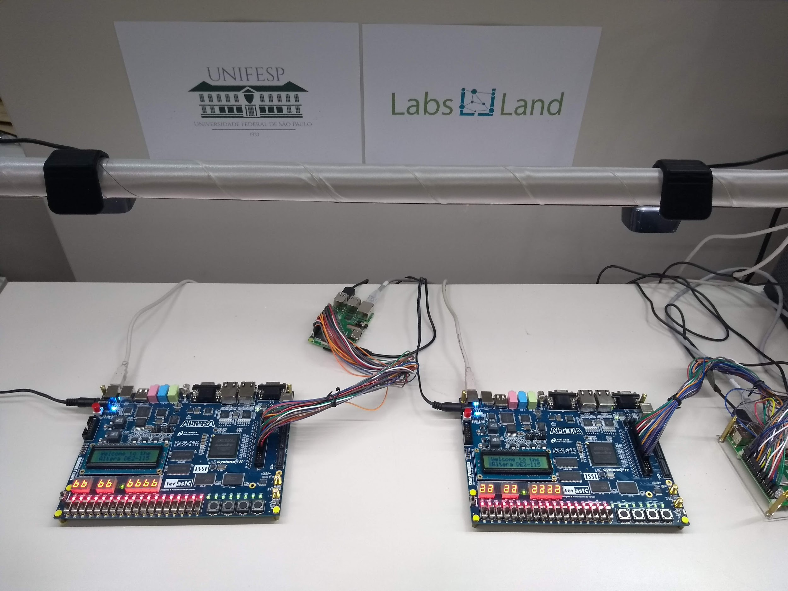
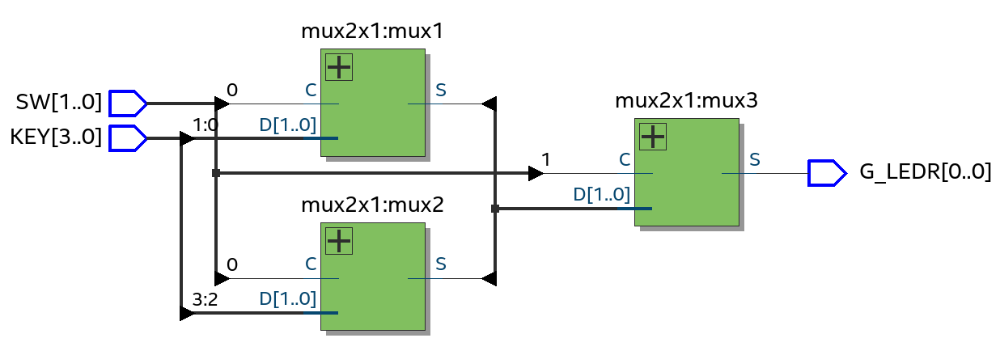
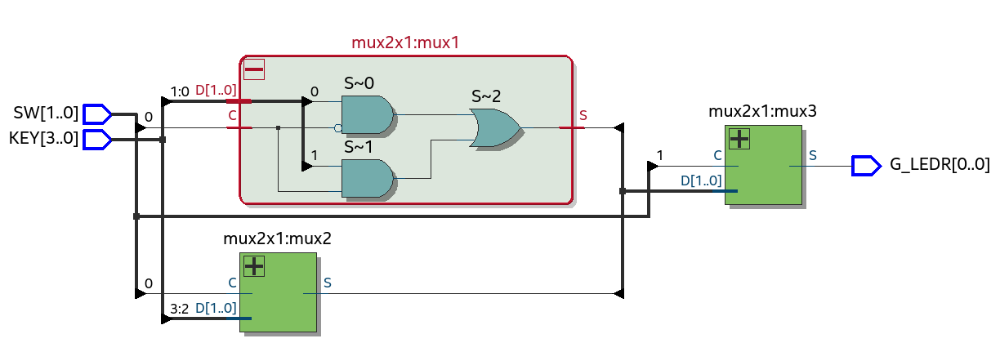
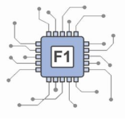
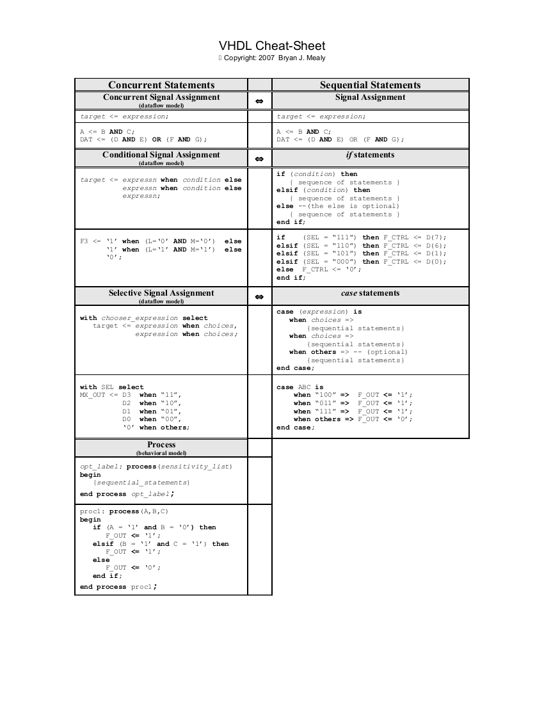

[.doc]
Introducción al Lenguaje VHDL y al Laboratorio Remoto de Sistemas FPGA 
======================================================================
:stem: latexmath 
:doctype: book
:doctitle: Introducción al Lenguaje VHDL y al Laboratorio Remoto de Sistemas FPGA 
:Author:          Cándido Aramburu
:Email:           candido@unavarra.es
:Author Initials: C.
:Revision:	  0.6.0
:Key words:	  computer, architecture
:revdate: {localdate}
:toc:
:toclevels: 3
:numbered:
:stylesdir: styles
:stylesheet: my-asciidoctor.css
:linkcss:
:imagesdir: images
:lang: es
:encode: ISO-8859-1
:ascii-ids:
:show-link-uri:
:icons: font
//:source-highlighter: rouge
:asciidoctor-fetch-kroki:
:source-highlighter: highlight.js
:highlightjs-languages: vhdl
:source-language: vhdl 
:docinfo: shared-footer
 

:experimental:
:ruta-apuntes: home/candido/Dropbox/apuntes

include::/{ruta-apuntes}/include_apuntes.txt[]

'{author} <{email}>'

Agradecimientos
---------------

El *Laboratorio Remoto de Sistemas FPGA* ha sido posible gracias a la colaboración de la Universidad Pública de Navarra, el Instituto Tecnológico de la Universidad Federa de Sao Paulo, a la empresa LabsLand y a la empresa Intel.

[.text-center]

[.text-center]
image::Unifesp_completa_policromia_RGB.png[width=50%,height="10%",align="center"]

[.text-center]
// image:/{ruta-apuntes}/apuntes_weblabupna/conferencia_REV20/presentation/images/logo/LabsLand_logo.png[width=50%,height="10%"]
image::panel_upna.png[width=50%,height="15%",align="center"]

[.text-center]

[.text-center]
image::intel_fpga_logo.png[width=50%,height="60%",align="center"]

////
image:/home/candido/Dropbox/tutoriales/inkscape/logos/quartus-logo-png-transparent.png[height="5%"]
image:/home/candido/Dropbox/tutoriales/inkscape/logos/terasic-logo.jpg[height="10%"]
////  

<<<<

Introducción
------------

* Estos apuntes sirven para iniciarse en el diseño y fabricación de circuitos electrónicos digitales mediante la descripción de los circuitos en el lenguaje de descripción del Hardware VHDL (Very high-speed integrated circuit Hardware Description) y mediante la síntesis del código fuente con la herramienta de diseño electrónico digital Quartus Prime Lite de Intel". La síntesis del código fuente compilado se utiliza para programar los <<KitDe1soc,dispositivos FPGA de Intel>> disponibles tanto remotamente como localmente en los laboratorios de la UPNA.

[[ref_apuntes_VHDL]]
VHDL: Lenguaje para la Descripción de Hardware (Circuitos Digitales)
--------------------------------------------------------------------

Documentación
~~~~~~~~~~~~~

* En miaulario está disponible en la carpeta 'Recursos/apuntes/VHDL/':
** './documentación/': <<ref_low_carb, The Low-Carb VHDL Tutorial>> ©Copyright: 2004 by Bryan Mealy (08-27-2004) 
** './documentación/': <<ref_sheet_min, Hoja de Referencia con sentencias secuenciales y recurrentes BASICAS>> : VHDL Cheat-Sheet, Copyright: 2007 Bryan J. Mealy
** './2020': Ejemplos de código VHDL del año 2020
** './2021': Ejemplos de código VHDL del año 2021
** './2022': Ejemplos de código VHDL del año 2022

[[Quartus]]
Herramienta Quartus
-------------------

[[QuartusInstall]]
Instalación del software: SUITE Quartus Prime Lite
~~~~~~~~~~~~~~~~~~~~~~~~~~~~~~~~~~~~~~~~~~~~~~~~~~

En el PC personal
^^^^^^^^^^^^^^^^^
* Sistema Operativo Windows 10 (año 2021) nativo o sobre una máquina virtual.
* Herramienta EDA de Intel: Quartus Prime Lite 22.1 correspondiente al año 2022. Cada año se publica una versión nueva. La versión de Quartus Prime Lite instalada en el laboratorio de la UPNA es la "20.1.0.711"
* El instalador se puede descargar desde distintos enlaces:
** Repositorio de Intel:
+

----
 Google Search: Intel Download Center for FPGAs Quartus Prime 
 https://www.intel.com/content/www/us/en/programmable/downloads/download-center.html -> Intel® Quartus® Prime Lite Edition Design Software Version 22.1 for Windows
 
 Es necesario *registrarse*
 Se puede descargar todo la SUITE o ficheros individuales (Quartus Prime Lite, Devices Cyclone V, Questa Intel ) :
 Ir a Web Download Center-> elegir la versión 20.1 ó 21.1 ó 22.1 -> Lite -> Windows -> Ficheros individuales: 

    QuartusLiteSetup-20.1.0.711-windows.exe
    QuestaSetup-20.1.0.711-windows.exe
    cyclonev-20.1.0.711.qdz

---- 
** UPNA ->  Miaulario: Herramientas -> SOFTWARE QÚARTUS -> instrucciones de cómo realizar la instalación
** UPNA ->  Miaulario: Recursos/Prácticas/Software Quartus/instrucciones de cómo realizar la instalación
** Una vez descargados los *3 ficheros* en el ordenador personal proceder al proceso de instalación:
+

----
Tanto QuartusLiteSetup como QuestaSetup son ficheros ejectutables de instalación: Instalar Quartus y Questa ejecutando el Setup.

Instalar el software asociado al dispositivo FPGA de la familia Cyclone V después de haber instalado Quartus Lite: El fichero qdz ha de instalarse utilizando la aplicación de instalación "Device Installer" que se encuentra en: Windows 10 -> Programas de Aplicación -> Intel Fpga Quartus -> Device Installer
----

Mac OS X
^^^^^^^^

* Virtual Box : Quartus no está disponible para las computadoras Mac por lo que es necesario instalarse una máquina virtual como 'VirtualBox' y en la máquina virtual instalarse Windows 10 y posteriormente Quartus.
** Descarga e instalación
*** https://www.oracle.com/virtualization/technologies/vm/downloads/virtualbox-downloads.html[Descargas]: para cualquier plataforma
*** https://docs.oracle.com/cd/E26217_01/E26796/html/qs-create-vm.html[Instalación de VirtualBox]
*** https://www.virtualbox.org/manual/ch01.html#idm374[Manual de VirtualBox]
* Windows 10:
** https://www.microsoft.com/en-us/software-download/windows10ISO[Windows 10]: Imagen ISO del instalador.
** https://developer.microsoft.com/en-us/windows/downloads/virtual-machines/[VirtualBox + Windows + App] : 20GB
** Para instalar Windows : https://docs.oracle.com/cd/E26217_01/E26796/html/qs-create-vm.html : Since you want to install an operating system in the virtual machine, you need to make sure the virtual machine can access the installation media. To do this, you edit the virtual machine settings. In Oracle VM VirtualBox Manager, select the virtual machine and then in the toolbar click the Settings button. The Settings window is displayed. In the navigation on the left, select Storage as shown in Figure 6.9.
* Compartir Carpeta entre la máquina virtual Windows y la máquina física Mac

[[QRemote]]
Quartus Prime Preinstalado en el Escritorio Virtual UPNA
~~~~~~~~~~~~~~~~~~~~~~~~~~~~~~~~~~~~~~~~~~~~~~~~~~~~~~~~

* Se puede ejecutar Quartus Prime Lite en modo remoto conectándose desde el navegador al Escritorio Virtual de la Upna
* Quartus Accesible Remotamente: Aulario Virtual, UDS Connection -> UDS web: https://vdibroker.unavarra.es/uds/page/services[Upna Escritorio Virtual] -> Descargar e Instalar *UDS cliente en Windows*. 
** UDS web:  Click Menú en  Windows 10 Teleco.-> Conexiones: desde PC Upna o desde un PC personal. 

CAUTION: Desde un PC personal para conectarse al servidor hacer click en la hamburguesa del icono Windows 10

** Windows 10 -> Programas -> Intel -> Quartus Prime Lite 21.1 ( de las 7 aplicaciones del entorno Quartus, click en Quartus Prime (quartus)
* Para transferir ficheros entre la ventan del ordenador servidor y la ventan del ordenador personal local no  hay más que arrastrar entre los exploradores de archivos o copiar/pegar entre los exploradores de archivos.

Crear un Proyecto Quartus con un diseño mínimo mediante VHDL
------------------------------------------------------------

[[QWork]]
Crear una Carpeta de Trabajo
~~~~~~~~~~~~~~~~~~~~~~~~~~~~
Carpeta de Trabajo
^^^^^^^^^^^^^^^^^^

* Antes de crear el proyecto es necesario tener una carpeta de trabajo donde guardar todos los ficheros del proyecto.
* Windows 10
* Files Explorer -> Por ej: ir a la carpeta Descargas
* Crear una subcarpeta con el nombre del proyecto: Pej ssdd\light_bit

CAUTION: En el escritorio virtual de la Upna al utilizar el programa Quartus no utilizar la carpeta de Descargas como ubicación del proyecto de diseño. Si se utiliza la carpeta Descargas es necesario utilizar un SUBDIRECTORIO como por ejemplo "Descargas\ssdd\light_bit"

[[QOpen]]
Cómo Abrir Quartus Prime Lite
~~~~~~~~~~~~~~~~~~~~~~~~~~~~~

Abrir la Aplicación de Quartus Prime Lite
^^^^^^^^^^^^^^^^^^^^^^^^^^^^^^^^^^^^^^^^^

* Windows 10
* Aplications Explorer
** Intel FPGA 21.1 Lite Edition -> Quartus Prime Lite

[[QProject]]
Crear un Proyecto
~~~~~~~~~~~~~~~~~

Proyecto Vacío
^^^^^^^^^^^^^^

* File -> Project Wizard
* Project Location: Ir a la carpeta de trabajo creada previamente -> Pej light_bit
* Project Name: light_bit
* Top File: light_bit

CAUTION: En el escritorio virtual de la Upna al utilizar el programa Quartus no utilizar la carpeta de Descargas como ubicación del proyecto de diseño. Si se utiliza la carpeta Descargas es necesario utilizar un SUBDIRECTORIO como por ejemplo "Descargas\ssdd\light_bit"

Proyecto a partir de un fichero vhd
^^^^^^^^^^^^^^^^^^^^^^^^^^^^^^^^^^^

* Abrir el fichero con Quartus  : light_bit.vhd
* Save As-> Create new project with this file
** Project name: light_bit
** Top level entity: light_bit
** File design: light_bit.vhd
** BOARD: DE1 SoC
** EDA simulation tool: Intel Questa (herramienta externa a Quartus como alternativa para la simulación)
** Finish
* Si queremos realizar algún cambio en la Configuración:
** *Assignments* -> *Settings*
*** General -> *Top level entity*: Selecciono el diseño que será la raíz en la jerarquía de múltiples diseños anidados
*** File -> Selecciono los múltiples ficheros de unidades de diseño que forman el proyecto. Se puede añadir o eliminar del proyecto. 

[[QConfiguration]]
Configurar 
~~~~~~~~~~

* Configurar la herramienta de simulación
** *Assigments* -> *Settings* -> *EDA Tool Settings* -> *Simulation*: Questa Intel FPGA
** *Tools* -> *Options* -> General -> *EDA Tool Options* -> EDA Tool: Questa Intel FPGA : carpeta donde se localiza el simulador Questa: C:/intelFPGA_lite/21.1/questa_fse/win64/questasim.exe

[[QEdition]]
Editar un fichero VHDL
~~~~~~~~~~~~~~~~~~~~~~

Operación básica
^^^^^^^^^^^^^^^^
* Abrir Quartus Prime Lite
* File -> New -> VHDL File
* Barra de herramientas del editor VHDL
** En el Area de Edición -> Barra de Herramientas de Edición Click Dcha -> Customize -> Toobars:Feedback -> Customize -> Seleccionar *Autocomplet Text* -> mover a la dcha con el bóton ">" ->  OK : El nuevo botón Autocomplet Text debe de aparecer en la barra de herramientas.
** Seleccionar el botón *Autocomplet Text*
* Editar el fichero 'light_bit.vhd': Descripción del circuito minimalista *z=x* : El objetivo de este código es ser lo suficientemente simple para no dificultar su comprensión y centrarse en poner a punto la herramienta de desarrollo *Intel Quartus Prime Lite* desde cualquier computadora utilizando los recursos remotos de la UPNA.
+

[source,vhdl]
----
entity light_bit is
  port (
    x   : in bit;
    z   : out bit
);
end entity;
architecture minima of light_bit is
begin
  z <= x;
end minima;
----

** según vamos tecleando sentencias VHDL se *autocompletan* 
** Observar los botones de la barra de herramientas colocando encima el cursor
*** botón ANALISIS : Analiza la sintaxis del código VHDL informando de los errores.
* Un proyecto nuevo equivale a una carpeta de trabajo nueva
* La carpeta de trabajo no puede ser una carpeta cualquiera. Ha de ser una carpeta de USUARIO, no de aplicaciones o del sistema.
* El nombre del proyecto ha de ser el mismo que el del fichero vhdl top
* El nombre del fichero vhdl ha de ser el mismo que el de la entidad

CAUTION: El nombre de la entidad ha de ser el MISMO que el nombe del fichero vhd.

Insertar Plantillas de Sentencias VHDL
^^^^^^^^^^^^^^^^^^^^^^^^^^^^^^^^^^^^^^

* El editor VHDL de Quartus permite insertar plantillas de bloques de sentencias VHDL, facilitando no tener que memorizarlas
* Desde el área de edición -> botón "insert template" ó ir a  Edit -> Insert Template 
** VHDL -> Constructs -> Entity
** sentencia Selected Signal Assignment : *with* : VHDL -> Constructs -> Concurrent Statement -> Selected Signal Assignment 
** sentencia *case* : VHDL -> Constructs -> Sequence Statement -> case
* Las plantillas sirven como recordatorio de las sintaxis de las sentencias VHDL y también como ayuda de edición.

[[QAnalysis]]
Análisis
~~~~~~~~

* *Processing -> Analyzing Current File* ó en la ventana de Edición uno de los botones de la barra de herramientas.
* Analiza la sintaxis del código VHDL y en caso de encontrar errores proporciona información sobre la línea donde se produce el error y posibles causas.

[[QCompilation]]
Compilación
~~~~~~~~~~~

* *Processing -> Start Compilation*
* La compilación se compone de las fases:
** Analysis: analiza la sintaxis del código fuente
** Synthesis: interpreta el código y obtiene el circuito digital (netlist) como combinación de componentes lógicos
*** El netlist es utilizado por las herramientas de Simulación.
** Fitter: 
*** Place: selecciona qué recursos lógicos del chip FPGA van a ser utilizados
*** Route: selecciona qué pistas del chip FPGA van a interconectar los recursos lógicos seleccionados.
** Assembler: vuelca en el fichero de extensión SOF el código binario de la "programación" del chip FPGA.
* La compilación puede tardar un par de minutos y durante la operación se puede ver en tiempo real sus distintas fases
** *View* -> *Utility Windows* -> *Tasks*

Archivos del Proyecto
~~~~~~~~~~~~~~~~~~~~~

* *View* -> *Utility Windows* -> Panel Project Navigator
** Navegar entre ... Hierarchy - Files - Unit Designs
* Según se van realizando operaciones con la herramienta Quartus van apareciendo nuevos ficheros como parte del Proyecto.

[[QSimulation]]
Simulación
~~~~~~~~~~

* *Tools -> Run Simulation Tool -> RTL Simulation*
* Lanza el simulador seleccionado en la configuración (<<QConfiguration>>) de Quartus Prime Lite.
* Permite simular el comportamiento del circuito digital y al especificar las señales binarias de entrada obtiene las señales declaradas en la descripción del circuito.

[[QArchive]]
Archivar el Proyecto
~~~~~~~~~~~~~~~~~~~~

* *Project* -> *Archive Project*
* El proyecto puede ser archivado para guardar el proyecto y poder llevarlo a otras computadoras.para continuar con el diseño. 

[[QRestore]]
Restaurar el Proyecto
~~~~~~~~~~~~~~~~~~~~~

* *Project* -> *Restore Archived Project*
* El proyecto previamente archivado puede ser restaurado en cualquier computadora que tenga instalado Quartu Prime Lite.

 
Tutorial light de Quartus Prime Lite
------------------------------------

Introducción
~~~~~~~~~~~~

* Se va a utilizar el tutorial propio de Quartus como referencia para la práctica de la descripción VHDL como la utilización de "Quartus Prime Lite" y el "Laboratorio Remoto".
** Quartus Prime Lite -> Help -> PDF tutorial -> Users VHDL-> "tutorial_quartusii_intro_vhdl.pdf" -> imprimirlo y tomar notas sobre él mismo.

IMPORTANT: Imprimirlo y LEERLO!!

* Se van a realizar los siguientes diseños basados todos en el mismo circuito digital. La descripción del circuito se realizará mediante el lenguaje VHDL y se utilizará "Quartus Prime Lite" al igual que en el tutorial de intel "tutorial_quartusii_intro_vhdl.pdf". La principal diferencia entre los distintos diseños será la arquitectura, donde se emplearán diferentes sentencias del lenguaje VHDL. +

. light_bit
. light_de1soc
. light_signal
. light_csa
. light_if
. light_with
. light_case
. light_sum

Ejercicio PRELIMINAR antes de empezar este Tutorial
~~~~~~~~~~~~~~~~~~~~~~~~~~~~~~~~~~~~~~~~~~~~~~~~~~~

. En este tutorial no es necesario instalar ningún tipo de software en el PC portátil.
. link:https://vdibroker.unavarra.es[VDI]: Acceder al Escritorio Virtual de la Upna:
. <<QWork, Crear una carpeta de trabajo>>
. <<QOpen, Abrir Quartus>>
. <<QProject, Crear Proyecto>>
. <<QConfiguration,Configurar Quartus>>
. <<QEdition, Editar Diseño minimalista con VHDL>>
. <<QAnalysis,Análisis del código fuente VHDL>>
. <<QCompilation, Compilación y Síntesis>>
. <<QSimulation,Simulación>>
. <<QArchive,Archivar el Proyecto>>
. <<QRestore,Restaurar el Proyecto>>

Carpeta de Trabajo
~~~~~~~~~~~~~~~~~~

* En el disco del PC es necesario crear manualmente el árbol de carpetas y subcarpetas donde se guardará cada proyecto de diseño realizado:
+

[ditaa]
----
..Descargas/ssdd/
	├── light_bit
	├── light_de1soc
        ├── light_csa
        ├── light_process
	├── light_if
	├── light_signal
	├── light_with
	├── light_case
	├── etc ...
----

Ayuda rápida
------------

* Es de gran ayuda disponer de una hoja de referencia con las principales sentencias del lenguaje VHDL como en el <<ref_sheet_min, Apéndice VHDL Sheet>> 

VHDL: Conceptos teóricos básicos
--------------------------------

Introducción
~~~~~~~~~~~~

* Los circuitos digitales se pueden describir de las siguientes formas:
** Lenguaje natural hablador por los humanos: fácil de entender pero díficil para describir con precisión.
** Descripción gráfica: Esquema eléctrico formado por los dispositivos (fuentes de alimentación, puertas lógicas, multiplexores, decodificadores, procesadores, memorias, ...) que componen el circuito digital y sus interconexiones mediante cables, hilos, pistas, buses, etc ..
** Descripción mediante un lenguaje de sentencias en modo texto: Hardware Description Language (*HDL*). Dos lenguajes básicos: *VHDL* ( Very high speed integrated circuits Hardware Description Language) y Verilog
*** Su cometido principal es ser un lenguaje para la descripción del hardware de un sistema digital y también para programar las señales de prueba con que verificar el funcionamiento del sistema digital mediante su simulación utilizando conceptos clásicos de programación como  variables, módulos, sentencias condicionales, bucles, sentencias de selección, etc
*** Estos lenguages tienen como objetivo emular el comportamiento de los circuitos:
**** la relación entre la salida y la entrada del circuito se denomina *arquitectura*: Hay 3 tipos de  arquitectura: *RTL*, *Behavioral* y *Structural*.
**** Arquitectura a nivel *funcional* (describir la relación entre la salida y la entrada del circuito mediante la función del circuito, ej describir literalmente la *tabla de la verdad* de un circuito). Los nombres behavioral y comportamental equivalen a funcional
**** Arquitectura a nivel de *flujo de datos* o también denominada lógica de transferencia entre registros ( Register Transfer Logic *RTL*, la salida del sistema se relaciona con la entrada mediante una *función matemática lógica* -> F(x,y,z)=xy+xz)
**** Arquitectura a nivel *estructural* ( la relación entre la salida y la entrada es la *conexión* entre distintas unidades lógicas, pej salida del sistema digital = salida de un "multiplexor" cuya entrada está conectada a la salida de un "decodificador" cuya entrada está conectada a la salida de un puerta "OR" cuya entrada es la entrada del sistema digital)

<<<<

Señales digitales binarias
~~~~~~~~~~~~~~~~~~~~~~~~~~

* Hay dos *tipos de señales* en el lenguaje VHDL:
** [.naranja]#PORT# : x,y,z
*** son señales de acceso al circuito: su *modo* puede ser de entrada ([.naranja]#IN#) ó de salida ([.naranja]#OUT#)
*** una señal de entrada tipo [.naranja]#IN# no puede conectarse a la salida de una puerta lógica
*** una señal de salida tipo [.naranja]#OUT# no puede conectarse a la entrada de una puerta lógica
** [.naranja]#SIGNAL# : s,t,u,v
*** son señales internas al circuito y son bidireccionales: pueden conectarse tanto a la entrada como a la salida de una puerta lógica

Señales VHDL : tipos de datos
~~~~~~~~~~~~~~~~~~~~~~~~~~~~~

* Las señales electrónicas representan  DATOS.
* Hay diferentes *tipos de datos* para las señales.
* tipo de dato bit único : [naranja]#BIT# : admite únicamente dos valores: el *'* 0 *'* y el *'* 1 *'* 
* en VHDL los valores de los bits hay que entrecomillarlos para diferenciarlos de los datos de tipo [naranja]#INTEGER#
* tipo de dato secuencia de bits: *"* 010001010101 *"* -> doble entrecomillado si el dato se representa con más de un bit.

<<<<

Señal Digital Binaria tipo BIT
~~~~~~~~~~~~~~~~~~~~~~~~~~~~~~

* El paquete "standard" de la librería "std" incorporado en el propio lenguaje VHDL, define un tipo de señal *bit* que únicamente admite 2 valores lógicos: el "0" y el "1",que se corresponden con los valores lógicos del algebra de Boole. Físicamente una señal electrónica es una magnitud como la tensión o la corriente. El valor lógico abstracto 0 se puede corresponder con un nivel de tensión como los cero voltios y el valor lógico abstracto 1 con el nivel de tensión 5 voltios, es decir, con el par (0v,5v) ó también podría ser con el par (-5v,5v) ó cualquier otro par de niveles. Con la corriente ocurre lo mismo el par abstracto (0,1) se corresponde con cualquier par de niveles (0mA,10mA) ó (-3mA,3mA) ó ... etc.
* En los circuitos electrónicos digitales las señales físicas "idealmente" tienen únicamente un par de valores en tensión o corriente, pero ocurre que una señal puede *distorsionarse* o se le puede sumar una señal de *ruido* externo, por ejemplo en la transmisión a través de una línea de comunicaciones o una pista de un circuito impreso, por lo que sería imposible mantener dos niveles de tensión o corriente. Para que los circuitos digitales sean operativos es necesario asociar a cada valor abstracto "0" ó "1" un rango de valores. Por ejemplo, al "0" un rango entre cero voltios y 100mv y al "1" un rango de valores entre 800mv y 1 voltio, cuyos niveles y umbrales permitidos se representa a continuación.
+

[ditaa]
----
_____________________  5 voltios

	1  
_____________________ 0,8 voltios

	X  
_____________________ 0,1 voltios

	0  
_____________________ 0 voltios

----
** X: Un nivel de tensión entre 100mv y 800mv quedaría indeterminado y no podría asociarse ni al bit "0" ni al bit "1".

<<<<

Buses
~~~~~

* Físicamente un Bus es un conjunto de pistas metálicas que sirven para transportar señales conectandos dos unidades
* Por ejemplo el "bus de direcciones" de 32 hilos ó pistas de la memoria RAM sirve para seleccionar una dirección de 32 bits de la memoria. La dirección *01100110011001100110011001100110* se transporta desde la CPU hasta la memoria RAM a través de un bus de 32 pistas. Al bus de direcciones de memoria (address bus) se le podría llamar *A* y a cada hilo del bus *asciimath:[A_31]*,*asciimath:[A_30]*,...,*asciimath:[A_1]*,*asciimath:[A_0]*.
* Desde el punto de vista lógico un bus es un vector o un array de dimensión "n", por ejemplo n=32.  
* El tipo de datos de los buses *A* y *B* de 32 bits se podrían declarar como:
** [naranja]#signal A,B :bit_vector(31 downto 0);# donde el bit MSB(más a la izquierda) sería el hilo asciimath:[A_31] y el bit LSB(más a la derecha) el bit asciimath:[A_0] y lo mismo con el bus B
** [naranja]#signal A,B :bit_vector(0 to 31);# donde el bit MSB(más a la izquierda) sería el hilo asciimath:[A_0]y el bit LSB(más a la derecha) el bit asciimath:[A_31] y lo mismo con el bus B

<<<<

Circuito light_xor
~~~~~~~~~~~~~~~~~~

Descripciones HW: Esquema eléctrico, Tabla de la Verdad, Expresión Lógica
^^^^^^^^^^^^^^^^^^^^^^^^^^^^^^^^^^^^^^^^^^^^^^^^^^^^^^^^^^^^^^^^^^^^^^^^^

Descripción HW: VHDL
^^^^^^^^^^^^^^^^^^^^

[source,vhdl]
----
--
-- Descripción VHDL Primavera 2023
-- Circuito light_bit.vhd:
-- Puerta lógica XOR extendida
entity light_bit is
  port (
    x,y : in bit;
    z   : out bit
);
end entity;

architecture rtl of light_bit is
 signal s,t,u,v : bit;
begin
  s <= not x;
  t <= not y;
  u <= x and t;
  v <= y and s;
  z <= u or v;
end rtl;
--
----

<<<<

Lenguaje VHDL: Sentencias Concurrentes
~~~~~~~~~~~~~~~~~~~~~~~~~~~~~~~~~~~~~~

Concepto de concurrencia
^^^^^^^^^^^^^^^^^^^^^^^^

* CAS : Concurrent Assignment Sentence
* La instrucción o sentencia CAS se representa mediante el símbolo [naranja]#<=#
* ¿Cómo se ejecuta la sentencia asignación concurrente [naranja]#<=# ?
** A las señales de la derecha del símbolo [naranja]#<=# se les denomina *señales sensibles*
** Cuando una de la señales sensibles cambia (*evento*) es cuando se ejecuta la sentencia asignación.
** El valor resultante de *evaluar* la expresión a la derecha del símbolo [naranja]#<=# se asigna a la señal a la izquierda del símbolo [naranja]#<=#
** se ve mejor el concepto de concurrencia si en la arquitectura hay dos o más sentencias concurrentes.
** concurrencia es sinónimo de simultaneidad 
** El orden de ejecución lo dictan los eventos de las señales sensibles y *NO* por el orden de escritura de la secuencia de sententencias.

[source,vhdl,%linenums]
----
s <= not x;
t <= not y;
u <= x and t;
v <= y and s;
z <= u or v;
----

....
0- "x" = "y" = *0* => s = t = *1* => u = v = *0* => z = *0* 
1- Se produce un EVENTO (*0->1*) en la señal puerto "x" 
2- "x" es una señal sensible en la línea 1 del código 
y en la línea 3 del código 
3- Se ejecutan las líneas 1 y 3 del código 
4- Ejecución de la línea 1: "s" (*1->0*) 
5- Ejecución de la línea 3: "u" (*0->1*) 
6- Hay un evento en "s": se ejecuta la línea 4 : "v" no cambia -> no evento 
7- Hay un evento en "u": se ejecuta la línea 5 : "z" cambia (*0->1*) 
8- La señal z no es una señal sensible en ninguna de las sentencias [naranja]#<=# : FIN 
9- FIN de la actualización de todas las señales hasta el próximo evento en "x" o/y "y" 
....

* Por lo tanto el orden en que se ejecutan las sentencias dentro de la arquitectura NO ES SECUENCIAL. Son los eventos de las señales sensibles los que indican el orden en que se ejecutan las sentencias, pudiendo ocurrir que dos o más sentencias se ejecuten simultáneamente, CONCURRENTEMENTE. Esta concurrencia es necesaria ya que en los circuitos digitales reales formados por puertas lógicas u otro tipo de bloques, dichas puertas y bloques funcionan concurrentemente, pudiendo cambiar la salida de distintas puertas o bloques al mismo tiempo.

Circuito Digital  "light_bit.vhdl"
~~~~~~~~~~~~~~~~~~~~~~~~~~~~~~~~~

* Descripción del circuito *z = x~0~ XOR x~1~* : El objetivo de este código es seguir el tutorial de Intel.
+

[source,vhdl]
----
-- Universidad Pública de Navarra  <1>
-- Sistemas Digitales
-- Primavera 2023

library std; <2>
use std.standard.all;

entity light_bit is  <3>
  port (
    x   : in bit_vector(1 downto 0);
    z   : out bit
);
end entity;

architecture rtl of light_bit is  <4>
 signal s,t,u,v : bit;
begin
 s <= NOT x(0); <5>
 t <= NOT x(1);
 u <= x(0) AND t;
 v <= x(1) AND s;
 z <= u OR v;
end rtl;
----

<<<<

Estructura del Programa: Librería-Entidad-Arquitectura
~~~~~~~~~~~~~~~~~~~~~~~~~~~~~~~~~~~~~~~~~~~~~~~~~~~~~~

El Programa VHDL está estructurado en 4 partes:

* COMENTARIOS
* LIBRERIAS
* ENTIDADES
* ARQUITECTURAS

La secciones más importantes son la *entidad* de un circuito y la *arquitectura* de ese circuito. La entidad del circuito define únicamente las señales de entrada y salida del circuito, señales denomidas puertos. La arquitectura del circuito define la relación entre los puertos de entrada y salida del circuito. +

<1> Comentarios: Añadir Comentarios en la cabecera : informar sobre la funcionalidad del circuito, función de los puertos, etc... Añadir Comentarios en las líneas propensas a errores.

<2> Librería: declara donde se encuentran elementos del lenguaje VHDL como: tipos de señales, subcircuitos digitales, constantes etc. En el apéndice se explica el concepto de bus, vector, std_logic_vector.
<3> Entidad : El circuito digital visto desde fuera: entradas y salidas del circuito conectadas a los switches, botones, leds, etc .. de la tarjeta.
<4> Arquitectura: Define la relación lógica entre las señales de entrada y salida del circuito.
<5> Para la asignación de "señales" se utiliza la sentencia *<=* equivalente al símbolo = en algunos lenguajes de programación. El resultado de la evaluación de la expresión lógica de señales a la derecha de *<=* se asigna a la señal de la izda. La sentencia *<=* se ejecuta en el instante en que alguna de las señales a la derecha de *<=* cambia.

<<<<

Librería standard:  paquete STANDARD
~~~~~~~~~~~~~~~~~~~~~~~~~~~~~~~~~~~~

* light_bit.vhdl:
+

[source,vhdl]
----
-- Sistemas Digitales I año 2022			
-- Laboratorio Remoto de la Upna
-- FICHERO light_bit.vhdl : OBLIGATORIAMENTE debe ser el MISMO nombre que el utilizado en ENTITY.
-- tutorial: primera práctica en aula

-- El tipo de señal "bit" se define en el paquete standard.vhdl

library std;  -- La librería std no es necesario declararla
use std.standard.all; -- Si no se declara la librería std, tampoco el paquete standard

-- Entidad						
entity light_bit is
    port (
      x   : in bit_vector(1 downto 0);
      z   : out bit
    );
end gate_and;

--ARQUITECTURA						
architecture rtl of light_bit is
begin
 s <= NOT x(0);
 t <= NOT x(1);
 u <= x(0) AND t;
 v <= x(1) AND s;
 z <= u OR v;            
end rtl;
----

* No es necesario declarar el paquete "STANDARD" de la librería "std" porque el COMPILADOR dispone de él internamente.
* Los paquetes de las librerías son ficheros VHDL, como por ejemplo el fichero "standard.vhdl". A continuación tenemos una descripción parcial del paquete STANDARD en el fichero "standard.vhdl"
+

----
-- The sven STANDARD package.
-- This design unit contains some special tokens, which are only
-- recognized by the analyzer when it is in special "bootstrap" mode.

package STANDARD is

  -- predefined enumeration types:

  type BIT is ('0', '1');

  -- Unicamente  se pone la definición del tipo de señal BIT para no extender este documento, pero el paquete contiene más definiciones de tipos de señales etc.

end STANDARD;
----

* La librería std y sus paquetes están disponibles en la carpeta donde se ha instalado el simulador Questa Intel
** C:/intelFPGA_lite/21.1/questa_fse/vhdl_src/std/standard.vhdl

<<<<

Tutorial quartus -> light_bit.vhd (I)
-------------------------------------

Diseño
~~~~~~

* Descripción del circuito "light_bit.vhd" mediante la Tabla de la Verdad: función *XOR*
+

[width="40%",cols="2*^s, ^s",options="header"]
|==========================
|x1 |x2 |f=x1 &#8853; x2
|0 |0 |0
|0 |1 |1
|1 |0 |1
|1 |1 |0
|==========================
** Descripción del circuito "light_bit.vhd" mediante una expresión matemática lógica 

latexmath:[f(x_1,x_2)=\overline {x_1} \cdot x_2 + x_1\cdot\overline {x_2}] 

** Descripción del circuito light_bit.vhd mediante un esquema eléctrico o diagrama de bloques
+

image::light_block-diagram.png[Diagrama de Bloques]

CAUTION: En el escritorio virtual de la Upna al utilizar el programa Quartus no utilizar la carpeta de Descargas como ubicación del proyecto de diseño. Si se utiliza la carpeta Descargas es necesario utilizar un SUBDIRECTORIO como por ejemplo "Descargas\ssdd\light_bit"

* CREAR EL PROYECTO "light_bit" de Quartus Prime Lite:
** crear la CARPETA DEL USUARIO (no del sistema ni de las aplicaciones) *Descargas/ssdd/light_bit/* donde se guardará nuestro diseño quartus.
** abrir la herramienta de diseño Quartus Prime Lite
** crear proyecto: File -> New project Wizard (creación y configuración guiada)
*** introduction -> next
*** nombre proyecto: el mismo que el de la ENTIDAD vhdl: light_bit
*** ubicación proyecto:  ../ssdd/light_bit/
*** nombre de la entidad top: light_bit
*** empty project
*** add file -> ninguno
*** board -> DE1-SoC Board
*** simulation -> Questa Intel -> format: vhdl
*** Salvar proyecto 
* EDITAR el fichero vhd: File-> New -> VHDL File -> save as -> nombre: light.vhd : *el mismo* que el de la entidad vhdl: light
** edición vhdl : copiar el código fuente del tutorial PDF "tutorial_quartusii_intro_vhdl.pdf" y pegarlo -> corregir la edición ya que las copias desde un PDF no son literales -> salvar
** Descripción del circuito light mediante el lenguaje VHDL
+

[source,vhdl]
----
-- Sistemas Digitales : Descripción VHDL Curso Primavera 2023
-- Circuito light_bit.vhd: Puerta lógica XOR extendida

entity light_bit is
  port (
    x,y : in bit;
    z   : out bit
);
end entity;

architecture rtl of light_bit is
 signal s,t,u,v : bit;
begin
  s <= not x;
  t <= not y;
  u <= x and t;
  v <= y and s;
  z <= u or v;
end rtl;

----
** añadir el módulo fuente light_bit.vhd al proyecto light_bit.
** Project Navigator -> Hierarchy -> doble click en light_bit.vhd -> se abre el código fuente en el editor
** cerrar quartus
* SINTESIS
** abrir quartus
** abrir el proyecto light_bit.qpf : File -> Open Project -> light_bit.qpf
** síntesis: Processing -> Start Compilation

Errores en el Proceso de Compilación
~~~~~~~~~~~~~~~~~~~~~~~~~~~~~~~~~~~~

* Errores al finalizar la compilación? 
** Ventana de Errores: View -> Utility Windows -> Messages -> Pestaña processing (errores durante el procesado de compilación)
** ir a la ventana Messages y buscar la línea ERROR para identificar el tipo de ERROR.
** corregir el error y  compilar ... repetir la depuración del código hasta que no haya errores de compilación.

Archivar el proyecto para conservarlo
~~~~~~~~~~~~~~~~~~~~~~~~~~~~~~~~~~~~~

* Ir al enlace:
** <<QArchive,Archivar el Proyecto>>
** <<QRestore,Restaurar el Proyecto>>

VHDL: Paquetes std_logic_1164 y textio
--------------------------------------

Paquete Standard Logic (std_logic): std_logic_1164
~~~~~~~~~~~~~~~~~~~~~~~~~~~~~~~~~~~~~~~~~~~~~~~~~~

* El paquete "standard" de la librería "std" incorporado en el propio lenguaje VHDL, define un tipo de señal *bit* que únicamente admite 2 valores lógicos: el "0" y el "1",que se corresponden con los valores lógicos del algebra de Boole. Para definir señales con más valores lógicos que se correspondan con valores físicos reales típicos en los circuitos digitales se desarrolló el paquete *std_logic_1164*
* La librería IEEE desarrollada por la asociación "IEEE Computer Society" ha definido una serie de paquetes standard dentro de los cuales está el paquete std_logic_1164.
* El paquete std_logic_1164 define entre otras cosas tipos de señales digitales entre las que se encuentran los tipos *std_logic* y *std_logic_vector*
* Las señales del tipo *std_logic* pueden tener no solo los valores binarios '0' y '1' como son las de tipo *bit* sino hasta 9 valores diferentes, con el objetivo de emular los valores de las señales electrónicas reales. Los valores posibles de una señal std_logic son:
+

----
-- valores lógicos de las señales std_logic para emular valores físicos reales:
--    '0': logic 0
--    '1': logic 1
--    '-': Don't care.  
--    'X': unknown. Impossible to determine this value/result.
--    'U': uninitialized. This signal hasn't been set yet.
--    'Z': High Impedance
--    'W': Weak signal, can't tell if it should be 0 or 1.
--    'L': Weak signal that should probably go to 0
--    'H': Weak signal that should probably go to 1
----

* Valores  de las señales 0,1,H,L,W,Z,X,-,U
** 6 tipos tienen un valor definido,"mesurable": (Representación de los NIVELES LOGICOS(0,1,desconocido) con sus UMBRALES)
+

[ditaa]
----
_____________________

	1  : forzosamente un 1
_____________________

	H  : débilmente un 1
_____________________   --------------> UMBRAL DEL 1
 
	W  : débilmente desconocido
_____________________

	X  : forzosamente desconocido
_____________________

	W
_____________________   --------------> UMBRAL DEL 0

	L  : débilmente un 0
_____________________

	0  : forzosamente un 0
_____________________

----
** los niveles 0 y 1 se dividen cada uno de ellos en forzoso y débil
** el nivel desconocido se divide en forzoso y débil tirando a 1 o a 0.
** una forma de interpretar esos estados es DIBUJANDO la FORMA una señal digital generada por un transmisor y observada a la salida de una línea serie y a la entrada del receptor: se genera un 1 forzoso y se recibe un 1 débil ó un valor desconocido 

image::tema4_signal_stdlogic.png[]

** 3 Valores son indefinidos, "unmesurable".
+

----

- : don't care  -> puede tomar cualquiera de los valores definidos "mesurables" y no afecta al funcionamiento del circuito.
U : indefinido  -> representa el estado de un circuito secuencial al encenderse y sin estado de reset de reset. Puede ser cualquiera de los 6 valores definidos pero al no tener estado inicial, no puede determinarse su estado.
Z: alta impedancia : circuito abierto -> desconexión -> 
  si pongo el osciloscopio observo que el valor puede ser cualquiera-> se ve ruido
  concepto de driver -> la salida de dos inversores INV-1 e INV-2 conectada a un bus y la entrada de un inversor INV-3 conectada al mismo bus

                          INV-1
                        --|>o---|
                                |   INV-3
                                |---|>o--
                          INV-2 |
                        --|>o---|

   Las salidas de los inversores INV-1 e INV-2 si están en estado Z se desconectan del bus

----

* El paquete *std_logic_1164* está localizado en: C:/intelFPGA_lite/21.1/questa_fse/vhdl_src/ieee/stdlogic.vhdl

std_logic_vector : downto , to
~~~~~~~~~~~~~~~~~~~~~~~~~~~~~~

* El tipo std_logic_vector es un bus o conjunto de señales o matriz o vector formado por señales del tipo std_logic.
* BUS: es un agrupamiento hilos o pistas físicas por donde se transportan (autobus) las señales digitales en tensión o corriente y  que conectan dos dispositivos (origen y destino): Pej el bus de datos de 10 hilos o el bus de los hilos de 10 switches o el bus de los leds, etc. Un bus es necesario para conectar 10 switches con 10 pines de la FPGA.
** Desde el punto de vista de vhdl un bus de 10 hilos es un VECTOR de 10 componentes o 10 bits.
* std_logic_vector SW (9 DOWNTO 0) :
**      es un vector de 10 componentes equivalente a un bus de 10 hilos que hemos bautizado con el nombre de SW
**      SW(5): es el bit de la posición 5.
**      DOWNTO significa el orden descendente de los bits:  SW(9)-SW(8).... SW(1)-SW(0). SW(9) posicionado a la IZDA es el bit más significativo (MSB) y SW(0) posicionado a la DCHA el bit menos significatio (LSB).
* std_logic_vector SW (9 TO 0) :
**      TO significa el orden ascendente de los bits:  SW(0)-SW(1).... SW(8)-SW(9). SW(9) posicionado a la DCHA es el bit menos significativo (LSB) y SW(0) posicionado a la IZDA es el bit más significatio (MSB).

----
library ieee;
use ieee.std_logic_1164.all;

ENTITY light_de1soc IS
PORT(SW : IN std_logic_vector (1 downto 0) ;
     LEDR : OUT std_logic_vector (0 downto 0));
END light_de1soc ;
----

<<<<

Librería standard: paquete TEXTIO 
~~~~~~~~~~~~~~~~~~~~~~~~~~~~~~~~~

* Fichero textio.vhdl donde se define el paquete TEXTIO de la librería "std".
+

[source,vhdl]
----
-- textio.vhdl

library std; use std.standard.all;	-- needed for bootstrap mode

package TEXTIO is

  -- Type Definitions for Text I/O

  type TEXT is file of STRING;	-- a file of variable-length ASCII records
  procedure WRITE (L: inout LINE; VALUE: in BIT;
			JUSTIFIED: in SIDE := RIGHT; FIELD: in WIDTH := 0);

 -- CUIDADO: no están todas las definiciones de tipos, procedimientos, etc
----

* No es necesario declarar el paquete "TEXTIO" de la librería "std", pero se podría declarar de la  forma :
+

[source,vhdl]
----
library std;
use std.textio.all;
----

* Ejemplo de uso del paquete TEXTIO en el módulo fuente "hello_world.vhdl"
+

[source,vhdl]
----

library std;
use std.textio.all;

entity HelloWorld is
end entity;
 
architecture sim of HelloWorld is
begin
 
    process is
    begin
 
        report "Hello World!";
        wait;
 
    end process;
 
end architecture;
----

CAUTION: hello_world.vhd no produce ningún circuito lógicamente, no se sintetiza. Pero la sentencia [.naranja]#report# se puede utilizar para depurar código como en cualquier lenguaje de programación.

* La librería std y sus paquetes están disponibles en la carpeta donde se ha instalado el simulador Questa Intel
** C:/intelFPGA_lite/21.1/questa_fse/vhdl_src/std/textio.vhdl

Tutorial quartus -> light_de1soc.vhd (II) 
-----------------------------------------

Diseño
~~~~~~

* En este ejercicio:
** se va a utilizar el tipo de señal *std_logic* y *std_logic_vector*
** se va a fabricar el circuito digital en la *FPGA Cyclone V* de la tarjeta *DE1-SoC* accesible de forma remota.
* Se va a crear el nuevo proyecto light_de1soc con un nuevo módulo fuente  light_de1soc.vhd 
** crear la carpeta nueva ../ssdd/light_de1soc.
** copiar en la carpeta ../ssdd/light_de1soc el módulo fuente ../ssdd/light_bit/light_bit.vhd y cambiar el nombre del fichero por light_de1soc.vhd 
* Abrir Quartus Prime Lite.
** File -> Open -> ssdd/light_de1soc/light_de1soc.vhd
+

----
Cambiar los nombres de los puertos para que sean los mismos que los del Kit DE1-SoC
 puertos de entrada: bus de 2 switches con nombre SW 
 puerto  de salida: bus de leds rojos con nombre LEDR 
 puertos de entrada: señal tipo "std_logic_vector (1 download 0)" y el de salida tipo "std_logic_vector (0 download 0)"
 entradas: señales con nombres lógicos  SW(0) y SW(1) asociadas al cableado físico que conecta los switches 0 y 1 del Kit DE1-SoC a la entrada de la FPGA.
 salidas: señal con el nombre lógico LEDR(0) asociado al cableado físico que conecta el led rojo del Kit DE1-SoC a una salida de la FPGA
 arquitectura: relacionar lógicamente la señal digital de salida LEDR(0) con la señales digitales de entrada SW(0), SW(1)
----

** light_de1soc.vhd:
+

[source,vhdl]
----
-- SSDD
-- Intel tutorial reference: light.pdf
-- Entity: ports
--- El puerto lógico SW(0) se conecta al switch 0 de la tarjeta DE1-SoC
--- El puerto lógico SW(1) se conecta al switch 1 de la tarjeta DE1-SoC
--- El puerto lógico LEDR(0) se conecta al led rojo 0 de la tarjeta DE1-SoC
-- Función: el led se enciende sólo si uno de los switches de entrada está activo
-- RTL architecture : signals, logic math expresion between ports :XOR
-- Candido Aramburu

library ieee;
use ieee.std_logic_1164.all;

ENTITY light_de1soc IS
PORT(SW : IN std_logic_vector (1 downto 0) ;
     LEDR : OUT std_logic_vector (0 downto 0));
END light_de1soc ;

ARCHITECTURE LogicFunction OF light_de1soc IS
BEGIN
 LEDR(0) <= (SW(0) AND NOT SW(1)) OR (NOT SW(0) AND SW(1)) ;
END LogicFunction ;
----
** File -> save -> light_de1soc.vhd
* CREAR un nuevo PROYECTO
** File -> New -> Project -> Wizard
*** Introduction -> Next
*** Project Directory: ../ssdd/light_de1soc/
*** Project Name: light_de1soc
*** top-level design entity  name: light_de1soc
*** empty project
*** add file -> ../ssdd/light_de1soc/light_de1soc.vhd
*** board -> DE1-SoC Board
*** simulation -> Questa Intel-> format: vhdl
** Project Navigator -> Hierarchy -> doble click en light_de1soc -> se abre el código fuente en el editor
** Project Navigator -> Hierarchy -> seleccionar fichero light.vhd -> click dcha -> eliminar el fichero light_primer.vhd del proyecto de quartus. No se elimina del disco.
** SINTESIS
*** Processing -> Start Compilation

Fabricación en el laboratorio remoto
~~~~~~~~~~~~~~~~~~~~~~~~~~~~~~~~~~~~

*  Leer la información sobre la interfaz con el laboratorio remoto en el <<LabRemoto, Apéndice: Laboratorio Remoto>>
* Conectarse al laboratorio remoto de FPGAs de la UPNA desde Miaulario.
** UPNA -> Miaulario -> Herramientas -> Laboratorio Remoto
* Una vez abierta la interfaz en el navegador:
** crear el fichero con el código fuente light_de1soc.vhd
+

----
Eliminar todos los archivos del panel de archivos
Crear el archivo vhd nuevo con el nombre light_de1soc

Editar o copiar el código fuente VHDL en área de edición.

En el panel de archivos seleccionar el fichero de diseño TOP de la jerarquía de ficheros: light_de1soc.vhd
----
* SINTESIS
** botón "Síntesis"
** si ha habido errores, ir abajo, al final de los mensajes y buscar el mensaje del ERROR.
* PROGRAMAR la FPGA
** botón "Enviar a la FPGA"
* VERIFICAR EL DISEÑO
** utilizar los switches y botones  virtuales para verificar el circuito digital fabricado en la fpga observando los leds y displays del KIT DE1-SoC.

Ejercicios
~~~~~~~~~~

* ¿ Qué señales son sensibles a que se ejecute la sentencia de asignación concurrente ?

Tutorial quartus -> light_signal.vhd (III)
------------------------------------------

Diseño
~~~~~~

* En este ejercicio se va a:
** visualizar el esquema eléctrico resultante de la síntesis del circuito.
* A partir del proyecto light_de1soc creamos el proyecto light_signal
** crear la carpeta light_signal
** copiar el módulo fuente light_de1soc.vhd en la carpeta ../ssdd/light_signal/
** cambiar el nombre del fichero light_de1soc.vhd por light_signal.vhd

* Abrir Quartus Prime Lite.
** File -> open -> VHDL -> light_signal.vhd
** Código fuente: light_signal.vhd
+

[source,vhdl]
----
-- SSDD
-- Intel tutorial reference: light
-- RTL architecture : logic math expresion
-- concurrent sentence : <=
-- Candido Aramburu

library ieee;
use ieee.std_logic_1164.all;

ENTITY light_signal IS
PORT(SW : IN std_logic_vector (1 downto 0) ;
     LEDR : OUT std_logic_vector (0 downto 0));
END light_signal ;

ARCHITECTURE LogicFunction OF light_signal IS
 signal u, v : std_logic ;
BEGIN
 LEDR(0) <= u OR v ;
 u <= SW(0) AND NOT SW(1);
 v <= NOT SW(0) AND SW(1);
END LogicFunction ;
----

** File -> New -> Project -> Wizard
*** Introduction -> Next
*** Project Directory: ../light_signal/
*** Project Name: light_signal
*** top-level design entity  name: light_signal
*** empty project
*** add file -> ../light_signal/light_signal.vhd
*** board -> DE1-SoC Board
*** simulation -> Questa Intel -> format: vhdl
** Project Navigator -> Hierarchy -> doble click en light_de1soc -> se abre el código fuente en el editor

Análisis: Herramienta RTL Viewer
~~~~~~~~~~~~~~~~~~~~~~~~~~~~~~~~

* Utilizar en cualquier proyecto el visor del circuito sintetizado: Quartus ->Tools-> Netlist Viewer -> RTL viewer
** Se visualiza un esquema eléctrico que no es literalmente la descripción del módulo fuente sino una descripción equivalente.
+

image::light_signal.png[]

* interpretar los nombres lógicos del esquema netlist
** interpretar los nombres de las señales internas
** interpretar el símbolo que se utiliza para los puertos (señales externas)
* interpretar el símbolo de un bus de señales.

Ejercicios
~~~~~~~~~~

* ¿ Qué señales son sensibles a que se ejecute cada sentencia de asignación concurrente ?

Tutorial quartus -> light_de1soc.vhd (IV) : Simulación Questa Intel
-------------------------------------------------------------------

Simulación
~~~~~~~~~~
* En este ejercicio se va a:
** simular el procesado de señales que realiza el circuito para la obtención de un cronograma que visualice las señales digitales binarias del circuito y poder verificar así su funcionamiento.
* Simulación del diseño light_de1soc.
** Abrir Quartus
** Abrir el proyecto 'light_de1soc.qpf' ubicado en la carpeta ../ssdd/light_de1soc donde previamente he sintentizado el diseño 'light_de1soc.vhd'
** Configurar simulador Questa
*** Ha de estar instalado el simulador Questa
*** Quartus -> Settings -> Eda Tool Settings -> Simulation-> Tool Name: Questa Intel
*** Quartus -> Tools -> options -> general -> eda tool options -> Questa Intel : seleccionar la carpeta donde esté instalado *questasim* -> C:/intelFPGA_lite/21.1/questa_fse/win64/questasim.exe
** generar los ficheros fuente que utilizará el simulador Questa.
*** Processing -> Start Compilation
** Abrir el simulador Questa Intel
*** Tools -> Run Simulator Tool -> RTL simulation -> Abre una nueva ventana con el simulador Questa Intel
* Questa Intel Simulator:
*** Ventana Transcript -> mensajes del simulador y comandos del usuario. Interpretar lo realizado por el Simulador.
*** Ventana Library (View Library) -> Work -> Doble click en light -> se carga el diseño que se va simular en la ventana Objects
*** Ventana Objects -> seleccionar con el ratón la señal bus SW -> click dcha, *Modify -> Apply Wave* ->   Pattern: counter, start at 00, end at 80 ns, time unit ns,  from 00 to 11, Period: 10ns, counter type binary, Direction: up , Repeat:  Forever ->Se añaden en la ventana Wave las señales seleccionadas
*** Ventana Wave -> click dcha en el area del cronograma de las señales binarias -> Zoom Range: 80ns
*** Ventana Objects -> seleccionar con el ratón las señales de entrada salida LEDR(0) -> Click dcha -> *Add Wave* -> se añade la señal de salida a la ventana Wave.
*** Ventana Wave:  botones de la barra de herramientas -> simular 80 ns, run , restart simulation, run.
**** Verificar que la señal de salida LEDR(0) es la esperada para los diferentes estímulos de entrada SW(0) y SW(1)
*** Ventana Transcript -> mensajes del simulador y comandos del usuario. Interpretar lo realizado por el Simulador.

image::light_de1soc_wave.png[]

Tutorial quartus -> light_csa.vhd (V) 
-------------------------------------

Diseño
~~~~~~

* Proyecto "light_csa"
** El objetivo es describir literalmente la "Tabla de la Verdad" de la función del circuito.
** Utilizamos la *sentencia concurrente* "Conditional Signal Assignment" (csa).
** creo la carpeta ../light_csa
** copio el módulo fuente light_de1soc/light_de1soc.vhd en la carpeta ../light_csa/light_csa.vhd con el nombre light_csa.vhd

* EDITO el módulo fuente ../light_csa/light_csa.vhd
** Abrir Quartus Prime Lite.
** File -> open -> VHDL -> light_csa.vhd
*** Cambiamos el nombre de la entidad -> light_csa
*** Borramos el contenido de la arquitectura.
*** En la arquitectura la asignación a la señal LEDR(0) se edita mediante la herramienta 'Insertar Plantilla' de la barra de herramientas del Editor. 
*** Insert Template -> VHDL -> Constructs -> Concurrent Statements -> Conditional Signal Assignment (CSA)
+

[source,vhdl]
----
library ieee;
use ieee.std_logic_1164.all;

ENTITY light_csa IS
PORT(SW : IN std_logic_vector (1 downto 0) ;
     LEDR : OUT std_logic_vector (0 downto 0));
END light_csa ;
ARCHITECTURE TablaVerdad OF light_csa IS
BEGIN
 <optional_label>: <target> <= 
	<value> when <condition> else
	<value> when <condition> else 
	<value> when <condition> else
	...
	<value>;

END TablaVerdad ;

----
+
* Una vez insertada la plantilla la particularizo con las señales de mi diseño:
+

[source,vhdl]
----
library ieee;
use ieee.std_logic_1164.all;

ENTITY light_csa IS
PORT(SW : IN std_logic_vector (1 downto 0) ;
     LEDR : OUT std_logic_vector (0 downto 0));
END light_csa ;

ARCHITECTURE TablaVerdad OF light_csa IS
BEGIN
 LEDR(0) <= 
	'1' when SW(0)='0' AND SW(1)='1' else
	'1' when SW(0)='1' AND SW(1)='0' else
	'0'; -- CASO DEFAULT :  NO es obligatorio

END TablaVerdad ;
----
* CREO el proyecto light_csa y le añado el fichero light_csa.vhd
* SINTETIZO : Processing -> start compilation

Análisis
~~~~~~~~

* VISUALIZACION: Tools-> Netlist Viewer -> RTL viewer
+

image::light_csa.png[]

** interpretar los nombres lógicos: 

 LEDR~0, LEDR~1, LEDR~2

** son los nombres de las señales a la salida de las tres puertas. Son señales internas del circuito que ha sido definidas por el propia aplicación Quartus.
** 1h1 -> el primer dígito es el número bits y el último digito es el valor en hexadecimal 
** observamos que en el diagrama eléctrico utiliza un "multiplexor" digital. El esquema eléctrico es una descripción mediante componentes básicos digitales interconectados a diferencia de la descripción mediante la Tabla de la Verdad en el código VHDL.
*** La tabla de la verdad es una descripción funcional 
*** Las puertas lógicas y otros bloques digitales interconectados es una descrición RTL (Register Transfer Level).

Ejercicios
~~~~~~~~~~
* ¿ Qué señales son sensibles a que se ejecute la sentencia de asignación condicional CAS ?
* ¿ Qué ocurre si eliminamos el caso default? ¿Hay error de compilación? ¿Cómo ha cambiado el circuito netlist?¿Por qué?

Sentencias Secuenciales
-----------------------

Proceso/Process()
~~~~~~~~~~~~~~~~~

* Un proceso es un bloque de sentencias secuenciales, es decir, ejecutar un proceso significa ejecutar *todas* las sentencias de su cuerpo de forma secuencial empezando por la primera y siguiendo el orden hasta ejecutar la última sentencia del cuerpo.
* Unicamente las sentencias definidas como sentencias secuenciales pueden formar parte del cuerpo del proceso.
* ¿Cuando se ejecuta un proceso?
* Un proceso se ejecuta cuando hay un evento en una de las señales sensibles al proceso. Las señales sensibles al proceso se declaran entre paréntesis junto a la sentencia *PROCESS(sensivity signals)*. Por lo tanto la sentencia process es una sentencias *concurrente* y las sentencias de su cuerpo son *secuenciales*.
+

[source,vhdl]
----
<optional_label>:  process(sensivity signals) is
        { Declaration(s) }
        begin
        { Sequential Statement(s) }       
        end process;
----

Tutorial quartus -> light_process.vhd (VI)
------------------------------------------

* Arquitectura mediante la sentencia concurrente [.naranja]#process3
** En el cuerpo del proceso se utilizarán la sentencia de asignación secuencial [.naranja]#<=#.

[source,vhdl]
----
--
-- Descripción VHDL Primavera 2023
-- Circuito light_bit.vhd:
-- Puerta lógica XOR extendida
entity light_bit is
  port (
    SW : in std_logic_vector(1 downto 0);
    LEDR   : out std_logic_vector(0 downto 0)
);
end entity;

architecture rtl of light_bit is
 signal s,t,u,v : bit;
begin
  process (SW)
  begin
  s <= not SW(0);
  t <= not SW(1);
  u <= SW(0) and t;
  v <= SW(1) and s;
  LEDR(0) <= u or v;
  end process;
end rtl;
--
----

* Verificar el buen funcionamiento del circuito mediante la simulación o/y en el laboratorio remoto.
* La lista de señales sensibles para la ejecución del proceso es el bus SW
* Un evento en alguna de las señales SW(0) o SW(1), provoca la ejecución de todas las sentencias del cuerpo del process de forma secuencial.

* Cambiar el código VHDL cambiando el orden de las sentencias [.naranja]#=># y observar si hay algún cambio en la síntesis del circuito.

<<<

Tutorial quartus -> light_if.vhd (VII)
--------------------------------------

Diseño
~~~~~~

* Diseño "light_if"
** El objetivo es describir literalmente la "Tabla de la Verdad" de la función del circuito.
** Utilizamos la sentencia secuencial "if elseif else endif" .
** creo la carpeta ../light_if
** EDITO el módulo fuente ../light_if/light_if.vhd
*** En la arquitectura la asignación a la señal LEDR(0) se edita mediante la herramienta 'Insertar Plantilla' de la barra de herramientas del Editor.  
*** Insert Template -> VHDL -> Constructs -> Concurrent Statements -> PROCESS
+

[source,vhdl]
----
<optional_label>:
	process(reset, clk) is 
		-- Declaration(s) 
	begin 
		if(reset = '1') then
			-- Asynchronous Sequential Statement(s) ->  SOLO sentencias SECUENCIALES !!
		elsif(rising_edge(clk)) then
			-- Synchronous Sequential Statement(s) -> SOLO sentencias SECUENCIALES !!
		end if;
	end process; 
----
** La plantilla ha insertado dos sentencias: 
*** la sentencia concurrente PROCESS
*** la sentencia secuencial IF-ELSEIF-ELSE-END IF
** Particularizo las dos sentencias con las señales de mi diseño.
+

[source,vhdl]
----
	-- El proceso se ejecuta SI hay alguna variacion en las señales ARGUMENTO ( señales SENSIBLES del proceso) 
	process(SW) is 
		-- Declaration(s) 
	begin 
		if(SW(0) == SW(1)) then
			LEDR(0) <= '0';
		else 
			LEDR(0) <= '1';
		end if;
	end process; 
----

** Insert Template -> VHDL -> Constructs -> Sequential Statements -> if
*** NO es necesario volver a insertar la sentencia IF dentro del PROCESS.
+

[source,vhdl]
----
if <expression> then
	-- Sequential Statement(s)
elsif <expression> then
	-- Sequential Statement(s)
else  
	-- Sequential Statement(s);
end if;
----

IMPORTANT: "else" permite añadir TODOS los casos posibles que no han sido definidos previamente en las líneas "elsif" o/y "if"

* light_if.vhd:
+

[source,vhdl]
----
-- SSDDI-2022
-- Intel tutorial reference: light.pdf
-- Diseño: Si uno de los switches SW(0) o SW(1) esta activo -> led rojo LEDR(0) encendido
-- Arquitectura: tipo funcional (Behavioral) -> Describe literalmente la tabla de la verdad, no describe una expresión matematica.
-- Descripción del circuito mediante la sentencia secuencial IF.
-- Candido Aramburu

library ieee;
use ieee.std_logic_1164.all;

ENTITY light_if IS
PORT(SW : IN std_logic_vector (1 downto 0) ;
     LEDR : OUT std_logic_vector (0 downto 0));
END light_if ;

ARCHITECTURE TablaVerdad OF light_if IS
BEGIN
	-- El proceso se ejecuta SI hay alguna variacion en las señales ARGUMENTO ( señales SENSIBLES del proceso) 
	process(SW) is 
		-- Declaration(s) 
	begin 
		if(SW(0) = SW(1)) then
			LEDR(0) <= '0';
		else
			LEDR(0) <= '1';
		end if;
	end process; 
END TablaVerdad;

----

* CREO el proyecto light_if y le añado el fichero light_if.vhd
* SINTETIZO : Processing -> start compilation

Análisis
~~~~~~~~

* VISUALIZACION: Tools-> Netlist Viewer -> RTL viewer

image::light_if.png[]

Ejercicios
~~~~~~~~~~

* ¿ Qué señales son sensibles a que se ejecute la sentencia PROCESS ?
* ¿ Qué señales son sensibles a que se ejecute la sentencia IF-ELSEIF-ELSE ?
* ¿ Qué tipos de valores de señal tienen como consecuencia que se cumpla condición ELSE?

Tutorial quartus -> light_with.vhd (VIII)
-----------------------------------------

Diseño
~~~~~~

* Diseño "light_with"
** El objetivo es describir literalmente la "Tabla de la Verdad" de la función del circuito.
** Utilizamos la sentencia concurrente "Conditional Signal Assignment" (csa).
** creo la carpeta ../light_with
** EDITO el módulo fuente ../light_with/light_with.vhd
*** En la arquitectura la asignación a la señal LEDR(0) se edita mediante la herramienta 'Insertar Plantilla' 
*** Template -> VHDL -> Constructs -> Concurrent Statements - Selected Signal Assignments (ssa) -> WITH
+ 
* Módulo fuente: light_with.vhd
+

[source,vhdl]
----
-- SSDD
-- Intel tutorial reference: light
-- Behavioral architecture : Truth table function
-- concurrent sentence : with
-- Candido Aramburu

library ieee;
use ieee.std_logic_1164.all;

ENTITY light_with IS
PORT(SW : IN std_logic_vector (1 downto 0) ;
     LEDR : OUT std_logic_vector (0 downto 0));
END light_with ;

ARCHITECTURE LogicFunction OF light_with IS
BEGIN
	Truth_Table: with SW select
	LEDR(0) <= '1' when "00",
		   '1' when "11",
		   '0' when others; -- caso Default : SÍ ES OBLIGATORIO
END LogicFunction ;
----

IMPORTANT: "when others" permite añadir TODOS los casos posibles que no han sido definidos previamente en las líneas "when"

* CREO el proyecto light_if y le añado el fichero light_if.vhd
* SINTETIZO : Processing -> start compilation

Análisis
~~~~~~~~

* VISUALIZACION: Tools-> Netlist Viewer -> RTL viewer

Ejercicios
~~~~~~~~~~

* ¿ Qué señales son sensibles a que se ejecute la sentencia de asignación WITH-ELSE ?
* ¿ Qué tipos de valores de señal tienen como consecuencia que se cumpla la condición DEFAULT?
* ¿ Qué ocurre si eliminamos el caso default? ¿Hay error de compilación? ¿Cómo ha cambiado el circuito netlist?¿ Por qué?

Tutorial quartus -> light_case.vhd (IX)
---------------------------------------

Diseño
~~~~~~

* Diseño "light_case"
** El objetivo es describir literalmente la "Tabla de la Verdad" de la función del circuito.
** Utilizamos la sentencia secuencial case.
** creo la carpeta ../light_case
** EDITO el módulo fuente ../light_case/light_case.vhd
*** En la arquitectura la asignación a la señal LEDR(0) se edita mediante la herramienta 'Insertar Plantilla' 
*** Insert Template -> VHDL -> Constructs -> Concurrent Statements -> PROCESS
*** Insert Template -> VHDL -> Constructs -> Sequential Statements -> CASE
+ 
* Módulo fuente: light_case.vhd
+

[source,vhdl]
----
-- SSDDI-2022
-- Intel tutorial reference: light
-- Behavioral architecture : Truth table function
-- sequential sentence : case
-- Candido Aramburu

library std;
use std.standard.all;
use std.textio.all;

library ieee;
use ieee.std_logic_1164.all;

ENTITY light_case IS
PORT(SW : IN std_logic_vector (1 downto 0) ;
     LEDR : OUT std_logic_vector (0 downto 0));
END light_case;

ARCHITECTURE behavioral OF light_case IS
BEGIN
process (SW)
  begin
   case SW  is
    when "00" => LEDR <= "0";
    when "01" => LEDR <= "1";
    when "10" => LEDR <= "1";
    when "11" => LEDR <= "0";
    when others => LEDR <= "1"; -- caso DEFAULT: NO es obligatorio
   end case;   
  end process;

END behavioral ;
----

IMPORTANT: "when others" permite añadir TODOS los casos posibles que no han sido definidos previamente en las líneas "when"

* CREO el proyecto light_case y le añado el fichero light_case.vhd
* SINTETIZO : Processing -> start compilation

Análisis
~~~~~~~~

* VISUALIZACION: Tools-> Netlist Viewer -> RTL viewer
+

* interpretar los nombres lógicos
* interpretar el multiplexor
** SEL[1,0] : el bit más significativo es SEL(1)
** DATA[3..0]: el bit más significativo es DATA(3)
** 4h6 -> el primer dígito es el número bits (4) y el último digito es el valor en hexadecimal (6) -> 0110
** ¿qué implementa el multiplexor?

Ejercicios
~~~~~~~~~~

* Describe un tipo de señal que está definido en el paquete "standard" de la librería "std"
* ¿ Qué ocurre si quitamos la declaración de la librería y del paquete standard y std?
* ¿ Qué diferencia hay entre la librería "std" y la librería "ieee"?
* ¿ Qué tipos de valores de señal tienen como consecuencia que se cumpla la condición DEFAULT?
* ¿ Qué ocurre si eliminamos el caso default? ¿Hay error de compilación? ¿Cómo ha cambiado el circuito netlist?¿ Por qué?

Tutorial quartus -> light_sum.vhd (X)
-------------------------------------

Operación suma y multiplicación
~~~~~~~~~~~~~~~~~~~~~~~~~~~~~~~

* Ni la librería [naranja]#std# ni el paquete [naranja]#std_logic_1164# no define operaciones aritméticas para operar con señales std_logic.
* Las operaciones suma y multiplicación están definidos en  el paquete "numeric_std" de la librería "ieee"
** Operaciones suma y multiplicación con números sin signo, con signo, etc 
+

[source,vhdl]
----
-- Diseño ligth_sum
-- Quartus Prime Lite 21.1
-- Descripcion del circuito: operaciones suma y multiplicación de operandos de 1 bit.
-- Arquitetura: operacione suma y multiplicación

library ieee;
use ieee.std_logic_1164.all;
use ieee.numeric_std.all;

entity light_sum is
 port(
	SW : in std_logic_vector ( 1 downto 0);
	LEDR : out std_logic_vector (9 downto 0)
	);
end ;

architecture math of light_sum is
signal swu,suma,op1,op2: unsigned (1 downto 0);
signal mul: unsigned (3 downto 0);

begin
	 swu <= unsigned (SW); --casting : convertir el tipo del objeto
	 op1 <= '0' & swu(0); -- extiendo el signo
	 op2 <= '0' & swu(1); -- extiendo el signo
         suma <= op1 + op2 ;
	 mul <= op1 * op2;
	 LEDR(1 downto 0) <= std_logic_vector(suma); --casting : convertir el tipo del objeto
	 LEDR(9 downto 6) <= std_logic_vector(mul); 
end ;
----

<<<<

<<<<

Ascensor 2 plantas
------------------

Arquitectura RTL
~~~~~~~~~~~~~~~~

* El diseño se ha realizado manualmente y se va a realizar la descripción VHDL de dicho diseño.
* ascen2.vhd
+

[source,vhdl]
----
-- Ascensor de 2 plantas: Planta Baja y Planta Alta
-- Entradas: Switches SW 0-5 -> sensores sa, sb y botones bdb, blb, bda, bla
-- Salidas: Leds LEDR 0-1 -> código z0z1
-- Estados: Leds LEDR 8-9 -> código q0q1
-- Reloj : botón KEY(0)
--  falling_edge (signal) : función que devuelve TRUE si hay un evento en signal de '1' a '0'
--                          definida en la librería ieee para señales std_logic

library ieee;
use ieee.std_logic_1164.all;

entity ascen2 is
    port (
        SW: in std_logic_vector(5 downto 0);
        KEY: in std_logic_vector(1 downto 0);
        LEDR: out std_logic_vector(9 downto 0);
        HEX0:  out std_logic_vector(6 downto 0);
        HEX1:  out std_logic_vector(6 downto 0)

    );
end ascen2; 

architecture rtl of ascen2 is

-- Circuitos diseñados manualmente
-- cc salida z1z0=q1q0
-- cc excitacion biestables: 
-- j1=~q1q0sa  k1=q1~q0sb
-- j0=~q1~q0~bdb~blb(bda+bla)
-- k0=q1q0~bda~bla(bdb+blb)
signal j0,k0,j1,k1,q0,q1,z0,z1,clk,reset: std_logic;
signal j0k0,j1k1,q1q0,z1z0: std_logic_vector(1 downto 0);
signal sa,sb,bdb,blb,bda,bla: std_logic;

begin
--  Componentes de los buses
    j0k0 <= j0 & k0;
    j1k1 <= j1 & k1;
    q1q0 <= q1 & q0;
    z1z0 <= z1 & z0;
    
--  Señales externas de entrada
    clk <= KEY(0);
    reset <= not KEY(1);
    sa <= SW(5);sb <= SW(4);bdb <= SW(3);blb <= SW(2);bda <= SW(1);bla <= SW(0);
    
-- cc de excitación de biestables
    j0 <= (not q1) and (not q0) and (not bdb) and (not blb) and (bda or bla);
    k0 <= q1 and q0 and (not bda) and (not bla) and (bdb or blb);
    j1 <= (not q1) and q0 and sa;
    k1 <= q1 and (not q0) and sb;

-- cc de salida
    z1 <= q1;
    z0 <= q0;
    
-- Memoria : 2 biestables JK    
    biestable0:process (clk,reset)
    begin
        if ( reset = '1') then
            q0 <= '0';
        else
            if (falling_edge(clk)) then
                if j0k0 = "10" then
                    q0 <= '1';
                elsif j0k0 = "01" then
                    q0 <= '0';
                elsif j0k0 = "11" then
                    q0 <= not q0;
                end if;
            end if;
        end if;
    end process biestable0;
    
    biestable1:process (clk,reset)
    begin
     if ( reset = '1') then
            q1 <= '0';
        else
            if (falling_edge(clk)) then
                if j1k1 = "10" then
                    q1 <= '1';
                elsif j1k1 = "01" then
                    q1 <= '0';
                elsif j1k1 = "11" then
                    q1 <= not q1;
                end if;
            end if;
        end if;
    end process biestable1;
    
    
-- Visualización de la salida
    LEDR(0) <= z1z0(0);
    LEDR(1) <= z1z0(1);
    
-- Visualización de la entrada: reloj
   LEDR(9) <= clk;
    
-- Visualización de los estados
    decod7seg:process (q1q0)
    begin
       case q1q0 is
            when "00" =>
                HEX1 <= "0001100";
                HEX0 <= "0000011";
            when "01" =>
                HEX1 <= "0010010";
                HEX0 <= "1000001";
            when "10" =>
                HEX1 <= "0000011";
                HEX0 <= "0001000";
             when "11" =>
                HEX1 <= "0001100";
                HEX0 <= "0001000";
       end case;
    end process decod7seg;
    
end rtl;

----

Arquitectura behavioral
~~~~~~~~~~~~~~~~~~~~~~~

* La arquitectura es una descripción fiel del diagrama de estados mediante el lenguaje VHDL.
+

[source,vhdl]
----
-- Ascensor de 2 plantas: Planta Baja y Planta Alta
-- Entradas: Switches SW 0-5 -> sensores sa, sb y botones bdb, blb, bda, bla
-- Salidas: Leds LEDR 0-1 -> código z0z1
-- Estados: Leds LEDR 8-9 -> código q0q1
-- Reloj : botón KEY(0)
--  falling_edge (signal) : función que devuelve TRUE si hay un evento en signal de '1' a '0'
--                          definida en la librería ieee para señales std_logic

-- FSM Moore

library ieee;
use ieee.std_logic_1164.all;

entity ascen2 is
    port (
        SW: in std_logic_vector(5 downto 0);
        KEY: in std_logic_vector(1 downto 0);
        LEDR: out std_logic_vector(9 downto 0);
        HEX0:  out std_logic_vector(6 downto 0);
        HEX1:  out std_logic_vector(6 downto 0)

    );
end ascen2; 

architecture behavioral of ascen2 is

signal clk,reset,z0,z1: std_logic;
signal sa,sb,bdb,blb,bda,bla: std_logic;

type tipo_estado is (pb,sub,baj,pa);  -- tipo enumeración : ESTADOS
signal estado_actual : tipo_estado := pb; -- estado inicial
signal estado_siguiente: tipo_estado ; 

begin
--  Señales externas de entrada
    clk <= KEY(0);
    reset <= not KEY(1);
    sa <= SW(5);sb <= SW(4);bdb <= SW(3);blb <= SW(2);bda <= SW(1);bla <= SW(0);
    
-- Diagrama de Transiciones Moore
    process (SW,clk)
    begin
       case estado_actual is
            when pb =>
                if (bdb='1' or blb='1' ) then
                    estado_siguiente <= pb;
                elsif ( bdb='0' and blb='0' and bda='0' and bla='0') then
                    estado_siguiente <= pb;
                elsif (bda='1' or bla='1' ) then
                   estado_siguiente <= sub;
                end if;
                z0 <= '0';
                z1 <= '0';
            when sub =>
                if (sa='1') then
                    estado_siguiente <= pa;
                else 
                   estado_siguiente <= sub;
                end if;
                z0 <= '1';
                z1 <= '0';
           when pa =>
                if (bda='1' or bla='1' ) then
                   estado_siguiente <= pa;
                elsif ( bdb='0' and blb='0' and bda='0' and bla='0') then
                    estado_siguiente <= pa;
                elsif (bdb='1' or blb='1' ) then
                   estado_siguiente <= baj;
                end if;
                z0 <= '1';
                z1 <= '1';
           when baj =>
                if (sb='1') then
                    estado_siguiente <= pb;
                else 
                   estado_siguiente <= baj;
                end if;
                z0 <= '0';
                z1 <= '1';
       end case;
    end process;
    
-- Memoria : 2 celdas de memoria síncrona
    memoria:process (clk,reset)
    begin
        if ( reset = '1') then
            -- actualizar el estado asíncronamente
            estado_actual<= pb;
        else
            -- actualizar el estado sincronamente
            if (falling_edge(clk)) then
                estado_actual <= estado_siguiente;
            end if;
        end if;
    end process memoria;
    
    
    
-- Visualización de la salida
    LEDR(0) <= z0;
    LEDR(1) <= z1;
    
-- Visualización de la entrada: reloj
   LEDR(9) <= clk;
    
-- Visualización de los estados
    decod7seg:process (estado_actual)
    begin
       case estado_actual is
            when pb =>
                HEX1 <= "0001100";
                HEX0 <= "0000011";
            when sub =>
                HEX1 <= "0010010";
                HEX0 <= "1000001";
            when baj =>
                HEX1 <= "0000011";
                HEX0 <= "0001000";
             when pa =>
                HEX1 <= "0001100";
                HEX0 <= "0001000";
       end case;
    end process decod7seg;
    
end behavioral;

----

Ejercicio 1.5: Matricula
------------------------

Arquitectura rtl
~~~~~~~~~~~~~~~~

* Ejercicio 1.5 del libro de problemas resueltos de circuitos electrónicos.
** Unidad 'matricula.vhdl'
+

[source,vhdl]
----
-- SSDD I
-- Ejercicio 1.5
-- matricula.vhdl

library ieee;
use ieee.std_logic_1164.all;

entity matricula is
    port (
        SW: in std_logic_vector(9 downto 0);
        LEDR: out std_logic_vector(9 downto 0)
    );
end matricula;

architecture puertas of matricula is
    signal a, b, c: std_logic;         		
begin
    a 		<= SW(0) and SW(1);		
    b 		<= SW(1) and SW(2);		
    c 		<= SW(3);			
    LEDR(0) 	<= a or b or c;			
end puertas;
----

netlist view
~~~~~~~~~~~~

image::matricula_RTL.png[Circuito Digital matricula] 

Tutorial quartus -> matricula_case.vhd
~~~~~~~~~~~~~~~~~~~~~~~~~~~~~~~~~~~~~~

* Ejercicio 1.5 (matricula) del libro de problemas resueltos de circuitos electrónicos
* La tabla de la verdad
** 4 entradas : SW(0), SW(1), SW(2), SW(3)
** 1 salida : LEDR(0)
** Nº de filas = 2^4^ = 16
** los minitérminos SW(0)*SW(1)*SW(2)*SW(3) que hacen 0 a la función son: m~0~, m~1~, m~4~, m~8~ y m~9~  

* Arquitectura mediante la sentencia concurrente *process* y la sentencia secuencial *case* 
** La arquitectura describe literalmente la Tabla de la Verdad
* Unidad 'matricula_case.vhdl'
+

[source,vhdl]
----
-- SSDD I
-- Ejercicio 1.5
-- matricula_case.vhdl

library ieee;
use ieee.std_logic_1164.all;

entity matricula_case is
    port (
        SW: in std_logic_vector(3 downto 0);
        LEDR: out std_logic_vector(0 downto 0)
    );
end matricula_case;

architecture behavioral_seq of matricula_case is
 begin
  process (SW)
  begin
   case SW  is
    when "0000" => LEDR <= "0";
    when "0001" => LEDR <= "0";
    when "0100" => LEDR <= "0";
    when "1000" => LEDR <= "0";
    when "1001" => LEDR <= "0";
    when others => LEDR <= "1";
   end case;   
  end process;
end behavioral_seq;
----

CAUTION: la constante 0 en  la asignación LEDR <= "0" da error si se pone \'0' ya que LEDR es un bus, no un hilo.

IMPORTANT: La idea fundamental de este ejercicio es la arquitectura. Mediante la sentencia secuencial 'case' describimos la tabla de la verdad. No es necesario saber la función lógica que relaciona la entrada y la salida.

* Verificar el buen funcionamiento del circuito en el laboratorio remoto.

Ejemplo_1: matricula.vhd
~~~~~~~~~~~~~~~~~~~~~~~~

* Ejercicio 1.5 del libro de problemas resueltos de circuitos electrónicos
** Unidad 'matricula.vhdl'
+

[source,vhdl]
----

-- Ejercicio 1.5
-- matricula.vhdl

library ieee;
use ieee.std_logic_1164.all;

entity matricula is
    port (
        SW: in std_logic_vector(9 downto 0);
        LEDR: out std_logic_vector(9 downto 0)
    );
end matricula;

architecture rtl_seq of matricula is
    signal a, b, c: std_logic;         		        
begin
  process (SW(0), SW(1), SW(2), SW(3))
  begin
      a 		<= SW(0) and SW(1);		
      b 		<= SW(1) and SW(2);		
      c 		<= SW(3);			
      LEDR(0) 	<= a or b or c;			
  end process;
end rtl_seq;
----
* Verificar el buen funcionamiento del circuito en el laboratorio remoto.
* La lista de señales sensibles para la ejecución del proceso es: SW(0), SW(1), SW(2), SW(3)
* Un evento en alguna de las señales SW(0), SW(1), SW(2), SW(3), provoca la ejecución de todas las sentencias del cuerpo del process de forma secuencial.
+

[source,vhdl]
----
process (SW(0), SW(1), SW(2), SW(3))
  begin
      LEDR(0) 	<= a or b or c;	
      a 		<= SW(0) and SW(1);		
      b 		<= SW(1) and SW(2);		
      c 		<= SW(3);					
  end process;
----

<<<<
Multiplexor
-----------

mux2x1: arquitectura RTL
~~~~~~~~~~~~~~~~~~~~~~~~

* Multiplexor 2x1 con arquitectura RTL
** Unidad 'mux2x1_rtl.vhd'
+

[source,vhdl]
----
-- UPNA
-- SSDD I
-- mux2x1_rtl.vhdl
-- Multiplexor 2x1
-- identidad:
--            entrada de datos: Botones KEY(0), KEY(1)
--            entrada de control: Switches SW(0)
--            salida : Led Red LEDR(0)
-- arquitectura RTL : ecuación lógica del mux 2x1

library ieee;
use ieee.std_logic_1164.all;

entity  mux2x1_rtl is
    port (
        KEY: in std_logic_vector(1 downto 0);
        SW: in std_logic_vector(0 downto 0);
        LEDR: out std_logic_vector(0 downto 0)
    );
end mux2x1_rtl;

architecture rtl of  mux2x1_rtl is
 begin
    LEDR(0) <= (KEY(0) and (not SW(0))) or (KEY(1) and SW(0)) ;
end rtl;
----

* Verificar el buen funcionamiento del circuito en el laboratorio remoto.

Análisis
~~~~~~~~

* VISUALIZACION: Tools-> Netlist Viewer -> RTL viewer
+

image::mux2x1_rtl.png[]

<<<<

mux4x1: arquitectura Behavioral
~~~~~~~~~~~~~~~~~~~~~~~~~~~~~~~

* Multiplexor 4x1 con arquitectura funcional o comportamental (behavioral)
** Unidad 'mux4x1_beh.vhdl'
+

[source,vhdl]
----
-- UPNA
-- SSDD I
-- mux4x1_beh.vhdl
-- Multiplexor 4x1
-- identidad:
--            entradas de datos: KEY(0), KEY(1), KEY(1), KEY(2)
--            entradas de control: SW(0), SW(1)
--            salida : LEDR(0)
-- arquitectura Funcional :
--            sentencia concurrente PROCESS y sentencia secuencial IF 

library ieee;
use ieee.std_logic_1164.all;

entity  mux4x1_beh is
    port (
        KEY: in std_logic_vector(3 downto 0);
        SW: in std_logic_vector(1 downto 0);
        LEDR: out std_logic_vector(0 downto 0)
    );
end mux4x1_beh;

architecture behavioral of  mux4x1_beh is
 begin
  multi4x1: process (KEY)
              begin
               if    (SW="00") then
                   LEDR(0) <= KEY(0);
               elsif (SW="01") then
                   LEDR(0) <= KEY(1);
               elsif (SW="10") then
                   LEDR(0) <= KEY(2);
               elsif (SW="11") then
                   LEDR(0) <= KEY(3);       
               else
                   LEDR <= "0";
               end if;
              end process multi4x1;
end behavioral;
----

CAUTION: Si se escribe LEDR en lugar de LEDR(0) da error.

* La selección "else" es necesaria ya que las señales std_logic pueden tener hasta 9 valores diferentes por lo que el bus de 2 hilos como SW admite 512 combinaciones, no sólamente las cuatro combinaciones 00,01,10,11. 

* Verificar el buen funcionamiento del circuito en el laboratorio remoto.

Análisis
~~~~~~~~

* VISUALIZACION: Tools-> Netlist Viewer -> RTL viewer
+

<<<<

mux4x1: arquitectura Estructural
~~~~~~~~~~~~~~~~~~~~~~~~~~~~~~~~

* En teoría se ha visto como extender multiplexores de un número elevado de entradas en función de multiplexores de menos entradas,
lo cual  se describe en VHDL mediante una arquitectura estructural.

* Diseñar un Multiplexor 4x1 en función de Multiplexores 2x1
** Un multiplexor 4x1 se puede diseñar como la combinación de 3 multiplexores 2x1. En la entrada del circuito se utilizan 2 multiplexores 2x1 en paralelo y a la salida de estos dos multiplexores 2x1 se conecta el multiplexor 2x1 de salida. Es decir, 2 multiplexores de entrada y un multiplexor de salida.
+

** Esquema del componente 'mux2x1'
+

** Son necesarios dos ficheros o programas VHDL relacionados jerárquicamente. La entidad mux4x1_str recurre a la entidad mux2x1.
* unidad 'mux2x1.vhd' en el nivel bajo de la jerarquía.
+

[source,vhdl]
----
-- UPNA
-- SSDD I
-- mux2x1.vhd
-- Multiplexor 2x1
-- identidad:
--            entrada de datos: D(0), D(1)
--            entrada de control: C
--            salida : S
-- arquitectura RTL : ecuación lógica del mux 2x1

library ieee;
use ieee.std_logic_1164.all;

entity  mux2x1 is
    port (
        D: in std_logic_vector(1 downto 0);
        C: in std_logic;
        S: out std_logic
    );
end mux2x1;

architecture rtl of  mux2x1 is
 begin
 S <= (D(0) and (not C)) or (D(1) and C) ;
end rtl;
----

* Descripción estructural:  describe cómo se conectan con hilos o buseslos tres multiplexores mux2x1 , es decir, se va a describir la estructura del circuito mux4x2_str en función de los 3 componentes mux2x1.
** Unidad 'mux4x1_str.vhd' en el nivel top de la jerarquía.
+

[source,vhdl]
----
-- UPNA
-- SSDD I
-- mux4x1_beh.vhdl
-- Multiplexor 4x1
-- identidad:
--            entradas de datos: KEY(0), KEY(1), KEY(1), KEY(2)
--            entradas de control: SW(0), SW(1)
--            salida : LEDR(0)
-- arquitectura Funcional :
--            sentencia concurrente PROCESS y sentencia secuencial IF 

library ieee;
use ieee.std_logic_1164.all;

entity  mux4x1_str is
    port (
        KEY: in std_logic_vector(3 downto 0);
        SW: in std_logic_vector(1 downto 0);
        LEDR: out std_logic_vector(0 downto 0)
    );
end mux4x1_str;

architecture estructural of  mux4x1_str is
    component mux2x1 is
        port (
            D: in std_logic_vector(1 downto 0);
            C: in std_logic;
            S: out std_logic
            );
    end component;
    
      signal OUT1,OUT2,OUT3: std_logic;
  
 begin
   mux1: mux2x1 port map ( D(0) => KEY(0),
         D(1) => KEY(1),
         C => SW(0),
         S => OUT1);  
   mux2: mux2x1 port map (
         D(0) => KEY(2),
         D(1) => KEY(3),
         C => SW(0),
         S => OUT2); 
   mux3: mux2x1 port map (
         D(0) => OUT1,
         D(1) => OUT2,
         C => SW(1),
         S => LEDR(0)); 	
end estructural;
----

Compilación en Quartus
^^^^^^^^^^^^^^^^^^^^^^
* Posibilidad de realizar la compilación con Quartus
** Crear el proyecto mux4x1_str
** File -> New -> VHDL file 
*** copiar el código de la unidad *mux4x1_str* en el área de Edición VHDL
*** salvar el fichero con el nombre mux4x1_str y seleccionar "Add this file to project"
*** En la ventana de herramientas de la ventana de Edición click en el icono "Analyze current file" : no debe de haber errores de sintaxis
** File -> New -> VHDL file 
*** copiar el código de la unidad *mux2x1* en el área de Edición VHDL
*** salvar el fichero con el nombre mux2x1 y seleccionar "Add this file to project"
*** En la ventana de herramientas de la ventana de Edición click en el icono "Analyze current file" : no debe de haber errores de sintaxis
** De las dos unidades que forman parte del diseño mux4x1_str es el *top* de la jerarquía ya que contiene a la otra unidad mux2x1.
*** El panel del navegador  del proyecto "Project Navigator" lo ponemos en modo "Files". Seleccionamos el fichero top, click dcha, *Set as top-level entity* 
** En el panel de navegación seleccionar la FPGA Cyclone, click derecha, Settings -> Files : se tienen que listar los dos ficheros del proyecto, si falta alguno hay que añadirlo desde esa misma ventana. Los ficheros deben de estar listados en orden de jerarquía.

<<<<

Decodificador
-------------

Decoder Hex/Display_7_segmentos: 1 bloque
~~~~~~~~~~~~~~~~~~~~~~~~~~~~~~~~~~~~~~~~~

* Arquitectura funcional con sentencia CASE
** Puertos de la tarjeta DE1-SoC: SW y HEX0
+

[source,vhdl]
----
-- Decodificador hexadecimal display 7 segmentos
-- Entradas: Switches 0-3 -> Código hexadecimal 4 bits
-- Salidas: Display HEX0 -> Anodo Común -> Apagado="1111111"
--      SW: 0001 Salida='1' ->  gfedcba -> "1111001"

entity dec7seg is
    port (
        SW: in bit_vector(3 downto 0);
        HEX0: out bit_vector(6 downto 0)
    );
end dec7seg;

architecture behavioral of dec7seg is
--    signal signals: std_logic;
-- Arquitectura funcional con sentencias secuenciales
-- Sentencia secuencial : CASE
begin
    process (SW)
    begin
      case SW is
          when "0000" =>
             HEX0 <= "1000000";
          when "0001" =>
             HEX0 <= "1111001";
          when "1010" =>
              HEX0 <= "0001000";
          when others =>
              HEX0 <= "0111111";
      end case;
    end process;
end behavioral;
----

Decoder Hex/Display_7_segmentos: 2 bloques
~~~~~~~~~~~~~~~~~~~~~~~~~~~~~~~~~~~~~~~~~~

* Circuito de visualización de dígitos hexadecimales en el display de 7 segmentos
+

image::decoder_hex7seg.png[decodificador 7 segmentos]

** Diseño jerárquico formado por la unidad top 'decodificador_hexadecimal.vhdl' con arquitectura estructural que recurre a la unidad 'dec7seg' con arquitectura funcional para conectarla a los periféricos, los switches *SW* y el display 0 de 7 segmentos *HEX0*.

** unidad de diseño en el nivel bajo (bottom) de la jerarquía : 'dec7seg.vhdl'
+

[source,vhdl]
----
-- decodificador hex -> 7 segmentos
-- lógica positiva
library ieee;
use ieee.std_logic_1164.all; --STANDARD

entity dec7seg is port(
	hex_digit : in std_logic_vector(3 downto 0);
	segment_7dis : out std_logic_vector(6 downto 0)
	);
end dec7seg;

architecture arch_dec of dec7seg is
	signal segment_data : std_logic_vector(6 downto 0); -- 7 segmentos ó leds : g-f-e-d-c-b-a
	begin
		process (hex_digit)
			begin
			case hex_digit is
				when "0000"=> segment_data <="0111111"; -- display 7 segmentos con lógica positiva
				when "0001"=> segment_data <="0000110";
				when "0010"=> segment_data <="1011011";
				when "0011"=> segment_data <="1001111";
				when "0100"=> segment_data <="1100110";
				when "0101"=> segment_data <="1101101";
				when "0110"=> segment_data <="1111101";
				when "0111"=> segment_data <="0000111";
				when "1000"=> segment_data <="1111111";
				when "1001"=> segment_data <="1101111";
				when "1010"=> segment_data <="1110111";
				when "1011"=> segment_data <="1111100";
				when "1100"=> segment_data <="0111001";
				when "1101"=> segment_data <="1011110";
				when "1110"=> segment_data <="1111001";
				when "1111"=> segment_data <="1110001";
				when others=> segment_data <="0000000";
			end case;
		end process;
		segment_7dis <= not segment_data; -- El display 7 segmentos de la tarjeta DE1-SoC funciona con lógica negativa
end arch_dec;

----
** unidad de diseño  'decodificador_hexadecimal.vhdl' en el nivel alto (top) de la jerarquía.
*** Conecta el decodificador 'dec7seg' a los periféricos de la tarjeta DE1-SoC: las 4 entradas del decodificador a 4 switches SW y las 7 salidas del decodificador a los 7 leds del display 0,  HEX0.
+

[source,vhdl]
----
-- Laboratorio Remoto
-- Decodificador Hexadecimal
-- Entrada de 4 bits conectada a los switches
-- Salida conectada al display de 7 segmentos
-- Nombres de los puertos: Asignación de Señales según documentación del laboratorio remoto

library ieee;
use ieee.std_logic_1164.all;

entity decodificador_hexadecimal is
port (
    SW : in std_logic_vector ( 9 downto 0);
    HEX0: out std_logic_vector( 6 downto 0)
);
end decodificador_hexadecimal ;

architecture RTL of decodificador_hexadecimal is
    component dec7seg is
        port (
        hex_digit : in std_logic_vector(3 downto 0);
    	segment_7dis : out std_logic_vector(6 downto 0 )
    	);
    end component;

begin
display0: dec7seg port map (
    hex_digit => SW (3 downto 0),
    segment_7dis => HEX0
    );
end RTL;  
----

Valores INDETERMINADOS X en la entrada y en la salida
-----------------------------------------------------

Codificador con Prioridad
~~~~~~~~~~~~~~~~~~~~~~~~~

** El objetivo es describir en vhdl una tabla de la verdad con variables cuyo valor es "NO IMPORTA" tanto a la entrada como a la salida.
+

----
I(3) I(2) I(1) I(0) | B(1) B(0)

 1     X     X    X |    1    1
 0     1     X    X |    1    0
 0     0     1    X |    0    1
 0     0     0    1 |    0    0
 resto casos        |    X    X
---- 

** Si en VHDL la fila 1XXX la pusiese con valores dont care -> 1---, la síntesis NO serían todos los 8 casos que implica 1XXX, es decir: 1000,1001,1010,1011,1100,1101,1110,1111 sino que eligiría UN UNICO caso, pej 1010.
** para que las entradas I con valor X se sintetizasen como todos los casos posibles con X=0 y X=1 y la salida B con valor X como UN UNICO caso a elegir.
+

[source,vhdl]
----
if (I(3)='1')                then B <="11";
elsif (I(3 downto 2)="01")   then B <="10";
elsif (I(3 downto 1)="001")  then B <="01";
elsif (I(3 downto 0)="0001") then B <="00";
else B <= "--"
----

*** con la sentencia IF si puedo implementar entradas con valor indeterminado X al ser entradas que no aparencen en la condición. En la condición I(3)='1' no aparecen los valores de I(2), I(1) e I(0).

* source code con 2 arquitecturas diferentes: WHEN e IF
+

[source,vhdl]
----
LIBRARY ieee;
USE ieee.std_logic_1164.ALL;

ENTITY cod4x2 IS
	PORT (
		SW : IN STD_LOGIC_VECTOR (3 DOWNTO 0);
		LEDR : OUT STD_LOGIC_VECTOR (1 DOWNTO 0));
END cod4x2;

ARCHITECTURE examen OF cod4x2 IS
BEGIN

	LEDR <= "11" WHEN SW(3) = '1' ELSE
		"10" WHEN SW(3 DOWNTO 2) = "01" ELSE
		"01" WHEN SW(3 DOWNTO 1) = "001" ELSE
		"00" WHEN SW = "0001" ELSE
		"--"; 

END ARCHITECTURE;

ARCHITECTURE exa OF cod4x2 IS
BEGIN
  PROCESS(SW)
	IF (SW(3) = '1') THEN
		LEDR <= "11";
	ELSIF (SW (3 DOWNTO 2) = "01" THEN
		LEDR <= "10"
			ELSE
			LEDR <= "--";
		END IF;

  END PROCESS;
END ARCHITECTURE;

----
<<<<

Diseños VHDL NO sintetizables en circuitos electrónicos
-------------------------------------------------------

Introducción
~~~~~~~~~~~~

* El lenguaje VHDL se puede utilizar comoc lenguaje de programación software en lugar de un lenguaje para describir el  hardware de los circuitos electrónicos digitales. En estos casos el compilador genera ficheros binarios que se pueden ejecutar produciendo salidas como mensajes en el monitor, ficheros con formas de onda, sonidos, ficheros con imágenes, etc... pero no genera el fichero binario para programar una FPGA.

Hello World
~~~~~~~~~~~

* Código fuente de HelloWorld.vhdl:
+

[source,vhdl]
----
-- Programa para imprimir el mensaje 'Hello World'
-- Declaración de la librería std y del paquete textio aunque no es necesario.

library std;
use std.textio.all;

entity HelloWorld is
end entity;
 
architecture sim of HelloWorld is
begin
 
    process is
    begin
 
        report "Hello World!";
        wait;
 
    end process;
 
end architecture;
----

* Al compilar el módulo  VHDL con el compilador de la heramientas "Quartus Prime Lite" 

<<<<
Flip-Flop
---------

Memorias
~~~~~~~~

* Los circuitos con memoria también denominados circuitos secuenciales ó maquimas de estados finitos corresponden al segundo parcial.

VHDL: Flip Flop D con entradas asíncronas en lógica negativa
~~~~~~~~~~~~~~~~~~~~~~~~~~~~~~~~~~~~~~~~~~~~~~~~~~~~~~~~~~~~

diseño
^^^^^^

* Editamos directamente en el Laboratorio Remoto para verificar su funcionamiento.
* ¿Cómo sintetiza  Quartus unidades de memoria descritas en VHDL?
* Entidad: Descripción gráfica mediante un esquema

----
 Flip Flop con las señales de entrada/salida: d,clk,set,preset,q
 Conexión entre el Flip Flop y los puertos de la entidad: clk al botón KEY(0), resto de entradas con SW y salida q al LEDR(0)
----
* Arquitectura mediante la sentencia IF
+

----
process (cp,clk)
  if
   {cuerpo}
  end if;
end process;
----

** sentencia IF:
*** condiciones descritas con pseudocódigo 
*** cortocircuito -> en cuanto se cumple una condición del IF se SALE del IF
*** las entradas asíncronas del Flip-Flop tienen prioridad luego serán las primeras condiciones del IF en evaluar
*** la condición flanco de subida ->  clk'event and clk='1' ó mediante la función rising_edge(clk)
+

[source,vhdl]
----
-- Flip Flop tipo D con entradas asíncronas

library ieee;
use ieee.std_logic_1164.all;

entity ffd is
port(
        SW: in std_logic_vector ( 9 downto 0);
        KEY: in std_logic_vector ( 0 downto 0);
        LEDR: out std_logic_vector ( 9 downto 0)
    );
end entity;

architecture behavioral of ffd is

signal clear,preset,d,clk,q : std_logic ; 
signal cp : std_logic_vector ( 1 downto 0);

begin

d <= SW(0);
clk <= KEY(0);
preset <= SW(9);
clear <= SW(8) ;
LEDR(0) <= q ;
cp <= preset & clear ; -- concatenamos los hilos preset y clear para crear un BUS de dos hilos.

process (cp,clk)
begin
if ( cp="01") then
    q <= '0';
elsif ( cp="10") then
    q <= '1';
elsif ( cp="11") then
    if ( clk'event and clk='1') then
        q <= d;
    -- NO ESTAN DEFINIDOS TODOS LOS CASOS POSIBLES DE clK tipo std_logic
    end if;
-- NO ESTAN DEFINIDOS TODOS LOS CASOS POSIBLES DE cp tipo std_logic
end if;
end process;

end architecture;
----

Implementación de unidades de MEMORIA
^^^^^^^^^^^^^^^^^^^^^^^^^^^^^^^^^^^^^

* *NO ESTAN DEFINIDOS TODOS LOS CASOS posibles de valores de una variable en una relación función(variable)* donde tanto la variable como la función son señales o buses digitales.
** en el ejemplo anterior el valor de q está definido únicamente para clk flanco de subida. Si clk no está en un flanco de subida el valor de q NO está definido y por lo tanto no se hace nada con q para esos casos indefinidos de clk. No hacer nada es memorizar. Hay que implementar q como memoria -> q será la salida de una celda de memoria.
** ocurre lo mismo con la relación q(cp) -> q depende de cp pero no está definidad esa relación para todos los valores posibles del bus cp . Es decir, hay que memorizar el valor de q.

FF-D
~~~~

* Flip-Flop Data o Muestreo-Retención
* Función: La salida Q sigue a la entrada Data en sincronía con el reloj.
* Esquema
+

* Descripción vhdl
+

[source,vhdl]
----
-- Sistemas Digitales I 
-- Sistemas Secuenciales: Biestables
-- ffd.vhdl
--
-- Dispositivo: Flip Flop tipo D con entrada síncrona únicamente.
-- Señales estímulo:
--      El switch (0) como entrada de datos
--      El botón (0) de la tarjeta como reloj de sincronismo
-- Visualización
--      El led rojo (0) como lectura del ffd

entity ffd is
  port (
    SW : in std_logic_vector (0 downto 0); 
    KEY : in std_logic_vector (0 to 0); 
    LEDR : out std_logic_vector (1 downto 0)
  );
end ffd;

architecture behavioral of ffd is
 signal d,q,clk : std_logic;
begin
-- conexiones de los periféricos al flip-flop
d 	  <= SW(0); -- entrada de datos del FF
clk 	  <= KEY(0); -- el reloj es el dedo al pulsar el botón
LEDR(0) <= q      ; -- visualiza la lectura del FF
LEDR(1) <= KEY(0); -- visualiza el nivel del reloj
-- flip-flop tipo D : d,clk,q
process (clk) -- se ejecuta si evento en la señales sensibles clk 
begin
  -- un if solo se puede utilizar dentro de un process
  if ( clk'event and clk = '1') then -- evento (flanco) y positivo
   -- if (rising_edge(clk))  -- otra forma de describir un flanco positivo
    q <= d;
    -- en el if no se definen todas las situaciones = NO HACER NADA = MEMORIZAR
    -- no esta definido q para clk NO flanco positivo = MEMORIA
  end if;
end process;
end behavioral;

----

<<<<

Contador Síncrono
-----------------

* Contador Síncrono Ascendente Módulo 16 con entrada reset asíncrona
* Código Fuente
+

[source,vhdl]
----
-- Contador Sincrono Ascendene Modulo 16
-- Reset con logica negativa
-- Perifericos
---- KEY(0): clk
---- SW(0): resetn
---- LEDR (3 downto 0): count value

library ieee;
use ieee.std_logic_1164.all;
use ieee.numeric_std.all;

entity counter_4 is
    port (
        SW: in std_logic_vector ( 9 downto 0);
        KEY: in std_logic_vector ( 3 downto 0);
        LEDR: out std_logic_vector ( 9 downto 0)
    );
end counter_4;

architecture behavioral of counter_4 is
    signal clk,resetn: std_logic;
    signal q : std_logic_vector (3 downto 0);
    signal count : unsigned (3 downto 0); -- operador suma
begin
    -- Conexiones con los periféricos
    clk <= KEY(0);
    resetn <= SW(0);
    q <= std_logic_vector (count);
    LEDR (3 downto 0) <= q;
    -- contador de 4 bits
    process (clk,resetn)
    begin
     if (resetn = '0') then
        count  <= "0000" ;
    elsif resetn = '1' then
        if rising_edge (clk) then
            if count = "1111" then
                count <= "0000"  ;
            else              
                count <= count + 1;
            end if;
        end if;
    end if;
    end process;
end behavioral;
----

Cerradura Electrónica
---------------------

* Ejercicio 8.1 del libro de ejercicios
* Código Fuente
+

[source,vhdl]
----
-- Libro Problemas Upna Capítulo 8: Sistemas Secuenciales
-- Ejercicio 8.1
-- Cerradura con controlador digital
-- entada serie: la clave 11011 abre la puerta
---- Casos posibles:
-----------11111111011
-----------00000011011
-----------01010011011
-- entrada serie: SW(0)
-- salida: accionador de la cerradura 
-- salida: LEDR(7)
-- sistema secuencial síncrono Mealy
-- El reloj ha de ser lento para poder leer las entradas despues de que hayan cambiado
-- El reloj es el boton manual KEY(0) -> sync con flanco negativo
-- El reloj se visualiza con LEDR(9)
-- El contenido de la memoria se visualiza con LEDR(4 downto 0)

library ieee;
use ieee.std_logic_1164.all;
use ieee.numeric_std.all;

entity cerradura is port(
  SW  : in std_logic_vector (9 downto 0) ;
  LEDR: out std_logic_vector (9 downto 0) ;
  KEY : in std_logic_vector (3 downto 0) -- KEY(0) : clock
   );
end cerradura;

architecture arch_cerradura of cerradura is
  type tipo_estado is (q0,q1,q2,q3,q4);  -- tipo enumeración : ESTADOS
  signal estado_actual : tipo_estado := q0; -- estado inicial
  signal estado_siguiente: tipo_estado; -- hilos internos

begin
 
  -- Mealy : la entrada provoca un cambio en la salida y en el estado
  -- Circuito Combinacional:Dos salidas: la salida del sistema y la entrada de la memoria
  --                        La salida del sistema: función de la entrada y del estado de la memoria
  --                        La entrada de la memoria: función de la entrada y del estado de la memoria.
  -- Descripción de las transiciones de estados y descripción de la salida
  -- Process: lista de señales sensibles: activan el proceso si evento en dichas señales
  -- Para sintetizar un circuito combinacional todas las señales de entrada del circuito combinacional 
  --  (SW(0) y estado actual) deben de estar en la lista de señales sensibles.
 
 LEDR(9) <= KEY(0); -- visualiza el estado del boton

 process (SW(0), estado_actual)
  begin
    case estado_actual is    
      when q0 => -- esperando al primer uno de la clave
        if SW(0)= '0' then
          LEDR(7) <= '0';
          estado_siguiente <= q0;
        else -- caso ideal: SW(0) unicamente toma los valores '0' y '1'
			 LEDR(7) <= '0';
          estado_siguiente <= q1; -- primer digito de la clave
        end if;
      when q1 =>
        if SW(0)= '0' then
		    LEDR(7) <= '0';
          estado_siguiente <= q0;
        else
		    LEDR(7) <= '0';
          estado_siguiente <= q2; -- segundo digito de la clave (dos o mas unos consecutivos) 
        end if;
      when q2 =>
        if SW(0)= '0' then
          LEDR(7) <= '0';
          estado_siguiente <= q3; -- tercer digito de la clave 
        else
		    LEDR(7) <= '0';
          estado_siguiente <= q2; -- segundo digito de la clave (dos o mas unos consecutivos) 
        end if;
      when q3 =>
        if SW(0)= '0' then
		    LEDR(7) <= '0';
          estado_siguiente <= q0; -- reiniciar
        else
		    LEDR(7) <= '0';
          estado_siguiente <= q4; -- cuarto digito de la clave
        end if;
      when q4 =>
        if SW(0)= '0' then
		    LEDR(7) <= '0'; -- reiniciar
          estado_siguiente <= q0;
        else
		    LEDR(7) <= '1';
          estado_siguiente <= q0; -- ultimo digito de la clave, abrir y reinicio
        end if;
    end case;
  end process;
  
  -- MEMORIA: memorizar ESTADOS. Sincronismo de escritura de la memoria.  
  process  (estado_siguiente, KEY(0)) 
  begin
    if ( KEY(0)'event and KEY(0) = '0') then -- sensible a eventos en KEY(0) sin rebotes
                         -- evento: cambio al nivel 0 -> flanco negativo
    estado_actual <= estado_siguiente;      -- actualización del nuevo estado de forma sincronizada
    -- En cambio la salida LEDR(7) no está sincronizada
    end if;
  end process;
  
  --Circuito Combinacional: Lee los 5 bits de memoria y visualiza la lectura. 
  process (estado_actual)
  begin
  case estado_actual is    
    when q0 => LEDR (4 downto 0)  <= "00001"; -- estado 0
    when q1 => LEDR (4 downto 0)  <= "00010"; -- estado 1
    when q2 => LEDR (4 downto 0)  <= "00100"; -- estado 2
	when q3 => LEDR (4 downto 0)  <= "01000"; -- estado 3
	when q4 => LEDR (4 downto 0)  <= "10000"; -- estado 4
  end case;
  end process;

  
   
  end arch_cerradura;
----

Registros
---------

* x

[[KitDe1soc]]
[appendix]
Kit DE1-SoC
-----------

* Kit DE1-SoC de la empresa Terasic disponibles en el laboratorio de la UPNA y que contienen la FPGA de Intel.
* https://www.terasic.com.tw/cgi-bin/page/archive.pl?Language=English&No=836[Kit de Terasic : DE1-SoC]
+

----
La pastilla o circuito integrado programable del Kit es una SoC: System On Chip
SoC: integra 2 componentes: un procesador ARM Cortex-A9 más una FPGA Cyclone V (5CSEMA5F31C6)
Al procesador ARM,  Intel le llama "Hard Processor System"
FPGA: Field Programmable Gate Array: Dispositivo PROGRAMABLE para fabricar el circuito digital diseñado. El Circuito queda integrado en el Silicio de la FPGA -> ADIOS A LAS SOLDADURAS DE CIRCUITOS INTEGRADOS EN UNA PLACA BASE !!!!
----

* Aunque posiblemente no conectéis una tarjeta FPGA a vuestra computadora mediante el cable USB-Blaster, en caso de hacerlo es necesario tener instalados los drivers del adaptador siguiendo las instrucciones: http://www.terasic.com.tw/wiki/Altera_USB_Blaster_Driver_Installation_Instructions

<<<

[[LabRemoto]]
[appendix]
Laboratorio Remoto de Sistemas FPGA
-----------------------------------

Acceso
~~~~~~

* Miaulario -> Herramientas -> Digital Circuits Design with VHDL -> Ir a la herramienta Externa
* DE1-SoC IDE VHDL -> Program Altera DE1-SoC DE1 in VHDL -> Accede

Objetivos
~~~~~~~~~

El objetivo del Laboratorio Remoto de FPGAs es  motivar a l@s alumn@s de Circuitos Digiales al aprendizaje mediante la práctica desde cualquier lugar y en cualquier momento: Learn by Doing

////
image:/home/candido/Dropbox/tutoriales/inkscape/humans/human_brain_gear.jpeg[height="60%"]
image:/home/candido/Dropbox/tutoriales/inkscape/electronics/fpga_icon.jpg[FPGA]
////

image:brain.png[height="100%"]

Paciencia
~~~~~~~~~

La herramienta de diseño automatizado Quartus necesita tiempo en la fase de compilación de los diseños de los usuarios, del orden de un minuto...no un segundo, tener un poco de paciencia por favor.

IDE VHDL Web del Laboratorio Remoto
~~~~~~~~~~~~~~~~~~~~~~~~~~~~~~~~~~~

* Herramientas de Diseño del Circuito Digital
** Navegador de Ficheros: Eliminar fichero vhdl, Crear Nuevo Fichero vhdl , Añadir (subir fichero vhdl)
*** Antes de Editar es necesario crear o subir un fichero vhdl.
** Seleccionar el fichero top dentro de la jerarquía de ficheros que componen el diseño.
+

----
* Pulsar el *botón PAPELERA* si se desea  eliminar diseños previos
* Pulsar el *botón SUBIR* si se desea  insertar un diseño ya existente y  almacenado previamente en nuestra computadora personal.
* Pulsar el *botón NUEVO* si se desea generar un nuevo fichero VHDL.
----

** Editor del circuito: 
*** Edición del texto de la unidad de diseño en lenguaje VHDL
*** Autocompletar comandos VHDL
*** Notificación de Errores de Síntesis
*** La edición del circuito tiene que estar limpia de errores de sintaxis para poder pasar a la fase de SÍNTESIS.
** Síntesis del circuito: Ejecuta las herramientas de diseño de Intel Quartus Prime: compilar (analizar, elaborar, mapear, fitter ...)
** Consola: mensajes del sintetizador Quartus Prime según va realizando las distintas fases de compilación.
** Interfaz de Usuario: Standard
* Documentación
** Asignación de señales: Nombres obligatorios de los puertos de los circuitos a diseñar
*** P.ej: SW( 9 downto 0) : son  los nombres lógicos de las señales que generan los 10 switches de la tarjeta DE1-SoC donde se encuentra la FPGA. : no se puede utilizar otro nombre ni dimensión para esas 10 señales. No sirve definir SW(9 downto 0) ni SW (0 up 1), etc ... en la ENTITY de la descripción del diseño de mi circuito.

image::web_labsland_ide_2022.png[VHDL IDE]

Errores con el compilador del laboratorio remoto
~~~~~~~~~~~~~~~~~~~~~~~~~~~~~~~~~~~~~~~~~~~~~~~~

CAUTION: La edición en el lab_remoto da error de sintaxis si la primera sentencia "port map" tiene después del paréntesis un salto de línea, aunque la compilación la realiza de manera correcta.

<<<<

CAUTION: En la ventana de ficheros '*.vhdl' del circuito digital diseñado únicamente deben de estar únicamente los ficheros asociados al diseño, ya que el sintetizador compilará "todos" los ficheros de la ventana y generará el fichero bitstream-fpga con "todos" los ficheros y el fichero TOP LEVEL ENTITY ha de ser uno de ellos, el top de la jerarquía.  

CAUTION: El nombre de los ficheros '*.vhdl' y el de las 'entity' ha de ser el mismo. En caso de que un fichero tenga una jerarquía de  'entity' (muñeca rusa) el nombre del fichero ha de ser el de la entity "top" o de mayor rango en la jerarquía.

IMPORTANT: El nombre y tipos de los puertos de la entidad no son arbitrarios. Han de ser los nombres y tipos especificados en el documento "Asignación de señales" que aparece en el apartado DOCUMENTACIÓN del IDE y que también se incluye en el apéndice de este documento.

IMPORTANT: Si el sintetizador imprime en la pantalla el aviso "Waiting to start compilation(170.1). 6/6 compilers busy. 25 compilations before yours" es porque todos los procesos de compilación lanzados estén ocupados 

IMPORTANT: El Laboratorio Remoto se encuentra en fase de verificación. Si durante la programación de la FPGA el usuario recibe el aviso "No fue posible programar la FPGA. Por favor, prueba de nuevo, o contacta con un administrador. ", es necesario pulsar el botón  "Salir Ahora" y volver a pulsar "Enviar diseño al Dispositivo". Gracias por la colaboración.

<<<<

Síntesis en el laboratorio remoto
~~~~~~~~~~~~~~~~~~~~~~~~~~~~~~~~~

* La fase de SINTESIS consiste en la generación por parte de QUARTUS del fichero BITSTREAM que generará el circuito digital en el Silicio de la FPGA.
* Quartus Prime Lite Edition está instalado en el servidor del laboratorio remoto, el cual no es accesible por el usuario.
* Pulsar el *botón SINTESIS* para generar el BITSTREAM : Quartus tarda un tiempo en realizar toda la compilación del fichero VHDL editado, y es necesario esperar un par de minutos a que se genere el bitstream: Durante este tiempo Quartus informa al usuario del proceso de compilación a través de la consola.
*  Si hay errores en el proceso de compilación es necesario volver a la fase de Edición y corregirlos. 

image::ide_consola1.png[Consola parte superior]

image::ide_consola2.png[Consola parte inferior]

image::ide_consola3.png[Sintesis finalizada sin errores]

<<<<

Fabricación del Circuito Digital
~~~~~~~~~~~~~~~~~~~~~~~~~~~~~~~~

* En esta fase se va a proceder a fabricar el circuito digital, diseñado con el IDE, programando la FPGA con el fichero bitstream para lo cual pulsamos el *botón ENVIAR AL DISPOSITIVO* del IDE para abrirse una nueva ventana:
+

image::upload_device.png[Transferir el Diseño al Servidor de Tarjetas]

* Pulsar el *Botón Upload Now* para transferir Diseño al Servidor de Tarjetas FPGA y abrirse una nueva ventana:
+

* En este caso el sistema ha seleccionado la tarjeta DE2-115 del laboratorio remoto de la Universidad UNIFESP en Sao Paulo, Brasil. El Laboratorio remoto de la Upna y de Unifesp dispone de 10 tarjetas DE1-SoC y 4 DE2-115.
* Pulsar el *Botón Programar FPGA*  para fabricar el circuito diseñado en el Silicio de la FPGA y abrirse una nueva ventana con los switches y botones virtuales de la tarjeta

Interfaz Web de Visualización de la Tarjeta y Manejo de Switches y Botones
~~~~~~~~~~~~~~~~~~~~~~~~~~~~~~~~~~~~~~~~~~~~~~~~~~~~~~~~~~~~~~~~~~~~~~~~~~

* Una vez programada la FPGA de la tarjeta DE1-SoC con el circuito digital diseñado se procede a su verificación mediante la  activación de los SWITCHES y BOTONES y la visualiación de los  LEDS y DISPLAYS 7-SEG.
* Pulsar los switches y/o botones virtuales para verificar el funcionamiento del circuito digital fabricado. 
+

<<<

Circuito Digital  "gate_and.vhdl"
~~~~~~~~~~~~~~~~~~~~~~~~~~~~~~~~~

* La primera fase del diseño es la de EDICIÓN del circuito.
* módulo fuente 'gate_and.vhdl' descriptor del hardware en lenguaje VHDL:
+

----
-- Sistemas Digitales I año 2020			<1>
-- Upna 7 de Febrero 2020
-- Laboratorio Remoto de la Upna
-- FICHERO gate_and.vhdl : OBLIGATORIAMENTE debe ser el MISMO nombre que el utilizado en ENTITY.
-- tutorial: primera práctica en aula
-- SSDDI 2020 Febrero 7

-- Librerías donde se definen los tipos de señales std_logic
library ieee;				 		<2>
use ieee.std_logic_1164.all;

-- Entidad						<3>
entity gate_and is
    port (
        SW: in std_logic_vector(9 downto 0);
        LEDR: out std_logic_vector(9 downto 0)
    );
end gate_and;

--ARQUITECTURA						<4>
architecture rtl of gate_and is
begin
    LEDR(0) <= SW(0) and SW(1);                         <5>
end rtl;

----
**  Los nombre de los puertos han de ser obligatoriamente los utilizados por el laboratorio remoto (Ver <<IdenPuerto,Apéndice>> )
* Verificar el buen funcionamiento del circuito en el laboratorio remoto.

CAUTION: para poder fabricar el circuito en los dispositivos FPGA del laboratorio remoto, los nombre de los puertos han de ser obligatoriamente los utilizados por el laboratorio remoto (Ver apéndice)

<<<<

<<<

[[IdenPuerto]]
[appendix]
Identificación de los puertos
-----------------------------

[source,vhdl]
----
Documentación - Asignación de señales

LabsLand proporciona este conjunto de entradas virtuales que podrás ver cuando accedas al laboratorio:

Nombre 	Descripción
SW: in std_logic_vector(9 downto 0) 	10 switches virtuales, numerados de 0 a 9. Podrás ponerlos a 1 o 0 hasta que vuelvas a cambiar el valor.
KEY: in std_logic_vector(3 downto 0) 	4 botones virtuales, numerados 0 a 3. Por defecto, valdrán '0', y cuando haces click valdrán '1' por un periodo de tiempo breve, volviendo a '0' enseguida. Puedes mantenerlo pulsado para que valga '1' más tiempo.

Además, podrás referirte a los periféricos de la tarjeta con los siguientes nombres abstractos (que serán los mismos en todas las placas):

Nombre 	Descripción
CLOCK_50: in std_logic 	Reloj que trabaja a 50 MHz.
LEDR: in std_logic_vector(9 downto 0) 	10 LEDs rojos, numerados de 0 a 9. Está garantizado que serán rojos.
LED: in std_logic_vector(9 downto 0) 	10 LEDs, numerados de 0 a 9. Dependiendo de la placa, serán los mismos que los verdes o rojos.
HEX0: in std_logic_vector(6 downto 0) 	Display 7-segmentos número 0.
HEX1: in std_logic_vector(6 downto 0) 	Display 7-segmentos número 1.
HEX2: in std_logic_vector(6 downto 0) 	Display 7-segmentos número 2.
HEX3: in std_logic_vector(6 downto 0) 	Display 7-segmentos número 3.
HEX4: in std_logic_vector(6 downto 0) 	Display 7-segmentos número 4.
HEX5: in std_logic_vector(6 downto 0) 	Display 7-segmentos número 5.

----
<<<

[appendix]
[[ref_sheet_min]]
Listado incompleto de sentencias concurrentes y secuenciales
------------------------------------------------------------

La sintaxis de tipos de valores, señales, sentencias, etc en <<ref_sheet_basic, VHDL:Hoja de Referencias Básica>>

<<<

[appendix]
[[ref_sheet_basic]]
VHDL: Hoja de Referencia Básica
-------------------------------

.An example table
[width="100%",cols="2<m,3<m,3<m"]
|==========================
|Category | Definition| Example
|Identifer Names       |Can contain any letter, digit, or + 
                        underscore '_' + 
                        Must start with alphabetic letter + 
                        Can not end with underscore or be a + 
                        keyword + 
                        Case insensitive   |q0 + 
                                            Prime_number + 
                                            lteflg 
|Signal Values       | ‘0’ = logic value 0 + 
                       ‘1’ = logic value 1 + 
                       ‘Z’ = high impedance + 
                       ‘X’ = unknown value | 
|Numbers and
Bit Strings       |<base>#xxx# + 
                      B = binary + 
                      X = hexadecimal + 
                      O = octal |35 (default decimal) +
                                 16#C# = “1100” + 
                                 X”3C” = B”00111100” + 
                                 O”234” = B”010011100” 
|Generic
statement      |Associates an identifer name with a
                   value that can be overridden with the
                   *generic map* statement  | *generic* ( N:integer := 8);
|Generic map   | Assigns a value to a generic parameter | *generic map* (N => 16)
|Signals and
Variables Types| *signal* (used to connect one logic + 
                element to another) + 
                *variable* (variables assigned values in +
                process) +
                *integer* (useful for loop control +
                variables)| *signal* d : std_logic_vector(0 to 3); + 
                           *signal* led: std_logic; + 
                           *variable* q: std_logic_vector(7 downto 0); + 
			   *variable* k: integer; + 
|Program
structure| *library*  IEEE; +  
           *use* IEEE.STD_LOGIC_1164.*all*; +
           *entity* <identifier> *is* + 
           .{nbsp}{nbsp}{nbsp}{nbsp} *port* ( + 
           .{nbsp}{nbsp}{nbsp}{nbsp}{nbsp}{nbsp}{nbsp}{nbsp}<port interface list ); + 
          *end* <identifier>; + 
          *architecture* <identifier> *of* + 
          .{nbsp}{nbsp}{nbsp}{nbsp}{nbsp}{nbsp}{nbsp}{nbsp} <entity_name> *is* + 
          *begin* + 
          .{nbsp}{nbsp}{nbsp}{nbsp} *process* (clk, clr) + 
          .{nbsp}{nbsp}{nbsp}{nbsp} *begin* + 
          .{nbsp}{nbsp}{nbsp}{nbsp}{nbsp}{nbsp} \{concurrent_statement} + 
          .{nbsp}{nbsp}{nbsp}{nbsp} *end* <identifier>; +
          *end* | *library* IEEE; + 
                  *use* IEEE.STD_LOGIC_1164.*all*; + 
                  + 
                  *entity* Dff + 
                  *port*( + 
                  .{nbsp}{nbsp}{nbsp} clk : *in* STD_LOGIC; + 
                  .{nbsp}{nbsp}{nbsp} clr : *in* STD_LOGIC; + 
                  .{nbsp}{nbsp}{nbsp} D : *in* STD_LOGIC; + 
                  .{nbsp}{nbsp}{nbsp} q : *out* STD_LOGIC ); + 
                  *end* Dff; + 
                  + 
                  *architecture* Dff *of* Dff *is* + 
                  *begin* + 
                  .{nbsp}*process* (clk, clr) + 
                  .{nbsp} *begin* + 
                  .{nbsp}{nbsp} *if*(clr = '1') *then* + 
                  .{nbsp}{nbsp}{nbsp} q <= '0'; + 
                  .{nbsp}{nbsp} *elsif*  (*rising_edge*(clk)) *then* + 
                  .{nbsp}{nbsp}{nbsp} q <= D; + 
                  .{nbsp}{nbsp} *end if*; + 
                  .{nbsp} *end process*; + 
                  *end* Dff;
|Logic operators| *not* + 
                 *and* + 
                 *or* + 
                 *nand* + 
                 *nor* + 
                 *xor* + 
                 *xnor* |
                       z <= *not* y; + 
                       c <= a *and* b; + 
                       z <= x *or* y; + 
                       w <= u *nand* v; + 
                       r <= s *nor* t; + 
                       z <= x *xor* y; + 
                       d <= a *xnor* b;
|Arithmetic operators|+ (addition) + 
                      - (subtraction) + 
                      '*' (multiplication) + 
                      / (division) (not synthesizable +
                      rem (remainder)|count <= count + 1; + 
                                      q <= q – 1;
|Relational operators|=, /=, >, <, >=, <= |*if* a <= b *then* + 
                                           *if* clr = ‘1’ *then*
|Shift operators| *shl* (arg,count) + 
                  *shr* (arg,count)|c = *shl*(a,3); + 
                                    c = *shr*(a,4);
|Assignment operator| *:=* (variable) + 
                      *<=*  (signal)|z *:=* z + x(i); + 
                                 count *<=* count '+' 1;
|Conditional Signal Assig. | signal <= expression *when* (condition) + 
                                 .{nbsp}{nbsp} {expression *when* (condition) *else*} + 
                                 expression ;   | F3 <= ‘1’ *when* (L = ‘0’ AND M = ‘0’ AND N = ‘1’) + 
                                 .{nbsp}{nbsp}‘1’ *when* (L = ‘1’ AND M = ‘1’) *else* + 
                                 ‘0’;
|Selective Signal Assig. | *with* ( (select expression) *select* + 
                                     .{nbsp} {{assign expresion} *when* {select value},} + 
                                     .{nbsp} {assign expresion} *when others* (REQUIRED);| *with* ( (L = ’0’ *and* M = ’0’ *and* N = ’1’) + 
                                     .{nbsp} *or* (L = ’1’ *and* M = ’1’) ) *select* + 
                                     .{nbsp}{nbsp} F3 <= ‘1’ *when* ‘1’, + 
                                     .{nbsp}{nbsp} ‘0’ *when* ‘0’, + 
                                     .{nbsp}{nbsp} ‘0’ *when others* (REQUIRED);
|process|[<id>] *process*(<sensitivity list>) + 
                  {{process declaration}} + 
                *begin* + 
                  {{sequential statement}} + 
                *end process* [<id>]| *process* (a) + 
                                       variable j: integer; + 
                                       *begin* + 
                                       .{nbsp}{nbsp}{nbsp} j := conv_integer(a); + 
                                          .{nbsp}{nbsp}{nbsp}{nbsp}{nsbp} *for* i *in* 0 *to* 7 *loop* + 
                                            .{nbsp}{nbsp}{nbsp}{nbsp}{nbsp}{nbsp}{nbsp} *if* (i = j) then + 
                                              .{nbsp}{nbsp}{nbsp}{nbsp}{nbsp}{nbsp}{nbsp}{nbsp}{nbsp} y(i) <= '1'; + 
                                            .{nbsp}{nbsp}{nbsp}{nbsp}{nbsp}{nbsp}{nbsp} *else* + 
                                              .{nbsp}{nbsp}{nbsp}{nbsp}{nbsp}{nbsp}{nbsp}{nbsp}{nbsp} y(i) <= '0'; + 
                                            .{nbsp}{nbsp}{nbsp}{nbsp}{nbsp}{nbsp}{nbsp} *end if*; + 
                                          .{nbsp}{nbsp}{nbsp}{nbsp}{nsbp} *end loop*; + 
                                        *end process*;
|if statement| *if* (expression1) *then* + 
               .{nbsp} {{statement;}} + 
               {{ *elsif* (expression2) *then* + 
               .{nbsp} {{statement;}} }} + 
             [[*else* (OPTIONAL) + 
               .{nbsp} {{statement;}} ]] + 
              *end if* ; | *if* (clr = '1') *then* + 
                        .{nbsp}{nbsp} q <= '0'; + 
                      *elsif*(clk'event and clk = '1') *then* + 
                        .{nbsp}{nbsp} q <= D; + 
                      *end if* ;
|case statement| *case* expression *is* + 
                .{nbsp}(( *when* choices => {sequential +
                 .{nbsp}{nbsp} statement;}} )) + 
                {{ … }} + 
                .{nbsp} *when others* (OPTIONAL) => {sequential + 
                 .{nbsp}{nbsp} statement;}} + 
                *end case*;| *case* s *is* + 
                             .{nbsp}{nbsp}{nbsp}{nbsp} *when* "00" => z <= c(0); + 
                             .{nbsp}{nbsp}{nbsp}{nbsp} *when* "01" => z <= c(1); + 
                             .{nbsp}{nbsp}{nbsp}{nbsp} *when* "10" => z <= c(2); + 
                             .{nbsp}{nbsp}{nbsp}{nbsp} *when* "11" => z <= c(3); + 
                             .{nbsp}{nbsp}{nbsp}{nbsp} *when others* ) => z <= c(0); + 
                          *end case*;
|for loop| *for* identifier *in* range *loop* + 
            \{sequential statement} + 
          *end loop;*|zv := x(1); + 
                      *for* i *in* 2 to 4 *loop* + 
                         .{nbsp}{nbsp}{nbsp}{nbsp} zv := zv *and* x(i); + 
                      *end loop;* + 
                       z *<=* zv;
|Component| *component* entity_name *is* + 
                 .{nbsp} *port* ( + 
                    .{nbsp}{nbsp}(port_association_list); + 
                 .{nbsp} ); +
            *end component*; | *component* mux2x1 *is* + 
                                      .{nbsp} *port* ( + 
                                      .{nbsp}{nbsp} D: *in* std_logic_vector(1 *downto* 0); + 
                                      .{nbsp}{nbsp} C: *in* std_logic; + 
                                      .{nbsp}{nbsp} S: *out* std_logic + 
                                      .{nbsp}); +
                 *end component*;
|Port map|instance_name *:* component_name 
          *port* + 
           *map* (port_association_list);|M1 : mux21a *port map*( a => c(0), +
                                            b => c(1),
                                            s => s(0), y => v);
|==========================

<<<

[[ref_low_carb]]
[appendix]
Low-Carb VHDL Tutorial: Bryan Mealy
-----------------------------------

Examples Code
~~~~~~~~~~~~~

my_nand3
^^^^^^^^
[source,vhdl]
----
library IEEE;
use IEEE.STD_LOGIC_1164.ALL;

entity my_nand3 is
port ( A,B,C : in std_logic;
  F : out std_logic);
end my_nand3;
architecture ex_nand3 of my_nand3 is
begin
  F <= NOT (A AND B AND C);
--
-- An alternative approach for this statement:
-- F <= A NAND B NAND C;
--
end ex_nand3;
----

my_ckt_f3
^^^^^^^^^

[source,vhdl]
----
library IEEE;
use IEEE.STD_LOGIC_1164.ALL;

entity my_ckt_f3 is
port ( L,M,N : in std_logic;
  F3 : out std_logic);
end my_ckt_f3;

architecture f3_1 of my_ckt_f3 is
  signal A1, A2 : std_logic; -- intermediate signals
begin
  A1 <= ((NOT L) AND (NOT M) AND N);
  A2 <= L AND M;
  F3 <= A1 OR A2;
end f3_1;
----

my_ckt_f3
^^^^^^^^^
[source,vhdl]
----
library IEEE;
use IEEE.STD_LOGIC_1164.ALL;

entity my_ckt_f3 is
port ( L,M,N : in std_logic;
  F3 : out std_logic);
end my_ckt_f3;

architecture f3_3 of my_ckt_f3 is
begin
F3 <= ‘1’ when (L = ‘0’ AND M = ‘0’ AND N = ‘1’)
      ‘1’ when (L = ‘1’ AND M = ‘1’) else
      ‘0’;
end f3_3;
----

mux4_t1
^^^^^^^

[source,vhdl]
----
library IEEE;
use IEEE.STD_LOGIC_1164.ALL;
---
-- entity and architecture of 4:1 Multiplexor implemented using
-- conditional signal assignment.
---
entity my_4t1_mux is
port ( D3,D2,D1,D0 : in std_logic;
  SEL : in std_logic_vector(1 downto 0);
  MX_OUT : out std_logic);
end my_4t1_mux;

architecture mux4t1 of my_4t1_mux
begin
  MX_OUT <= D3 when (SEL = “11”)
  D2 when (SEL = “10”)
  D1 when (SEL = “01”)
  D0 when (SEL = “00”)
  ‘0’;
end mux4t1;
----

my_ckt_f3
^^^^^^^^^

[source,vhdl]
----
library IEEE;
use IEEE.STD_LOGIC_1164.ALL;

entity my_ckt_f3 is
port ( L,M,N : in std_logic;
  F3 : out std_logic);
end my_ckt_f3;

architecture f3_4 of my_ckt_f3 is
begin
  with ( (L = ’0’ AND M = ’0’ and N = ’1’) or (L = ’1’ AND M = ’1’) ) select
    F3 <= ‘1’ when ‘1’,
    ‘0’ when ‘0’,
    ‘0’ when others;
end f3_4;
----

my_4t1_mux
^^^^^^^^^^

[source,vhdl]
----
library IEEE;
use IEEE.STD_LOGIC_1164.ALL;

---
-- entity and architecture of 4:1 Multiplexor using selective
-- signal assignment.
---

entity my_4t1_mux is
port ( D3,D2,D1,D0 : in std_logic;
  SEL : in std_logic_vector(1 downto 0);
  MX_OUT : out std_logic);
end my_4t1_mux;

architecture mux4t1_2
begin
  with SEL select
       MX_OUT <= D3 when
                 D2 when
                 D1 when
                 D0 when
                 ‘0’ when
end mux4t1_2;
----

[appendix]
[[Glosario]]

Glosario
--------

----
* IDE: Integrated Development Environment 
* EDA: Electronic Design Automation
* HDL: Hadware Description Language 
* VHDL: Very High Speed Integraged Circuits Hadware Description Language 
* FPGA: Field Programmable Gate Array
----

